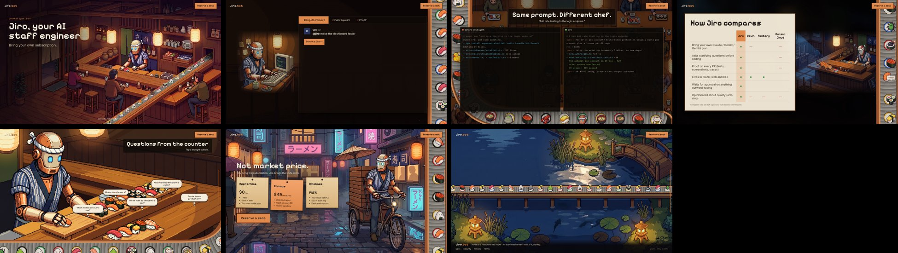

# Demo1: Jiro.bot scroll flow

**Demo1** is the name for this version. It is the complete, recreatable record of the jiro.bot 3D scroll-flow site as approved on 2026-09-30 (git tag `demo1` in `tilework-tech/jiro.bot`): the working site, every final asset, the asset pipeline, and documentation precise enough to rebuild it exactly.

One sushi conveyor belt runs from the hero's kitchen window to a koi pond and never stops. Scrolling moves a 3D camera along it through 7 rooms of a house, and each room holds one looping pixel-art scene.



## Run it

```bash
cd site
npm ci                              # Node 22, exact versions from package-lock.json
npm run build && node serve.mjs     # http://localhost:3000
```

`npm run dev` gives hot reload instead. It needs WebGL2; without it the page falls back to the plain video reel at `/fallback/`.

## What's where

| Path | What |
|---|---|
| `docs/RECREATE.md` | **The spec.** Slides, 3D layout, belt maths, slats, camera, snapping, doors, parallax, overlays, easter eggs, and the per-scene asset recipe |
| `docs/FEEDBACK-LOG.md` | Every piece of client direction, round by round, with what was built, plus the standing rules |
| `docs/ASSETS.md` | Every asset with size, dimensions, duration and sha256 (generated) |
| `docs/PROMPTS.md` | The saved generation prompts (verbatim), plus the intent of the later edits |
| `docs/CONVEYOR-RESEARCH.md` | Airport-carousel research behind the belt's curves |
| `docs/REBUILD-PROMPT.md` | A one-shot prompt for an agent to rebuild or continue from this repo |
| `reference/` | Ground truth: `stops/stop-0..6.png` (1600×900), `walkthrough.mp4` (the full scroll), and overview sheets |
| `site/` | The site (Vite + TypeScript + Three.js 0.170). `src/` holds the code and `public/` holds the videos, posters and sprites |
| `art/` | Source stills at full resolution, the item sheet, and ending concepts |
| `ref/` | The client's belt-path sketch and the canon Jiro character reference |
| `pipeline/` | Python scripts: Gemini stills, Veo clips, crisp compositing, seamless loops, hand animation, the manifest, and screenshot capture |

## Recreating it "to the T"

1. **Nothing needs regenerating.** Every final video, poster, sprite and still is committed here. Image and video models are not deterministic, so regenerating an asset will never give the same pixels. Use these files as-is.
2. Build and run the site as above.
3. Check the result against the reference:
   - screenshots of each stop (`window.__jiro.set(n)`, see `pipeline/capture.mjs`) against `reference/stops/`
   - the scroll against `reference/walkthrough.mp4`
4. Prove the assets are untouched: `python pipeline/manifest.py && git diff --exit-code docs/ASSETS.md`.
5. To change a scene, follow its recipe in `docs/RECREATE.md` §8.1 and the prompts in `docs/PROMPTS.md`, and keep every standing rule in `docs/FEEDBACK-LOG.md`.

## Status

- Verified on a real GPU: Safari 26.5 on macOS (Apple GPU, 1920×960) ran at about 57 fps on 2026-09-30, and all 7 videos loaded and played through to the pond. It also renders in Chrome and in WebKit on Linux.
- An earlier black screen in Safari did not reproduce once the page was served by `site/serve.mjs`. The `/__diag` beacon stays in place so any future failure is reported.
- The competitor cells in the comparison table and all pricing are draft copy.
- There is no mobile layout yet.

History: Demo1 was built in tilework-tech/jiro.bot PR #5 (branch `scroll-flow-3d`) and lives here as the `demo1/` folder of `tilework-tech/jiro.bot`. All paths in these docs are relative to `demo1/`.
