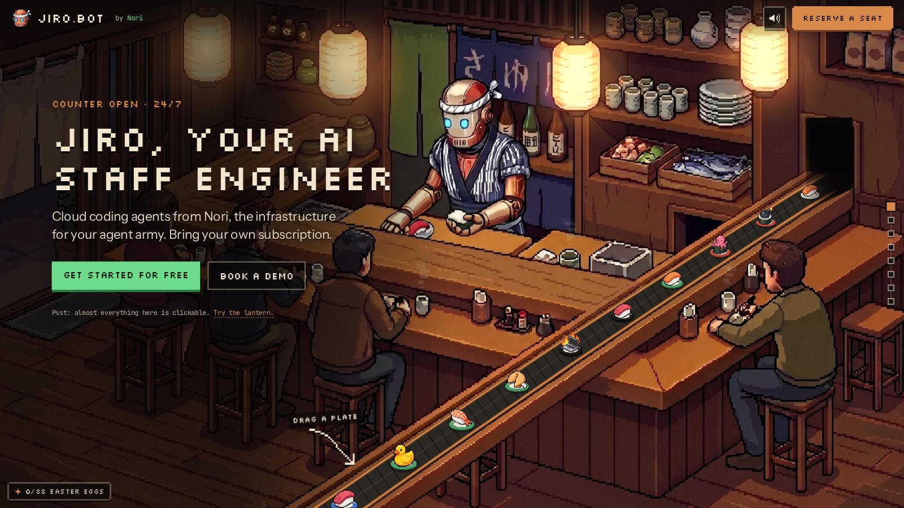
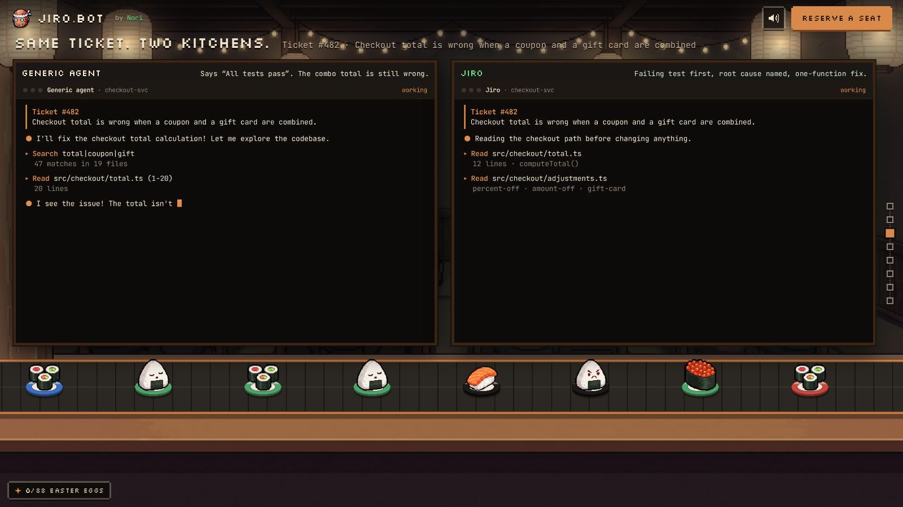
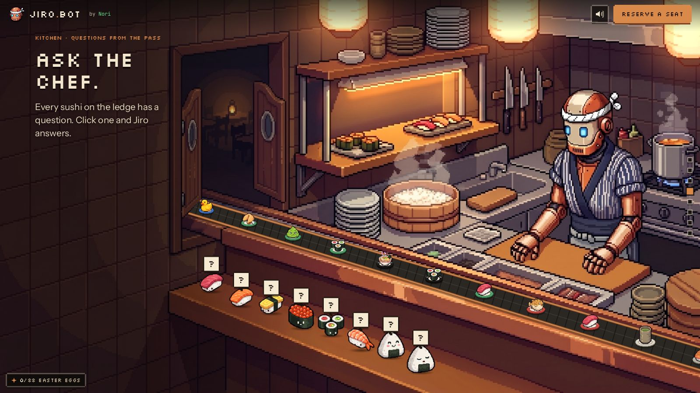

# 02 · Scenes: bar, office, dining, kitchen

Recreation spec for the first four rooms of Jiro's Restaurant. It covers the art, belt, surfaces, ambient animation, DOM, hotspots, easter eggs, and enter/leave hooks. Anyone with this file and the committed assets should be able to rebuild these rooms pixel for pixel.

Source files: `src/scenes/{bar,office,dining,kitchen}.{ts,css}`, `src/content/{copy,product,compare}.ts`, `public/ui/product/states.json`, `public/ui/compare/compare.json`. Global CSS lives in `src/style.css`.

## 0. Conventions shared by all four scenes

- **Stage.** Every coordinate is in stage space: a fixed 1920×1080 canvas. The canvas and the DOM layer `#ui` (also 1920×1080) share one transform that scales them to the viewport. Every scene art file is 1920×1080 and is drawn at `(0,0,1920,1080)`.
- **Draw order per frame** (`renderScene` in `src/engine/stage.ts`):
  1. The art JPEG.
  2. `under(g, now, api)`.
  3. The belt tread and plates (`drawBeltFull`). Belt `style` is not set in these four scenes, so it defaults to `"full"`: tread and rails are drawn by the engine.
  4. Dragged or rested plates.
  5. `over(g, now, api)`.
- **Clocks.**
  - `now` is the ambient clock: `performance.now()/1000`, or the `?t=` URL value when the time is frozen.
  - `LOOP = 24` s. Every periodic ambient period divides 24.
  - Click reactions use a separate wall clock, `performance.now()/1000`, so they play even with a frozen `?t=`.
- **Belt constants** (engine): `BELT_SPEED = 46` px/s and `PLATE_GAP = 150` px, both at scale 1. The belt width default is 64 and the plate default is 52. When a scene omits `fadeIn` or `fadeOut`, they default to 40 px. Plates fade in over the first `fadeIn` px of the path and out over the last `fadeOut` px (alpha is linear). A `BeltPt` is `[x, y, scale]`; scale multiplies width, plate size and local speed.
- **Hold.** `hold` is the scroll length of the scene in viewport heights.
- **FX helpers** (`src/engine/fx.ts`), used verbatim below:
  - `wave(now, period, phase) = sin(((now % 24)/period)·2π + phase)`.
  - `glow(g, x, y, r, color, now, amt=.08, period=6, seed=0)`: a radial gradient from `color` to transparent. The radius is `r·(1 + amt·(0.6·wave(now,period,seed) + 0.4·wave(now,period/3,seed·2.1)))`. It uses `globalCompositeOperation="lighter"` and fills the square `x±1.3r, y±1.3r`.
  - `steam(g, x, y, now, seed=0, h=120, px=6, alpha=.22)`: 7 puffs on a 6 s cycle, with puff `i` offset by `i·6/7 + seed`. For fraction `f` (0 to 1):
    - `yy = y − f·h`
    - `xx = x + sin(f·5 + i + seed)·10·f`
    - `r = px·(1+2f)`
    - alpha is `alpha·sin(fπ)` and the fill is `#f3eee4`.
    - The rect is snapped to a `px` grid: x `round((xx−r)/px)·px`, y `round((yy−r/2)/px)·px`, size `round(2r/px)·px` × `round(r/px)·px`.
  - `shade(g, x, y, w, h, alpha, feather, side)`: a linear gradient of `rgba(8,6,5,alpha)` that stays solid until `1 − feather/w` of the way across, then fades to 0.
  - `motes(g, now, x0, y0, w, h, n, color)`: `n` 3×3 px motes rising through the rect. Mote `i` has period 12, 18 or 24 (by `i%3`) and x = `x0 + ((i·0.618)%1)·w + sin(f·2π+i)·14`. Alpha is `0.6·sin(fπ)`.
- **DOM helpers** (`src/engine/dom.ts`):
  - `html(el, markup)` appends the first element of the markup.
  - `place(el, x, y, w?, h?)` sets absolute left/top/width/height in stage px.
  - `hotspot(parent, x, y, w, h, title, onClick)` creates a transparent `<button class="hit">` with `title` and `aria-label` set to `title`. Clicks call `stopPropagation`. Global CSS: `.hit:focus-visible { outline: 2px dashed var(--copper) }`.
  - `bubble(parent, x, y, text, ms=2600, cls="")` creates a `<div class="bubble cls">` placed at (x, y) whose top-left is the anchor, and returns a remover.
    - Global bubble CSS: cream `#f3e6cf` background, `#1b130d` text, `22px/1.35` sans, padding `14px 18px`, `max-width 420px`, `3px solid #1b130d` border, `0 5px 0 rgba(0,0,0,.5)` shadow.
    - It enters from `translateY(10px) scale(.96)` at opacity 0 with a `.2s` transition, uses `z-index 3`, and ignores pointer events.
    - It is removed after `ms`, with a 300 ms fade.
- **Eggs.** Every `api.egg(id, text)` call shows `text` as a cream toast. The first call per id (persisted in `localStorage["jiro-eggs"]`) also counts the egg, stays for 3600 ms and wears a green pixel tag "Easter egg `<n>/<total>` found!". Repeat calls show a plain toast. Every scene declares its egg ids up front with `declareEggs([...])`.
- **Dropping plates.** A dragged plate dropped with its bottom centre inside a surface polygon rests there at `surface.scale`, plays sfx `blip`, and calls egg `plate-parked` with the surface's `say` text. The first park anywhere counts the egg; every later park still toasts that surface's line.
- **Tokens:**
  - colours: `--ink #0b0a09`, `--cream #f3e6cf`, `--muted #bfae95`, `--copper #d98a4a`, `--green #6fdc8c`
  - fonts: `--px "Silkscreen"`, `--sans "Instrument Sans"`, `--mono "JetBrains Mono"`
- **Global copy CSS:**
  - `.copy { position:absolute }`
  - `.kicker { 20px/1 px font; copper; letter-spacing .04em; margin 0 0 22px }`
  - `.px { px font, 400, cream, text-shadow 0 4px 0 rgba(0,0,0,.6), letter-spacing .01em }`
  - `h1.px 76px/1.08`, `h2.px 56px/1.05`
  - `.lede { 27px/1.45; #e7d8bf; margin 24px 0 0; max-width 34ch; text-shadow 0 2px 8px rgba(0,0,0,.8) }`
  - `.hint { 18px mono; muted; margin-top 40px }`
- **Layer visibility.** Each scene's DOM lives in `<div class="layer scene-ui" data-id="<id>">`. Opacity is 1 while the scene holds. It cross-fades during transitions: the `from` layer fades out over t 0 to 0.12 and the `to` layer fades in over t 0.88 to 1. The class `live` is set while opacity > 0.5, and only `.live` layers receive pointer events (buttons, links, `.hot`, `video`, `figure`).
- **Hooks.** `enter()` fires when the scroll lands on the scene hold; `leave()` fires when it leaves.

Scene order and scroll lengths:

| # | id | `room` (rail label) | `mood` | `hold` |
|---|----|--------------------|--------|--------|
| 1 | `bar` | Bar | bustling | 1.2 |
| 2 | `office` | Back office | quiet | 1.6 |
| 3 | `dining` | Dining room | bustling | 1.3 |
| 4 | `kitchen` | Kitchen | bustling | 1.6 |

Reference screenshots were taken with `seg.mjs` (`?seg=<id>&tt=0.5&t=5`, 1600×900 viewport, 2.5 s settle). They were downscaled to 1600 px JPEG q80. A fresh visitor sees the drag hint, full glints and 0 eggs.

---

## 1. `bar`: the sushi bar (hero)



### Purpose and mood
This is the hero room: busy, warm and lantern-lit. Jiro stands behind the counter and the regulars eat at the bar. The left 40% of the room is darkened in code so the headline and CTAs read cleanly. The belt runs up the diagonal counter rail and disappears into a dark hole in the wall at the upper right, the "reversed flow" from the bible. Plates flow *into* the wall.

### Art
- `public/art/bar.jpg`: 1920×1080 RGB JPEG (427 462 bytes). Isometric 16-bit pixel art, seen from above and to the front-left.
  - **Left (x 0 to 230, y 90 to 600):** the street entrance, with a cream split noren and a dark wooden lattice sliding door. A green floor mat sits at about (0 to 250, 610 to 720).
  - **Paper lanterns:** four hang from the ceiling, centred at (440,110), (728,140), (1224,140) and (1622,105).
  - **Upper-left wall shelf:** sake jars, a green pot and a lidded box at about 548 to 700 × 0 to 200. Three glazed crocks sit on the back counter at about 630 to 800 × 245 to 360.
  - **Back wall behind Jiro:** a **green noren** at x 818 to 952, y about 40 to 334. To its right is an **indigo noren** with white kana (きゅり…) at about 965 to 1170 × 60 to 230.
  - **Jiro** stands centre at about x 830 to 1120, y 170 to 500. He has a copper dome head with a white hachimaki knot on his right, a cream faceplate with **two glowing blue eyes** centred at (952,262) and (986,263), and a speaker grille. He wears an indigo-striped happi and has copper arms. His hands rest on the cutting board at about y 450 to 500, holding a tuna nigiri and an onigiri. A tea cup stands by his right hand at about (1212,540).
  - **Sake bottles** stand behind his left shoulder at x 1060 to 1210, y 215 to 345: three bottles with white labels (one reads 助).
  - **Right back shelves:** tea cups on two tiers (1280 to 1470, 10 to 250), a **stack of white plates** at 1478 to 1600, 160 to 268, and two crates of fish and vegetables at 1270 to 1600, 290 to 420.
  - **Far right:** a tall shelf with jars (1760 to 1920, 40 to 170). Below it is the **dark wall opening** where the belt goes in: the black hole is about x 1712 to 1812, y 250 to 450, and its right wooden jamb is x 1811 to 1833, y 244 to 422.
  - **Counter:** an L-shaped wooden bar runs from the left door down to the centre. Four regulars sit on stools at the front, from left to right: a woman in a purple sweater (about 260 to 420), a man in a navy jacket, a man in a brown jacket (about 650 to 870), and in the gap a condiment tray with soy bottles at about 1050 to 1180 × 640 to 712.
  - **The diagonal counter rail** (the belt's bed) runs from bottom centre (about 650,1080) up to the opening (about 1800,380).
  - **Far-end regular:** a man in an olive jacket sits on a stool on the right at about 1510 to 1780 × 510 to 1000, holding chopsticks and a tea cup (steam at 1546,620).
- `public/art/bar/jiro-blink.png`: 66×37 RGBA. Two cream eyelids (oval) with a dark-teal closed-eye line, drawn at (936,244).
- `public/art/bar/chop-mid.png`: 74×54 RGBA. The middle regular's hand and chopsticks, cut from the art and drawn at (806, 622 − lift).
- `public/art/bar/chop.png`: 74×86 RGBA. The far-end regular's hand and chopsticks and a sushi piece, drawn at (1540, 612 − lift).

### Belt
```ts
belt: { pts: [[662,1122,1.06],[900,956,1.0],[1200,752,0.9],[1500,554,0.8],[1700,426,0.73],[1768,386,0.71]],
        width: 58, plate: 54, fadeOut: 70 }   // fadeIn defaults to 40
```
- The belt rides the flat top of the diagonal rail. The scale per point follows the measured top-face width of the rail, so the perspective narrows as it recedes. It starts below the bottom edge at y 1122 and ends inside the opening.
- **Recess** (drawn in `under`, before the belt): for each segment, a stroke `rgba(20,10,4,.28)` with `lineCap butt` and width `58·avg(scale)+10`, from `(x0,y0+3)` to `(x1,y1+3)`. It reads as a channel rather than a sticker.
- **Into the wall** (`over`):
  1. Clip to the polygon (1712,250) (1812,250) (1812,400) (1712,450).
  2. Fill rect (1712,250,100,200) with a linear gradient. It runs from 15% of the way along the last segment, from (1700,426) toward (1768,386), to (1768,386), with stops `0 rgba(6,4,5,0)`, `.8 rgba(6,4,5,.8)` and `1 rgba(6,4,5,.94)`.
  3. Redraw the art slice JAMB `{x:1811,y:244,w:22,h:178}` 1:1 over the belt, with smoothing off, so plates slide *behind* the right jamb.

### Surfaces (drop targets)
| poly | scale | say |
|------|-------|-----|
| (690,578) (1000,622) (1150,650) (1150,722) (1000,724) (690,672) | 0.95 | A regular claims this plate. Nobody argues. |
| (745,438) (1110,452) (1118,522) (760,500) | 0.85 | Jiro inspects it. LGTM. Back to work. |
| (1255,722) (1500,612) (1556,588) (1572,650) (1525,706) (1285,800) | 0.85 | The regular at the end adds it to his tab. His tab is all green checks. |
| (1790,492) (1880,446) (1905,505) (1800,556) | 0.78 | Saved a seat for a friend. The friend is a plate. |
| (1250,212) (1600,212) (1600,258) (1250,258) | 0.7 | Shelved. Like that refactor. Jiro will get to it. |
| (1262,78) (1560,78) (1560,116) (1262,116) | 0.62 | Top shelf. Reserved for plates with excellent test coverage. |
| (548,160) (700,160) (700,200) (548,200) | 0.62 | Up with the pickled plums. It will age like good documentation. |

In order: the counter in front of the regulars (kept clear of the CTAs), Jiro's cutting board, the far-end counter (split around the regular), the far-right counter end, the fish-crate shelf, the top cup shelf, and the upper-left jar shelf.

### Ambient animation (all in `under` unless noted; `imageSmoothingEnabled=false` for sprite work)
1. **Green noren sway.**
   - Rows run over y = 84, 87, … < 334 (3 px strips). For each row, `k = ((y−70)/264)^1.6`, so motion grows toward the hem.
   - There are two columns. Column A spans x 818 to 889 with phase 0. Column B spans x 889 to (952 if y<166, else 928) with phase 1.3. Column B is skipped when y>300.
   - Offset: `dx = round(2·k·(0.7·wave(now,8,ph) + 0.3·wave(now,4,ph·2)))`. When dx≠0, copy the art strip `(x0,y,x1−x0,3)` to `(x0+dx,y)`. The maximum is ±2 px, with periods of 8 s and 4 s.
2. **Jiro blink.**
   - `pulse(now, period, at, len, ease)` is 1 for `len` seconds starting at `at` in every `period`, with linear ramps of `ease`.
   - Blink = `pulse(now,8,2.6,0.16,0.01) + pulse(now,24,18.95,0.12,0.01)`. That is a 0.16 s blink at 2.6, 10.6 and 18.6 s, plus a second 0.12 s blink at 18.95 s, giving a double blink once per loop.
   - While blinking, draw `jiro-blink.png` at (936,244).
   - Otherwise draw two eye glows: `glow(952,262,26,"rgba(90,220,255,.16)",now,.25,4,.5)` and `glow(986,263,26,…,.9)`.
   - Blinking is suppressed while a poke reaction plays (see hotspots).
3. **Chopstick lifts.** With `t = now % 24`:
   - `liftM = round(3·(0.5−0.5cos(2πt/12))²)`; `chop-mid.png` is drawn at (806, 622−liftM) when liftM>0 (12 s period).
   - `liftR = round(3·(0.5−0.5cos(2πt/8 + 2))²)`; `chop.png` is drawn at (1540, 612−liftR) (8 s period).
4. **Shading for the hero copy:**
   - `shade(g,0,0,960,1080,0.66,460,"left")`: solid 0.66 to x≈500, fading to 0 at x=960.
   - Then a radial pool at (420,520), r 40 to 560, `rgba(8,6,5,.38)` to 0, filling (0,0,1000,1080).
5. **Lantern breathing.** For each lantern i: `glow(x,y,170,"rgba(255,190,110,.20)",now,.1,6,i)`.
6. **Tea steam.**
   - Jiro's cup: `steam(1212,530,now,.3,70,4,.14)`
   - Middle regular: `steam(897,628,now,2.2,80,4,.14)`
   - Far-end regular: `steam(1546,620,now,4.1,70,4,.13)`
7. **The cat in the wall** (`over`).
   - Eyes = `max(pulse(now,24,14,2.4,0.4)·(1 − pulse(now,24,15.1,.14,.01)), clickPeek)`. They open from 14.0 to 16.4 s each loop with 0.4 s fades and blink at 15.1 s.
   - Pixels: `#f5c451` rects (1768,296,3,2) and (1780,297,3,2) at alpha=eyes, plus halos (1767,295,5,4) and (1779,296,5,4) at alpha=eyes·0.3.
   - Click peek (since click `p` < 1.8 s): `min(1, p/0.2, (1.8−p)/0.3)`, forced to 0 for 0.9<p<1.02 (a blink).

### DOM
Hero copy block: `<section class="copy hero-copy" style="left:110px;top:210px;width:760px">`.
- `p.kicker`: **Counter open · 24/7**
- `h1.px`: **Jiro, your AI staff engineer** (76px Silkscreen)
- `p.lede`: **Cloud coding agents from Nori, the infrastructure for your agent army. Bring your own subscription.** It gets an extra `text-shadow: 0 2px 0 rgba(0,0,0,.55), 0 0 18px rgba(8,6,5,.9)`.
- `div.ctas` (flex, gap 16, margin-top 38). Both links use `target="_blank" rel="noopener"`.
  - `a.btn.primary` to `https://noriagentic.com/`: **Get started for free**. Green background, text `#07130b`, shadow `0 5px 0 #2d7a45`.
  - `a.btn.ghost` to `https://noriagentic.com/book-a-demo.html`: **Book a demo**. Background `rgba(10,8,7,.6)`, `2px solid rgba(243,230,207,.5)`.
  - `.btn` is `20px/1` px font with padding `18px 24px`. On hover it gets `brightness(1.1)` and `translateY(-1px)`.
- `p.hint` (14px mono in this scene, `text-shadow 0 1px 0 #000, 0 0 10px rgba(8,6,5,.9)`): **Psst: almost everything here is clickable.** followed by `<button class="try-lantern">`**Try the lantern.**</button>.
  - The button inherits the font, is copper, has a `2px dotted rgba(217,138,74,.6)` bottom border, and turns `#f5c451` on hover.
  - Clicking it triggers lantern #2 (see hotspots).

Hover affordance on every bar hotspot (`.bar-hit`):
- The native `title` is removed. A child `<span class="bar-tag">` holds a tiny verb.
- **Hover or focus-visible:** eight 16×3 / 3×16 gradient strips in `rgba(245,196,81,.9)` form pixel corner brackets, plus a radial glow `rgba(255,205,130,.16)` to 0.
- **Tag:** absolutely positioned at `left 50%; top −30px`. It uses `14px/1` px font, `letter-spacing .04em`, ink text on `#f5c451`, padding `5px 8px 4px`, and shadow `0 3px 0 rgba(0,0,0,.55)`. It rises from `translate(−50%,4px)` at opacity 0 to `translate(−50%,0)` at opacity 1, over `.15s` with `steps(2)` on the transform.
- `mousedown` calls `preventDefault` so clicking doesn't focus and nudge the scroll.
- The wall opening also gets `cursor: zoom-in` (`.peek`).

### Hotspots and easter eggs
| # | name (aria) | rect x,y,w,h | hover tag | on click | sfx | bubble (x,y,ms) | egg id: toast |
|---|---|---|---|---|---|---|---|
| 1 | Jiro | 900,160,240,340 | poke Jiro | Cycles lines; eyes flare | blip | 1110,150 (2600): cycles "Irasshaimase!", "Your PR is ready. So is the tuna.", "I reviewed it twice. Once for you, once for me.", "No slop leaves this counter.", "Please stop poking the chef." | `bar-jiro` on the **5th** click: "You poked Jiro five times. He noted it in the retro." |
| 2 | Sake bottles | 1060,215,150,140 | sake? | Bottles jiggle | chime | 1150,360 (1400): "clink." | `bar-sake`: "Sake is for after the deploy." |
| 3 to 6 | Lantern ×4 | (x−55, y−90, 110, 170) for each lantern: 385,20 · 673,50 · 1169,50 · 1567,15 | tap the lantern | Flicker then flare | pop | none | `bar-lantern`: "The lantern flickers. Somewhere, a flaky test passes." |
| 7 | Customer | 1590,490,190,350 | say hi | Regular hops 3 px | pop | 1330,440: "I asked for one fix. I got a fix, tests, and a changelog." | `bar-customer`: "The regulars are very happy." |
| 8 | Stack of plates | 1478,160,124,108 | count them | Stack jiggles | bonk | none | `bar-plates`: "Twelve plates deep. Jiro calls it the call stack. Please don't pop from the middle." |
| 9 | Soy sauce | 1050,640,130,72 | soy | none | blip | none | `bar-soy`: "Low-sodium soy. Like the logs: just enough salt to be useful." |
| 10 | Wall opening | 1712,256,98,104 (`cursor: zoom-in`) | peek inside | Cat eyes open 1.8 s | meow | 1470,200: "mrrp? (the wall cat approves this PR)" | `bar-opening`: "There's a cat in the wall. It has read access to every plate." |
| 11 | Noren curtain | 826,48,70,120 | staff only | none | whoosh | none | `bar-noren`: "Staff only. Behind this curtain: the on-call rotation, and a very tired rice cooker." |

Declared eggs: `bar-jiro, bar-sake, bar-lantern, bar-customer, bar-plates, bar-soy, bar-opening, bar-noren`.

Click reactions, all timed by wall-clock `since(key)`. `f2(k,dur)` returns +1 or −1, alternating every 0.1 s, for `dur` seconds after the click:
- **Jiro.** For 0 to 0.1 s and 0.2 to 0.3 s the blink sprite is suppressed and the normal glow shows. For 0.1 to 0.2 s and 0.3 to 0.5 s two bright flares are added over the eyes: `glow(952,262,40,"rgba(120,235,255,.55)",now,0)` and the same at (986,263). The effect reads as the eyes flaring twice.
- **Sake.** For 0.6 s the art slice (1100,214,112,132) is redrawn shifted x by ±2 px.
- **Customer.** For 0.4 s, on +1 frames only, the art slice (1612,500,108,100) is redrawn 3 px higher.
- **Plates.** For 0.4 s the art slice (1484,166,116,48) is redrawn shifted x by ±2 px.
- **Lantern i** (key `lantern<i>`), drawn in `under` after the lantern glow:
  - For a<0.1 s and 0.2 to 0.3 s, a dark rect `rgba(20,10,4,.55)` covers (x−52, y−62, 104, 130).
  - For 0.3 to 0.9 s a flare plays: `glow(x,y,190,"rgba(255,200,120,α)",now,0,6,i)` with `α = 0.45·(1−(a−0.3)/0.6)`.
- **Opening.** The cat-eye peek described in ambient item 7.

### The 5 "click me" glints (the hero's affordance targets)
Each glint is an `<i class="bar-glint">` at `(x−22, y−22)`, 44×44, holding an 11×11 `crispEdges` SVG pixel sparkle. The sparkle is a plus-shaped star in `#fff3d6` with a single `#f5c451` centre pixel. The SVG path data:
```
fill #fff3d6: M5 0h1v3h-1zM5 8h1v3h-1zM0 5h3v1h-3zM8 5h3v1h-3zM4 4h3v3h-3zM5 3h1v1h-1zM5 7h1v1h-1zM3 5h1v1h-1zM7 5h1v1h-1z
fill #f5c451: M5 5h1v1h-1z
```

| key | centre (x,y) | slot | `animation-delay` | quieted by |
|---|---|---|---|---|
| lantern | 1284,96 (lantern #2, upper right) | 0 | 0.8s | lantern #2 hotspot or the "Try the lantern." button |
| jiro | 1074,150 | 1 | 3.2s | Jiro hotspot |
| customer | 1726,500 | 2 | 5.6s | Customer hotspot |
| sake | 1200,226 | 3 | 8.0s | Sake hotspot |
| opening | 1792,246 | 4 | 10.4s | Wall-opening hotspot |

- **Schedule:** `animation: bar-glint 12s steps(1,end) infinite both`. The delay is `0.8 + slot·2.4` s, so exactly one glint sparkles at a time, 2.4 s apart, and each glints once per 12 s.
- **Keyframes** (opacity / scale):
  - 0%: 0 / 0
  - 1.5%: .7 / .4
  - 3%: 1 / .7
  - 5%: 1 / 1
  - 7.5%: 1 / .7
  - 9.5%: .7 / .4
  - 11%: 0 / 0
  - 100%: 0 / 0
- With `steps(1,end)` the sparkle pops through pixel sizes, visible for about 1.32 s of each 12 s.
- `filter: drop-shadow(0 0 6px rgba(255,214,130,.9))`, `z-index 2`, `pointer-events none`.
- **Quieting:** a glint goes quiet (`.quiet { opacity:0 !important; animation:none }` with a `.6s` opacity transition) once its target is clicked. Poked keys persist in `localStorage["jiro-bar-poked"]` as a JSON array, so return visits stay calm.
- **Reduced motion:** no animation; `opacity .55; scale(.7)`.

### Drag hint (one-time)
- Rendered only if `localStorage["jiro-dragged"]` is unset: `<div class="bar-drag">` at `left 610px; top 872px`. It is a column flex container with `pointer-events none`.
  - `<span>`**drag a plate**</span>: 16px/1 px font, cream, `letter-spacing .04em`, background `rgba(11,10,9,.72)`, padding `6px 9px 5px`, shadow `0 3px 0 rgba(0,0,0,.5)`, `rotate(-4deg)`.
  - Below it, a hand-drawn pixel arrow SVG: viewBox 60×44 rendered at 120×88, `crispEdges`, fill `#f3e6cf`, margin `2px 0 0 40px`, `drop-shadow(0 2px 0 rgba(0,0,0,.7))`. The arrow curves from top-left down to bottom-right and ends in an arrowhead pointing down-right at the belt. Path:
    ```
    M2 4h6v2h-6zM8 6h6v2h-6zM14 8h4v2h-4zM18 10h4v2h-4zM22 12h2v2h-2zM24 14h2v2h-2zM26 16h2v2h-2zM28 18h2v2h-2zM30 20h2v4h-2zM32 24h2v2h-2zM34 26h2v2h-2zM36 28h2v2h-2zM38 30h2v2h-2zM40 32h2v2h-2zM42 34h2v2h-2zM44 36h2v2h-2zM46 38h2v2h-2zM40 40h10v2h-10zM48 30h2v10h-2z
    ```
- **Bob:** `bar-drag-bob 6s ease-in-out infinite`, from translate(0,0) to (3px,3px) at 50%.
- **Dismissal:** a `MutationObserver` watches `#frame`'s class. The first time `#frame` gets `.dragging` (a plate drag anywhere on the site), it sets `localStorage["jiro-dragged"]="1"`, adds `.gone` (opacity 0 over `.5s`), removes the node after 600 ms, and disconnects.
- **Reduced motion:** no bob.

### Enter / leave
None. The bar has no `enter`, `leave` or `click` hooks.

---

## 2. `office`: the back office (product tour)


### Purpose and mood
A quiet, almost dark back room. A large clickable window of the real Nori Sessions UI (Playwright captures on fake data) fills the left two-thirds. The right column holds the title and a live caption. Tiny Jiro types at a tiny desk in the bottom-right corner, lit by a desk lamp, just above the belt. The belt runs straight across the bottom, left to right. It enters through a hatch at the far left, which is the bar's wall opening seen from behind.

### Art
- `public/art/office.jpg`: 1920×1080 RGB JPEG (135 263 bytes).
  - A dark aubergine-brown **vertical-plank wood wall** (planks about 45 to 50 px wide) fills the frame. A darker central area, x about 190 to 1740, is where the product window floats. A faint warm arc of lamplight spreads from the lower right (dithered, about 1000 to 1900 × 450 to 920).
  - **Desk group:**
    - Tiny desk at about x 1515 to 1700, y 800 to 925.
    - Beige CRT with a green terminal screen, housing about 1535 to 1645 × 700 to 820; screen area **(1589,724) 42×64**.
    - Yellow sticky notes under the screen at about 1586 to 1642 × 788 to 812.
    - Keyboard at about 1595 to 1680 × 790 to 850.
    - Green tea cup at about (1602,840).
    - Brass desk lamp with bulb at **(1667,744)**; stem at about 1650 to 1684 × 715 to 785.
  - **Jiro**, seated in three-quarter back view, spans about 1650 to 1790 × 700 to 925. He has the copper dome, white hachimaki, striped happi and copper hands on the keys. His visible eye is at **(1697,743) 5×10** with a blue glow.
  - **Belt, painted in the art:**
    - top copper rail line at y ≈ 925 to 935
    - dark tread with scalloped slat marks at y ≈ 940 to 995
    - thick copper front rail at y ≈ 1000 to 1035
    - dark floor strip below
  - **Hatch:** a black square with a copper frame at x 0 to 66, y ≈ 897 to 1008, at the left end of the belt.
- `public/art/office/hand-l.png` (31×24 RGB) and `hand-r.png` (34×26 RGB): opaque cut-outs of Jiro's copper hands on the keyboard, in two poses. Each includes its keyboard background, so it just overwrites the art.

### Belt
```ts
belt: { pts: [[-20,955],[1940,955]], width: 56, plate: 46, fadeIn: 60, fadeOut: 60 }
```
Horizontal at y 955, left to right, scale 1. The engine tread is drawn over the painted belt. The fades hide plates in the hatch on the left and off the right edge.

### Surfaces
| poly | scale | say |
|---|---|---|
| (1515,818) (1550,805) (1600,815) (1602,828) (1660,845) (1700,858) (1692,876) (1600,852) (1518,829) | 0.5 | Desk lunch. Crumbs in the keyboard are a feature. |
| (1538,725) (1566,703) (1622,698) (1644,707) (1641,717) (1580,728) | 0.46 | Warm. Keeps the tamago toasty. |
| (1690,718) (1704,703) (1742,703) (1757,716) (1741,724) (1700,724) | 0.46 | Balanced on Jiro's head. He keeps typing. |

In order: the desk top, the top of the CRT, and Jiro's head. The plates are tiny because the desk is tiny.

### Ambient animation
All drawn in `under`, except where noted.
1. **Lamp light** while the lamp is on (wall clock ≥ `lampOffUntil`):
   - `glow(1650,810,240,"rgba(255,180,100,.06)",now,.06,12)`
   - Bulb: `glow(1667,744,70,"rgba(255,210,140,.22)",now,.1,8,1)`
   - Dust motes in the lamp cone: `motes(1560,690,190,140,7,"rgba(255,220,160,.55)")`
   - **Lamp off:** instead fill `rgba(6,4,4,.55)` over (1480,660,330,266).
2. **CRT glow:** `glow(1610,756,80,"rgba(120,255,150,.09)",now,.12,4,1)`.
3. **CRT screen** (clipped to 1589,724,42,64):
   - Phosphor fill `#7dff9a` at alpha `0.07 + 0.04·(0.5+0.5·wave(now,4)) + 0.02·wave(now,0.25)`.
   - A rolling scan band: 4 px tall, alpha .14, at `y + (now%4)/4·(64+16) − 8`. It rolls down every 4 s.
   - Scanlines: 1 px black at alpha .18 every 3 px.
   - Blinking cursor: 3×3 `#8dffa8` at alpha .9 at (1603,779), visible when `now%1 < 0.5`.
4. **Typing hands.**
   - Hands animate while `now % 12 < 7` (7 s typing, 5 s pause thinking).
   - The frame is `floor((now%24)·4) % 2`, so it alternates every 0.25 s.
   - Frame 1 draws `hand-r.png` at (1656,793). Frame 0 draws `hand-l.png` at (1625,809). Both are drawn at `y − 2`.
5. **Eye blink.**
   - `p = now % 8`. Blink when `p ≤ 0.14`, plus a second blink when `0.3 < p < 0.42` and `now % 24 < 8`, so there is one double blink per loop, at 0 s.
   - To blink, fill the eyelid `#c9b494` rect (1697,743,5,10), plus a 1 px `#3a6f86` line at y 748.
6. **Eye halo:** `glow(1699,748,10,"rgba(120,200,255,.35)",now,.15,6,2)`.
7. **Tea steam:** `steam(1602,830,now,0,48,3,.34)`.
8. **`over`:** `shade(g,0,0,1920,180,0.5,180,"top")` darkens the top edge from 0.5 to 0 over 180 px. It sits under the site header.

### DOM
- `<section class="copy office-head" style="left:1370px;top:100px;width:440px">`:
  - `p.kicker` **Back office**
  - `h2.px` **Your agents, on shift.** at 46px (override in `style.css`)
- **Product window** (`mountProduct`, `src/content/product.ts`): `div.product-win` placed at **x 60, y 80, width 1250**. Everything uses border-box sizing. It is about 830 px tall, so the bottom sits near y 912, just above the belt.
  - The window has background `#0f0d0c`, `2px solid rgba(243,230,207,.16)`, and shadow `0 30px 80px rgba(0,0,0,.7), 0 0 0 1px #000`.
  - `.chrome`: flex, gap 8, padding `10px 14px`, background `#1a1714`, bottom border `1px rgba(243,230,207,.1)`.
    - Three 12 px circles in `#3a332d` (traffic lights).
    - `span.url`: 15px mono, muted, margin-left 12, background `#0f0d0c`, padding `5px 14px`, radius 6. Its initial text is "norisessions.com", replaced on load by `spec.url`, which is **acme.norisessions.com**.
  - `.screen`: relative, full width, `aspect-ratio` set from JSON to `1600 / 1000` (CSS fallback 16/10), background `#111`.
    - `` with `object-fit: cover`.
    - `div.hots`, absolutely filling the screen.
- **Caption column:** `div.product-cap` placed at **x 1370, y 380, width 400**.
  - `p.hint`: **Click around. It's the real Nori UI.** 16px px font, green, margin `0 0 18px`.
  - `p.caption`: the current state caption. `26px/1.45` sans, `#e7d8bf`, `min-height 5.8em`, `text-shadow 0 2px 8px #000`.
  - `p.steps`: **`<n> of 10 screens explored`**. 15px mono, muted, margin-top 16.
  - If the JSON fetch fails, the caption shows **Product capture loading…**.
- **Hot zones:**
  - Each hotspot is a `<button class="hot">` positioned in % of the screenshot. The first in each state gets `.lead`.
  - Style: transparent, `2px solid transparent`, radius 6. On hover: background `rgba(111,220,140,.12)` with a green border.
  - `.lead` pulses: `hotpulse 3s ease-in-out infinite`, with box-shadow going from `0 0 0 0 rgba(111,220,140,0)` to `0 0 0 4px rgba(111,220,140,.35)` at 50%.
  - Each has `title` and `aria-label` set to the label. A click plays sfx `pop` and calls `go(to)`.
- **Loading:** all 10 state images are preloaded on load, and the tour starts at `chat`. Each `go()` adds the state to `visited` and updates the steps text. When all 10 are visited it fires egg `product-tour`: "You clicked through the whole product. Jiro would hire you."
- **Scene CSS** (`office.css`):
  - `.bubble.office-bubble { font-size 18px; max-width 300px; padding 10px 14px }`
  - `.hit:hover { background: radial-gradient(closest-side, rgba(243,230,207,.08), transparent) }`

### Product states (`public/ui/product/states.json`)
- `width 1600, height 1000, start "chat", url "acme.norisessions.com"`. Every image is `ui/product/<id>.png`: 1600×1000, palette PNG.
- Hotspot rects are fractions of the screenshot, given as x, y, w, h.
- The screenshots show a dark Nori Sessions UI. On the left is a sidebar (logo "nori", Chat, Projects, Automations, Integrations, Search, filters). Its session list includes "Fix flaky checkout test", "jiro: refactor tuna-inventory service", "Nightly dependency bum…", "#alerts · payment webh…", "Add coupon codes to the…", "Draft the Q4 on-call runb…", "Omakase menu page: da…", "Postgres 17 upgrade plan" and "Wasabi feature flag clean…", with the user hana@acme.dev. The main pane is the chat for "@nori checkout.spec.ts has failed 3 of the last 10 CI runs on acme/checkout…".

| state | caption (verbatim) | hotspots (count): label → to @ x,y,w,h |
|---|---|---|
| `chat` | Mention @nori in Slack and a session spins up on its own machine. Watch it work and steer it from here. | **8**: Expand the work: every tool call → work @ .3544,.0705,.1013,.022 · Artifacts → code @ .7931,.0035,.0706,.036 · Open checkout.spec.ts → code @ .3544,.5219,.1053,.036 · New chat → new @ .9106,.0035,.0638,.036 · Conversation actions → menu @ .1375,.3691,.0188,.03 · Open "jiro: refactor tuna-inventory service" → done @ .0031,.3996,.1556,.038 · Chat: start a new session → new @ .0031,.045,.1556,.038 · Account and settings → settings @ .0031,.957,.1356,.038 |
| `work` | Every turn folds its work: thoughts, file reads, edits and commands, one click away. | **5**: Fold the work away → chat @ .3544,.1935,.1013,.022 · Open "Fix flaky checkout test" → chat @ .0031,.3656,.1556,.038 · Open "jiro: refactor tuna-inventory service" → done @ .0031,.3996,.1556,.038 · Chat: start a new session → new @ .0031,.045,.1556,.038 · Account and settings → settings @ .0031,.957,.1356,.038 |
| `code` | Code, tables and pull requests the agent produces collect in the artifacts pane. | **5**: Close artifacts → chat @ .9758,.011,.0161,.026 · then the same 4 sidebar hotspots as `work` (Fix flaky → chat, jiro: refactor → done, new session → new, settings → settings) |
| `done` | Finished work lands as a pull request with CI green. The session stays live for follow-ups. | **5**: Open the pull request → pr @ .3544,.5251,.232,.036 · New chat → new @ .9106,.0035,.0638,.036 · Open "Fix flaky checkout test" → chat @ .0031,.3656,.1556,.038 · Chat: start a new session → new @ .0031,.045,.1556,.038 · Account and settings → settings @ .0031,.957,.1356,.038 |
| `pr` | Pull requests open straight from the conversation. | **5**: Close → done @ .9758,.011,.0161,.026 · then the 4 sidebar hotspots as in `work` |
| `new` | Start a session from the web: pick a model and skillset, and a fresh machine picks it up. | **4**: Switch model → model @ .3685,.6148,.0676,.034 · Open "Fix flaky checkout test" → chat @ .0031,.3656,.1556,.038 · Open "jiro: refactor tuna-inventory service" → done @ .0031,.3996,.1556,.038 · Account and settings → settings @ .0031,.957,.1356,.038 |
| `model` | Switch models per session: Claude, Codex and more from one picker. | **2**: Use Claude Opus 5.5 → new @ .3692,.461,.1729,.038 · Close the picker → new @ .3685,.6148,.0676,.034 |
| `menu` | Every session is a real machine: rename it, archive it, or release it back to the pool. | **2**: Release → release @ .0656,.4894,.0875,.0348 · Close the menu → chat @ .1375,.3691,.0188,.03 |
| `release` | Releasing stops the agent and returns its machine to the pool. | **1**: Cancel → chat @ .5156,.527,.0522,.04 |
| `settings` | Completion alerts, connected integrations and org settings live one click away. | **1**: Close settings → chat @ .2377,.0123,.0161,.026 |

Total: 10 states and 38 hotspots.

### Hotspots and easter eggs (office)
Plain `.hit` buttons with a native title.

| name | rect | sfx | effect | egg id: toast |
|---|---|---|---|---|
| Tiny Jiro | 1640,700,150,190 | blip | bubble at 1500,640 for 2800 ms, class `office-bubble`, cycling "Shh. I'm in the middle of a refactor." / "Twelve agents on shift. I'm just the night manager." / "It works on my machine. And on yours. That's the point." / "I don't need a bigger desk. I need fewer flaky tests." | `office-jiro`: "Tiny Jiro works in the corner so the product gets the spotlight." |
| CRT | 1580,712,58,76 | pop | For 2.4 s the CRT shows a pixel smiley (see below) | `office-crt`: "The CRT runs \`nori sessions list\`. It's green all the way down." (the backticks are literal characters) |
| Tea | 1588,822,28,26 | blip | none | `office-tea`: "Genmaicha at 62 °C: Jiro's only unpinned dependency." |
| Desk lamp | 1650,726,34,60 | bonk | Toggle: if on, off for 4 s (`lampOffUntil = t+4`); if already off, back on immediately | `office-lamp`: "Lights out. Jiro keeps typing: agents don't need daylight." |
| Sticky notes | 1586,788,56,24 | pop | none | `office-sticky`: "Sticky note: \"TODO: stop writing TODO notes. (J)\"" (the note text is wrapped in real double quotes) |
| Hatch | 0,897,66,111 | bonk | bubble at 30,830 for 2400 ms, class `office-bubble`: "Knock knock. It's a plate. It's on a deadline." | `office-hatch`: "The hatch from the bar: every plate passes the mouse family's code review first." |

**CRT smiley:**
- Fill the whole screen `#0a1a0e` at alpha .95.
- Draw 3 px `#8dffa8` pixels with the origin at (1599,742), using these rows:
  ```
  0110110
  0110110
  0000000
  1000001
  0100010
  0011100
  ```

Declared eggs: `office-jiro, office-crt, product-tour, office-tea, office-lamp, office-hatch, office-sticky`.

### Enter / leave
None.

---

## 3. `dining`: the dining room (comparison)



### Purpose and mood
A busy dining room full of customers, with no Jiro. Two large recording windows fill the screen and show the same ticket solved by a "Generic agent" and by "Jiro". The room is pushed into the background with a canvas desaturate-and-dim pass (the art file is untouched). The belt runs bright and wide along the counter in the foreground.

### Art
- `public/art/dining.jpg`: 1920×1080 RGB JPEG (277 953 bytes). A front-on view across the sushi counter into the dining room.
  - Two big wooden pillars stand at the left (x 0 to 110).
  - Ceiling beams at the top carry **six paper lanterns**, centred at (58,68), (270,92), (630,160), (1302,160), (1660,92) and (1873,68).
  - **Three swags of string lights** hang along y ≈ 70 to 110, from x 342 to 1583 (30 bulbs, coordinates listed under ambient item 5).
  - Plain grey-brown plaster wall panels with dark wood framing sit between y 170 and 440.
  - **Diners:** about 30 people in casual clothes sit at eight low wooden tables on tatami: a back row at y ≈ 430 to 600 and a front row of four tables at y ≈ 610 to 750. Front tables span x 158 to 548, 576 to 928, 992 to 1348 and 1374 to 1772; back tables sit at about 506 to 652 and 734 to 884.
  - **Double swinging kitchen doors** with round **portholes** at (1402,318) and (1546,318) span x ≈ 1335 to 1615, y 205 to 545.
  - An indigo noren doorway with a monstera plant sits to their right (x ≈ 1660 to 1820).
  - **Foreground:** a wooden counter top from y ≈ 755 to 960, with a recessed dark belt trough across it at about x 170 to 1850, y 775 to 805. Below it are the dark counter front and floor (y 960 to 1080).
- No sprite files. The ambient "sprite swaps" are cut from the art at runtime.

### Belt
```ts
belt: { pts: [[-30,824,1.55],[1950,824,1.55]], width: 72, plate: 50, fadeIn: 30, fadeOut: 30 }
```
- Horizontal at y 824, left to right, scale 1.55. The effective width is about 112 px (y ≈ 768 to 880) and the plate diameter is about 78 px. Local speed is ×1.55.
- It covers the painted trough and the counter edge.

### Surfaces
| poly | scale | say |
|---|---|---|
| (176,612) (548,612) (548,694) (158,694) | 0.95 | Table 4 didn't order this. They're keeping it. |
| (578,612) (928,612) (928,694) (576,694) | 0.95 | Table 7 is splitting it four ways. Git blame says it was you. |
| (992,612) (1348,612) (1348,694) (992,694) | 0.95 | Table 9 reviewed it. LGTM, very tasty. |
| (1376,610) (1770,610) (1772,694) (1374,694) | 0.95 | Table 12 thinks it's a free sample. Technically, it is. |
| (512,498) (652,498) (646,562) (506,562) | 0.72 | Table 2 asked for no wasabi. Jiro already filed a ticket. |
| (734,496) (884,496) (884,548) (734,548) | 0.72 | Table 3 is photographing it for the changelog. |
| (0,892) (1920,892) (1920,968) (0,968) | 1.4 | Parked on the counter. Jiro wipes around it, silently judging. |

The tables sit behind the windows. **While a plate is being dragged** (`#frame.dragging`), `.cmp` and `.compare-head` drop to `opacity .06` (`.25s` transition on `.cmp`) so the tables show through.

### Ambient animation
1. **Sprite swaps** (`under`, smoothing off).
   - Each entry `[sx,sy,w,h,dx,dy,period,a,b]` redraws the art rect (sx,sy,w,h) offset by (dx,dy) while `(now%period)/period ∈ [a,b)`. The source is scaled by `naturalWidth/1920`, which is 1 here.
   - They are mostly hidden behind the windows and show when the windows step aside during a drag.

   | sx,sy,w,h | dx,dy | period | on-window | who |
   |---|---|---|---|---|
   | 788,560,56,48 | 0,−3 | 8 | .10 to .32 | light-blue diner lifts chopsticks |
   | 1394,560,80,48 | 0,−3 | 12 | .55 to .72 | pink sweater, chopsticks up |
   | 1412,498,64,60 | 2,0 | 24 | .05 to .30 | pink sweater tilts head |
   | 312,562,50,44 | 0,−2 | 6 | .60 to .80 | left diner, chopsticks |
   | 1566,478,70,100 | 0,−2 | 24 | .30 to .42 | man by the doors takes a bite |
   | 1198,502,52,60 | 2,0 | 12 | .70 to .90 | scarf woman glances over |
   | 1658,552,66,60 | −2,0 | 24 | .55 to .80 | blue shirt turns to friend |
2. **Tea steam:** `steam(x,y,now,seed,56,3,.16)` at (890,604) seed 0, (1266,608) seed 2.2, and (617,632) seed 4.1.
3. **Dim pass** (`LEDGE = 768`):
   1. With `globalCompositeOperation="saturation"`, fill `rgba(128,128,128,.5)` over y 0 to 768 and `rgba(128,128,128,.2)` over y 768 to 1080. This half-desaturates the room above the counter and lightly desaturates the counter.
   2. With `source-over`, fill a vertical gradient over y 0 to 768 with stops `0 rgba(7,5,4,.56)`, `.75 rgba(7,5,4,.5)` and `1 rgba(7,5,4,.36)`.
   3. Fill `rgba(7,5,4,.2)` over y 768 to 1080.

   The belt is drawn after this pass, so it stays bright.
4. **Lanterns through the dim**, for each `[x,y,r]` = (58,68,170), (270,92,190), (630,160,150), (1302,160,150), (1660,92,190), (1873,68,170):
   - `glow(x,y,r·0.8,"rgba(255,196,120,.3)",now,.08,6,i)`
   - `glow(x,y,r·0.3,"rgba(255,214,150,.22)",now,.05,12,i+1)`

   Portholes: `glow(x,y,60,"rgba(255,210,130,.16)",now,.12,8,i·2)` at (1402,318) and (1546,318).
5. **String-light twinkle** (`over`, `lighter`). For each of the 30 bulbs:
   - `a = 0.1 + 0.12·(0.5+0.5·wave(now,[6,8,12,24][i%4], i·1.9))`
   - Draw an 8×8 core `rgba(255,205,120,a)` centred on the bulb and an 18×18 halo `rgba(255,190,100,a·.35)`.
   - Bulbs: (342,86) (382,98) (425,106) (476,106) (515,100) (552,86) (583,72) (660,72) (689,86) (728,98) (767,106) (818,106) (861,98) (901,87) (936,72) (985,71) (1020,86) (1062,99) (1104,106) (1155,106) (1194,99) (1231,86) (1261,72) (1342,72) (1373,87) (1408,96) (1448,106) (1499,106) (1543,100) (1583,87).
6. **Flaky-lantern egg** (`FLICK = 4`, the lantern at (1660,92) in the top right, visible above the windows). For 1.6 s after a click, on frames where `floor(elapsed·7)` is even, skip that lantern's glows and fill `rgba(10,6,4,.6)` over (1602,12,116,165). It flickers at about 3.5 Hz.

### DOM (`mountCompare`, `src/content/compare.ts` + `dining.css`)
- **Header:** `<section class="copy compare-head">` placed at **x 30, y 74, width 1560**. It is flex with baseline alignment, `gap 26px` and `nowrap`.
  - `h2.px`: the default text **Same ticket. Two kitchens.**, replaced by `spec.title` (the same string). 32px, line-height 1.
  - `p.ticket`: **Ticket #482 · Checkout total is wrong when a coupon and a gift card are combined**. 18px mono, muted, margin 0, `text-shadow 0 2px 0 rgba(0,0,0,.8)`, ellipsis on overflow.
- **Two windows:** `<figure class="cmp left|right" data-side tabindex="0" role="button">`.
  - Positions: `COMPARE_BOX.left = [28,128,902]` and `right = [960,128,902]` (x, y, width). The height is automatic, about 604 px, so the bottoms sit at about y 732, just above the belt.
  - Frame: margin 0, `cursor:pointer`, `z-index 1`, background `#0e0c0b`, `border 6px solid #3b2517`, `outline 2px solid #1a0f08`.
    - Box-shadow: `inset 0 0 0 2px rgba(217,138,74,.45), 0 18px 40px rgba(0,0,0,.7)`.
    - The right window adds a green inner line and glow: `inset 0 0 0 2px rgba(111,220,140,.55), …, 0 0 30px rgba(111,220,140,.14)`.
    - Transitions: `box-shadow .2s, opacity .25s`.
  - **Hover and focus:**
    - Left: inset copper line, shadow `0 22px 46px rgba(0,0,0,.75)`, copper outline.
    - Right: inset green line, `0 0 34px rgba(111,220,140,.22)`, green outline.
  - `figcaption`: flex, baseline, gap 18, padding `8px 12px 7px`, background `#1a1714`, nowrap.
    - `<b>` label: 19px px font. It is **Generic agent** on the left in cream and **Jiro** on the right in green.
    - `span.verdict`: `margin-left:auto`, 15px mono, ellipsis. The left verdict is cream and the right is `#cfe9d5`.
  - `<video muted playsinline loop preload="auto">` with `display:block`, `width 100%`, `aspect-ratio 16/10`, background `#0b0a09`. The rendered size is about 890×556.
  - The `title` is the stats joined by " · ". The `aria-label` is "`<label>: <verdict> <stats joined by ", ">. Click to replay.`". **Stats are not rendered visibly.** They live only in the title and aria-label.
- **Scene bubble override:** `.bubble { font-size 20px; max-width 360px }`.

### Compare data (`public/ui/compare/compare.json`)

| | left | right |
|---|---|---|
| label | Generic agent | Jiro |
| verdict | Says “All tests pass”. The combo total is still wrong. | Failing test first, root cause named, one-function fix. |
| stats | 7 files · +149 −29 / 16× as any / 1 test skipped / 0 new tests | 2 files · +32 −8 / 114 tests passing / 2 regression tests / PR #483 opened |
| video | ui/compare/generic.mp4 | ui/compare/jiro.mp4 |
| poster | ui/compare/generic.jpg (1280×800) | ui/compare/jiro.jpg (1280×800) |

- The title is "Same ticket. Two kitchens." and the task is "Ticket #482 · Checkout total is wrong when a coupon and a gift card are combined".
- The verdict quotes are curly (“ ”), and the minus signs are U+2212 (−).
- **Videos:** both are H.264 (`avc1`), 1280×800, 25 fps (849 frames, timescale 12800, 512 ticks per frame), **34.0 s** long, and loop. `generic.mp4` is 2 678 573 bytes and `jiro.mp4` is 2 559 639 bytes.
- **Video content:** Playwright recordings of a mock terminal agent pane, with a "● ● ● `<name>` · checkout-svc" title bar, a "working" status and the ticket quote at the top.
  - The generic agent says "I'll fix the checkout total calculation! Let me explore the codebase." and then searches "total|coupon|gift" (47 matches in 19 files).
  - Jiro reads `src/checkout/total.ts` and `src/checkout/adjustments.ts` first.
- **Click behaviour:** a click (or Enter / Space) on a window sets `video.currentTime = 0`, calls `play()`, and plays sfx `blip`. Clicks per side are counted:
  - The 3rd left replay fires egg `slop`: "You watched the generic agent three times. It still didn't run the tests."
  - The 3rd right replay fires egg `dining-jiro`: "Third replay. The diff is still 32 lines. Watching harder won't make it longer."
- **Dim overlay:** there is no DOM overlay. The "dim" is the canvas pass in ambient item 3. While a plate is dragged, the windows and header go to 6% opacity.

### Hotspots and easter eggs
| name | rect | sfx | effect | egg id: toast |
|---|---|---|---|---|
| Lantern | 1608,22,104,110 (lantern 4 at 1660,92) | bonk | flicker 1.6 s | `dining-lantern`: "Flaky lantern. The generic agent marked it @skip. Jiro filed a bug." |
| Left window | 28,128,902×~604 | blip | replay | `slop` on the 3rd click (text above) |
| Right window | 960,128,902×~604 | blip | replay | `dining-jiro` on the 3rd click (text above) |

Declared eggs: `slop, dining-jiro, dining-lantern`.

### Enter / leave
- `enter()`: every `<video>` in the layer gets `currentTime = 0; play()`, so both recordings start in sync from the beginning each time you arrive.
- `leave()`: every video is paused.

---

## 4. `kitchen`: the kitchen (FAQ)



### Purpose and mood
A lively, warm kitchen. Jiro stands at the cutting board on the right, with the pass shelf and rice tub in the middle and open saloon-style swinging doors on the left leading into the dim dining room. Eight kawaii sushi sit on the customer ledge in front, each with a bobbing "?" bubble. Clicking one makes Jiro answer in a big comic speech bubble whose tail comes from his speaker grille, and the grille lights up while he talks. The belt comes out of the doorway behind the left door leaf and runs diagonally down to the bottom-right edge. The bible calls the mood "medium"; the code says `bustling`.

### Art
- `public/art/kitchen.jpg`: 1920×1080 RGB JPEG (354 674 bytes). Isometric view from the front-left.
  - **Left third:** a brown tiled wall, darkened in code. The **doorway** (frame about x 470 to 790, y 95 to 690) holds two **open swinging door leaves** with porthole windows, swung toward the viewer:
    - left leaf outline (499,304) (512,280) (530,246) (553,241) (554,543) (505,599) (499,599)
    - right leaf outline (696,221) (720,221) (752,256) (782,275) (782,557) (696,520)
    - Behind them is the dim dining room with a small hanging oil lamp at about (635,300).
  - **Three ceiling lanterns** at (941,40), (1406,48) and (1872,78).
  - **Pass shelf**, about 810 to 1370 × 120 to 480: stacks of plates and bowls on top, and an under-shelf heat-lamp strip glowing orange at about (950 to 1260, 200 to 250). Trays of gunkan maki and nigiri sit on the lower shelf at about 910 to 1360 × 310 to 430.
  - **Knife rack** on the wall with three knives, blades at x ≈ 1392, 1433 and 1478, y ≈ 185 to 340.
  - **Jiro** stands at about 1400 to 1780 × 250 to 750, facing us: copper dome, hachimaki with the knot on his left, faceplate with two blue eyes, speaker grille around **(1560 to 1600, 405 to 425)**. The tail target MOUTH is (1560,414). His copper hands rest on a wooden cutting board, about 1330 to 1785 × 650 to 800.
  - **Stove** with a steaming pot on the far right, about 1770 to 1910 × 355 to 520.
  - **Rice hangiri tub**, steaming, at about 1050 to 1260 × 495 to 640. A **plate stack** stands left of it at about 920 to 1045 × 520 to 650. A sink with a wooden board sits at about 1260 to 1500 × 400 to 580.
  - **Pass counter:** a stainless top with a tile-edged trough runs diagonally from the doorway (about 505,560) to the bottom right. This is the belt line.
  - **Customer ledge:** a wooden ledge in front of it, top-surface centre line `y = 855 + (x − 700)·0.37`.
  - **Bottom right:** stacked bowls and a wooden tub lid at about 1730 to 1920 × 740 to 900.
- `public/art/kitchen/jiro-blink.png`: 88×100 RGBA, drawn at **(1536,330)**. Two cream eyelid patches with dark closed-eye lines over Jiro's eyes; the rest is transparent.
- `public/art/kitchen/jiro-talk.png`: 88×100 RGBA, drawn at **(1536,330)**. Only the grille bars in bright cyan (about 5 vertical bars near the bottom right of the patch), so the grille lights up.
- `public/art/kitchen/faq-<item>.png`: 2-frame horizontal sprite sheets, 320 px wide (two 160 px frames). Frame 0 is eyes open and frame 1 is the blink or alternate face. All are kawaii sushi with tiny faces:

  | item | size | subject |
  |---|---|---|
  | tuna | 320×128 | maguro nigiri |
  | salmon | 320×125 | salmon nigiri |
  | tamago | 320×126 | egg nigiri with nori band |
  | ikura | 320×160 | ikura gunkan |
  | maki | 320×133 | three hosomaki |
  | ebi | 320×132 | shrimp nigiri |
  | onigiri-happy | 320×160 | smiling onigiri with blush |
  | onigiri-sleepy | 320×160 | sleeping onigiri, eyes closed |
- `public/items/cat.png`: 160×103 RGBA, the shared kitchen-cat sprite.

### Belt
```ts
belt: { pts: [[505,560,0.784],[1945,993,1.12]], width: 54, plate: 50, fadeIn: 70, fadeOut: 20 }
```
- A single straight diagonal. Plates appear out of the dim doorway behind the left door leaf, fading in over 70 px, and follow the painted trough off the right edge. The kitchen→storage transition continues it.
- **Door leaves in `over`** (drawn over the belt so plates come from *behind* the left leaf). For each leaf `i` with hinge x `hx` (499 for the left leaf, 782 for the right):
  - Take the leaf's bounding box (left: x 499 to 554, w 55, y 241 to 599; right: x 696 to 782, w 86, y 221 to 557).
  - Draught sway: `sway = 1.5·(1 − cos(2π(now + 4i)/12))/2` px, at most 1.5 px at the free edge, 12 s period.
  - Kick after a click: `kick = |sin(6·age)|·e^(−2.2·age)` for age < 2 s, otherwise 0.
  - Horizontal scale about the hinge: `sx = 1 + sway/w + 1.1·kick`. Translate(hx), scale(sx,1), translate(−hx).
  - Clip to the leaf polygon, then draw the art bbox 1:1. If kick > .02, fill `rgba(8,5,3, .25·min(1,kick))` over the bbox (a leaf turning away catches less light).
  - Reset the transform and re-apply `shade(0,0,900,1080,.5,500,"left")` inside the clip so the leaf matches the shaded wall.

### Surfaces
| poly | scale | say |
|---|---|---|
| (466,800) (545,766) (600,757) (1585,1080) (1161,1080) (470,812) | 0.95 | On the pass. Order up! |
| (1332,694) (1420,650) (1560,658) (1742,662) (1784,732) (1690,802) (1334,704) | 0.9 | On the cutting board. Jiro eyes it with a knife. |
| (812,426) (860,396) (1010,352) (1160,322) (1342,316) (1372,338) (1300,374) (1000,432) (828,456) | 0.72 | Back on the shelf, next to its friends. |
| (812,180) (1000,152) (1330,118) (1342,134) (1000,184) (818,204) | 0.62 | Top shelf. Reserved for the good plates. |
| (1768,498) (1920,466) (1920,562) (1782,548) | 0.82 | Seared. Jiro approves. |

In order: the customer ledge, the cutting board, the pass shelf, the top shelf, and the stove. The rice tub is deliberately not a surface.

### Ambient animation (`under`)
1. `shade(g,0,0,900,1080,0.5,500,"left")`: solid 0.5 to x=400, fading to 0 at x=900. This darkens the left wall and doorway so the header reads.
2. **Jiro blink:** blinking when `now%6 ∈ (5.2,5.34)` or `now%24 ∈ (17.52,17.64)`, which gives a double blink near 17.5 s. While blinking, draw `jiro-blink.png` at (1536,330) with smoothing off.
3. **Talking grille:**
   - While wall-clock `t < talkUntil`, on even 0.16 s frames (`floor(t/0.16)%2===0`), draw `jiro-talk.png` at (1536,330) and `glow(1586,413,34,"rgba(120,220,255,.35)",now,0,6)`.
   - Talk length: `min(5, 1.2 + answer.length/45)` s for a FAQ answer, and 1.2 s for a poke.
4. **Lantern breathing:** `glow(x,y,190,"rgba(255,190,110,.16)",now,.08,6,i·1.3)` at (941,40), (1406,48) and (1872,78).
5. **Heat lamp:** `glow(1030,250,170,"rgba(255,160,70,.13)",now,.1,8,3)` and `glow(1200,250,…,4.2)`.
6. **Steam:**
   - Rice tub: `steam(1160,528,now,.1,150,6,.2)` and `steam(1185,530,now,3.1,120,6,.14)`
   - Pot: `steam(1838,378,now,1.7,140,6,.2)`
7. **Knife glints:**
   - For knives at x 1392, 1433 and 1478 (i = 0, 1, 2): `f = ((now + 2.67i) % 8)/0.7`, active while f<1 (0.7 s per knife, one knife after another within each 8 s).
   - The sparkle slides down the blade at `y = 200 + 90f`. Alpha is `0.9·sin(fπ)` and the colour is `#fffaf0`.
   - It is a plus shape: a vertical 3×12 at `(x−1, y−6)` plus a horizontal 11×3 at `(x−5, y−1)`, with coordinates rounded.
8. **`over`:** the door leaves (see Belt).

### DOM
- **Header** `<section class="copy k-head">` at `left 96px; top 96px; width 390px`:
  - `p.kicker` (15px, nowrap): **Kitchen · questions from the pass**
  - `h2.px`: **Ask the chef.**
  - `p.lede` (25px, `max-width 16em`): **Every sushi on the ledge has a question. Click one and Jiro answers.**
- **Question sushi.** There are 8 `<button class="faq-sushi" aria-label="<q>">`. For index i:
  - Position: `x = 580 + 82i`, `y = 852 + (x−700)·0.37 + (i odd ? +5 : −5)`, which alternates back and front rows.
  - Scale: `s = 0.86 + 0.022i`.
  - Size: `w = round(76s)` and `h = round(w·aspect)`, where aspect is the frame's h/w (tuna 128/160, salmon 125/160, tamago 126/160, ikura 1, maki 133/160, ebi 132/160, onigiri 1).
  - Placement: `(x − w/2, y − h, w, h)`, so the bottom centre sits on the ledge line.
  - Inline CSS vars: `--d: −1.37i s` (bob phase), `--bd: −2.3i s` (blink phase), and `z-index: 10 + i%2`.

  Computed:

  | i | item | x | y (bottom) | w×h | left,top | question (tooltip + aria) |
  |---|---|---|---|---|---|---|
  | 0 | tuna | 580 | 802.6 | 65×52 | 547.5,750.6 | Which coding agents can I run? |
  | 1 | salmon | 662 | 842.94 | 67×52 | 628.5,790.94 | Does it work with non-engineering tools? |
  | 2 | tamago | 744 | 863.28 | 69×54 | 709.5,809.28 | What does an agent's environment look like? |
  | 3 | ikura | 826 | 903.62 | 70×70 | 791,833.62 | How does billing work? |
  | 4 | maki | 908 | 923.96 | 72×60 | 872,863.96 | Is the output always a pull request? |
  | 5 | ebi | 990 | 964.3 | 74×61 | 953,903.3 | What repositories can I use? |
  | 6 | onigiri-happy | 1072 | 984.64 | 75×75 | 1034.5,909.64 | Is Jiro a real sushi chef? |
  | 7 | onigiri-sleepy | 1154 | 1024.98 | 77×77 | 1115.5,947.98 | Does Jiro ever sleep? |

  Each button contains:
  - `span.shadow`: `left 6%; right 2%; bottom −5px; height 12px`, radial `rgba(0,0,0,.55)` to 0.
  - `span.sprite`: the background is the sheet at `background-size 200% 100%`, `image-rendering: pixelated`, `transform-origin 50% 100%`.
    - Blink: `k-blink 6s steps(1) infinite` with delay `var(--bd)`. Position `0 0` for 0 to 95%, then `100% 0` (frame 1) for 96 to 100%, so the blink lasts about 0.3 s every 6 s.
    - Hover and focus lift it `translateY(-3px)`; `.on` lifts it `-4px`; transition `.18s`.
  - `span.qb` "?": a 40×38 grid-centred cell at `bottom: calc(100% + 16px)`, centred horizontally, with `24px/1` px font.
    - Paper `#f6ead2` background and ink `#1b130d` text. The pixel border is four 3 px box-shadows in ink plus a drop shadow `0 7px 0 rgba(0,0,0,.35)`.
    - The `::after` tail is a 6×6 ink square at `top: calc(100% + 3px)` with `margin-left −5px` and `box-shadow 3px 3px 0 ink`.
    - Bob: `k-bob 6s ease-in-out infinite`, delay `var(--d)`, 0 to −7 px at 50%.
    - States: `.asked` green background; `.on` copper background with paper text, and `::before` overlays a copper "!"; hover `#fff6e4`.
  - `span.tip`: the question text, at `bottom: calc(100% + 70px)`, nowrap, background `#15110e`, cream, 19px sans, padding `7px 12px`, ring `0 0 0 2px rgba(243,230,207,.35)`.
    - Visible on hover and focus (`.15s`). Hidden while an answer is open (`.k-open`).
    - Focus-visible: `2px dashed copper` outline, offset 6.
- **Answer overlay:** `div.k-ask[aria-live=polite]`, `position:absolute; inset:0; z-index 30; pointer-events none`. It contains:
  - `svg.k-tail`: 1920×1080, `overflow visible`, holding one `<path>` with fill paper `#f6ead2`, stroke ink, `stroke-width 6`, `stroke-linejoin miter`.
  - `div.k-answer[role=dialog][aria-label="Jiro's answer"]`, placed at **x 470, y 270, width 900**.
    - Padding `30px 44px 36px`, paper background, ink text. The pixel border is 6 px ink box-shadows on 4 sides plus `0 16px 0 rgba(0,0,0,.45)`.
    - Closed: `transform: scale(.55) translate(30%,10%)`, `transform-origin 100% 20%`, opacity 0.
    - Open (`.k-ask.on`): `transform:none; opacity:1`, with `transition: transform .3s cubic-bezier(.2,1.35,.4,1), opacity .18s`. It pops out from Jiro's side.
    - `button.x` "×" (aria "Close answer"): absolute `right 14 top 12`, 48×48, `40px/1` sans, ink. Hover background `rgba(27,19,13,.08)`.
    - `p.who`: **Jiro says**. `16px/1` px font, `#7c5a3c`, `letter-spacing .08em`, uppercase, margin-bottom 14.
    - `p.q`: the question, `30px/1.2` px font, `#8a4a1e`, margin-bottom 18, padding-right 40.
    - `p.a`: the answer, `500 31px/1.42` sans.
  - `i.k-plug`: a paper rectangle that hides the stroke seam where the tail meets the card.
  - The tail and plug fade in (`.15s`, delay `.08s` when opening).
  - Pointer events: only the live, open card receives them.
- **Tail geometry** (computed on open):
  - `r = 470+900 = 1370`, `h = card.offsetHeight`, `y0 = 270 + min(70, 0.25h)`, `y1 = y0 + 70`.
  - Path: `M r−20 y0 Q r+90 y0+6 1560 414 Q r+80 y1−6 r−20 y1 Z`.
  - Plug: `place(plug, r−8, y0+5, 14, y1−y0−10)`.
- **Opening a question:**
  1. `stopPropagation`, sfx `blip`.
  2. Remove `.on` from the other sushi; add `.on` and `.asked` to this one.
  3. Fill in q and a.
  4. Restart the pop: remove `.on`, force a reflow, lay out the tail, add `.on`.
  5. Add `.k-open` to the layer.
  6. Set `talkUntil`.
  7. Record the index. When all 8 have been asked, fire egg `faq-all`: "You asked every question. Jiro is impressed. And a little tired."
- **Closing:** the × button, the **Escape** key (a global keydown listener, active only while open), any canvas click in the scene (the scene's `click()` clicks the open card's `.x` and returns false), or `leave()`. Closing removes `.on` and `.k-open`, sets `talkUntil = 0` and clears `.on` from the sushi. Clicks inside the card stop propagation.
- **Scene CSS extras:**
  - `.bubble.k-small { font-size 24px; white-space nowrap; max-width none }`
  - Kitchen cat: `div.k-cat` placed at **935,452, 100×74**, `overflow hidden`, `pointer-events none`. Inside is `` pinned bottom-left at 100% width, pixelated, `translateY(105%)` when hidden and `translateY(18%)` when `.on`, with `transition .45s cubic-bezier(.3,1.4,.5,1)` (springy peek).

### FAQ copy (`src/content/copy.ts`, verbatim)
| item | q | a |
|---|---|---|
| tuna | Which coding agents can I run? | Claude Code, Codex, and Cursor. Any agent that speaks the Agent Client Protocol can be registered alongside them. Every agent runs on the same environment primitives, so you can mix agents across tasks or run several inside one workspace. |
| salmon | Does it work with non-engineering tools? | Yes. Salesforce, HubSpot, Google Sheets, Google Drive, Notion, Linear, Jira, Stripe, and Gmail, plus hundreds more. Ops, finance, and data teams describe the work in Slack the way they would ask a teammate. No CLI and no new dashboard. |
| tamago | What does an agent's environment look like? | Each agent works in an isolated cloud environment with your repository, tools, dependencies, and services ready to use. |
| ikura | How does billing work? | Plans are sized by runtimes. The free trial runs five for 30 days, Developer gives one user up to three persistent runtimes, and Team gives multiple users five shared ones. Runtimes sleep when idle and wake on demand. |
| maki | Is the output always a pull request? | No. A pull request, commit, comment, or completed task for you to review, merge, or send back. It can also be a file: a document, a spreadsheet, a presentation. |
| ebi | What repositories can I use? | Any GitHub repository you have access to. Connect your GitHub account and select which repos to enable. |
| onigiri-happy | Is Jiro a real sushi chef? | Jiro is a real staff engineer. The sushi is load-bearing metaphor. Please do not eat the rock. |
| onigiri-sleepy | Does Jiro ever sleep? | Runtimes sleep when idle and wake on demand, so you only pay for work. Jiro himself blinks every six seconds and calls it a nap. |

### Hotspots and easter eggs (kitchen)
| name | rect | sfx | effect | egg id: toast |
|---|---|---|---|---|
| Pot | 1770,350,140,130 | splash | none | `kitchen-pot`: "Miso, simmering since the last on-call rotation." |
| Knives | 1370,180,130,150 | chime | none | `kitchen-knife`: "The third knife is called git reset --hard. Nobody touches it." |
| Jiro | 1515,250,200,280 | blip | Kills the previous poke bubble; new bubble at 1330,205 for 2400 ms, class `k-small`, cycling "Yes, chef?" / "Please don't poke the staff engineer." / "I'm reviewing the rice. It's passing." / "Ask a sushi. They know things." / "Beep. That was a sigh."; grille talks 1.2 s | `kitchen-jiro`: "You poked Jiro. He logged it as a minor incident." |
| Plate stack | 925,520,125,140 | meow | The cat peeks up over the plate stack for 2600 ms (the timer restarts on re-click) | `kitchen-cat`: "The kitchen cat. Job title: QA. Salary: tuna." |
| Swinging doors | 500,250,280,270 | whoosh | `kickAt = now`: both leaves flap toward closed and settle over 2 s | `kitchen-doors`: "Staff and plates only. The duck has a special exemption." |
| 8 question sushi | see table | blip | open answer | `faq-all` after all 8 |

Declared eggs: `faq-all, kitchen-pot, kitchen-knife, kitchen-jiro, kitchen-cat, kitchen-doors`.

`mount` preloads `art/kitchen/jiro-blink.png` and `jiro-talk.png`.

### Enter / leave
- No `enter`.
- `leave()` removes `.on` from the open `.k-ask`, removes `.k-open` from the layer, and sets `talkUntil = 0`. The sushi keep their `.asked` green state.
- `click()` closes any open answer and never consumes the click.

---

## 5. Rebuild checklist
1. **Art.** Put the four 1920×1080 JPEGs and the sprite PNGs listed above in `public/art/…`, and the product and compare captures in `public/ui/…`. All art uses `imageSmoothingEnabled = false` when sliced.
2. **Scene defs.** Register the four `SceneDef`s in scroll order bar, office, dining, kitchen, with the `hold` values in §0.
3. **Numbers.** Copy every coordinate, period and string from this file. The ambient functions are pure functions of `now`, so check a rebuild by rendering the same `?seg=<id>&tt=0.5&t=5` frame and diffing it against `docs/img/scene-<id>.jpg`.
4. **Reset state.** To see the first-visit state (glints, drag hint), clear `localStorage` keys `jiro-bar-poked`, `jiro-dragged`, `jiro-eggs` and `jiro-egg-notes`.
