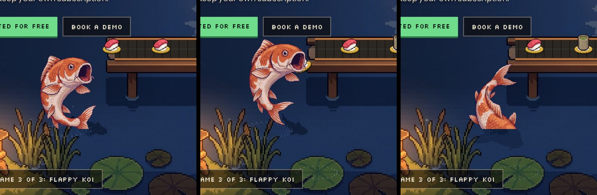

# 03 — Scenes: storage, pantry, street, pond · Mini games · Belt item catalogue

Recreation spec for the back half of Jiro's Restaurant. Everything here is in
**stage space** (fixed 1920×1080 logical canvas, see the engine doc) unless it
says "internal px" (game canvases). Times are seconds. `now` is the global scene
clock (`performance.now()/1000`, or the frozen `?t=` value). `LOOP = 24`,
`BELT_SPEED = 46` px/s, `PLATE_GAP = 150` px, so one plate passes every
`150/46 = 3.2609 s`.

Source files covered:

| File | Role |
|---|---|
| `src/scenes/storage.ts`, `storage.css` | Storage room: Hose Snake entry point + integrations jars |
| `src/scenes/pantry.ts` | Pantry = storage canvas + MCP moodboard DOM |
| `src/scenes/street.ts`, `street.css` | Night delivery street: pricing board |
| `src/scenes/pond.ts`, `pond.css` | Koi pond ending: koi eats every plate, final CTA, footer, Flappy Koi entry |
| `src/games/arcade.ts`, `games.css` | Shared 16-bit arcade cabinet overlay |
| `src/games/snake.ts` | Hose Snake (mini game 1 of 2) |
| `src/games/flappy.ts` | Flappy Koi (mini game 2 of 2) |
| `src/engine/items.ts`, `public/items/*.png` | Belt item catalogue |

Canonical scroll order (from `src/main.ts`):
`bar, office, dining, kitchen, storage, pantry, street, pond`, with transitions
`kitchen>storage (kitchen-storage-f), storage>pantry, pantry>street (file storage-street.ts, export pantryStreet), street>pond`.

> **BIBLE.md is stale on three points; the code is the truth.** (1) The storage
> room hosts **Hose Snake** (mini game 2), not Whack-a-Bug. (2) There is **no
> `yard` scene**; `public/art/yard.jpg` is committed but unused. The integrations
> moved from the yard laundry line onto storage jar labels. (3) Whack-a-Bug was
> dropped; the `.whack-*`, `.mole*` CSS in `games.css` and `style.css` is dead
> code. You do not need it to rebuild the site.

---

## Reference screenshots

Rendered with `node ~/.local/pw/seg.mjs /tmp/docshots2 storage:0.5 street:0.5 pond:0.5 --t=5 --wait=2500`
(1600×900 viewport, time frozen at `now = 5`), saved as JPEG q80.

| Storage | Street | Pond |
|---|---|---|
|  |  |  |

Full size:


Koi jump crops (stage region x 250–850, y 380–980) at `t = 127.37`
(rising, τ≈0.2), `128.12` (apex, τ≈0.95, mouth on the plate) and `129.17`
(dive, τ≈2.0):



Items contact sheet (catalogue order; last three are committed but unused):


---

## Shared engine facts you need for these scenes

These come from `src/engine/*` (documented in full elsewhere); they are repeated
here only where they affect the numbers below.

- **SceneDef fields used here:** `id, room, art, mood, hold, belt, surfaces, under(g, now, api), over(g, now, api), mount(el, api), click(x, y, api)`.
  Draw order per frame: art (`drawImage(art, 0, 0, 1920, 1080)`) → `under` →
  belt tread + plates (`drawBeltFull(g, belt, now, scene.id)`) → dragged plates →
  `over`.
- **Belt path:** `pts: [x, y, scale]`. Resampled every ≤6 px; world distance
  `u` advances by `screenDist / avgScale`. Plates sit at `u = first + k·150`
  with `head = now·46 + (phase ?? 0)`, `first = head mod 150`, plate id
  `= floor(head/150) − k`. Default belt style `"full"`: shadow
  `rgba(0,0,0,.35)` offset 8·s down, tread `#2b2723`, centre highlight line
  `#3d3832` 2 px, moving seams every 26 world px `rgba(0,0,0,.45)` 2 px wide
  (inset 3 px from each edge), rails `#6d3f22` 7 px under `#c9814a` 4 px on both edges.
- **Fades:** `fadeIn`/`fadeOut` are world-px alpha ramps at the start/end of
  an open path (plate alpha = `u/fadeIn`, `(U−u)/fadeOut`). Default 40 each.
- **Plate sprite:** procedurally drawn pixel plate (2-tone rim, cream well,
  specular glint, contact shadow), diameter `round(plate·s)`, rim colour
  `RIMS[hash(id,"rim") % 6]` from `#c8483f #3a6fc4 #e0b33a #4ea36a #d9d2c3 #1c1a18`.
  Item image fit inside `0.86d × 0.92d`, bottom at `y + round(0.1d)`. Animal
  items hop 1 px when `floor((x + 0.5y)/18) & 3 === 0`.
- **Helpers (`src/engine/fx.ts`):**
  - `wave(now, period, phase=0) = sin(((now % 24)/period)·2π + phase)`.
  - `glow(g, x, y, r, color, now, amt=.08, period=6, seed=0)`: additive
    (`lighter`) radial gradient `color → transparent`, radius
    `r·(1 + amt·(0.6·wave(now,period,seed) + 0.4·wave(now,period/3,seed·2.1)))`,
    filled over a `2.6r` square.
  - `shade(g, x, y, w, h, alpha, feather, side)`: linear gradient of
    `rgba(8,6,5,alpha)` solid until `feather` px from the open edge, then to 0.
  - `motes(g, now, x0, y0, w, h, n, color="rgba(255,220,160,.7)")`: n 3×3 px
    dust motes rising bottom→top of the box, periods 12/18/24 s by `i % 3`,
    x = `x0 + ((i·0.618) % 1)·w + 14·sin(2πf + i)`, alpha `0.6·sin(πf)`.
- **DOM helpers (`src/engine/dom.ts`):** `html(el, markup)` appends the first
  element; `place(el, x, y, w?, h?)` sets absolute stage px; `hotspot(parent, x, y, w, h, title, fn)`
  makes an invisible `<button class="hit">` with `title` and `aria-label`
  (click `stopPropagation`); `bubble(parent, x, y, text, ms=2600, cls="")`
  shows a `.bubble` (cream `#f3e6cf` box, `#1b130d` text, 22px/1.35 sans,
  3px `#1b130d` border, pops in via `.on`, removed after `ms` + 300 ms).
- **Eggs:** `api.egg(id, text)` fires once per id ever (localStorage
  `jiro-eggs`, notes in `jiro-egg-notes`), shows a toast with a green
  "`<id>` found!" tab. Every scene calls `declareEggs([...])` at module load
  so the total counter (shown as e.g. `0/88 EASTER EGGS`) is known up front.
- **Surfaces:** a dragged plate may be dropped where its bottom centre is inside
  a `poly`; it rests at `scale` and toasts `say` (the first park anywhere
  also fires the global `plate-parked` egg).
- **Plate click (engine default):** plays `item.sfx ?? "pop"`, shows a spark
  (`boom` burst for `sfx:"boom"`, coin burst for `sfx:"coin"`), cycles through
  `item.say` per item id (session counter), and calls `api.egg(item.egg, line)`
  if the item has an egg, else `api.toast(line)`.
- **Shared CSS tokens (`src/style.css`):** `--ink #0b0a09`, `--cream #f3e6cf`,
  `--muted #bfae95`, `--copper #d98a4a`, `--green #6fdc8c`, `--pink #ff5fc8`,
  `--cyan #5ff0ff`, `--px "Silkscreen", monospace`,
  `--sans "Instrument Sans", system-ui, sans-serif`,
  `--mono "JetBrains Mono", ui-monospace, monospace`.
  `.kicker` 20px/1 px-font copper, letter-spacing .04em, margin 0 0 22px.
  `.px` px-font, cream, `text-shadow: 0 4px 0 rgba(0,0,0,.6)`; `h2.px` 56px/1.05.
  `.lede` 27px/1.45 `#e7d8bf`, margin-top 24px, max-width 34ch,
  `text-shadow: 0 2px 8px rgba(0,0,0,.8)`. `.ctas` flex gap 16 margin-top 38.
  `.btn` 20px/1 px-font, padding 18px 24px; `.btn.primary` green bg, `#07130b`
  text, `box-shadow: 0 5px 0 #2d7a45`; `.btn.ghost` `rgba(10,8,7,.6)` bg,
  cream text, `2px solid rgba(243,230,207,.5)`. `.foot` flex space-between,
  16px mono, muted; links cream. `.game-start { position:absolute }`.
- **Sound effects (`src/engine/sfx.ts`, WebAudio synth):** `pop` square 500→900 Hz 80 ms;
  `blip` square 880→1320 Hz 70 ms; `quack` two sawtooth chirps 420→260 / 400→250;
  `boom` low-passed noise 0.6 s + sine 120→40; `coin` square 988 Hz then 1319 Hz;
  `meow` triangle 700→1000 then 1000→500; `splash` noise 0.5 s lp 2200;
  `whoosh` noise 0.35 s lp 900; `bonk` square 220→110; `chime` sine 1568 + 2093 Hz.

---

## Scene 5 — `storage` (Storage room)

### Purpose and mood

Quiet, dim, warm back-of-house store room. A single bare bulb breathes over rice
sacks, sake barrels and a pickle-jar shelf; Jiro stands arms-crossed behind the
belt guarding the rice. The coiled green garden hose on the floor **is** the
game: "That hose is a snake." The ten pickling jars / crates carry masking-tape
labels with the integration names ("Everything plugs in"). Right third of the
frame falls into shadow; that is where the copy sits.

SceneDef: `id "storage"`, `room "Storage"` (side-rail label), `art "art/storage.jpg"`,
`mood "quiet"`, `hold 1.1` viewport heights.

### Art

`public/art/storage.jpg` — 1920×1080 RGB JPEG (380,894 bytes). Generated with
Gemini (`pipeline/gen_still.py`, model `gemini-3-pro-image-preview`, 2K 16:9,
Jiro canon ref), then hand-edited; first-pass prompt is in
`pipeline/first_pass.tsv` row `storage` (the whack-a-mole sack grid it asks for
was painted out). Key content and coordinates (stage px):

| Feature | Where |
|---|---|
| Dark doorway (belt enters from it) | x ≈ 265–470, y ≈ 40–400, upper left |
| Bare hanging bulb | centre (731, 106); cord from top edge |
| Painted light cone | from bulb down-left to the floor, apex ~ (731,120), base ~505–930 at y≈450 |
| Painted belt bed (stone slats, copper rail) | diagonal from (262, 357) to off-canvas (1880, 1119); centre line `y = 441 + 0.471·(x − 440)` |
| Rice sack stack | x ≈ 40–380, y ≈ 470–740 (left) |
| Stripe crate / Gmail crate | lids ≈ (352–553, 548–648) and (502–698, 618–718) |
| Rice tub (white bucket) | (732–838, 280–460) |
| Two sake barrels (酒) | (890–1020, 140–300) and (1020–1130, 195–360) |
| Top shelf of stacked sacks | (880–1130, 0–150) |
| Jiro (arms crossed, behind belt) | head ≈ (960–1080, 345–480), body to y ≈ 700; eyes at (966,417,13×18) and (997,421,15×19) |
| Pickle jars shelf | (1205–1465, 115–320), carrot crate (1180–1380, 300–450), potato crate (1180–1400, 500–650), lower jars (1350–1465, 580–690) |
| Spoons / utensils on shelf | ≈ (1340–1465, 400–490) |
| Tool crate (dark, right) | (1545–1740, 630–860) |
| Coiled green garden hose + brass nozzle | coil ≈ (690–925, 790–960), nozzle tail to (800, 1000) |
| Mouse hole (drawn in code, not painted) | arch centre (1112, 965) at the foot of the belt's front skirt |

No sprite sheets: everything else is code-drawn.

### Belt

```ts
belt: { pts: [[262, 357, 0.96], [1880, 1119, 1.04]], width: 72, plate: 54, fadeIn: 80, fadeOut: 20 }
```

- Straight diagonal down-right, scale 0.96 → 1.04 (slight perspective). Screen
  length 1788.5 px, world length ≈ 1788 → ~12 plates visible.
- Style default `"full"`: the code tread is drawn **over** the painted bed and
  matches its 72 px width (the painted rails show at the edges).
- `fadeIn: 80` — plates fade in over the first 80 world px as they come out of
  the doorway; `fadeOut: 20` — near-instant fade at the bottom-right edge (off
  canvas anyway).
- `phase` is unset (0). Transitions compute their own phases against it.
- Item pool: global (no `pool`).

### Surfaces (drag-and-park)

| # | Polygon | scale | say |
|---|---|---|---|
| 1 | `[352,600] [450,548] [553,596] [455,648]` | 1 | "On the Stripe crate. Billing has been notified." |
| 2 | `[502,670] [596,618] [698,665] [604,718]` | 1 | "Parked on the Gmail crate. Marked as read, never eaten." |
| 3 | `[45,560] [160,500] [250,470] [378,518] [300,566] [200,600] [60,612]` | 0.95 | "A plate on a rice sack. The rice is thrilled to meet its future." |
| 4 | `[892,140] [1018,140] [1018,196] [892,196]` | 0.8 | "On the sake barrel. The plate is now eighteen years old." |
| 5 | `[1028,198] [1130,198] [1130,252] [1028,252]` | 0.8 | "Second sake barrel. Jiro counts this as a pairing." |
| 6 | `[732,280] [838,280] [838,345] [732,345]` | 0.85 | "In the rice tub. Closest this plate has been to its origin story." |
| 7 | `[880,30] [1130,30] [1130,150] [880,150]` | 0.75 | "Top shelf. Good. Nobody can reach it, including you." |
| 8 | `[1340,400] [1465,400] [1465,490] [1340,490]` | 0.8 | "Filed next to the spoons. Jiro approves the taxonomy." |
| 9 | `[1545,640] [1740,640] [1740,705] [1545,705]` | 0.9 | "On the tool crate. Dark in here. It will be found in 2031." |

Rule in the source comment: "Plates rest on crate lids, sack tops, barrel lids
and the free shelf boards. Not on the floor."

### Ambient animation (`under`, in this exact order)

Constants: `BULB = [731, 106]`, `EYES = [[966,417,13,18],[997,421,15,19]]`,
`FACE = "#c3a990"`, `MOUSE = [1112, 965]`. Module variable `flicker` holds the
`performance.now()` of the last bulb click (0 = never).

1. **Bulb flicker check.** `since = (performance.now() − flicker)/1000`;
   `off = flicker && since < 1.2 && floor(since·10) % 3 === 1` (1.2 s of
   stuttering: dark every third 100 ms slice).
2. **If lit:**
   - `glow(g, 731 + wave(now,12), 106, 110, "rgba(255,210,140,.30)", now, 0.06, 8)` — the bulb halo, drifting ±1 px horizontally over 12 s (the cord sways).
   - `glow(g, 720, 360, 330, "rgba(255,190,110,.09)", now, 0.08, 8, 1)` — soft room fill.
   - **Light cone** `cone()`: `k = 0.5 + 0.5·wave(now, 8)`; vertical linear
     gradient y 106 → 470 from `rgba(255,205,130, 0.07 + 0.04k)` to
     `rgba(255,205,130,0)`, composite `lighter`, polygon
     `(717,120) (745,120) (930,450) (505,450)`.
   - **If off:** `shade(g, 0, 0, 1300, 1080, 0.35, 10, "left")` (the left
     1300 px darkens hard).
3. **Dust motes:** `motes(g, now, 560, 160, 360, 300, 16)` — 16 motes in the
   cone box x 560–920, y 160–460.
4. **Jiro blink** (`blink()`): shut when `now % 6 ∈ (3.1, 3.24)` **or**
   `now % 24 ∈ (15.42, 15.54)` (a second, extra blink once per 24 s loop →
   reads as a double blink at 15.1/15.42). While shut, each eye rect is
   over-painted: `FACE` fill at `(x−1, y−1, w+2, h+2)`, then a closed-lid line
   `#1b3a44` at `(x, y + round(h/2) − 1, w, 3)`.
5. **Mouse** (`mouse()`), a code-drawn pixel mouse peeking out of a hole:
   - Hole, always: fill `#0c0706`, half-ellipse centre (1112,965) rx 17 ry 15
     from π to 0 (top arch), closed by lines to (1129,968) and (1095,968).
   - Peek: `t = now % 12`; `out = t < 5 ? sin(π·t/5) : 0`; `p = min(1, 1.6·out)`.
     Out ~5 s of every 12 s, eased both ways, no pop. Drawn only if `p > 0.02`,
     clipped to a slightly smaller arch (rx 16, ry 14). Vertical offset
     `dy = round((1 − p)·20)` (slides up from below the rim).
   - Pixels (offsets from (1112, 965+dy)): head `(-9,-6,18,12) #8a7f78`;
     ears `(-12,-12,6,6)` and `(6,-12,6,6) #8a7f78`; inner ears `(-11,-10,3,3)`,
     `(8,-10,3,3) #d9a1a1`; eyes `(-5,-3,3,h)` and `(3,-3,3,3) #0b0a09`, left eye
     height 1 (wink) when `now % 6 ∈ (4.4, 4.52)` else 3; nose `(-1,2,3,2) #e79aa0`;
     whiskers `(-8,2,5,1)` and `(4,2,5,1) #c9c0b8`.
6. **Right-side shade for the copy:** `shade(g, 1470, 0, 450, 760, 0.35, 200, "right")`.

No `over` layer.

### DOM layout (`mount`)

All positions are stage px inside the scene layer (`.scene-ui[data-id="storage"]`).

1. **Hose Snake copy + button** via
   `mountSnake(el, api, { copy: [1496, 112, 384], btn: [1496, 470], hose: [690, 790, 235, 215], arcade: [470, 250] })`
   (see Hose Snake below). Copy block at left 1496, top 112, width 384:
   - kicker: `Storage room · mini game 1 of 2`
   - h2.px: `That hose is a snake.`
   - lede: `Nobody remembers why a sushi bar owns a garden hose. Steer it, eat the sushi, don't tie yourself in a knot.`
   - Button (`.btn.primary.game-start`) at (1496, 470): `▶ Play Hose Snake`
2. **Integrations heading**:
   `<p class="st-plugs">Everything plugs in<span>Ten jars on the shelf. Hundreds more in the back.</span></p>`
   at left 1496, top 600. CSS: width 370, 18px/1 px-font, copper, letter-spacing
   .04em, `text-shadow: 0 2px 0 #000`; `::before` content `"\2190  "` (← and two
   spaces) in green; the `span` is block, margin-top 10, 18px/1.4 sans, letter-spacing 0, `#e7d8bf`.
3. **Ten tape labels** — one `<button class="st-tape">` per entry of
   `INTEGRATIONS = ["Slack","GitHub","Linear","Notion","Google Drive","Sentry","Jira","HubSpot","Stripe","Gmail"]`
   (in that order, from `src/content/copy.ts`). Inner HTML = name with the
   first space replaced by `<br>` (so "Google<br>Drive"), `title` = name,
   `left/top` = centre, `--r` = tilt.

   | i | Integration | centre (x, y) | tilt | Quip (bubble) | Sits on |
   |---|---|---|---|---|---|
   | 0 | Slack | 1240, 196 | −3° | "Slack: fermented daily. Very chatty jar." | top-left jar |
   | 1 | GitHub | 1306, 214 | 2° | "GitHub: every jar is a fork of the one before it." | 2nd jar |
   | 2 | Linear | 1382, 252 | −2° | "Linear: pickled in exactly the order it was filed." | 3rd jar |
   | 3 | Notion | 1428, 280 | 3° | "Notion: the jar is also a database. Of pickles." | 4th jar |
   | 4 | Google Drive | 1284, 428 | −2° | "Google Drive: 14 carrots, all named final_final_v3." | carrot crate |
   | 5 | Sentry | 1426, 676 | 2° | "Sentry: if this jar makes a noise, Jiro already knows why." | lower-right jar |
   | 6 | Jira | 1382, 644 | −3° | "Jira: labelled, prioritised, story-pointed. Still a jar." | lower jar |
   | 7 | HubSpot | 1285, 612 | 2° | "HubSpot: potatoes, each with a lifecycle stage." | potato crate |
   | 8 | Stripe | 404, 706 | −2° | "Stripe: the crate that pays for the other crates." | left crate |
   | 9 | Gmail | 552, 770 | 2° | "Gmail: crate of unread mail. 4,012 envelopes." | right crate |

   Tape CSS (`storage.css`): absolute, `transform: translate(-50%,-50%) rotate(var(--r,0deg))`,
   `font: 400 15px/1.05 var(--px)`, letter-spacing .02em, colour `#2a170c`,
   centred, background `#eadcb8`, padding `4px 6px 3px`, no border, pointer,
   nowrap, `box-shadow: inset 0 -2px 0 rgba(120,90,50,.35), 0 2px 0 rgba(0,0,0,.55)`,
   torn-tape `clip-path: polygon(0 8%, 6% 0, 50% 6%, 94% 0, 100% 10%, 97% 50%, 100% 92%, 92% 100%, 50% 94%, 8% 100%, 0 90%, 3% 50%)`.
   Hover/focus-visible: background `#f6ecd0`, lifts to `translate(-50%,-54%)`, no outline.

   Click: `stopPropagation`, `sfx("pop")`, bubble at `(min(x + 30, 1500), y − 70)`
   with the quip, 2800 ms, class `st-say`. Tracks a `Set` of opened indices:
   first open → egg `storage-jars` "Pickled integrations. Do not open before 2031.";
   all 10 opened → egg `storage-all-jars` "You opened every jar. Jiro plugs into all of them anyway."

Other scene CSS (`storage.css`):
`.copy { text-shadow: 0 2px 0 #000, 0 0 24px rgba(0,0,0,.8) }`,
`.copy h2.px { font-size: 46px }`, `.copy .kicker { font-size: 17px; margin-bottom: 18px }`,
`.copy .lede { font-size: 24px }`, `.st-say { font-size: 20px; max-width: 360px }`.

### Hotspots and easter eggs

`declareEggs(["storage-bulb", "storage-jars", "storage-mouse", "storage-jiro", "storage-all-jars"])`
(Hose Snake adds `snake-played`, `snake-10`, `snake-gold`.)

| Hotspot (title) | Rect x, y, w, h | Trigger effect | SFX | Egg id → text |
|---|---|---|---|---|
| "Light bulb" | 700, 50, 64, 90 | `flicker = performance.now()` → 1.2 s stutter (above) | blip | `storage-bulb` → "The bulb has never been turned off. Jiro doesn't do cold starts." |
| "Mouse hole" | 1090, 939, 44, 32 (`MOUSE − (22, 26)`) | — | blip | `storage-mouse` → "Not a bug. The mouse is a feature. It pays rent in crumbs." |
| "Jiro" | 915, 345, 200, 180 | bubble at (1060, 300), 2600 ms, class `st-say`, cycling lines | chime | on the 3rd click: `storage-jiro` → "Jiro, arms crossed, guarding the rice like production data." |
| "Garden hose" | 690, 790, 235, 215 | opens Hose Snake (same as the button) | chime | `snake-played` |
| 10 tape labels | see table | quip bubble | pop | `storage-jars`, `storage-all-jars` |

Jiro lines, in order (cycling):
1. "Inventory: rice, sake, one hose. Nobody ordered the hose."
2. "Put a plate on a crate. Not the floor. We have standards."
3. "Every sack is load-tested. By sitting on it."

---

## Scene 6 — `pantry` (MCP pantry)

The pantry is **the storage room again**, same art, same camera, same belt, same
ambient, same surfaces, dimmed behind the MCP moodboard panel. Only the DOM changes.

```ts
export const pantry: SceneDef = {
  ...storage,
  id: "pantry",
  room: "MCP pantry",
  hold: 1.5,
  mount(el, api) { mountMoodboard(el, api); },
  enter: undefined,
  leave: undefined,
};
declareEggs(["mood-all"]);
```

- Because it spreads `storage`, it inherits `art`, `belt`, `surfaces`, `under`,
  `mood`. Plate item draws use the key `"pantry"` (scene id) instead of
  `"storage"`, so the item sequence on the belt differs between the two holds.
- The dimming and all moodboard content live in `src/moodboard/viewer.ts`
  (+ `v01…v10`, documented in the moodboard doc), not here. The viewer fires
  `mood-all` → "You tasted all ten versions. Jiro wants to know your favourite."
  once all 10 versions have been viewed.
- Transition `storage>pantry` (`src/transitions/storage-pantry.ts`): length
  0.35 viewport heights, route "No move: the pantry is the storage room with the
  moodboard pinned up.", `render` just calls `api.drawScene("storage", g, now)`.
  The storage copy fades out and the moodboard fades in (DOM layer swap).
- The next transition leaves from the pantry: `pantry>street`
  (`storage-street.ts`, export `pantryStreet`), which reads `storage.belt`.

---

## Scene 7 — `street` (Delivery)

### Purpose and mood

Bustling rainy neon night street. Jiro rides a green delivery trike with a big
wooden cargo box past a ramen shop. The belt has become a **vertical delivery
conveyor clamped to the utility pole** at the right edge, running straight from
above the frame to below it; it never touches the trike. The dark shuttered
wall on the left carries a lit, bolted-on **pricing menu board**.

SceneDef: `id "street"`, `room "Delivery"`, `art "art/street.jpg"`,
`mood "bustling"`, `hold 1.6`.

### Art

- `public/art/street.jpg` — 1920×1080 RGB (492,619 bytes). Source prompt row
  `street` in `pipeline/first_pass.tsv` (the cargo-box mini belt it asks for was
  painted out; the belt moved to the pole). Key coordinates:

  | Feature | Where |
  |---|---|
  | Dark wall + roller shutter (copy area) | x 0–700, y 0–700 |
  | Pedestrian with umbrella (left edge) | x 0–140, y 330–750 |
  | Pink RAMEN neon (horizontal) | x 890–1125, y 55–240; the "R" is at ~ (893–947, 78–166) |
  | Pink bowl neon sign | x 765–880, y 0–150 |
  | Awning | x 780–1150, y 180–300 |
  | Ramen shop window + diner | x 775–1100, y 280–650 |
  | Cyan window neon (bowl + cup) | ≈ (910–1025, 340–450) |
  | Sidewalk menu sign (A-frame) | x 905–1000, y 495–650 |
  | Amber vertical RAMEN sign | x 1170–1255, y 10–250 |
  | Cyan vertical SUSHI sign | x 1305–1380, y 65–290 |
  | Purple "BAR" + vertical sign | x 1590–1700, y 0–300 |
  | Paper lantern | ≈ (1160–1195, 350–420) |
  | Jiro on the trike (head / eyes) | head ≈ (1195–1330, 330–480); eye glows at (1212,425) and (1249,425) |
  | Bike headlamp | ≈ (1110–1140, 720–750) |
  | Cargo box (on the trike) | x 1385–1650, y 590–850 |
  | Rear wheel rim glint | (1590, 790) |
  | Person with umbrella (behind trike) | x 1575–1665, y 395–535 |
  | Storm drain grate | x 555–700, y 805–835 |
  | Black utility pole with rungs (the belt's mount) | x ≈ 1700–1790, full height |
  | Right-edge pedestrian with umbrella | x 1790–1920, y 340–740 |
  | Wet street / puddles with neon reflections | y 780–1080 |

- `public/art/street/r-off.png` — 54×88 RGBA: the RAMEN "R" with its tube
  **off** (dull purple R on transparent). Drawn at (893, 78).
- `public/art/street/blink.png` — 70×36 RGBA: Jiro's two eyes as closed dark
  lids (two short dark bars with a cyan rim). Drawn at (1196, 408).

### Belt

```ts
export const BELT_X = 1740;
belt: { pts: [[1740, -70, 1], [1740, 1150, 1]], width: 58, plate: 52, fadeIn: 0, fadeOut: 0 }
```

Straight vertical top→bottom at x 1740, length 1220 (≈8 plates visible), no
fades (plates enter and leave off-canvas). Default `"full"` style draws the
dark tread + copper rails over the pole. `BELT_X` and the path ends are
exported for the transitions: `pantry>street` arrives at the top,
`street>pond` leaves at the bottom.

### Surfaces

| # | Polygon | say |
|---|---|---|
| 1 | `[1385,628] [1480,596] [1650,598] [1712,640] [1690,692] [1400,692]` | "Plate stowed on the cargo box. Delivery ETA: whenever the tests pass." |
| 2 | `[898,490] [1002,490] [1002,528] [898,528]` | "Balanced on the sidewalk sign. Today's special just got more special." |
| 3 | `[1004,478] [1100,478] [1100,512] [1004,512]` | "Slid across the ramen counter. The ramen chef is filing a merge conflict." |
| 4 | `[790,190] [1140,250] [1150,300] [790,290]` | "Plate on the awning. The rain is now pre-washing it." |
| 5 | `[780,640] [1080,610] [1080,700] [780,740]` | "Left on the doorstep. Jiro rang twice." |
| 6 | `[160,250] [760,250] [760,284] [160,284]` | "Plate on top of the menu board. Now it costs $0 and a ladder." |
| 7 | `[150,772] [772,772] [772,806] [150,806]` | "Parked on the menu board's ledge. Pricing now includes one free nigiri." |

No `scale` set → the plate keeps the scale it was picked up at (1).

### Ambient animation

Helpers: `lt(now) = ((now % 24) + 24) % 24`; hash `h(i, k=1) = frac(sin(i·127.1·k + k·311.7)·43758.5453)`.
Egg one-shots use wall-clock seconds `fxAt = { lamp, rOut, blink }` (initially −99), set from `performance.now()/1000`.

**`under`** (in order):

1. **Neon halos breathe** (`glow` calls, exactly):
   - `(1005,150) r190 rgba(255,80,190,.13) amt .12 period 6` — RAMEN sign
   - `(820,70) r110 rgba(255,80,190,.10) .12, 8, seed 2` — bowl sign
   - `(1207,130) r130 rgba(255,190,90,.10) .1, 12, seed 1` — amber RAMEN
   - `(1342,175) r150 rgba(80,240,255,.12) .14, 4, seed 3` — SUSHI
   - `(1690,85) r140 rgba(200,110,255,.12) .12, 6, seed 4` — BAR
   - `(965,395) r90 rgba(80,240,255,.10) .1, 8, seed 5` — cyan window neon
   - `(1175,385) r60 rgba(255,170,80,.18) .08, 12, seed 6` — paper lantern
2. **RAMEN "R" sputter** `rIsOut(now)`:
   - If the egg fired within 1.6 s: out when `floor((now − rOut)·9) % 3 !== 1` (mostly dark, flickering).
   - Otherwise out during loop windows `[6.0,6.07) [6.16,6.21) [6.3,6.36) [17.4,17.46) [17.55,18.3)` of `lt(now)` — a triple sputter at 6 s and a stutter-then-0.75 s blackout at 17.4 s.
   - Out → draw `art/street/r-off.png` at (893, 78). On → `glow(920, 122, 50, "rgba(255,95,200,.10)", now, 0.2, 3)`.
3. **Puddle neon shimmer:** `SHIMMER` spots `[x, y, w, rgb]`:
   `[965,870,70,"95,240,255"] [940,915,60,"255,95,200"] [1700,1030,80,"200,110,255"] [830,1055,70,"255,95,200"] [1560,960,50,"255,190,120"] [1880,990,40,"255,160,90"]`.
   For each spot i and k = 0..4: alpha `0.12 + 0.12·(0.5 + 0.5·wave(now, [6,8,12][(i+k)%3], 1.3i + k))`,
   dx `round(wave(now, 12, i + 0.7k)·6)`, y `y + 5k − 10`, width `round(w·(0.4 + 0.6·h(5i + k, 2)))`,
   rect `(round(x − ww/2 + dx + (k%2)·9), yy, ww, 2)` in `rgba(rgb, a)`.
4. **Rain ripples:** `RIPPLES` = `[120,905] [330,960] [520,890] [690,1010] [260,1045] [880,985] [990,880] [1380,1040] [1500,1005] [1760,1050] [1840,930] [1250,1060] [60,1000] [610,945]`.
   Period `P = i odd ? 3 : 4`; `f = frac(now/P + h(i,5))`; only while `f ≤ 0.6`: `q = f/0.6`, 1 px stroke ellipse rx `3 + 16q`, ry `1 + 5q`, colour `rgba(190,215,255, 0.32·(1−q))`.
5. **Bike lamp:** `lampBoost = max(0, 1 − (now − lamp)/1.2)` (0 before the click).
   `glow(1126, 736, 46 + 40·boost, rgba(255,230,160, 0.35 + 0.4·boost), now, 0.06, 4, 1)`;
   plus a light pool on the street: additive radial gradient centred (1010, 930), r 190,
   inner alpha `0.07 + 0.015·wave(now,6) + 0.12·boost` of `rgba(255,220,150,…)`,
   squashed vertically ×0.35 about (1010,930), filling rect (800, 700, 420, 460).
6. **Jiro's eyes:** `b8 = lt % 8`; blinking when `b8 ∈ (3.0, 3.14)` or `lt ∈ (19.34, 19.46)` (extra blink once per loop → double blink at 19.0/19.34), or forced by the egg: for 0.9 s after the click, whenever `floor((now − blink)/0.15) % 3 === 0` (three quick blinks).
   Blinking → draw `art/street/blink.png` at (1196, 408). Otherwise two glows
   `(1212,425)` and `(1249,425)`, r 24, `rgba(110,240,255,.22)`, amt .1, period 4, seeds 0 and 1.
7. **Wheel spoke glint:** `tw = max(0, wave(now, 12, 0.4))`; when `tw > 0.2`: alpha `(tw − 0.2)·0.9`, `#fff4dc` 3×3 at (1589, 789), then at 0.6× alpha a 13×1 horizontal (1584,790) and 1×13 vertical (1590,784) cross.

**`over`** (rain, above the belt): `drizzle(g, now, n, alpha, len, periods)` —
1 px strokes `rgba(185,205,255,alpha)`; drop i: `P = periods[i % len]`,
`f = frac(now/P + h(i,3))`, `x = round(h(i,7)·2000 − 70f)`, `y = round(−40 + 1160f)`,
line from `(x+.5, y)` to `(x − 3 + .5, y + len)`.
Two layers: `drizzle(now, 120, 0.2, 16, [2, 2.4, 3])` (far, faint) and
`drizzle(now, 60, 0.3, 24, [1.5, 1.6, 2])` (near). Every period divides 24, so it loops.

### DOM: the pricing board

Data (`PRICING` in `src/content/copy.ts`):

```ts
title: "Pay per agent, no hidden fees.",
plans: [
  { name: "Free trial", price: "$0", unit: "for 30 days", included: "Five runtimes and the complete team experience", cta: "Start free", href: LINKS.start, hot: true },
  { name: "Developer", price: "$99", unit: "/month", included: "One user, up to three persistent runtimes, integrations, triggers, and BYOK", cta: "Get started", href: LINKS.start },
  { name: "Team", price: "$250", unit: "/month", included: "Multiple users, five shared runtimes, organization controls, integrations, and collaboration", cta: "Get started", href: LINKS.start },
  { name: "Enterprise", price: "Let's talk", unit: "", included: "Custom capacity, role-based access control, audit trails, deployment, onboarding, and support", cta: "Talk to us", href: LINKS.enterprise },
]
```

`LINKS.start = "https://noriagentic.com/"`,
`LINKS.enterprise = "mailto:amol@noriagentic.com?subject=Nori%20Sessions%20Enterprise"`.

Markup (title split on the first comma: lead `Pay per agent`, tail `no hidden fees.`):

```html
<section class="copy st-board">
  <p class="st-open"><i></i>Open late · night delivery</p>
  <h2 class="px st-title">Pay per agent,<br><em>no hidden fees.</em></h2>
  <div class="st-menu">
    <span class="st-tag">Tonight's menu</span>
    <!-- per plan -->
    <article class="st-row hot?">
      <div class="st-line">
        <h3>{name}</h3>[<span class="st-pick">chef's pick</span> if hot]
        <span class="st-dots"></span>
        <p class="st-price">{price}[<small>{unit}</small> if unit]</p>
      </div>
      <p class="st-inc">{included}</p>
      <a class="btn primary|ghost" href target="_blank" rel="noopener">{cta}</a>
    </article>
  </div>
</section>
```

`primary` for the hot row, `ghost` for the rest.

CSS (`street.css`, all scoped `.scene-ui[data-id="street"]`):

- `.st-board`: absolute, left 140, top 88, width 640.
- `.st-open`: inline-flex, centred, gap 12; 15px/1 px-font, letter-spacing .08em,
  `#ffd7f2`; padding `9px 14px 8px`; `2px solid rgba(255,95,200,.85)`;
  `box-shadow: 0 0 12px rgba(255,95,200,.45), inset 0 0 10px rgba(255,95,200,.25)`;
  `text-shadow: 0 0 6px rgba(255,95,200,.9)`; bg `rgba(14,6,16,.7)`; margin `0 0 22px`;
  `animation: st-buzz 12s steps(1,end) infinite`.
  `.st-open i`: 8×8 green square, `box-shadow 0 0 8px green`, `st-dot 4s ease-in-out infinite`.
- `.st-title`: 44px/1.12, `#fff3de`, `text-shadow: 0 0 10px rgba(95,240,255,.35), 0 4px 0 rgba(0,0,0,.7)`, margin `0 0 26px`.
  `em`: normal style, cyan, `text-shadow: 0 0 12px rgba(95,240,255,.7), 0 4px 0 rgba(0,0,0,.7)`, `st-buzz 8s steps(1,end) -3s infinite`.
- `.st-menu`: relative; background = `repeating-linear-gradient(0deg, rgba(255,255,255,.012) 0 2px, transparent 2px 4px)` over `rgba(9,8,16,.88)`;
  `border: 4px solid #2a1c16`; `outline: 2px solid rgba(95,240,255,.5)`, `outline-offset: -10px` (the inner neon tube);
  `box-shadow: 0 0 0 2px #0b0706, 0 0 26px rgba(95,240,255,.18), 0 12px 0 rgba(0,0,0,.45)`; padding `30px 26px 18px`.
  `::before/::after` = two bolts: 10×10 at top −10, left 18 / right 18, bg `#8a5a3a`,
  `box-shadow: 0 0 0 2px #1a100c, inset -3px -3px 0 #5a3622`.
- `.st-tag`: absolute, centred on the top edge (left 50%, top −17, translateX −50%),
  14px/1 px-font, letter-spacing .18em, `#1a0f07` on copper, padding `7px 12px 6px`, `box-shadow: 0 3px 0 #7a4220`, nowrap.
- `.st-row`: grid `1fr auto`, column-gap 18, row-gap 6, align end, padding 14,
  `border-bottom: 2px dashed rgba(243,230,207,.12)` (none on last).
  `.st-line` spans both columns, flex baseline gap 10.
  `h3`: 19px/1 px-font, uppercase, letter-spacing .06em, cyan, `text-shadow: 0 0 8px rgba(95,240,255,.55)`.
  `.st-dots`: flex 1, min-width 20, 2px tall, align centre, margin-top 8, `repeating-linear-gradient(90deg, rgba(243,230,207,.35) 0 4px, transparent 4px 10px)`.
  `.st-price`: 30px/1 px-font `#fff3de`; `small`: 15px sans, muted, margin-left 6.
  `.st-inc`: 16px/1.4 sans `#d9d0e6`.
  `.btn`: 14px, padding `10px 12px 9px`, centred, nowrap, min-width 138. `.btn.ghost`: bg `rgba(10,8,7,.5)`, border colour `rgba(95,240,255,.4)`.
- `.st-row.hot` (Free trial): margin `0 -8px 6px`, padding `16px 22px`, `2px solid rgba(255,95,200,.9)`,
  bg `rgba(40,8,34,.55)`, `box-shadow: 0 0 16px rgba(255,95,200,.4), inset 0 0 14px rgba(255,95,200,.16)`,
  `animation: st-glow 6s ease-in-out infinite`; its `h3` pink with `text-shadow 0 0 10px rgba(255,95,200,.8)`; its price 36px white.
  `.st-pick`: 11px/1 px-font, `#1b0716` on pink, padding `4px 6px 3px`, letter-spacing .06em, `rotate(-4deg)`, `box-shadow 0 0 10px rgba(255,95,200,.6)`.
- `.st-foot` (defined, unused): 12px mono `rgba(191,174,149,.7)`, right aligned.
- Keyframes:
  - `st-buzz`: `0%,100% {opacity:1} 61% {.72} 61.6% {1} 62.4% {.8} 63% {1}` (with `steps(1,end)` → instant dips like a real tube).
  - `st-glow`: `0%,100% box-shadow 0 0 14px rgba(255,95,200,.36), inset 0 0 12px rgba(255,95,200,.14)`; `50% 0 0 22px …,.5 / inset 0 0 18px …,.2`.
  - `st-dot`: `0%,100% opacity 1; 50% .45`.
  - `prefers-reduced-motion: reduce` → all animations in the scene off.

### Hotspots and easter eggs

`declareEggs(["street-bell", "street-neon", "street-jiro", "street-pm", "street-drain", "street-special"])`

| Hotspot | Rect x, y, w, h | Effect | SFX | Bubble (x, y) text | Egg id → text |
|---|---|---|---|---|---|
| "Bike lamp" | 1080, 690, 90, 90 | `fxAt.lamp` → lamp flare 1.2 s | chime | (1010, 620) "Ring ring. Delivery for main." | `street-bell` → "Every delivery ships with tests." |
| "Ramen sign" | 880, 40, 260, 200 | `fxAt.rOut` → R flickers out 1.6 s | bonk | — | `street-neon` → "The R in RAMEN has been flickering since 2019. Ticket status: won't fix." |
| "Jiro" | 1185, 335, 110, 150 | `fxAt.blink` → triple blink 0.9 s | blip | (1000, 250) "Tips? I only accept well-scoped tickets." | `street-jiro` → "Jiro delivers 24/7. He does not know what a weekend is." |
| "Person with umbrella" | 1575, 395, 90, 140 | — | quack | (1440, 330) "“Can it ship tonight?”" (curly quotes) | `street-pm` → "That's the PM. He has followed the trike for three blocks." |
| "Storm drain" | 540, 790, 180, 60 | — | splash | (470, 700) "(from the drain) …works on my machine…" | `street-drain` → "Something down there is still running the legacy cron job." |
| "Sidewalk menu sign" | 905, 495, 95, 150 | — | coin | (820, 430) "Today's special: zero-downtime deploy. Side of rollback, free." | `street-special` → "Chef recommends: the Free trial. Thirty days, no chopsticks required." |

Bubbles use the default 2600 ms.

---

## Scene 8 — `pond` (Koi pond, the ending)

### Purpose and mood

Quiet night garden, top-down-ish: a long wooden pier runs in from the right edge
and stops over open water on the left. The belt runs along the pier and simply
ends; every plate tips off the end and a big koi eats it. Two out of three
plates: a lazy surface gulp. Every third plate: the koi leaps clear out of the
water, catches the plate at the apex, and dives back. Punchline copy: "Every
plate gets eaten." Final CTAs, footer, Flappy Koi.

SceneDef: `id "pond"`, `room "Koi pond"`, `art "art/pond.jpg"`, `mood "quiet"`, `hold 1.8`.

### Art

- `public/art/pond.jpg` — 1920×1080 RGB (391,921 bytes). Source `art/src/pond.png` (2752×1536).

  | Feature | Where |
  |---|---|
  | Open dark water (copy area) | x 0–800, y 0–520 (moon-dark) |
  | Pier deck (plank top with scalloped tiles) | x 578–1920, deck top y ≈ 495–600; posts at x ≈ 650, 880, 1105, 1335, 1565, 1795 down to y ≈ 680 |
  | Pier end / lip | x = 578 |
  | Moon reflection on the water | x ≈ 830–1380, y ≈ 300–480 |
  | Top island with stone lantern | lantern ≈ (1105–1220, 15–205), reeds around |
  | Arched wooden bridge | x 1385–1920, y 20–450 (top right) |
  | Left bank + stone lantern | lantern ≈ (155–275, 745–945) |
  | Right bank + stone lantern | lantern ≈ (1580–1700, 790–990) |
  | Lily pads | e.g. (1238,385), (1368,400), (605,910), (780,945), (1292,930), (1365,812), (1505,862) … |
  | Shadow koi silhouettes in the water | several, painted, static |
- Koi ending sprites, `public/end/` (all RGBA, facing right, transparent):

  | File | Size | Content | Mouth anchor (mx, my) in sprite px |
  |---|---|---|---|
  | `koi-rise.png` | 169×264 | C-curved koi, head up-right, mouth wide open | 155, 86 |
  | `koi-rise2.png` | 173×264 | same pose, tail flicked (2nd swim frame) | 159, 86 |
  | `koi-gulp.png` | 178×264 | same pose, mouth closed, cheeks full | 172, 88 |
  | `koi-dive.png` | 160×264 | koi head-down, tail up (dive) | 8, 250 (drawn flipped, see below) |
  | `koi.png` | 330×456 | large leaping koi (legacy; only used as Flappy fallback) | — |

  Source sheet: `art/src/koi-sprite.png` (2752×1536).

### Belt

```ts
const END_X = 600, PIER_Y = 530, LIP_X = 578, PLATE = 54;
belt = { pts: [[1950, 530], [600, 530]], width: 62, plate: 54, fadeIn: 20, fadeOut: 1 }
```

Horizontal, right→left along the pier deck, length `U = 1350`. Plates come in
from off-canvas right (fadeIn 20 is off-screen), and **fadeOut 1** means they
stay fully opaque to the very end; the `over` layer then takes each plate over
at the belt end. Default `"full"` tread.

### Surfaces

`pad(cx, cy, rx, ry)` = 12-point ellipse polygon, point i = `(cx + rx·cos(i·2π/12), cy + ry·sin(i·2π/12))`.
`LILY = "Lily pad rated for one (1) nigiri."`

| # | Polygon | scale | say |
|---|---|---|---|
| 1 | `[578,568] [1920,568] [1920,602] [578,602]` (pier) | 1 | "Parked on the pier. The koi is watching." |
| 2 | bridge `[1510,165] [1600,165] [1700,195] [1800,245] [1880,300] [1920,340] [1920,440] [1880,420] [1800,330] [1700,268] [1600,228] [1510,215]` | 0.72 | "On the bridge. Mind the trolls." |
| 3 | lantern L `[163,790] [190,774] [240,774] [274,790] [256,806] [180,806]` | 0.85 | "Lantern-top dining. Very romantic." |
| 4 | lantern R `[1590,838] [1615,820] [1672,820] [1702,838] [1682,853] [1610,853]` | 0.85 | "Lantern-top dining. Very romantic." |
| 5 | lantern top `[1108,56] [1135,40] [1188,40] [1216,56] [1196,69] [1130,69]` | 0.62 | "Lantern-top dining. Very romantic." |
| 6 | `pad(1365, 812, 76, 44)` | 0.9 | LILY |
| 7 | `pad(605, 910, 76, 46)` | 0.95 | LILY |
| 8 | `pad(1505, 862, 46, 28)` | 0.9 | LILY |
| 9 | `pad(780, 945, 70, 34)` | 0.95 | LILY |
| 10 | `pad(1292, 930, 58, 38)` | 0.95 | LILY |
| 11 | `pad(1368, 400, 54, 30)` | 0.7 | LILY |
| 12 | `pad(1238, 385, 40, 22)` | 0.7 | LILY |
| 13 | left grass `[0,760] [150,740] [300,800] [390,880] [470,960] [500,1080] [0,1080]` | 0.95 | "Picnic on the grass. Watch for ants." |
| 14 | right grass `[1580,780] [1700,700] [1920,650] [1920,1080] [1640,1080] [1562,990] [1562,900]` | 0.95 | "Picnic on the grass. Watch for ants." |
| 15 | top island `[880,30] [1000,0] [1390,0] [1390,130] [1370,250] [1250,272] [1100,272] [1000,255] [900,200]` | 0.62 | "Picnic on the grass. Watch for ants." |

"Open water is not one of them" — drops on water are not accepted.

### Ambient animation — `under`

1. **Copy-column night shade** (left 780 px): horizontal gradient x 0→780,
   stops `0 rgba(4,8,20,.55)`, `0.55 rgba(4,8,20,.38)`, `1 rgba(4,8,20,0)`.
   Painted as a stepped vertical fade: 8 bands of 14 px from y 60 with
   `globalAlpha = (b+1)/9`; a full-alpha block y 172–652; 8 bands of 16 px from
   y 652 with alpha `1 − (b+1)/9`. Then a footer floor: vertical gradient y 950→1080
   from `rgba(4,6,10,0)` to `rgba(4,6,10,.6)` over the full width.
2. **Lanterns breathe:** at `(218,836)`, `(1163,96)`, `(1640,878)`:
   `glow(x, y, 190 + 120·flare, rgba(255,190,100, 0.2 + 0.25·flare), now, 0.08, 6, 2.1i)`;
   `flare = max(0, 1 − (now − t0)/1.6)` for the clicked lantern only.
3. **Moon shimmer:** 22 dashes, `#f4efdc`, dash i at `x = 880 + (97i % 420)`,
   `y = 318 + (53i % 150)`, size `(10 + 6·(i%3)) × 2`.
   `a = 0.5 + 0.5·wave(now, [4,6,8,12][i%4], 1.3i)`; after a moon click
   `mf = max(0, 1 − (now − moonT0)/2)`;
   alpha `min(1, 0.28a² + 0.6·mf·(0.5 + 0.5·sin(9·now + i)))` (sparkles for 2 s).
4. **Water ripples** with `ripple(x, y, age, life, r0, grow, rings)` (see below):
   `ripple(1060, 740, now mod 8, 6, 8, 60, 2)`,
   `ripple(1330, 1020, (now+3) mod 12, 7, 8, 50, 2)`,
   `ripple(930, 1010, (now+7) mod 12, 7, 6, 44, 2)`;
   lily-pad nods: `ripple(1363, 812, (now+1) mod 6, 5, 70, 12, 1)`,
   `ripple(605, 910, (now+4) mod 6, 5, 60, 10, 1)`.

### Particle primitives

- **`ripple(g, x, y, age, life=2.4, r0=10, grow=70, rings=2)`** — nothing if
  `age < 0 || age > life`. Fill `#bcd4ff`. For ring k: `a = age − 0.35k` (skip if
  < 0), `f = a/life`, `rx = r0 + grow·√f`, `ry = 0.32·rx`,
  alpha `0.45·(1 − f)·(1 − 0.3k)`, `n = max(12, round(rx/2.5))` dots of 3×2 px
  evenly around the ellipse (`round(x + cos·rx) − 1`, `round(y + sin·ry) − 1`).
- **`splash(g, x, y, age, big=1)`** — `life = 0.9·big`, nothing outside
  `[0, life]`. Fill `#dceaff`. `n = round(10·big)` droplets; droplet i:
  `sp = 2i/(n−1) − 1`, `vx = 70·sp·big`, `vy = −(140 + ((37i) % 5)·30)·big`,
  position `x + vx·age`, `y + vy·age + 260·age²` (gravity 520); hidden once
  below `y + 2`; alpha `0.85·(1 − age/life)`; size 5 px when `i % 3 === 0`, else 4 px.
- **Koi drawing `drawKoi(g, api, frame, x, y, rot, waterY, flip=false, under=0.16)`**
  — anchors the sprite so its mouth point `(mx, my)` lands on `(round x, round y)`,
  rotated by `rot`, optionally mirrored (`scale(-1,1)`), `imageSmoothingEnabled = false`.
  Pass 1: the normal sprite clipped to `y < waterY`. Pass 2 (if `under > 0`):
  a baked, fully tinted copy (`source-atop` fill `#0b1a38`, cached per URL)
  clipped to `y ≥ waterY` at `globalAlpha = 3·under` (0.48 for the default), so
  the submerged part reads as a dark silhouette under a flat waterline.
- **Surface lips `lips(x, y, lift, closed)`** — the koi head poking straight up
  out of the water: `drawKoi(closed ? gulp : rise, x, y − lift, rot −1.35 rad, waterY = y, flip false, under 0.12)`.

### The koi ending choreography (`over`)

Constants:

```ts
P = PLATE_GAP / BELT_SPEED = 3.2609 s     // seconds between plates
JUMP_EVERY = 3
GRAV = 500 px/s²                          // falling plates
GULP_X = 546, GULP_Y = 652                // surface gulp spot + its waterline
J_T0 = -1.25, J_APEX = 0.95, J_T1 = 3.05  // jump times relative to plate arrival
J_X0 = 380, J_X1 = 590                    // jump centre x at T0 → T1 (linear)
J_APEX_Y = 637, J_WATER = 776             // apex centre y, jump waterline
J_K = (905 - 637) / (3.05 - 0.95)^2 = 60.771   // parabola so cy = 905 at T1
```

**Belt clock** (pure function of `now`, no state): `head = 46·now + (pond.belt.phase ?? 0)`;
`id = floor((head − 1350)/150)` = the last plate to reach the belt end;
`ts = (head − 150·id − 1350)/46` = seconds since it did (0 ≤ ts < P).
Each frame also stores `lastNow = now` for the eggs.

**Falling plate `fallPos(ts, stopY)`:** `tip = (600 − 578)/46 = 0.478 s`. For
`ts < tip` the plate keeps sliding left on the deck: `x = 600 − 46ts, y = 530, rot 0`.
After that, with `f = ts − tip`: `x = 578 − 0.7·46·f`, `y = min(stopY, 530 + 250f²)`,
`rot = −min(0.5, 1.1f)` (tips counter-clockwise, max −0.5 rad). Plates are drawn
with the real plate renderer at size 54, same item (`itemFor(id, "pond", pool)`)
and rim (`rimFor(id)`) the plate had on the belt, so the hand-off is seamless.

**Per plate, for the last three plates** (`back = 2, 1, 0`; `pid = id − back`, `t = ts + back·P`):

- **Jump plate** (`pid mod 3 === 0`): draw it at `fallPos(t, 900)` only while
  `t < J_APEX + 0.02 = 0.97 s`. At that moment it is at ≈ (562, 590) — exactly
  where the koi's open mouth is at the apex (see below), so it vanishes into the mouth.
- **Gulp plate** (the other two of every three):
  - `tLand = tip + √(2·(652 − 530)/500) = 1.177 s` — when it reaches the water at `GULP_Y`.
  - Lips lift `26·ss(tLand − .55, tLand − .1, t)·(1 − ss(tLand + .35, tLand + 1.1, t))`
    (`ss` = smoothstep; up 26 px from 0.63 s to 1.08 s, back down 1.53 s → 2.28 s).
  - Lips drawn while `t < tLand + 1.3` at (546, 652), mouth **open** (`koi-rise`) until
    `tLand + 0.12`, then **closed** (`koi-gulp`).
  - The plate is drawn while `t < tLand + 0.12`, clipped to `y < 656`, and after
    `tLand` it sinks at 160 px/s into the mouth.
  - `ripple(546, 656, t − tLand, 2.2, 10, 46, 2)` and
    `splash(546, 652, t − tLand − 0.05, 0.45)`.

**The big jump** (phase-locked to every third plate): `m = id mod 3`;
`τ = (m === 2) ? ts − P : ts + m·P` — τ is the time since the current/next jump
plate reached the belt end (negative = it is still coming). Active while
`−2.75 < τ < 6.05`. Centre path:
`cx = 380 + ((τ + 1.25)/4.3)·210`, `cy = 637 + 60.771·(τ − 0.95)²` (clamped to 1200 for drawing).

| τ window | What is drawn |
|---|---|
| −2.75 → −0.35 | **Rising shadow + bubbles** (only while τ < J_T0 + 0.9): `a = ss(−2.75, −1.05, τ)·(1 − ss(−0.75, −0.35, τ))`; shadow ellipse `#050a18` at alpha `0.35a`, centre `(round(cx + 30), 794)`, radii 70×18; 4 bubbles `#bcd4ff` 3×3 at alpha `0.6a`, x `round(cx + 20 + 14b)`, y `round(782 − 10·frac(1.4τ + b/4))`. |
| −1.25 → 0.95 | **Rise**: frame alternates `koi-rise` / `koi-rise2` every 0.28 s (`floor(τ/0.28) % 2`); rotation `−0.5·(1 − ss(−1.25, 0.95, τ))` (nose up, levelling at the apex); mouth at `(cx + 71, cy − 51)`; waterline 776. At the apex τ = 0.95: mouth = (558, 586). |
| 0.95 → 1.65 | **Gulp**: `koi-gulp` (mouth closed), rotation `0.25·ss(0.95, 1.65, τ)`, mouth anchor `(cx + 71, cy − 51)`. |
| 1.65 → 3.05 | **Dive**: `koi-dive`, **flipped horizontally**, anchor `(cx + 80, cy + 120)`, rotation `−0.15 + 0.35·ss(1.65, 3.05, τ)`, waterline 776, under-tint 0.16. It slides under the waterline head first. |
| surface events | Breach: `splash(450, 776, τ − (−0.7), 1.2)` and `ripple(450, 780, τ − (−0.75), 3.2, 14, 90, 3)`. Re-entry at `tIn = 2.5`: `splash(560, 776, τ − 2.5, 1.4)` and `ripple(560, 780, τ − 2.5, 3.6, 16, 110, 3)`. |

So in absolute terms relative to a jump plate's arrival at the belt end (t = 0):
shadow gathers from −2.75 s; koi breaks the surface at −1.25 s (splash at −0.7 s);
the plate slides to the lip (0.48 s) and falls; apex and catch at 0.95 s; gulp
until 1.65 s; dive and re-entry splash at 2.5 s; out of sight at 3.05 s; last
ripples fade by ≈ 6.1 s. The next two plates (arriving at +3.26 s and +6.52 s)
are gulped at the surface; the cycle repeats every `3P = 9.78 s`. Because
everything derives from `now` via the belt clock, it loops forever with no
visible start.

**Rubber ducks (egg):** each duck `{x, y, t0}` lives `DUCK_LIFE = 7 s` (+2.5 s
for the aftermath, then removed). With `a = now − t0`: drifts left 6 px/s
(`x = d.x − 6a`); for `a < 7`: drop-in offset `−40·(1 − a/0.35)` during the first
0.35 s, bob `round(2·wave(a, 2))`, image `items/duck.png` drawn 48×48 at
`(x − 24, y − 42 + drop + bob + sink)`, clipped to `y + 2`; after `a > 6.6`
it sinks at 90 px/s; `splash(x, y, a − 0.3, 0.5)` on landing. Gulp at
`tg = 6.6`: lips lift `26·ss(tg − .7, tg − .1, a)·(1 − ss(tg + .4, tg + 1.2, a))`,
lips visible for `a ∈ (tg − 0.8, tg + 1.3)`, closed after `tg`;
`ripple(x, y + 2, a − tg, 2.2, 10, 46, 2)`. At the first frame past `tg`: `sfx("quack")`
and egg `pond-duck` → "The koi ate the rubber duck. It is now debugging from the inside."

**Fireflies** (last in `over`): fill `#e9ff9a`, 12 flies at
`[960,60] [1320,90] [1480,260] [860,200] [1780,420] [1700,700] [1820,980] [1540,960] [330,760] [120,700] [1240,210] [1880,180]`.
Period `per = 24/(1 + i%2)` (24 s or 12 s); `ph = 2π·now/per + 1.7i`;
`x = x0 + 26·sin(ph) + 8·sin(2ph + i)`, `y = y0 + 14·cos(ph)`;
brightness `b = 0.5 + 0.5·wave(now, [4,6,8][i%3], 2.3i)`; core 3×3 at alpha
`0.15 + 0.75b²`, halo 9×9 (offset −3,−3) at a quarter of that.

### Canvas click (open water → rubber duck)

`click(x, y)`: water is `(610 < y < 1000 and 560 < x < 1560)` or
`(250 < y < 480 and 800 < x < 1380)`. Otherwise return false. On water:
push a duck at `(x, max(y, 300))` with `t0 = lastNow`, `sfx("splash")`,
toast "Rubber duck deployed. The koi is reviewing it.", return true.

### DOM

```html
<section class="copy ending" style="left:110px;top:92px;width:640px">
  <p class="kicker">The end of the belt</p>
  <h2 class="px">Every plate gets eaten.</h2>
  <p class="lede">Hand Jiro the ticket. Get back something worth serving. Nori runs the agents in the cloud, you keep your own subscription.</p>
  <div class="ctas">
    <a class="btn primary" href="https://noriagentic.com/" target="_blank" rel="noopener">Get started for free</a>
    <a class="btn ghost" href="https://noriagentic.com/book-a-demo.html" target="_blank" rel="noopener">Book a demo</a>
  </div>
</section>
<footer class="foot" style="left:110px;top:1000px;width:1700px">
  <span>jiro.bot is Jiro's corner of <a href="https://noriagentic.com" target="_blank" rel="noopener">Nori</a> · Tilework Tech</span>
  <span><a href="https://github.com/tilework-tech/nori-cli" target="_blank" rel="noopener">GitHub</a> · <a href="https://noriagentic.com/privacy.html" target="_blank" rel="noopener">Privacy</a></span>
</footer>
```

`pond.css`: `.ending .lede { max-width: 30ch }`; `.game-start { left: 110px !important; top: 900px !important }`
(the Flappy button is placed at (110, 640) by `mountFlappy`, and this CSS moves it
down onto the grass bank at (110, 900), clear of the koi's leap).

### Hotspots and easter eggs

`declareEggs(["pond-koi", "pond-duck", "pond-lantern", "pond-moon", "flappy-played", "flappy-5"])`
(`flappy.ts` adds `flappy-sushi`, `flappy-20`.)

| Hotspot | Rect x, y, w, h | Effect | SFX | Egg id → text |
|---|---|---|---|---|
| "Koi" | 400, 560, 230, 250 | — | splash | `pond-koi` → "Plates eaten: {n}. The koi is not full. The koi is never full." with `n = 4096 + max(0, clock(lastNow).id)` formatted `toLocaleString("en-US")` (e.g. "4,113") |
| "Stone lantern" ×3 | (150, 740, 140, 210), (1100, 10, 130, 200), (1575, 790, 140, 200) | that lantern flares 1.6 s | chime | `pond-lantern` → text of the first lantern clicked: i0 "Lantern overclocked. It now runs at 4,000 lumens and slight regret.", i1 "This lantern is serverless. There is definitely a server in it.", i2 "The lantern has been promoted to staff lantern." |
| "Moon reflection" | 960, 300, 300, 150 | moon sparkle 2 s | chime | `pond-moon` → "That's not the moon. It's a very large tamago. Nobody tell the koi." |
| open water (canvas click) | see above | rubber duck | splash, later quack | `pond-duck` |
| Flappy button | (110, 900) | opens Flappy Koi | chime | `flappy-played` |

---

## Shared arcade cabinet (`src/games/arcade.ts`, `games.css`)

`openArcade(parent, api, opts)` builds a modal 16-bit cabinet in the scene layer
and returns an `Arcade` handle.

Options: `title`, display `w`/`h` (stage px), `px` (display px per internal px,
default 3), `x`/`y` (default `(1920 − w)/2 − 16`, `(1080 − h)/2 − 40`),
`bestKey` (localStorage), `keys` (extra `e.key` values to swallow).
Internal canvas = `round(w/px) × round(h/px)`, CSS size `w×h`,
`imageSmoothingEnabled = false`.

Markup:

```html
<div class="arcade arc16" role="dialog" aria-modal="true" aria-label="{title}" tabindex="-1">
  <header>
    <b class="px">{title}</b>
    <span class="sc" aria-live="polite">0</span>
    <span class="hi"></span>
    <button class="ab pz" aria-label="Pause" title="Pause (Esc)">{pause svg}</button>
    <button class="ab rs" aria-label="Restart" title="Restart (R)">{restart svg}</button>
    <button class="x" aria-label="Close" title="Close">×</button>
  </header>
  <div class="scr"><canvas …></canvas><i class="crt"></i>
    <div class="msg"><p class="m1"></p><p class="m2"></p><p class="m3"></p></div></div>
</div>
```

Pixel SVG icons (viewBox 0 0 8 8, 16×16, `shape-rendering="crispEdges"`, fill currentColor):
pause `M1 1h2v6H1zM5 1h2v6H5z`; play `M2 1h1v6H2zM3 2h1v4H3zM4 3h1v2H4zM5 3.5h1v1H5z`;
restart `M2 1h4v1H2zM1 2h1v4H1zM2 6h4v1H2zM6 5h1v1H6zM5 0h1v4H5zM6 2h1v1H6zM4 2h1v1H4z`.

Behaviour:

- **High score:** `best = parseInt(localStorage[bestKey]) || 0`. `.hi` shows
  `HI {best}` (empty when 0). `submit(n)` stores and returns true only if `n > best`.
- **Message overlay** `msg(title, sub, hint, pos="mid"|"top"|"low")` fills
  `.m1/.m2/.m3`; hidden when title is empty.
- **Keyboard** (window, capture phase), only while the scene layer has class
  `live`. Swallowed keys: Space, arrows, PageUp/PageDown, Home, End, `opts.keys`,
  Escape, p/P, r/R (`preventDefault` + `stopImmediatePropagation`, so the page
  never scrolls). Auto-repeat ignored for Esc/P/R.
  - **Esc**: if playing and not paused → pause; otherwise `sfx("pop")` and close.
  - **P**: toggle pause. **R**: restart (unpause, `onRestart()`, refocus).
  - While paused, Space/Enter resume; other keys ignored.
  - Anything else → game `onKey`.
- **Pause** only possible while `playing()`; shows `PAUSED` / `Esc again to close` /
  `P / click to resume · R restart`; `.paused .m1` turns `#ffd84a`; pause icon
  swaps to play.
- **Pointer:** `pointerdown` on `.scr` → focus; if paused, resume; else record
  start and call `onPoint(x, y)` in internal px. `pointermove` with >24 px travel
  (buttons held for mouse) → one `onSwipe(dx, dy)` per gesture. Canvas `touch-action: none`.
  Clicks and wheel events are stopped from reaching the page.
- **Buttons:** × → pop + close; ↻ → pop + restart; pause button toggles.
- **Frame loop:** rAF while open **and** the layer is `live`; `dt = min(0.05, Δ)`
  (0 while paused). A `MutationObserver` on the layer's `class` auto-pauses when
  you scroll away and restarts the loop when it becomes live again.
- **Close:** cancels rAF, removes listeners, removes the DOM, returns focus to
  the element focused before opening (`preventScroll`).
- `shrink(img, w, h, sx, sy, sw, sh)`: smooth high-quality downscale into a
  `w×h` canvas, then hard alpha threshold (`> 110 → 255` else 0). Cached by
  `src|w|h|sx|sy|sw|sh`. This is how the 160 px item and koi sprites become
  crisp 14–30 px game sprites.
- `ptext(g, s, x, y, size, color, align="center")`: `400 {size}px Silkscreen, monospace`,
  middle baseline, black copy 1 px below, then colour.

Cabinet CSS (`games.css`, loaded after `style.css`, overrides the older `.arcade` rules there):

- `.arcade.arc16`: bg `#1b1512`, no border, padding `0 14px 14px`, stepped pixel
  frame `box-shadow: 0 0 0 4px #0b0a09, 0 0 0 8px var(--copper), 0 0 0 12px #0b0a09, 0 18px 0 12px #000, 0 40px 90px rgba(0,0,0,.85)`,
  no outline, `image-rendering: pixelated`. (Base `.arcade` in style.css also
  gives `position:absolute; z-index:4`.)
- `header`: flex, centred, gap 14, padding `12px 2px 10px`. Title `b`: 24px/1
  px-font copper, letter-spacing .04em, `text-shadow 0 3px 0 #000`.
  `.sc`: 26px/1 px-font green, margin-left auto, min-width 2ch, right aligned.
  `.hi`: 16px/1 px-font `#ffd84a`, min-width 5ch.
- `.ab, .x`: bg `#2a211c`, `box-shadow: inset 0 -4px 0 #0f0b09, 0 0 0 3px #0b0a09`,
  cream, 40×36, padding `0 0 3px`; `.x` 26px sans on `#5b2a22`; hover brightness 1.3;
  focus-visible 3px green outline.
- `.scr`: relative, `box-shadow 0 0 0 4px #0b0a09`, pointer cursor.
  `.crt`: scanlines `repeating-linear-gradient(to bottom, transparent 0 3px, rgba(0,0,0,.12) 3px 6px)` + `inset 0 0 60px rgba(0,0,0,.55)` vignette.
- `.msg`: inset 0, flex column centred, gap 10, bg `rgba(8,7,10,.5)`, no pointer events, padding `0 24px`.
  `.m1` 44px/1.1 px-font cream (`0 4px 0 #000, 0 0 24px rgba(0,0,0,.8)`);
  `.m2` 18px/1.4 px-font green; `.m3` 15px/1.4 mono muted; empty `.m2/.m3` hidden.
  `[data-pos=top]`: top aligned, padding-top 34, gradient `rgba(8,7,10,.6)` → 0 at 55%.
  `[data-pos=low]`: bottom aligned, padding-bottom 34, reverse gradient from 45%.

---

## Mini game 1 of 2 — Hose Snake (`src/games/snake.ts`)

Classic Snake played with the garden hose on the storage-room floor.

**Entry:** `.btn.primary.game-start` "▶ Play Hose Snake" at (1496, 470), or the
"Garden hose" hotspot (690, 790, 235, 215). Ignored if a game is already open.
On start: `sfx("chime")`, egg `snake-played` → "The hose was a snake all along.",
then `openArcade({ title: "HOSE SNAKE", w: 720, h: 450, px: 2.5, x: 470, y: 250, bestKey: "jiro-best-snake", keys: [all direction keys…, "Enter"] })`
→ internal canvas **288×180** = 24×15 cells of 12 px.

**Rules and state**

- Grid `COLS 24 × ROWS 15`, `CELL 12`. Start snake `[[7,7],[6,7],[5,7],[4,7]]`
  (length 4, heading right).
- Food: random free cell with a 1-cell margin (x 1–22, y 1–13), not on the
  snake, gold, or current food. Item random from
  `["tuna","salmon","tamago","ikura","maki","ebi","onigiri-happy"]`.
- Eat food: `score +1`, `eaten +1`, grow 1, `sfx("pop")`, 8 blue drops, spray.
  Every 5th food eaten (when no gold present) spawns a **golden tamago** at a
  free cell with `ttl 6 s`.
- Eat gold: `score +3`, grow 2, `sfx("coin")`, 14 gold drops, egg `snake-gold`
  → "Golden tamago, swallowed by a hose. Worth 3. Tastes like brass." (gold does
  not increment `eaten`).
- `score ≥ 10` → egg `snake-10` → "10 sushi eaten by a garden hose. Storage inventory: down 10."
- **Speed:** step interval `max(0.06, 0.15 − 0.0045·eaten)` s — 150 ms at start,
  floor 60 ms after 20 foods. Fixed-step accumulator.
- **Death:** head outside the grid or into its body (the tail cell counts as free
  unless growing). `sfx("bonk")`, 18 blue drops, `submit(score)`, message
  `score ≥ 10 ? "HOSE OF THE YEAR" : "TANGLED!"` /
  `"{score} sushi"` + `" · NEW HIGH SCORE"` if record and score > 0 /
  `"Space or tap to play again · R restart"`. Hose flashes red for 800 ms.
- States `ready → play → over`; `playing()` = state is play.

**Controls**

- Arrows or WASD (either case) steer; any steer also starts the game from ready/over.
  Turn queue ≤ 2; same or reverse direction of the last queued move is ignored.
- Space/Enter start (when not playing; 400 ms guard after death).
- Swipe: dominant axis sets direction. Tap: when playing, turns toward the tap
  relative to the head (moving horizontally → up/down by tap y; vertically →
  left/right by tap x); when not playing, starts.
- Ready message: `HOSE SNAKE` / `Arrows / WASD or swipe to steer. Eat sushi.` /
  `Space or tap to start · Esc pause`.
- R / ↻: reset and play immediately. Esc pauses, Esc again closes; × closes.
- Test hook: `canvas.dataset.s = "headX,headY,foodX,foodY,dirX,dirY"` while playing.

**Drawing** (internal px)

- Floorboards: per row r, fill `r odd ? #4a2e1c : #52331f`; bottom seam `#3a2315`
  1 px; top highlight `rgba(255,210,150,.06)` 1 px; butt joints `#34200f` 1 px wide
  every 7 cells starting at `((7r) % 5)·12 + 24`; a knot `rgba(0,0,0,.12)` 5×1 at
  `(((37r) % 24)·12 + 3, 12r + 5)`.
- Bulb pool: radial gradient centre (144, 90) r 20 → 178.6,
  `rgba(255,190,110,.10)` → `rgba(8,5,3,.45)`. 2 px `#1a0f08` border.
- Food: `shrink(item, 16, 16)` at `(12x − 2, 12y − 2 + bob)`, bob `round(0.8·sin(5t))`
  (fallback `#ff8a3d` 8×6). Gold: `shrink(gold, 16, 16)` bobbing opposite,
  blinking at 8 Hz when ttl ≤ 2; sparkle `#fff6c0` 2×2 at (+13, +1) at 4 Hz
  (fallback `#ffd84a` 8×8).
- **Hose** (three passes over each segment, tail→head, half-width 5): shadow
  `rgba(0,0,0,.35)` offset (+1, +2); outline `#0b140d` 1 px larger; tube body
  `mid` with a 2 px `lo` edge (bottom/right) and 1 px `hi` highlight (top/left).
  Colours: normal `hi #8fe39c, mid #3fa35a, lo #236b3a, band #17482a`; death flash
  (every other 120 ms for 800 ms) `hi #ffb0a0, mid #e0503c, lo #8a2a20, band #5a1a14`.
  Ribbed band every 3rd segment (2×10 or 10×2 across the tube).
- Tail: brass coupling 10×10 `#0b0a09`, 8×8 `#c9a24a`, top 2 px `#f2d27a`, bottom 2 px `#7a5a1e`.
- Head: brass spray nozzle rotated to `dir`: outline `#0b0a09` (−6,−6,14,12) + (7,−3,4,6);
  ring `#b8862e` (−5,−5,4,10); barrel `#e0b24a` (−1,−4,8,8), top `#ffe08a` 2 px,
  bottom `#8a6220` 2 px; green trigger `#6fdc8c` (−4,5,3,3); tip `#d9d2c3` (7,−2,3,4);
  bore `#1b2a3a` (9,−1,1,2). After eating (0.35 s): 6 spray dashes `#bfe6ff` 2×1 moving out;
  idle: a 1 px drip `#9fd8ff` at (11,0) one quarter of each 2 s.
- Drops: 2×2 px, random angle, speed 20–80, −20 vy bias, life 0.4–0.8 s, gravity 160.

---

## Mini game 2 of 2 — Flappy Koi (`src/games/flappy.ts`)

Flappy Bird at the night pond: flap a small koi between pier posts.

**Entry:** `.btn.ghost.game-start` "▶ Mini game 2 of 2: Flappy Koi" placed at
(110, 640) then moved to (110, 900) by `pond.css`. On click: `sfx("chime")`,
egg `flappy-played` → "Flappy Koi. The koi would like you to know it can't actually fly.",
`openArcade({ title: "FLAPPY KOI", w: 720, h: 480, px: 3, bestKey: "jiro-best-flappy", keys: ["Enter","w","W"] })`
→ internal **240×160**, cabinet centred at the default (584, 260).

**Constants (internal px, s):** `GRAV 560`, `FLAP −168` (velocity set on flap),
`TERM 280` (max fall speed), `SPEED 62` (scroll), `KX 62` (koi x),
`POST_W 20`, `GAP 54`, `SPACING 96`, `WATER 146` (waterline).

**Rules**

- Ready: koi hovers at `y = 72 + 4·sin(4t)`; message (top) `FLAPPY KOI` /
  `Space, click or tap to flap` / `Leap between the pier posts · Esc pause`.
- Flap (Space, ↑, Enter, w/W, click/tap; key repeat ignored): from ready → play
  and spawn the first post at x 270; set `vy = −168`, `sfx("whoosh")`, 3 splash
  bits behind the koi. From over: only after 500 ms, resets to ready first.
- Posts: when the last post's x < 174, add one at `last.x + 96`. Gap centre
  `gy = clamp(prev ± 46·rand, 38, 108)` (first `prev` = 75). 28% of posts carry
  a floating sushi (tuna/salmon/tamago/ebi).
- Score +1 when a post's centre passes KX (`sfx("coin")`). Egg at 5:
  `flappy-5` → "Five posts cleared. The koi is now insufferable."; at 20:
  `flappy-20` → "20 posts. The koi has filed for a pilot's licence."
- Sushi in the gap: caught when `|post centre − KX| < 10` and `|gy − y| < 12`:
  score +1, `sfx("pop")`, gulp face 0.25 s, egg `flappy-sushi` →
  "Mid-air sushi catch. The koi has trained for this its whole life."
- Collision: forgiving 16×10 box (`KX ± 8`, `y ± 5`) vs post columns outside
  `gy ± 27` → `die()`: `sfx("bonk")`, `vy = −80`, state dying, koi spins
  (`rot += 8·dt`, up to π) and falls.
- Ceiling at y 6. Hitting the water (`y > 142` in play, or `y > 146` while dying)
  → `finish()`: `sfx("splash")`, 16 splash bits, `submit(score)`, message
  `NEW BEST!` (record and score > 0) else `SPLASH!` / `"{n} post(s)"` +
  medal `" · GOLD SCALE"` (≥30), `" · SILVER SCALE"` (≥20), `" · BRONZE SCALE"` (≥10) /
  `Space or tap to try again`. The koi disappears (sank).
- R / ↻: reset and flap immediately. Esc pauses while playing; Esc again closes.
- Test hook: `canvas.dataset.s = "state,y,nextGapY,vy"`.
- In play, tilt `rot = clamp(vy/220, −0.45, 1.3)`.

**Sprites (`public/games/`)**

| File | Size | Use | Drawn at |
|---|---|---|---|
| `pond-bg.png` | 480×267 RGB | Static night backdrop: stars, full moon (upper right), bonsai pines, stone lantern, arched bridge, moonlit water, pink lotus | `shrink(bg, 240, 160, 40, 0, 400, 267)` at (0,0) (fallback fill `#1a1d4a`) |
| `koi-a.png` | 160×123 | koi, fins neutral (default) | 30×23 |
| `koi-b.png` | 160×123 | koi, fins flapped | 30×23; used 0.14 s after a flap, and on alternate thirds of a second in ready |
| `koi-gulp.png` | 160×124 | koi, mouth open | 30×23 for 0.25 s after a sushi catch |
| `koi-dizzy.png` | 132×160 | koi belly-up with × eye | 22×26 while dying (no rotation) |
| `end/koi.png` | 330×456 | fallback if the game sprite isn't loaded | 26×16 (then an orange rect fallback) |

**Drawing** (in order): backdrop → 6 fireflies (`#e8ff9a` 1 px, visible when
`sin(2t + 1.7i) > 0`, parallax 0.15) → posts → foreground water (`#16244f` from
y 146 down, `#223a73` surface line, 14 scrolling dashes `#2c4a8a`/`#1d3263`) →
moon glitter under x≈206 (6 rows, `#ffe3a0`/`#e8c070`, shimmering width) →
4 scrolling lily pads (16×6 `#0b1a10` outline, `#2f6b3a` pad, `#4f9a52` top line,
`#16244f` notch; pad 1 has a pink flower `#ff8fb8` / `#ffd0e0`), parallax 1.1 →
koi → splash bits (1 px) → score via `ptext(score, 120, 16, 16, "#f3e6cf")` in play/dying.

Post drawing: top post from y −2 to the gap top, bottom piling from gap bottom to
the water. Wood: outline `#0b0a09` (1 px wider each side), body `#6b4226`, light
stripe `#8a5a34` (x+2, 4 wide), dark stripe `#4a2c18` (right, 3 wide), grain
`#3a2212` 1×5 every 13 px. Caps ("pipe lips") at `top − 6` and `bot`: outline
`#0b0a09` (POST_W + 8)×7, copper `#c9814a` (+6)×5, highlight `#e7a56a`, shadow
`#7a4220`. Rope `#d9c79a` 2 px at `top − 14` and `bot + 12`. Moss `#3f7a3a` at the
waterline. Ripple ring `#6f8fd0` 1 px at the water, width pulsing. Paper lantern
on the top post: 7×9 outline, 5×7 `#ff9d4a` / `#e07a2a` flicker. Sushi: `shrink(item, 14, 14)`
centred in the gap, bobbing ±2.

---

## Belt item catalogue (`src/engine/items.ts`, `public/items/*.png`)

Every plate on every belt carries one item. Sprites are transparent RGBA
pixel-art PNGs whose longer side is exactly 160 px, on a transparent
background, drawn with nearest-neighbour scaling. See the contact sheet above.

**Selection.** `itemFor(id, key, pool?)`: if `override.item` is set (Konami →
`duck` 30 s, typing `omakase` → `gold` 20 s, typing `sudo` → `maki` 15 s, all in
`main.ts`) return it; otherwise a weighted pick over `pool` (default: all 41
ids in declaration order) using `r = (hash(id, key) % 10000)/10000 · totalWeight`,
subtracting weights in order until `r ≤ 0`. `hash` = FNV-1a style
(`2166136261 ^ n`, then per char `imul(h ^ c, 16777619)`, then the murmur3
finaliser `imul(h ^ h>>>15, 2246822507)`, `imul(h ^ h>>>13, 3266489909)`, `h ^ h>>>16`, unsigned).
`key` is the scene id (or a transition key), so the same plate id carries
different items in different rooms. Rim colour: `RIMS[hash(id, "rim") % 6]`.
Images load from `${BASE_URL}items/{id}.png`; `preloadItems()` warms all 41.

**Click reaction:** see "Plate click" in the engine facts. Default sfx `pop`.

Total weight **84.9**. Absurd items total 24.9 (29.3% of plates; the source
comment says "roughly 1 plate in 5", the real share is closer to 1 in 3.4).

| id | weight | % | absurd | animal | sfx | egg id | say lines (cycled in order) |
|---|---|---|---|---|---|---|---|
| tuna | 10 | 11.78 | | | pop | — | "Maguro. Reviewed twice." · "Tuna, ship-ready." · "Clean diff, clean cut." |
| salmon | 10 | 11.78 | | | pop | — | "Sake. The salmon, not the drink." · "Salmon, zero lint warnings." |
| tamago | 7 | 8.24 | | | pop | — | "Tamago: sweet, layered, well-factored." · "Egg omelette. 14 layers, all tested." |
| ikura | 6 | 7.07 | | | pop | — | "Ikura. Each pearl is a passing test." · "112 tests. All orange. All green." |
| ebi | 6 | 7.07 | | | pop | — | "Ebi. Shrimp-le and correct." · "Prawn to production." |
| maki | 8 | 9.42 | | | pop | — | "Maki roll. Small functions, tightly wrapped." · "Rolled, not hand-waved." |
| onigiri-happy | 4 | 4.71 | | | pop | happy-onigiri | "\"I'm merged!\"" · "Onigiri is having a great day." |
| onigiri-angry | 3 | 3.53 | | | pop | angry-onigiri | "\"WHO FORCE-PUSHED TO MAIN?\"" · "Angry onigiri demands a code review." |
| onigiri-sleepy | 3 | 3.53 | | | pop | sleepy-onigiri | "zzz... runtime asleep. Wakes on demand." · "Idle runtimes sleep. So does this rice." |
| bowl-miso | 3 | 3.53 | | | pop | — | "Miso soup. Somebody's lunch. Not yours." |
| cup-tea | 3 | 3.53 | | | pop | — | "Tea for the reviewer." · "Hot tea. Handle with copper hands." |
| cup-matcha | 2 | 2.36 | | | pop | — | "Matcha: 100% green checks." |
| wasabi | 1.2 | 1.41 | yes | | bonk | wasabi | "Angry wasabi. Do not touch its eyes." · "It's spicier than your last incident." |
| duck | 1.5 | 1.77 | yes | | quack | duck | "Quack. (Rubber duck debugging, now on a conveyor.)" · "The duck has reviewed your PR. Approved." |
| bug | 1.2 | 1.41 | yes | | pop | bug | "A bug! On the belt! Jiro will... squash it later." · "Beetle found in production. Filed as P3." |
| bomb | 0.6 | 0.71 | yes | | boom | bomb | "BOOM. That was a merge conflict." · "Bomb maki. Handled gracefully." |
| puffer | 0.6 | 0.71 | yes | yes | pop | puffer | "Fugu. Licensed chefs only." · "The pufferfish is ALIVE and has opinions." |
| rock | 0.6 | 0.71 | yes | | bonk | rock | "It's a rock. Someone shipped a rock." · "Rock nigiri. Crunchy. Do not recommend." |
| gold | 0.6 | 0.71 | yes | | coin | gold | "Golden tamago! +1 staff engineer karma." |
| cat | 0.6 | 0.71 | yes | yes | meow | cat | "A cat is riding the belt. It paid nothing." · "Mrrp. The cat is supervising." |
| lucky-cat | 0.6 | 0.71 | yes | | chime | lucky-cat | "Maneki-neko waves your CI green." |
| floppy | 0.6 | 0.71 | yes | | pop | floppy | "A floppy disk with your 2003 dotfiles." · "1.44 MB of legacy config." |
| laptop-fire | 0.6 | 0.71 | yes | | boom | laptop-fire | "Someone ran the agent on their laptop. Use the cloud." · "This is why we run agents in the cloud." |
| fortune | 2 | 2.36 | | | chime | fortune | "Fortune: \"Your tests will pass on the first try.\"" · "Fortune: \"A clean diff is coming your way.\"" · "Fortune: \"You will stop babysitting agents.\"" · "Fortune: \"Bring your own subscription.\"" |
| mini-jiro | 0.6 | 0.71 | yes | | blip | mini-jiro | "Mini Jiro! He's inspecting the belt himself." · "Tiny Jiro says: every plate gets reviewed." |
| lobster | 0.6 | 0.71 | yes | yes | bonk | lobster | "A lobster. This is a sushi bar, sir." · "Lobster escaped the kitchen. Classic." |
| ramen | 1 | 1.18 | | | pop | ramen | "Ramen on a sushi belt. Wrong room, right vibe." |
| hamster | 0.5 | 0.59 | yes | yes | blip | hamster | "A hamster is surfing a salmon nigiri. Cowabunga, reviewed." · "Hamster on the wheel? No. Hamster on the belt. Scales horizontally." · "He's not on-call. He's on-salmon." |
| octopus | 0.5 | 0.59 | yes | yes | splash | octopus | "Octopus says hi with 1 of 8 arms. The other 7 are running agents." · "Eight arms, eight parallel sessions. Show-off." · "Gunkan occupied. Please take the next plate." |
| crab | 0.5 | 0.59 | yes | yes | bonk | crab | "Crab in sunglasses. Too cool to review your PR." · "He's walking sideways around the flaky test." · "Deal with it. ⌐■_■" |
| frog | 0.5 | 0.59 | yes | yes | blip | frog | "Ribbit. The frog has claimed this tamago." · "Frog-driven development: hop on, ship, hop off." · "He was a prince. Then he read the legacy codebase." |
| sloth | 0.5 | 0.59 | yes | yes | pop | sloth | "The sloth is hugging the maki. Estimated release: Q9." · "Slowest CI in the restaurant. Still green." · "Idle runtime detected. Idle sloth also detected." |
| sumo | 0.5 | 0.59 | yes | yes | bonk | sumo | "A very small sumo wrestler. Undefeated on this plate." · "He force-pushes. Literally." · "Heavyweight refactor, lightweight human." |
| googly | 0.5 | 0.59 | yes | | pop | googly | "The tuna is watching you scroll." · "Googly-eye nigiri. It has seen your commit history." · "It blinked. Tuna don't blink. File a bug." |
| ufo | 0.5 | 0.59 | yes | | whoosh | ufo | "A UFO is abducting a tuna nigiri. Jiro did not approve this deploy." · "Nigiri migrated to a remote runtime. Very remote." · "They come in peace. They leave with tuna." |
| raccoon | 0.5 | 0.59 | yes | yes | bonk | raccoon | "Raccoon stole one chopstick. Now nobody can eat. Classic race condition." · "Trash panda found in prod. It brought its own utensil." · "One chopstick. Half a feature. Ship it?" |
| seal | 0.5 | 0.59 | yes | yes | splash | seal | "The seal is balancing a plate. Load balancing, technically." · "Seal of approval: LGTM." · "Arf! (That's a +1 on your PR.)" |
| cat-maki | 0.5 | 0.59 | yes | yes | meow | cat-maki | "Three cats in a nori trenchcoat pretending to be maki." · "This is definitely a maki roll. Please do not look closer." · "Stacked PRs, but cats." |
| snail | 0.5 | 0.59 | yes | yes | pop | snail | "The snail brought its own salmon. Bring your own subscription, too." · "Slow and steady ships the nigiri." · "Snail mail-merge in progress..." |
| corgi | 0.5 | 0.59 | yes | yes | chime | corgi | "Corgi onigiri. Good boy. Great rice." · "Who's a good rice ball? You are!" · "This onigiri fetches your logs." |
| goose | 0.5 | 0.59 | yes | yes | quack | goose | "HONK. The goose is stealing a salmon nigiri. Nobody will stop him." · "Untitled goose, unassigned ticket." · "Peace was never an option. Tests were." |

("pop" in the sfx column = no `sfx` set, engine default.) The first click on an
item with an egg records that egg with the line shown. Order in the source file
matters: it is the weighted-pick order, so reordering changes which item every
plate id gets.

**Sprite files** (`public/items/`, RGBA, W×H px, content):

| file | size | content |
|---|---|---|
| tuna.png | 160×128 | red maguro nigiri |
| salmon.png | 160×125 | orange salmon nigiri |
| tamago.png | 160×126 | yellow omelette nigiri with nori band |
| ikura.png | 160×160 | gunkan of orange roe |
| ebi.png | 160×132 | shrimp nigiri, tail out |
| maki.png | 160×133 | three maki slices |
| onigiri-happy.png | 160×160 | onigiri, smiling face, blush |
| onigiri-angry.png | 160×160 | onigiri, angry brows |
| onigiri-sleepy.png | 160×160 | onigiri, closed eyes |
| bowl-miso.png | 160×151 | black bowl of miso with greens |
| cup-tea.png | 108×160 | tall grey yunomi with green tea |
| cup-matcha.png | 157×160 | squat stone matcha cup |
| wasabi.png | 160×145 | green wasabi blob with angry face |
| duck.png | 158×160 | yellow rubber duck |
| bug.png | 160×150 | green beetle |
| bomb.png | 139×160 | maki with a lit black bomb on top |
| puffer.png | 160×131 | spiky yellow pufferfish |
| rock.png | 160×128 | grey rock |
| gold.png | 146×124 | golden tamago nigiri |
| cat.png | 160×103 | sleeping orange tabby, curled |
| lucky-cat.png | 123×160 | maneki-neko with coin |
| floppy.png | 160×159 | blue 3.5" floppy disk |
| laptop-fire.png | 137×160 | open laptop on fire |
| fortune.png | 160×141 | fortune cookie with paper slip |
| mini-jiro.png | 160×152 | Jiro's head (copper dome, hachimaki, blue eyes, grille) |
| lobster.png | 159×129 | red lobster |
| ramen.png | 138×160 | ramen bowl with egg, nori, steam |
| hamster.png | 135×160 | hamster standing on a salmon nigiri |
| octopus.png | 142×160 | pink octopus waving out of a gunkan |
| crab.png | 160×123 | crab in sunglasses holding a maki |
| frog.png | 160×160 | green frog sitting on a tamago nigiri |
| sloth.png | 160×156 | sloth hugging a maki roll |
| sumo.png | 129×160 | tiny sumo wrestler |
| googly.png | 160×122 | tuna nigiri with googly eyes |
| ufo.png | 95×160 | UFO beaming up a tuna nigiri |
| raccoon.png | 160×151 | raccoon holding one chopstick |
| seal.png | 160×148 | grey seal balancing a white plate on its nose |
| cat-maki.png | 133×160 | three cats (orange, white, black) stacked in a nori wrap |
| snail.png | 160×118 | snail with a salmon nigiri as its shell |
| corgi.png | 160×157 | corgi-faced onigiri |
| goose.png | 160×154 | white goose carrying a salmon nigiri in its beak |
| bowl-ramen.png | 160×141 | *(unused)* black ramen bowl |
| bowl-soup.png | 160×144 | *(unused)* white bowl of clear soup with tofu |
| cup-soy.png | 134×160 | *(unused)* brown cup of soy sauce |

---

## Egg ids declared by this part (checklist)

`storage-bulb, storage-jars, storage-mouse, storage-jiro, storage-all-jars,
snake-played, snake-10, snake-gold, mood-all (pantry, fired by the moodboard),
street-bell, street-neon, street-jiro, street-pm, street-drain, street-special,
pond-koi, pond-duck, pond-lantern, pond-moon, flappy-played, flappy-5,
flappy-sushi, flappy-20`, plus the item eggs:
`happy-onigiri, angry-onigiri, sleepy-onigiri, wasabi, duck, bug, bomb, puffer,
rock, gold, cat, lucky-cat, floppy, laptop-fire, fortune, mini-jiro, lobster,
ramen, hamster, octopus, crab, frog, sloth, sumo, googly, ufo, raccoon, seal,
cat-maki, snail, corgi, goose` (32, auto-declared from `ITEMS`).

localStorage keys used here: `jiro-best-snake`, `jiro-best-flappy`
(plus the global `jiro-eggs`, `jiro-egg-notes`).

## Rebuild checklist

1. Put the committed assets in place: `public/art/{storage,street,pond}.jpg`,
   `public/art/street/{r-off,blink}.png`, `public/end/koi-{rise,rise2,gulp,dive}.png`
   (+ `koi.png`), `public/games/{pond-bg,koi-a,koi-b,koi-gulp,koi-dizzy}.png`,
   `public/items/*.png`.
2. Recreate `items.ts` with the table above **in the same order** and the same hash.
3. Recreate each SceneDef with the exact `belt`, `surfaces`, `hold`, `room`.
4. Recreate `under`/`over` in the documented order (draw order matters for the
   additive glows and the copy shades).
5. Recreate the DOM and CSS verbatim; wire hotspots with the rects above.
6. Recreate `arcade.ts` + `games.css`, then Snake and Flappy.
7. Verify with `?seg=pond&tt=0.5&t=128.12`: the koi's open mouth should sit on the
   falling plate at ≈ (558–562, 586–590), as in `img/pond-koi-jump.jpg`.
