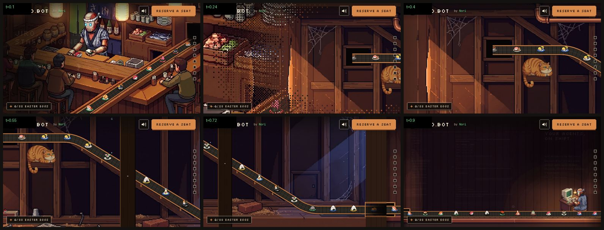
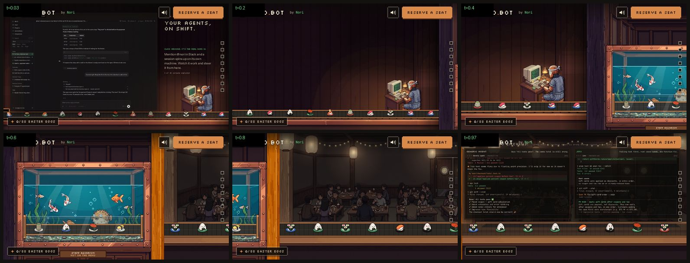
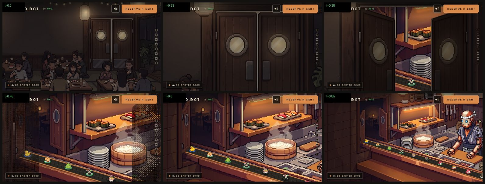
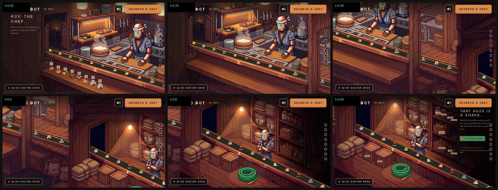
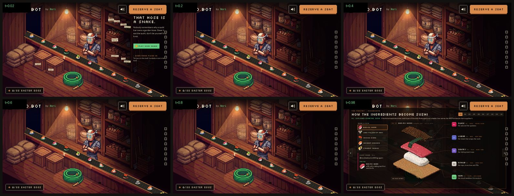
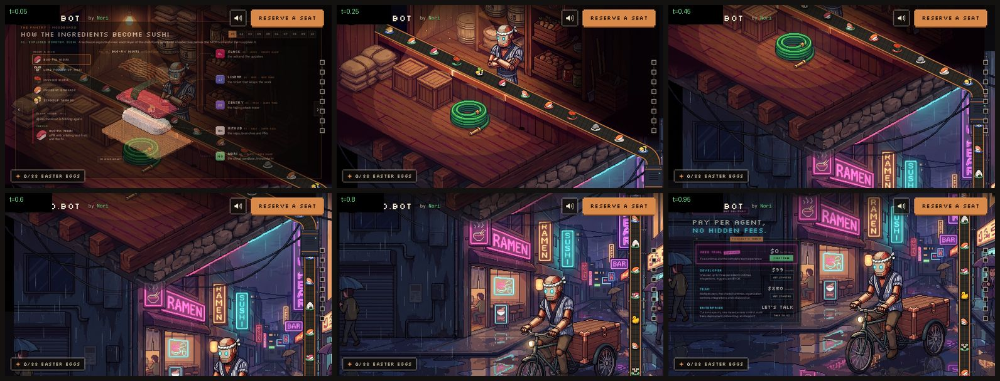
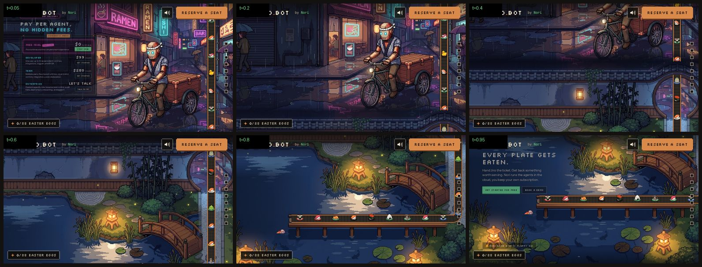

# 04 · Transitions (scroll-scrubbed room-to-room moves)

This file covers every transition between the eight scroll stops of Jiro's Restaurant: `src/transitions/**` and `public/art/tr/**`. With this file, the committed art, and the engine/scene docs, you should be able to rebuild each transition so that it matches the current one pixel for pixel at t = 0 and t = 1, and matches it closely in between.

All numbers were read from the code on branch `restaurant-belt` at `a6cda8c`. Derived values (the ones marked "computed") were evaluated in a browser against the live modules, so they match what the code computes at runtime.

---

## 0. Shared contract (read this first)

### 0.1 Chain, ids, lengths

`src/main.ts` passes the scenes and transitions to `start()` in this order:

```ts
start(
  [bar, office, dining, kitchen, storage, pantry, street, pond],
  [barOffice, officeDining, diningKitchen, kitchenStorage, storagePantry, pantryStreet, streetPond],
);
// kitchenStorage is `kitchenStorageF as kitchenStorage` from ./transitions/kitchen-storage-f
// pantryStreet comes from ./transitions/storage-street (storageStreet with from: "pantry")
```

`start()` looks up each consecutive pair as `trs.get(`${from}>${to}`)` and throws `missing transition X>Y` if the pair is missing. Segments alternate between a scene hold and a transition. Lengths are in viewport heights, and scroll position `p = scrollY / innerHeight` (computed from `window.__segs`):

| seg id | file / export | length (vh) | starts at p |
|---|---|---|---|
| `bar>office` | `bar-office.ts` / `barOffice` | 0.9 | 1.2 |
| `office>dining` | `office-dining.ts` / `officeDining` | 2.0 | 3.7 |
| `dining>kitchen` | `dining-kitchen.ts` / `diningKitchen` | 0.7 | 7.0 |
| `kitchen>storage` | `kitchen-storage-f.ts` / `kitchenStorageF` | 0.7 | 9.3 |
| `storage>pantry` | `storage-pantry.ts` / `storagePantry` | 0.35 | 11.1 |
| `pantry>street` | `storage-street.ts` / `pantryStreet` | 0.7 | 12.95 |
| `street>pond` | `street-pond.ts` / `streetPond` | 0.8 | 15.25 |

Scene holds are bar 1.2, office 1.6, dining 1.3, kitchen 1.6, storage 1.1, pantry 1.5, street 1.6, pond 1.8. The total is 17.85, and the scroll div is `(total + 1) * 100vh`.

`src/transitions/through.ts` is **not used**. It is the original placeholder: zoom ×6 into an exit point, fade to `rgba(5,4,4,…)`, then come out of the entry point. Keep it only as a fallback template.

### 0.2 TransitionDef and engine behaviour

```ts
interface TransitionDef {
  from: string; to: string;
  length: number;           // viewport heights
  route: string;            // one-line description (kept in code)
  render(g, t, now, api);   // t in [0,1]; t=0 must equal `from`, t=1 must equal `to`
  mount?(el, api);          // once, into the transition's own DOM layer (.layer.tr-ui)
  update?(el, t, now, api); // every frame while active
}
```

Per frame, the engine (`src/engine/stage.ts`, `tick()`) does the following:
- `shown += (target − shown) * 0.18` (scroll smoothing; 1 with reduced motion or `?p`/`?seg`). Then `t = clamp01((p − seg.start) / seg.len)`.
- Before `render` it resets the canvas state: `setTransform(1,0,0,1,0,0)`, `globalAlpha = 1`, `imageSmoothingEnabled = true`. It wraps `render` in `save/restore` and then calls `update(layerEl, t, …)`.
- **DOM layer fades are engine-level and apply to every transition.** The `from` scene's `.scene-ui` layer has opacity `1 − smooth(0, 0.12, t)`, and the `to` layer has `smooth(0.88, 1, t)`. So between t = 0.12 and 0.88 no scene copy/UI is visible. The only transition that moves DOM layers is kitchen→storage (§5).
- `document.body.dataset.segment = seg.id` is set every frame. kitchen→storage uses it to know when to reset its DOM transforms.

`api.drawScene(id, g, now, cam?)` draws the scene's art (1920×1080 at 0,0), `under()`, belt tread and plates, dragged/rested plates, and `over()`. It takes an optional camera `{zoom, cx, cy, dx, dy, rot, alpha}`, which is applied as `translate(960+dx, 540+dy) · rotate · scale(z) · translate(−cx, −cy)`. `api.drawBelt(g, path, now, key)` = `drawBeltFull` (tread + plates).

Easing helpers (from `engine/stage.ts`):
- `smooth(a, b, t)` = smoothstep of `clamp01((t−a)/(b−a))`: `x²(3−2x)`.
- `ease(t)` = cubic in-out: `t<.5 ? 4t³ : 1 − (−2t+2)³/2`.
- kitchen→storage uses smootherstep inline: `t³(t(6t−15)+10)`.

### 0.3 Belt and plate identity (why continuity works)

These rules are the basis of every handover described below (`engine/belt.ts`, `engine/items.ts`, `engine/types.ts`):

- `BELT_SPEED = 46` world units/s, `PLATE_GAP = 150` u, `LOOP = 24` s, stage 1920×1080.
- A path is `pts: [x, y, scale?][]`. It is resampled every ≤6 px. World distance `u` accumulates `screenDist / avgScale`, so plates shrink and slow with perspective while moving at a constant u-speed.
- `head = now·46 + phase`. Plates sit at `u = head − 150·id` for integer `id`, i.e. `first = head mod 150`, `id = floor(head/150) − k`.
- **Item** = `itemFor(id, key, pool)`, an FNV-style hash of `(id, key)`. Changing the `key` (e.g. `"office"` → `"dining"`) therefore changes the item. **Rim colour** = `rimFor(id)`, which hashes `(id, "rim")` only, so the rim carries across a key switch. Every transition does its item switch while the plate is hidden behind an occluder.
- Seams: every 26 u, offset `(now·46 + phase) mod 26`. The same phase means the same seams.
- Fades: `fadeIn`/`fadeOut` (u) ramp plate alpha at the path ends (defaults 40/40). Transition paths usually set both to 0.
- Tread style `"full"` draws the shadow (`rgba(0,0,0,.35)`, +8·s px down), the tread `#2b2723`, a centre highlight line `#3d3832` 2 px, seams `rgba(0,0,0,.45)` 2 px, and rails: dark `#6d3f22` 7 px, then copper `#c9814a` 4 px on each edge.
- **Joining rule used everywhere:** to make path P continue scene belt S, set `P.phase = S.phase + (u on S where P starts)`. To make P lead into S, set `P.phase = S.phase + (u on P where S starts)`. No scene currently sets `phase`, so every scene phase is 0.

Scene belts the transitions read (current values):

| scene | `belt` | computed length (u) |
|---|---|---|
| bar | pts (662,1122,1.06) (900,956,1.0) (1200,752,.9) (1500,554,.8) (1700,426,.73) (1768,386,.71); width 58, plate 54, fadeOut 70 | 1507.6 |
| office | (−20,955) → (1940,955); width 56, plate 46, fadeIn 60, fadeOut 60 | 1960 |
| dining | (−30,824,1.55) → (1950,824,1.55); width 72, plate 50, fadeIn 30, fadeOut 30 | 1277.4 |
| kitchen | (505,560,.784) → (1945,993,1.12); width 54, plate 50, fadeIn 70, fadeOut 20 | 1596.2 |
| storage / pantry | (262,357,.96) → (1880,1119,1.04); width 72, plate 54, fadeIn 80, fadeOut 20 | 1789.4 |
| street | `BELT_X = 1740`: (1740,−70) → (1740,1150); width 58, plate 52, fadeIn 0, fadeOut 0 | 1220 |
| pond | (1950,530) → (600,530); width 62, plate 54, fadeIn 20, fadeOut 1 | 1350 |

No belt sets `pool`, so all use the global item list.

### 0.4 Verifying a rebuild

- `?seg=<from>><to>&tt=<0..1>&t=<seconds>` renders a transition at a fixed local progress and frozen time (`tt` is capped at 0.9999). Example: `/?seg=bar%3Eoffice&tt=0.4&t=5`.
- Contact sheets below were made with `node ~/org/workspace/.local/pw/seg.mjs /tmp/doctr "bar>office:0.1" … --t=5 --wait=1500 --w=800` against `vite preview` on :3000. Frames were then tiled 3×2 at 520×292 with PIL and saved as JPEG q80. The screenshots include the page chrome and DOM overlays (header, rail, egg counter, scene copy), because those are part of the real frame.
- Endpoint checks: t ≤ 0 and t ≥ 1 must be exactly `drawScene(from)` / `drawScene(to)`. Every transition except bar→office and dining→kitchen short-circuits to `drawScene` at the ends. Those two short-circuit at `t <= 0` and `t >= T_END`/`t >= 1` respectively.

---

## 1. bar → office: inside the wall, past the fat cat



**Route:** the plates slide into the dark opening under the bar's bottle shelf. They come out of a slot in a side-view cutaway of the wall, ride down a diagonal brace past a fat, bored ginger tabby loafing on a beam and a dripping brass valve, and pass through a floor-level hatch into the office's left wall.

**Length:** 0.9 vh. (The in-repo `bar-office.md` still says 1.8. That was the round-1 value; `762b735` halved it.)

**Files:** `src/transitions/bar-office.ts` (cameras, dissolve, timeline) and `src/transitions/bar-office/wall.ts` (cutaway world). Art: `public/art/tr/bar-office/wall.jpg` and `cat.png`.

### 1.1 World space

World = **office stage space extended to the left**. The office frame is x 0..1920, and the wall cavity is x −2560..0. `WALL_X0 = −2560`, `WALL_PAD = 440`, `WALL_LEFT = −3000`. The camera is clamped so it never shows x < −3000.

### 1.2 Timeline

Constants: `D0 = 0.15`, `D1 = 0.31`, `T_END = 0.88`, `ZB = 3.2`.

| t | what happens |
|---|---|
| 0 | `drawScene("bar")` exactly |
| 0 → 0.31 | **Bar push-in.** `e = ease(min(1, t/0.31))`, `z = 1 + 2.2e`. The target `OPEN = bar.belt last pt + (15, −25)` = **(1783, 361)**. `cx = clamp(960 + (1783−960)e, 960/z, 1920−960/z)`, and cy likewise toward 361, so the view never leaves the bar art. At t = 0.31: z 3.2, centre (1620, 361); the opening lands on screen at `BC = (1481.6, 540)`. Zoom samples: t .15 → 2.0, .20 → 2.81, .25 → 3.14 |
| 0.15 → 0.31 | **Bayer dissolve** bar → cutaway, `k = smooth(0.15, 0.31, t)`. The cutaway is rendered to an offscreen canvas and masked (see 1.4). It spreads out from the opening's screen position `(bc.sx, bc.sy)` |
| 0.15 → 0.88 | **Cutaway camera** (`wallCam`): Catmull-Rom through the keys below. It interpolates cx, cy linearly and zoom in **log** space. The final segment (0.74→0.88) uses ease-out `f = 1 − (1−f)²`. Clamps: `cx ≥ WALL_LEFT + 960/z`, `cy ∈ [540/z, 1080 − 540/z]` |
| 0.88 → 1 | `drawScene("office")` exactly (the office DOM fades in over this window by engine rule) |

Cutaway keyframes `[t, cx, cy, zoom]` (computed where derived):

| t | cx | cy | zoom | note |
|---|---|---|---|---|
| 0.15 | −2383.4 | 349 | 1.35 | `slotCam(1.35)`: the slot centre sits at the screen spot of the bar opening |
| 0.31 | −2323.0 | 349 | 1.6 | `slotCam(1.6)` |
| 0.46 | −1700 | 470 | 1.5 | the cat |
| 0.60 | −1150 | 640 | 1.45 | down the brace, past the stud |
| 0.74 | −480 | 700 | 1.3 | lower bend |
| 0.88 | 960 | 540 | 1 | exact office frame |

`slotCam(z) = [SLOT_C.x − (BC.sx − 960)/z, SLOT_C.y − (BC.sy − 540)/z]` with `SLOT_C = (−1997, 349)`.

`renderWall` draws the office first with the same camera, via `api.drawScene("office", g, now, {zoom:z, cx, cy})`, whenever the view reaches x > 0. Otherwise it fills `#0b0a09`. When the view reaches x < 0 it applies the camera, clips to `rect(−3000, −100, 3000, 1280)` and calls `drawWall`. The office really is "the room to the right of the wall", so the pan lands on the office frame with no cut.

### 1.3 Belt continuity

The cutaway belt (`wallBelt`) is built by `buildPts()`:
- `TOP_Y = SLOT.y + SLOT.h/2 + 12 = 361`. It runs horizontally from `SLOT.x + 40 = −2053` at y 361.
- The brace centre line is `braceY(x) = 205 + (x + 1860)·0.614`. The belt rides `RIDE = 46` px above it: `rideY(x) = braceY(x) − 46`.
- Two corner bends are quadratic Béziers with 5 interior samples (`bez(a, c, b, 6)`) and radius `r = 70`. The upper bend meets the brace at `xTop`. The lower bend runs from the brace onto the horizontal `y = 955` at `xLow`, with control point `(xLow + 10, 955)` and exit `xLow + 1.6r`.
- It ends at `office.belt.pts[0] = (−20, 955)`.
- Computed points: (−2053,361) (−1601,361) … bend … (−1461,404) (−674.3,887) … bend … (−492.3,955) (−20,955). All at scale 1. Length `U_C = 2194.2`.
- `wallBelt = { width: 56, plate: 46, phase: office.phase + U_C (= 2194.2), fadeIn: 60, fadeOut: 60 }`. Width and plate come from the office belt.

**Office identity:** the wall path's end (u = U_C) has the same `head − 150·id` as office u = 0, so plates, ids and seams run straight on into the office belt. Key `"office"`.

**Bar identity (before the stud):** `platesInWall()` re-keys every plate whose cutaway `u < U_SWAP` (the u where the path crosses `STUD.x = −1180`) to the bar:
```
uc = headC − m·150            // m = plate's office id
n  = round((headB − (U_BAR − BAR_TAIL) − uc) / 150)   // U_BAR = 1507.6, BAR_TAIL = 35
item = itemFor(n, "bar"); rim = rimFor(n); key = "bar:n"
```
Cutaway u = 0 therefore continues the bar belt 35 u before its end. That point is inside the bar opening, where the bar belt's `fadeOut: 70` has already darkened the plate. The floppy that goes into the bar opening is the floppy that comes out of the slot. It becomes an office item while hidden behind the foreground stud.

### 1.4 Dissolve mask (bar → cutaway)

- The mask is one cell per 12 px: `CELL = 12`, mask `160×90`, drawn scaled up with `imageSmoothingEnabled = false` and `destination-in` onto the offscreen cutaway.
- Bayer 4×4 thresholds: `[0,8,2,10,12,4,14,6,3,11,1,9,15,7,13,5]`, mapped as `(v+0.5)/16`.
- Radial order from the opening: `d = hypot(x−cx, (y−cy)·1.4) / maxD`. `maxD` is the farthest corner distance (y weighted 1.4). `v = (k·(1+R) − d)/R` with `R = 0.45`. A cell is on when `v > bayer`.

### 1.5 Art

**`public/art/tr/bar-office/wall.jpg`**: 2560×1080 RGB, drawn 1:1 at world (−2560, 0). It is a side-view cutaway of a wall cavity in dark wood: vertical studs with horizontal noggins, and a long diagonal brace from upper-left (≈ x −1860, y 205) to lower-right (ending ≈ x −770). A copper pipe runs along the top with an elbow at the far left and a brass valve with a hanging drip (≈ x −1286, y 212). Cobwebs sit in the top corners and bottom-left. At upper-left there is a small dark **slot** (the back of the bar's shelf opening, `SLOT = {x −2093, y 274, w 192, h 150}`). The floor is planks with sawdust, a crumpled newspaper, bent nails, a brick, a cotton reel, a matchbox, and a thimble. There is a small wooden door/hatch low on a stud at right-centre and a floor grate at the lower right. Warm amber light slants in from the left (bar side) and cool blue light from the right (office side). The beam the cat lies on is a horizontal noggin at y ≈ 524 near x −1752.
- **Padding:** the leftmost `sw = 440` source px are drawn **mirrored** into x −3000..−2560 (`translate(−2560,0); scale(−1,1)`). They are then sunk into shadow by a linear gradient from x −3000 (`rgba(8,6,5,.85)`) to x −2500 (`rgba(8,6,5,0)`), filled over x −3000..−2500. Fallback when not loaded: `#120c09`.

**`public/art/tr/bar-office/cat.png`**: 480×118 RGBA, four frames of 120×118 side by side: 0 = open eyes, 1 = blink (eyes closed), 2 = tail-tip flick, 3 = ear twitch. The cat is a fat ginger tabby loaf with cream chest and green half-lidded eyes, paws tucked, and its tail hanging down in a curl. Drawing:
- scale 1.6 → 192×188.8, `imageSmoothingEnabled = false`.
- centred at x −1752, with sprite row `BELLY = 72` on the beam at y 524. So `dx = round(−1752 − 96)`, `dy = round(524 − 72·1.6) = 409`.
- `catFrame(now)` on a 24 s loop (`t = now mod 24`):
  - frame 1 (blink) when `t mod 8 < 0.3` (0, 8, 16 s);
  - frame 2 (tail) for t ∈ (4, 4.35) ∪ (4.7, 5.05) ∪ (13, 13.35);
  - frame 3 (ear) for t ∈ (19.5, 19.62) ∪ (19.8, 19.92);
  - otherwise frame 0.

(Until `a6cda8c`, this spot had `mice.png`, a mouse family plus a cat eye in a knothole. It was replaced by the fat cat.)

### 1.6 Code-drawn layers in `drawWall` (in order, world coords)

1. `wall.jpg` and the mirrored pad (above).
2. `motes(g, now, −2440, 250, 420, 560, 14)`: 14 warm dust motes in the bar-light shaft.
3. The cat.
4. Slot darkness behind the belt start: `#060404` rect `(SLOT.x+22, SLOT.y+22, SLOT.w−44, SLOT.h−36)`.
5. **Supports:** for x = −1480, −1350, …, −570 (step 130), a post runs from `beltY(x)+24` down to `braceY(x)+8` if x < `BRACE_END = −770` (copper bracket: body `#6d3f22` 10 px wide, highlight `#c9814a` 3 px). Otherwise it runs down to y 905 (wooden post: body `#3a2416` 18 px, highlight `#553522` 3 px). It is skipped if its top is below its bottom.
6. Belt tread (`drawTread(wallBelt)`), then plates (`platesInWall`).
7. Slot lip in front of emerging plates: `#060404` rect `(SLOT.x+22, SLOT.y+22, 40, SLOT.h−36)`.
8. **Drip** from the valve, period 3 s. The drop is 4×7 px, `#9fd0ff`. It falls from (−1286, 212) to `y1 = rideY(−1286) − 30 ≈ 481` with `y = y0 + (y1−y0)k²` over the first 70% of the period. For the remaining 30% two 3×3 splash pixels fly ±10 px outward and 4 px up while fading to alpha 0.
9. **Foreground stud** (closest to camera): x centre −1180, w 104, y −40..1120.
   - Planks base `#1e120b`, hi `#2a1a10`, lo `#130b07`, step 52 (3 px dark line + 2 px light line per plank).
   - Warm rim `#5a3620` 5 px on the left edge, dark edge `#0c0705` 6 px on the right.
   - Knots `#1a0f09`: for y = 60, 250, 440, …: (l+20, y, 5×70) and (l+62, y+95, 4×50).
   - Nail heads `#8a8a8a` 8×5 at (x−4, 612) and (x+14, 204).
   - This is where plates switch from bar items to office items.
10. **Office-wall section with the hatch** (`PLASTER = {x −150, w 150}`, `y0 = 955−46 = 909`, `y1 = 955+42 = 997`):
    - planks `#2c1b12`/`#3a2418`/`#1c110b` step 38 above y0 and below y1;
    - hatch frame `#6d3f22`: top bar (x−8, y0−12, w+8, 12), bottom bar (x−8, y1, w+8, 10);
    - copper highlight `#c9814a`: top edge 3 px and a left jamb 5 px, spanning y0−12..y1+10;
    - tunnel darkness: a gradient from x −150 → 0 with stops 0 `rgba(5,4,4,.35)`, .6 `.85`, 1 `.97`, over the opening.

### 1.7 What the neighbouring scenes must keep

- **bar:** a dark opening at the belt's last point. It is currently at (1768, 386); the camera aims at last point + (15, −25). The belt must run up and to the right into the opening, with `fadeOut ≈ 70`. The bar scene redraws a right jamb `JAMB = {x 1811, y 244, w 22, h 178}` over the belt so plates slide behind it. If the opening moves, move the belt end with it and the transition follows.
- **office:** the left wall needs a dark square hatch at x ≈ 0..60, y ≈ 905..1000, framed in wood or copper, with the belt coming out of it. The transition's own hatch frame (y 897..1007) sits just left of x = 0. Keep the belt horizontal at y 955, starting at x −20 with `fadeIn ≈ 60`. Dark wood at x 0..20 helps the seam.

---

## 2. office → dining: the in-wall aquarium pan



**Route:** the belt leaves the office through its right wall and tunnels through the dark office-side post. It crosses the wall's built-in aquarium in a glass tube (koi, goldfish and a wide-eyed pufferfish watch the sushi go by; plaque "STAFF AQUARIUM / not on the menu"), then dives into the honey-wood dining-side post and comes out on the dining ledge.

**Length:** 2.0 vh. **File:** `src/transitions/office-dining.ts`. **Art:** `public/art/tr/office-dining/wall.jpg`.

### 2.1 World space and layout (computed)

World = office stage units. The office is at (0,0) at scale 1. The wall art starts at `WX = 1920`. The dining room is drawn at scale `1/ZD` so its (closer, bigger) belt lines up with the office belt.

| symbol | formula | value |
|---|---|---|
| `OY`, `SA` | office belt last point y, scale | 955, 1 |
| `S0` | dining belt first-point scale | 1.55 |
| `ZD` | `S0 / SA` | 1.55 |
| `WALL_H` | constant | 805 |
| `WT` (wall top) | `OY − F_BELT·WALL_H` = 955 − 0.708·805 | 385.06 |
| `DT` (dining top) | `OY − 824/ZD` | 423.39 |
| `W` (wall width) | 926 nominal, then nudged by `solve()` | 929.35 |
| `XD` (dining left) | `WX + W` | 2849.35 |
| `XS` (handover x) | `WX + W·(F_TANK_R + 1)/2` = middle of the dining-side post | 2791.73 |
| `TL`, `TR` (inner glass) | `WX + W·0.169`, `WX + W·0.876` | 2077.06, 2734.11 |

The dining frame covers world x 2849.35..4088.06, y 423.39..1120.16.

Wall-art landmarks, as fractions of the art's width/height: `F_TANK_L 0.169`, `F_TANK_R 0.876` (inner glass), `F_WATER 0.405` (water line, world y 711.1), `F_GRAVEL 0.725` (gravel top, y 968.7), `F_BELT 0.708` (belt centre, y 955).

### 2.2 Camera and timeline

```
kz = smooth(0, 0.6, t)       // zoom and vertical settle finish at t=0.6
kx = smooth(0, 1, t)         // horizontal pan spans the whole transition
z  = 1 + (ZD − 1)·kz         // 1 → 1.55 (linear in kz, not log)
cx = 960 + (cxEnd − 960)·kx  // cxEnd = XD + 960/ZD = 3468.71
cy = 540 + (cyEnd − 540)·kz  // cyEnd = DT + 540/ZD = 771.77
```

Because the zoom tracks the dining scale, plate size and on-screen speed stay continuous.

| t | beat |
|---|---|
| 0 → 0.06 | the world render, plus `drawScene("office")` with the same camera at alpha `1 − smooth(0, .06, t)` on top (exact start frame) |
| 0 → 0.6 | zoom in to 1.55 and drop to the belt line; the pan runs throughout |
| ≈ 0.3–0.7 | office-side post, then the tank and tube cross the frame |
| 0.94 → 1 | `drawScene("dining")` on top with camera `{zoom: z/ZD, cx: (cx−XD)·ZD, cy: (cy−DT)·ZD}` at alpha `smooth(.94, 1, t)` (exact end frame) |

The endpoint cross-blends were measured: only DOM overlays and the side rail differ.

### 2.3 Belt continuity

- **Path A** = office belt pts plus `[XS, OY, SA]`, `fadeOut: 0`, key `"office"`, phase 0. It is identical to the office belt and just extends past x 1940 to the handover x. Length 2811.73.
- **Path B** = dining belt with a point prepended at dining-stage x `xsD = (XS − XD)·ZD = −89.31`, y 824, scale 1.55, and `fadeIn: 0`. Its `phase = dining.phase + E`, where E = 38.27 u is the prepended length. It is drawn inside `translate(XD, DT) · scale(1/ZD)` with key `"dining"`.
- **`solve()`** makes plates reach XS on both paths at the same instant. It needs `(len(A) − office.phase + B.phase) mod 150 == 0`. If not, it changes W by the residual (`−r` or `150−r`, × SA) and recomputes, up to 3 times. First residual 146.65, so W is adjusted from 926 to 929.35.
- The item switch (key office → dining) happens at XS, **hidden inside the dining-side post** (the post slice is redrawn over the belt).

### 2.4 Art

**`public/art/tr/office-dining/wall.jpg`**: 1436×1248 RGB. It is drawn stretched to **W × 805** (929.35×805) at (1920, WT). The painting shows the partition wall between the rooms:
- left: a tall dark (almost black-violet) wooden post, the office side;
- a panelled dark-wood wall with rafters above;
- centre: a copper-framed riveted aquarium (inner glass at 0.169..0.876 of the width) with water from 0.405 down to a gravel bed. Inside: two koi, two goldfish, small silver fish, the big spiky tan pufferfish with wide eyes at centre-right, seaweed, rocks and bubbles;
- a wooden cabinet with four panels below the tank;
- right: a tall honey/amber wood post, the dining side.

`drawWallArt(f0, f1)` draws the source slice `[f0, f1]` of the image width into world `[WX + W·f0, WX + W·f1]`. It also stretches the **top 6 source rows** into the 700 px above WT (y WT−700..WT), so the posts and beams continue upward while the camera is zoomed out. Fallback fill `#1a120e`.

### 2.5 Draw order in `world()` (inside the camera transform)

1. Fill `#0d0908` over (−4000, −4000, 12000, 9000).
2. Office: art + `office.under` clipped to (0,0,1920,1080). Then the office **floor extension**: the bottom 4 rows of `office.jpg` stretched to (0, 1080, 1920, 160). The zoomed camera peeks about 40 px below the frame.
3. Dining: `translate(XD, DT) · scale(1/1.55)`, clip to the stage rect, art + `dining.under`.
4. Wall art, full width (0..1).
5. Tank effects, clipped to (TL, water line, TR−TL, gravel−water + 30):
   - `glow` at ((TL+TR)/2, water line), r 360, `rgba(120,220,255,.10)`, amt .12, period 8;
   - **bubbles:** 9 squares, periods [6, 8, 12] by i mod 3, phase i·0.37. x = `TL + (TR−TL)·((i·0.618 + .08) mod 1) + 4·sin(4πf + i)`. They rise from the gravel to 8 px below the water line with alpha `.55·sin(πf)`, size 2r with r = 2 + (i mod 3), colour `#bfefff`;
   - the dark water band behind the tube: `rgba(0,18,28,.28)` at y OY−74..OY+40.
6. Belt A (key office). Belt B (dining transform, key dining).
7. **Glass tube** (x TL..TR, y OY−74 = 881 .. OY+40 = 995):
   - body `rgba(190,235,255,.07)`;
   - top edge `rgba(220,248,255,.45)` 3 px; a second line `.22` 2 px at +9; bottom edge `.22` 3 px;
   - three diagonal glints `rgba(255,255,255,.10)` at 0.18/0.52/0.8 of the width. Each is a parallelogram (x, y0+4) (x+26, y0+4) (x−14, y1−4) (x−40, y1−4);
   - copper gaskets at x = TL and TR−12: outer `#4a2616` 16 px wide (y0−8..y1+8), copper `#c9814a` 12 px, highlight `#f0b27a` 3 px.
8. **Posts redrawn over the belt:** `drawWallArt(0, 0.169)` and `drawWallArt(0.876, 1)`. The belt tunnels through them.
9. Contact shadows where the belt dives in: 18 px linear gradients `rgba(0,0,0,.45)` → 0, facing into the tank, at TL and TR, y OY−70..OY+40.
10. **Plaque** (`sign()`): 250×34, centred at x `WX + W·0.52`, top y `WT + 805·0.855` (≈ 1073). Border `#2a1810` 3 px, face `#6d4127`. Font `13px Silkscreen, monospace`, centred: "STAFF AQUARIUM" in `#f3e6cf` at +11, "not on the menu" in `#e8b27c` at +24.
11. `office.over` clipped to the office frame; `dining.over` in the dining transform, clipped.

`mount()` preloads `wall.jpg`.

### 2.6 What the neighbouring scenes must keep

- **office:** the belt must end on the right edge, horizontal, at y ≈ 955 (last pt of `office.belt.pts`). The right edge (x ≈ 1780–1920, y ≈ 880–1080) should read as the belt going into the wall: dark wood, no bright object cut off at the edge. The bottom rows (y 1076–1080) are stretched 160 px downward, so keep them plain floor or wood.
- **dining:** the belt must enter from the left edge, horizontal, at y ≈ 824, scale 1.55 (the first point of `dining.belt.pts`). The left edge (x 0–60) sits against the honey-wood post, so warm wood or plaster reads best. Only one belt may be painted.
- Both are read at load time: if y or scale changes, the layout adapts. If the office belt's y moves far, the tank landmarks (`F_BELT` etc.) must be retuned.

---

## 3. dining → kitchen: through the swinging doors



**Route:** an eye-level camera pushes from the dining room into the double swinging kitchen doors on the right wall. Both leaves swing away from us and the kitchen shows through the doorway. A centre-first pixel dissolve removes the door frame. The kitchen camera then pulls back from the pass to the normal kitchen frame, where the belt comes in through the open half-doors at the counter's left end.

**Length:** 0.7 vh. **Files:** `src/transitions/dining-kitchen.ts` and `src/transitions/dining-kitchen/dissolve.ts`. **No transition art:** everything is cut from the live scene frames. (`public/art/tr/dining-kitchen/` was deleted in `ed80e55`.)

### 3.1 Constants

```
DOOR  = { x0: 1335, x1: 1617, mid: 1474, y0: 207, y1: 551 }   // dining stage px (= the scene's "Kitchen doors" hotspot)
P     = { x: 1476, y: 300 }   // push focus: upper door, portholes
ZMAX  = 7.5, PUSH_END = 0.56
SWING = [3.6, 5.2]            // keyed to dining zoom z, not to t
DISS  = [4.6, 7.2]            // keyed to dining zoom z
THETA = 80°, DEPTH = 520      // max leaf angle; perspective viewing distance (stage px)
K0    = { zoom: 2.1, cx: 880, cy: 470 }   // kitchen camera at the pass
K_PULL = [0.4, 1]
```

(The header comment in the .ts says "z 3.4–5.0". The constants are 3.6–5.2, and the constants are what runs.)

### 3.2 Timeline

- Push: `u = smooth(0, 0.56, t)`, `z = 7.5^u` (log-linear zoom). The focus point P slides from its own screen spot to the screen centre: `s = lerp(P, (960,540), u)`, `cx = P.x − (s.x − 960)/z`, `cy = P.y − (s.y − 540)/z`. Because P is inside the art and ends centred, no clamping is needed.
- The z thresholds convert to t as follows (computed):

| t | beat |
|---|---|
| 0 | `drawScene("dining")` exactly |
| 0 → 0.56 | push, z 1 → 7.5 |
| 0.331 → 0.408 (z 3.6 → 5.2) | both leaves swing 0 → 80°, `sw = smooth(3.6, 5.2, z)`, `θ = 80°·sw` |
| 0.380 → 0.513 (z 4.6 → 7.2) | dissolve door frame → kitchen layer, `dk = smooth(4.6, 7.2, z)` |
| 0.40 → 1.0 | kitchen camera `k = smooth(0.4, 1, t)`: zoom 2.1 → 1, centre (880, 470) → (960, 540), linear in k |
| ≥ 0.513 (dk = 1) | kitchen only: `drawScene("kitchen", g, now, kcam)` with smoothing off |
| 1 | `drawScene("kitchen")` exactly |

The swing is keyed to zoom so it starts only once the screen bottom is above y ≈ 487. The diners in front of the lower door (heads from y ≈ 480) must be out of frame before the leaves move.

### 3.3 How a frame is built (dk < 1)

1. Render the dining scene **once at identity** into an offscreen 1920×1080 `base` canvas.
2. Draw `base` into `g` under the push camera, with `imageSmoothingEnabled = z < 1.02`. This gives crisp nearest-neighbour pixels once zooming starts.
3. If `sw > 0` or `dk > 0`: render the kitchen with `kcam` into the shared dissolve layer (`layerCtx()`, cleared each call, smoothing off).
4. If `sw > 0`: clip to the door rect (in dining coords under the push camera) and draw the kitchen layer in screen space (setTransform identity) inside it. Darken the doorway with `rgba(6,4,3, 0.35·(1−sw))`. Then draw both leaves:
   - `drawLeaf(g, base, hinge = DOOR.x0, inner = DOOR.mid, θ)` (left leaf) and `drawLeaf(g, base, DOOR.x1, DOOR.mid, θ)` (right leaf).
   - Each leaf is **36 vertical strips** cut from `base` (the live dining frame, x from hinge toward mid, y 207..551). For strip parameter s, depth `d = s·W·sinθ`, perspective `f = 520/(520+d)`, and vanishing point `(DOOR.mid, (207+551)/2 = 379)`. `x = vx + (hinge + dir·s·W·cosθ − vx)·f`, and top/bottom are scaled toward vy by f. Each strip is drawn +0.6 px wide to avoid hairline gaps.
   - Shade: a polygon hinge-top → far-top → far-bottom → hinge-bottom filled `rgba(8,5,3, 0.55·sinθ)` ("the turning leaf loses the lantern light").
5. If `dk > 0`: `dissolve(g, dk, bias)` with `bias(u,v) = min(1, 1.4·hypot((u−.5)·1.2, v−.5))` (centre first).

### 3.4 `dining-kitchen/dissolve.ts`

- `CELL = 6` stage px per dither cell (roughly the art's pixel size); mask 320×180.
- Bayer **8×8** built recursively 2×2 → 4×4 → 8×8 (`[[0,2],[3,1]]`, quadrant order `[0,2,3,1]`), mapped as `(v+.5)/64`.
- Cell value: `bayer·(1−w) + bias(i/MW, j/MH)·w` with `w = 0.55`. The cell is shown when the value < k. The mask is applied to the layer with `destination-in` and nearest-neighbour upscale, then the layer is drawn over `g` in screen space.
- `layerCtx()` returns the shared offscreen layer, reset and cleared.

### 3.5 What the neighbouring scenes must keep

- **dining:** a double swinging door with round portholes on the right wall exactly at `DOOR` (opening x 1335–1617, y 207–551, leaf split at 1474). If the doors or the diners move, update `DOOR`/`SWING`. The leaves are cut from the live frame, so any regrade of the dining art is picked up automatically.
- **kitchen:** only `K0`. Any framing works as long as zoom 2.1 around (880, 470) stays inside the art and shows the pass, the tub and the belt start (the open half-doors at the counter's left end; the kitchen scene redraws the leaves `LEAVES` over the belt).
- Neither scene's `belt` is read, so there is no plate continuity to maintain. The kitchen belt simply is already running when it appears.

---

## 4. kitchen → storage: one continuous back-of-house pan (candidate F)



**Route:** filmed as one continuous steadicam pan: along the kitchen counter, behind the corner post, across an open back room, and through the storage room's left wall to its dark doorway, where the belt comes out.

**Length:** 0.7 vh. **File:** `src/transitions/kitchen-storage-f.ts` (the filename keeps the candidate letter; `main.ts` imports it `as kitchenStorage`). **Art:** `public/art/tr/kitchen-storage-f/world.jpg`.

### 4.1 World space

World = kitchen stage px. `world.jpg` (4460×1966 RGB) is drawn 1:1 at (0,0). It contains:
- the **exact kitchen art** at (0,0), 1920×1080;
- the **exact storage art** at `(SX, SY) = (2470, 846)`, scaled `SS = 1.035` (→ 1987.2×1117.8, ending at ≈ 4457, 1964);
- joined by an outpainted interior painted from the same camera:
  - the kitchen counter and tiled floor continue to the right;
  - a dark wooden corner post at the kitchen's right edge (right face at `POST_R = 2062`);
  - an open back room with a pass-through window onto a lit prep area, stove, crates, rice sacks, a bucket and a mop;
  - then the storage room's pitched-roof plank wall with its dark doorway on the left wall (`WALL_X = 2500`), a hanging bulb, sacks, barrels, shelves, jars, Jiro with crossed arms, and the green hose.

The painted storage/kitchen parts are what make the feathers invisible: the live frames are drawn over identical pixels.

### 4.2 Camera and timeline

```
e  = t³(t(6t − 15) + 10)                 // smootherstep: gentle start/settle, near-linear middle
K  = { cx: 960,    cy: 540,    z: 1 }
S  = { cx: SX + 960·SS = 3463.6, cy: SY + 540·SS = 1404.9, z: 1/SS = 0.9662 }
cx = lerp(K.cx, S.cx, e); cy = lerp(K.cy, S.cy, e)
z  = exp(lerp(ln K.z, ln S.z, e))
```

| t | beat |
|---|---|
| 0 | `drawScene("kitchen")` exactly |
| 0 → ~0.3 | the camera starts right and down along the counter; the corner post comes in from the right |
| ~0.3 → 0.6 | the back room and the belt's corridor run (the belt vanishes behind the post, reappears, and goes into the storage wall) |
| ~0.6 → 1 | settle on the storage room |
| 1 | `drawScene("storage")` exactly |

There are no discrete phases: the whole move is the single smootherstep.

### 4.3 Frame composition (0 < t < 1)

1. Fill `#0b0a09`, apply the camera, draw `world.jpg` at (0,0).
2. **Live rooms** (ambient animation keeps running): `frame(api, id, now, edges)` renders the scene into a per-id offscreen canvas. It then erases `FEATHER = 40` px on the given edges with `destination-out` linear gradients (0 → full erase at the outer edge):
   - kitchen with edges `"rb"` (right and bottom), drawn at (0,0);
   - storage with edges `"lt"` (left and top), drawn at (2470, 846) at 1920·1.035 × 1080·1.035.
3. **Corridor belt** `BRIDGE`, clipped to x ∈ [POST_R, WALL_X] = [2062, 2500] (full height 4000). It is drawn with `drawBeltFull(g, BRIDGE, now, "kitchen")`:
   ```
   slope = (993 − 560) / (1945 − 505) = 0.30
   pts   = [ (1945, 993, 1.12),                                 // kitchen belt end
             (2540, 993 + (2540−1945)·0.30 = 1171.9, (1.12 + door.s)/2 = 1.057),
             door = (SX + 262·SS, SY + 357·SS, 0.96·SS) = (2741.2, 1215.5, 0.994) ]
   width 54, plate 50 (kitchen's), style "full", fadeIn 0, fadeOut 0
   phase = kitchen.phase − pathLength(kitchen.belt) = −1596.2
   ```
   With that phase, BRIDGE u = 0 has the same plate ids and seams as the kitchen belt's end, so plates that slide out of the kitchen frame are the same plates in the corridor.
4. Warm kitchen spill: a radial gradient centred (1900, 700), r 700, from `rgba(255,170,90,.10)` to 0. It is composited `lighter` over rect (1920, 0, 700, 1400).

**Plate continuity:** kitchen belt → BRIDGE is exact (same key `"kitchen"`, phase above). The belt is hidden from x 1920 to 2062 behind the painted post and from x 2500 on behind the storage wall. BRIDGE → storage is **not id-continuous**: storage plates come out of the black doorway with their own ids (key `"storage"`, phase 0, `fadeIn: 80`). The doorway darkness sells it.

### 4.4 DOM layers ride along (`update`)

For 0 < t < 1, the kitchen and storage `.scene-ui[data-id=…]` layers get `transform-origin: 0 0` and
`transform: translate((x − cx)·z + 960 px, (y − cy)·z + 540 px) scale(sc·z)`, with (x, y, sc) = (0, 0, 1) for kitchen and (2470, 846, 1.035) for storage. Their copy therefore moves with the rooms while the engine fades them. At t ≤ 0 or t ≥ 1 the transforms are cleared. A `requestAnimationFrame` watcher resets them as soon as `document.body.dataset.segment !== "kitchen>storage"`, so fast scrolls never leave a layer offset.

### 4.5 What the neighbouring scenes must keep

- **kitchen:** the belt must still leave at (1945, 993, 1.12) on its current heading (the painted counter and the post were painted around it). The whole kitchen art must stay pixel-identical to the copy baked into `world.jpg`. **If `kitchen.jpg` is repainted, `world.jpg` must be regenerated**, otherwise the 40 px feather and the pan will show a seam.
- **storage:** the doorway (belt start (262, 357)) must stay black, and `storage.jpg` must stay identical to the copy baked into `world.jpg` at (2470, 846) ×1.035. **If `storage.jpg` is repainted, regenerate `world.jpg`**: paste the new art at that placement and re-outpaint the joins.

---

## 5. storage → pantry: no move



**Route:** none. The pantry is the storage room with the MCP moodboard pinned up.

**Length:** 0.35 vh. **File:** `src/transitions/storage-pantry.ts`.

`render` = `api.drawScene("storage", g, now)` for every t. `pantry` is `{...storage, id: "pantry", room: "MCP pantry", hold: 1.5, mount: mountMoodboard, enter/leave: undefined}`, so its canvas frame is identical to storage. The only visible change is the engine's DOM fade: the storage copy fades out over t 0–0.12, and the moodboard layer fades in over 0.88–1. There is no art and no belt work (the belt keeps running as the storage belt).

---

## 6. pantry → street (storage → street): straight down through the floor



**Route:** the storage belt leaves the bottom edge, bends straight down under the floor, passes the stone foundation's corner, runs through a steel junction box (green status LED) and becomes the street's vertical wall conveyor. The camera tilts straight down with no zoom.

**Length:** 0.7 vh. **File:** `src/transitions/storage-street.ts`. It exports `storageStreet` (from `"storage"`) and `pantryStreet = { ...storageStreet, from: "pantry" }`; only `pantryStreet` is in the chain. `render` always draws `"storage"` at t ≤ 0, which is canvas-identical to the pantry. **Art:** `public/art/tr/storage-street/shaft.jpg`. The seg id for screenshots is `pantry>street`.

### 6.1 World space (computed lazily in `geometry()`, rebuilt if either belt changes under HMR)

- The storage frame is at (0,0); the street frame is at `(SX, SY)` with `SY = 1480`.
- `u0` = storage-belt u where y = 950 → 1404.72, point (1521.15, 950, s 1.02).
- `u1` = u where y = 1100 → 1746.49, point `p1` = (1839.66, 1100, s 1.04), heading θ = 25.22°.
- Bend: radius `R = 80`, centre `(p1.x − R·sinθ, p1.y + R·cosθ)` = (1805.57, 1172.38). 8 arc points go from heading θ to 90° (straight down).
- `VX = centre.x + R` = **1885.57** (the vertical run's x). `SX = VX − BELT_X` = 1885.57 − 1740 = **145.57**.
- `ART = { url: "art/tr/storage-street/shaft.jpg", x: 0, y: 900, w: 2048, h: 760 }`, drawn 1:1.
- Junction box: world y `BOX_Y0 = 1178` .. `BOX_Y1 = 1332`, x `VX ± 50`. `SWAP_Y = 1255`.

### 6.2 Belt runs

- **Upper** (key `"storage"`): pts `[p0, p1, …arc, (VX, 1255)]`, width 72, plate 54 (storage's), fades 0, `phase = storage.phase − u0 = −1404.72`. It continues the storage belt exactly from y 950 into the box.
- **Lower** (key `"street"`): pts `[(VX,1255), (VX, joinY = SY + street.pts[0].y = 1410), (VX, SY + 260 = 1740)]`, all at scale 1, width 58, plate 52 (street's), fades 0, `phase = street.phase + (joinY − SWAP_Y) = 155`. At world y 1410 its plates coincide with the street belt's u = 0.
- The item switch happens at y 1255, **inside the junction box**.

### 6.3 Camera and timeline

```
k = smooth(0, 1, t)
camX = SX·k  (0 → 145.57, a small rightward drift)   camY = SY·k (0 → 1480)
translate(−round(camX), −round(camY)); no zoom
mid = sin(π·t)                        // feather amount, 0 at both ends
```

| t | beat |
|---|---|
| 0 | `drawScene("storage")` exactly (= pantry canvas) |
| 0 → ~0.35 | the storage floor rises out of frame; the belt bends down past the joists and stone foundation |
| ~0.35 → 0.6 | the junction box passes; the rainy alley, neon and wires appear |
| ~0.6 → 1 | settle on the street frame |
| 1 | `drawScene("street")` exactly |

### 6.4 Draw order (0 < t < 1)

1. Fill `#0b0a0e`, translate by the camera, draw `shaft.jpg` at (0, 900).
2. If `camY < 1080`: the storage buffer, with its **bottom** feathered by `110·mid` px (destination-out gradient), drawn at (0,0).
3. If `camY + 1080 > 1480`: the street buffer, with its **top** feathered by `110·mid` px, drawn at (round(SX), 1480).
4. Upper run, clipped to `rect(−100, 1080 − 110·mid, 2400, 400)`. It only shows below the storage frame's feather, so t ≈ 0 stays the storage frame.
5. Lower run, clipped to `rect(−100, 1255, 2400, SY + 110·mid − 1255)`, i.e. down to where the street frame's feather ends.
6. **Junction box** at x = VX (pixel-art, hard edges; x0 = round(VX − 50), x1 = round(VX + 50)):
   - outline `#0b0c12` (3 px border);
   - body `#262a38`, top lip `#353a4d` 4 px, bottom `#1a1d28` 5 px;
   - copper bands `#6d3f22` 6 px at y0+20 and y1−30, each with a `#c9814a` 2 px highlight;
   - 4 bolts `#d98a4a` 4×4 at (x0+6 | x1−10, y0+8 | y1−16);
   - 4 vent slats `#12141c`, 4 px tall, at y0+44 + 12k, inset 22 px;
   - status LED 5×5 at (x1−18, y0+44). It blinks on a 4 s period (on for 2 s): on `#6fdc8c` with a 25%-alpha 11×11 halo, off `#244a31`.

### 6.5 Art

**`public/art/tr/storage-street/shaft.jpg`**: 2048×760 RGB at world (0, 900). It is a Gemini outpaint of the cutaway band under the storage room:
- the storage floor's plank underside (the green hose's nozzle and the bottom of a crate peek in at the top), with chunky wooden floor-joist ends along the left;
- a mortared stone foundation wall running diagonally, lit pink/cyan by neon at its lower edge;
- below it, the wet night street wall: a dark building with a window, rain streaks and sagging black cables;
- the tops of the RAMEN / ラーメン / SUSHI neon signs;
- on the right, the dark steel utility pole with the painted **steel chute** where the conveyor runs (x ≈ 1846–1926);
- a neon vertical sign and a lit window at the far right edge.

### 6.6 What the neighbouring scenes must keep

- **storage:** the belt must keep leaving the bottom edge near the right. It is read from `storage.belt.pts`, so small moves are fine; large ones would miss the painted chute at x ≈ 1846–1926. The foundation corner is painted where the storage frame's bottom edge is today.
- **street:** the vertical conveyor at `BELT_X = 1740` from the top edge (`street.belt.pts[0].y = −70`), `fadeIn: 0`.

---

## 7. street → pond: behind the garden wall, through the moon gate



**Route:** the street's vertical wall conveyor keeps going straight down past the bottom edge. It disappears behind the garden wall's tiled cap, shows through the round moon gate, runs down the gravel lane and turns left onto the pond pier. The camera tilts straight down, with a small leftward drift only once the view is below the street frame. Rain stays on the street side; the garden below the wall has fireflies.

**Length:** 0.8 vh. **File:** `src/transitions/street-pond.ts`. **Art:** `public/art/tr/street-pond/garden.jpg`.

### 7.1 World space (computed)

| symbol | formula | value |
|---|---|---|
| `R` | corner radius, lane → pier | 46 |
| `PX` | `round(BELT_X − R − pond.belt.pts[0].x)` = 1740 − 46 − 1950 | −256 |
| `PY` | constant | 1665 |
| `ART` | `{x: −360 + (PX + 351), y: 1052, w: 2395, h: 1673}` | x −265 (covers x −265..2130, y 1052..2725) |
| `WALL_TOP`, `WALL_BOT` | garden wall face (occludes the belt) | 1073, 1530 |
| `GATE` | `{x: 1644 + (PX + 351), y: 1357, rx: 180, ry: 172}` | centre (1739, 1357) |
| `SHADE_Y0`, `SHADE_Y1` | wall-shadow band on the pavement | 975, 1142 |
| `SWAP_Y` | item switch (hidden by the wall) | 1130 |
| `LANE_X` | `BELT_X` | 1740 |
| `PIER` | `(PX + 1950, PY + 530)` | (1694, 2195) |

`garden.jpg` was painted for the pond at PX = −351. The `+ (PX + 351)` terms slide the backdrop and gate with the pond frame, so the moon gate stays centred on the belt if the pond belt start moves. (The in-repo md still says −351; the current PX is −256.)

### 7.2 Belt runs

- **UPPER** (key `"street"`): (1740, 880) → (1740, 1130), street width/plate/pool, fades 0. `phase = street.phase − (880 − street.pts[0].y) = −950`, set every frame by `phases()`. It continues the street belt exactly.
- **LOWER** (key `"pond"`): (1740, 1130) → (1740, PIER_Y − 46) → 6-point quarter turn (`corner()`: `x = x1 + (x0−x1)cos a`, `y = y0 + (y1−y0)sin a`) ending at (1694, 2195) → (PIER_X, PIER_Y) → (PX + 1780 = 1524, 2195). Pond width 62, plate 54, fades 0. `phase = pond.phase + toPier`, where `toPier` = length of LOWER up to the pond belt's first point, so plates on the pier are the pond's plates.

### 7.3 Camera and timeline

```
cx = 960 + PX·smooth(0.62, 1, t)   // left drift of 256 px, only in the last 38%
cy = 540 + PY·smooth(0, 1, t)      // tilt down 1665
z  = 1                             // imageSmoothing stays on at z = 1
inS  = smooth(0, 0.06, t)          // street bottom feather 28·inS
outP = 1 − smooth(0.94, 1, t)      // pond top feather 90·outP, right feather 40·outP
shade = smooth(0.08, 0.30, t)
fireflies k = smooth(0.35, 0.60, t)
```

| t | beat |
|---|---|
| 0 | `drawScene("street")` exactly |
| 0 → 0.06 | the street's bottom 28 px feather fades in |
| 0.08 → 0.30 | the wall shadow band rises to full strength |
| ~0.2 → 0.45 | the tiled wall cap and moon gate come up; the belt disappears behind the cap and shows in the gate |
| 0.35 → 0.60 | fireflies fade in |
| 0.62 → 1 | leftward drift to the pond frame |
| 0.94 → 1 | pond feathers go to 0 |
| 1 | `drawScene("pond")` exactly (measured diff < 0.01/255 at the ends) |

### 7.4 Draw order (0 < t < 1, inside the camera)

1. Fill `#0c101a`.
2. `garden.jpg` at (ART.x, 1052), if the view bottom is below 1052.
3. Pond buffer at (PX, PY), if the view reaches PY, with top feather `90·outP` and right feather `40·outP`.
4. Street buffer at (0,0), if the view top is above 1080, with bottom feather `28·inS`.
5. **Wall shadow band**, if shade > 0 and the view top < WALL_TOP + 80. A vertical gradient over (ART.x, 975, ART.w, 167) with stops 0 → `rgba(8,10,22,0)`, 0.5 → `0.8·shade`, 0.62 → `0.8·shade`, 1 → `0.3·shade` (lighter at the roof cap so the tiles stay readable). It swallows the street art's upside-down puddle reflections at its bottom edge, so nothing mirrored meets the wall.
6. UPPER, clipped to `rect(LANE_X − 80, 1040, 160, WALL_TOP − 1040 = 33)`. It is visible only in the band between the street frame's bottom and the wall top.
7. LOWER, clipped to the union of:
   - the gate ellipse (1739, 1357, 180×172);
   - the lane strip `rect(GATE.x − 104, GATE.y, 208, WALL_BOT − GATE.y + 2)`;
   - the garden below the wall `rect(ART.x, 1530, ART.w, PY − 1530)`;
   - the overlap into the pond frame `rect(PX + 1860, PY, 1000, 1080)` (x ≥ 1604). Here LOWER's plates coincide with the pond's own plates in the frame's feathered right edge.
8. **Fireflies** (k = `smooth(.35, .6, t)`): 16 squares, `#e9ff8a`, 4×4 at alpha `k·a·0.9` plus a 12×12 halo at `k·a·0.25`.
   - Base x = `PX + 40 + ((i·0.618) mod 1)·2100`.
   - Base y = `WALL_BOT + 20 + ((i·0.377) mod 1)·(PY − WALL_BOT − 40)`, plus `((i·0.29) mod 1)·700` when x > PX + 1940 (right of the pond frame).
   - Wobble: `14·wave(now, 12, 1.3i)` in x and `10·wave(now, 8, 2.1i)` in y.
   - Brightness: `a = max(0, wave(now, [4,6,8][i mod 3], 0.9i))`.
   - They only appear below the wall and outside the pond frame, so nothing pops at t = 1.

### 7.5 Art

**`public/art/tr/street-pond/garden.jpg`**: 2395×1673 RGB, drawn 1:1 at (−265, 1052). Top to bottom:
- a thin strip of the rainy street with neon reflections;
- the garden wall's grey-blue **tiled roof cap** with a raised curve over the gate;
- a cracked plaster wall face with hanging ivy, a small glowing wall lantern and a bamboo clump;
- on the right, a round **moon gate** (the rainy street and neon are visible through it) with a wooden fence rail;
- below it, a pale **gravel lane** running straight down from the gate to the pier corner;
- the garden: a dark pond, raked-sand circles, stepping stones, glowing stone lanterns, reeds, an arched wooden bridge, lily pads, koi silhouettes, shrubs and bamboo;
- the long **wooden pier** across the lower middle, which the belt runs along.

The painted cat was removed from this image.

### 7.6 What the neighbouring scenes must keep

- **street:** the vertical belt at `BELT_X = 1740` running out of the bottom edge (pts end y 1150). The bottom rows should stay wet pavement.
- **pond:** the pier belt entering from the right at y 530 (`pond.belt.pts[0] = (1950, 530)`). If x changes, PX (and with it the backdrop and gate) shifts automatically. If y changes, the painted pier will no longer line up.

---

## 8. Decisions and history (with commits)

All commits are on `restaurant-belt` in the `jiro.bot` repo (`git log -- restaurant/src/transitions restaurant/public/art/tr`):

| commit | what changed in transitions |
|---|---|
| `fb79069` | site scaffold; all transitions were `through()` placeholders |
| `bdab3d1` | round 1: real transitions for all seven boundaries, including the sushi-cam, the kitchen→storage floor-hatch cutaway, storage→yard (cat flap), yard→street (over the fence), and wall mice in bar→office |
| `00921a4` | sushi-cam entry/exit smoothed with the Bayer dissolve (`dining-kitchen/dissolve.ts` added); garden wall textured |
| `762b735` | Martin round 2 restructure: yard scene and both yard transitions dropped, **aquarium stop** added (office→aquarium→dining), bar→office shortened 1.8 → 0.9, storage→street placeholder |
| `ed80e55` | sushi-cam replaced by the short swinging-door transition; aquarium pan transitions; new storage→street drop; street→pond reworked for the vertical street belt; **six kitchen→storage candidates A–F** |
| `58c10f2` | **F chosen** for kitchen→storage; A–E and the old cutaway deleted |
| `96a7cc3` | aquarium stop and Fish Frenzy reverted; the in-wall office→dining pan (identical to `bdab3d1`) restored |
| `a6cda8c` | wall mice → fat bored cat (`cat.png`); route text "open half-doors" |

### 8.1 kitchen → storage: candidates A–F (prototyped in `ed80e55`, chosen in `58c10f2`)

All six were built side by side. Check out `58c10f2^` to see them: `restaurant/src/transitions/kitchen-storage-{a..f}.ts` and art under `public/art/tr/kitchen-storage-{b,c,d,e,f}/`.

| | idea | length | art | notes |
|---|---|---|---|---|
| A | **Wall hatch with strip curtain.** Straight through the shared wall at counter height: a dolly with no zoom, the wall passes as a cut section, and the belt runs through a steel-lined slot behind a PVC strip curtain into the storage doorway. The storage room's left wall then slides over the section | 0.7 | procedural wall (4 px art pixels), no image | belt slope 0.38 in the wall |
| B | **Storage door.** Eye level: the camera trucks along the counter to a propped-open wooden door signed 倉庫 STORAGE, then pushes through it (zoom to 7.5) | 0.8 | `kitchen-storage-b/door.jpg` (kitchen outpaint at 0.62 scale) | |
| C | **Cellar stairs.** An inclined conveyor beside a narrow wooden cellar staircase under a single bulb, past a mop and bucket; storage at (2640, 1485) | 0.8 | `kitchen-storage-c/stairwell.jpg` 2752×1536 at ×1.65 | puts storage below the kitchen |
| D | **PVC strip curtain dolly.** Dolly to zoom 9 into a steel pass-through in a tiled pillar with code-drawn strip curtains that part around plates; a frosty beat with strips on the lens; out of a matching curtain in the storage doorway | 0.7 | `kitchen-storage-d/ext.jpg` + `curtain.ts` | |
| E | **Foreground shelf wipe.** A truck along the belt; a near-lens, pre-blurred rice-sack shelf wipes the frame with parallax and hides the cut behind its opaque core | 0.6 | `kitchen-storage-e/shelf.png` 1368×1152 | |
| **F** | **Continuous back-of-house pan** (shipped, §4) | 0.7 | `kitchen-storage-f/world.jpg` | |

**Why F:** it is the most realistic (one camera, one painted continuous interior, no gimmick cut). It also keeps the storage room **on ground level** next to the kitchen, so the later straight-down drop from storage to the street (§6) makes spatial sense. C put storage in a cellar, which would make "then drop down to the street" nonsensical.

The round-1 original (`bdab3d1`, `kitchen-storage.ts` + `kitchen-storage/cutaway.jpg`, 1.8 vh) was a dollhouse cutaway. The belt dropped through a floor hatch, down a chute past the joists (lost chopstick, ancient fortune cookie, a mouse, a copper pipe), and down the cellar stairwell past an "Employee of the month: JIRO" plaque. It was deleted in `58c10f2`.

### 8.2 Removed: dining → kitchen v1, the sushi-cam POV (removed at Martin's request)

- Added in `bdab3d1` and smoothed in `00921a4`. Removed in `ed80e55` in favour of the swinging doors (§3). Read it at `00921a4:restaurant/src/transitions/dining-kitchen{.ts,.md,/pov.ts,/dissolve.ts}` with art `public/art/tr/dining-kitchen/doors.jpg` and `kitchen-pov.jpg`.
- It was 2.0 vh. The camera was "bolted" to a dining plate (pinhole camera F = 500; the belt tread, rails and counter drawn as mode-7 scanlines at ¼ resolution). It rode at sushi eye height behind a rubber-duck plate that nosed the swinging doors open, pushed through, and looked up at a towering Jiro, a giant knife, the rice "hot tub" and a peeking cat. It then un-bolted (eye height +240) and dissolved top-first into the kitchen at `K_MATCH` (zoom 2.0 around 1397, 536).
- The ordered-dither dissolve built for it survives as `dining-kitchen/dissolve.ts`.

### 8.3 Removed: storage → yard, yard → street (and the yard scene)

Both were added in `bdab3d1` and removed in `762b735` ("drop yard and cat transitions"). Source: `bdab3d1:restaurant/src/transitions/{storage-yard,yard-street}.{ts,md}`, with art `tr/storage-yard/door.jpg` and `tr/yard-street/cross.jpg` (the art was deleted in `58c10f2`).
- **storage → yard** (1.6 vh): the belt runs down-right into the dark corner by the back door and climbs into a copper **cat flap**, beside a large, unimpressed ginger cat that blinks slowly. The flap opening becomes a window onto the moonlit yard, grows to full frame, and the camera pulls back out of the yard's wall hatch.
- **yard → street, "Over the fence"** (2.0 vh): the belt climbs the fence face into a copper hatch on the fence cap beside a sleeping cat. The camera rises over the fence into the neon, dissolves into the street, and a steep copper run drops each plate onto its twin on the delivery trike's loop belt.
- The yard became obsolete, so storage now drops straight to the street (§6). The street belt became a straight vertical wall conveyor (`BELT_X`) in `ed80e55`.

### 8.4 Removed: the aquarium stop

`762b735`/`ed80e55` made the aquarium a scroll stop of its own (`scenes/aquarium.ts`, hold 1.2, with the Fish Frenzy mini game). It had two short pans, `office-aquarium.ts` and `aquarium-dining.ts` (0.7 vh each), built on a generic `aquarium-pan.ts` side-scroll helper (handover inside a copper column / wooden post, with a gap filled by stretching an edge column). `96a7cc3` reverted this to the single in-wall office→dining pan (§2), which is byte-identical to the `bdab3d1` version, and dropped the stop and Fish Frenzy. The aquarium now only exists as the painted tank inside `office-dining/wall.jpg`.

---

## 9. Rebuild checklist

1. Engine contract (§0): `BELT_SPEED 46`, `PLATE_GAP 150`, `LOOP 24`, belt baking in u with scale, `itemFor(id, key)` and `rimFor(id)`, the DOM fades 0–0.12 / 0.88–1, `?seg&tt&t`.
2. Scene belts exactly as in the table in §0.3. Every transition derives its joins from them.
3. Copy the art verbatim: `public/art/tr/bar-office/{wall.jpg, cat.png}`, `office-dining/wall.jpg`, `kitchen-storage-f/world.jpg`, `storage-street/shaft.jpg`, `street-pond/garden.jpg`.
4. Implement each transition from §1–7. Check it with `?seg=…&tt=…&t=5` against the contact sheets in `docs/img/tr-*.jpg` (same tt values as the sheet labels).
5. Endpoint check for every transition: tt 0.0001 vs the `from` scene, tt 0.9999 vs the `to` scene. They must be identical apart from DOM opacity.
6. If a scene is repainted, follow the "must keep" list for both of its neighbouring transitions. kitchen or storage repaints also require regenerating `kitchen-storage-f/world.jpg`.
