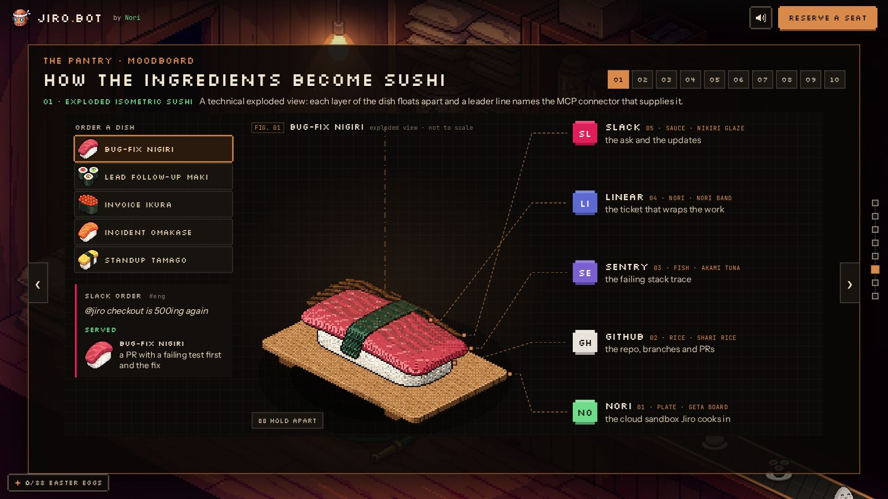
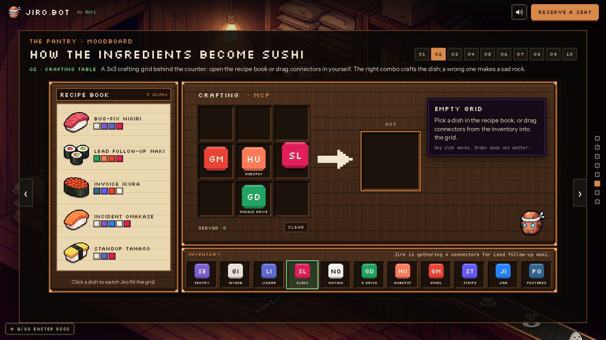
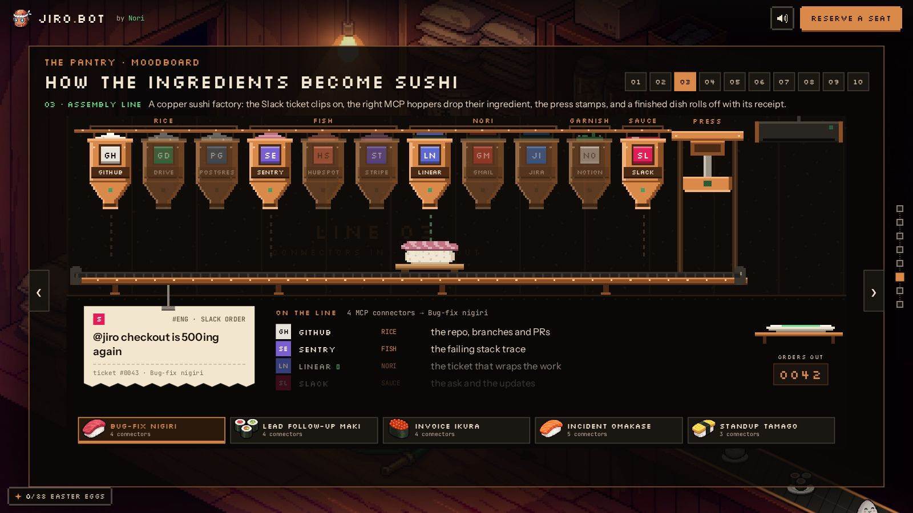
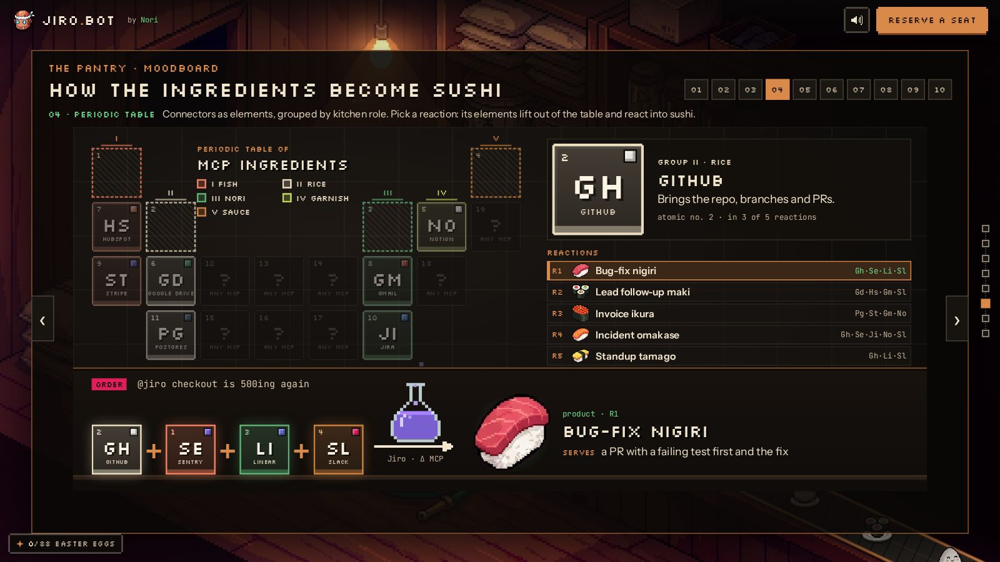
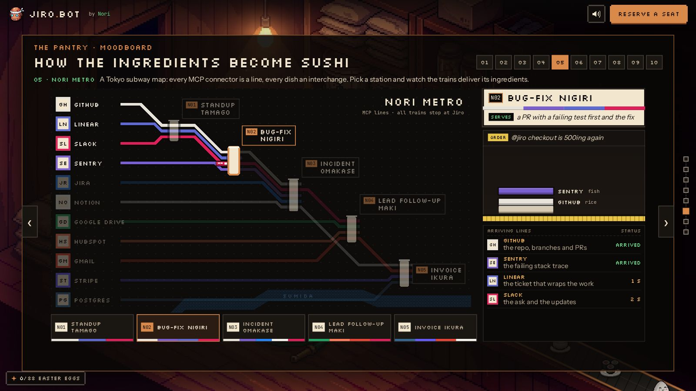
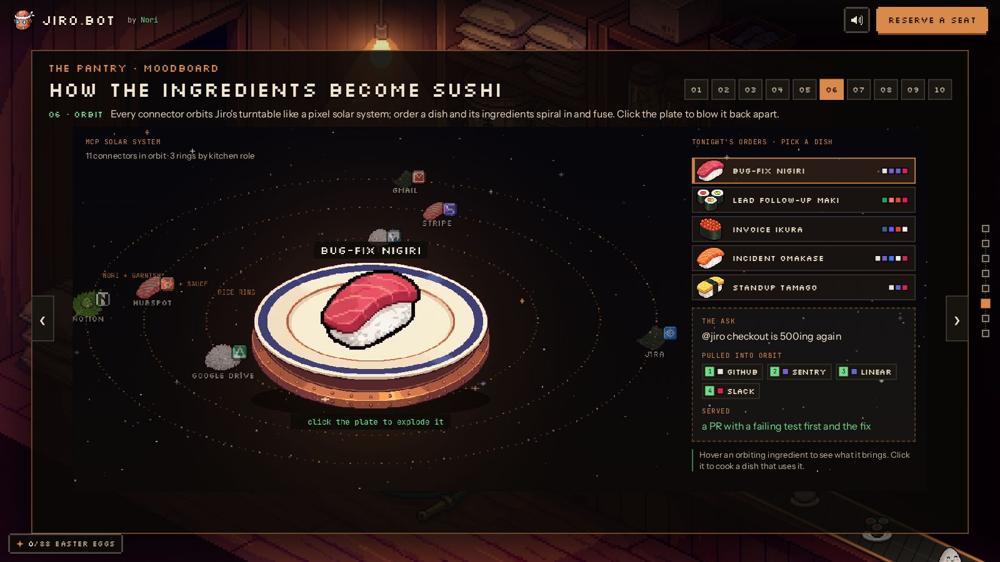
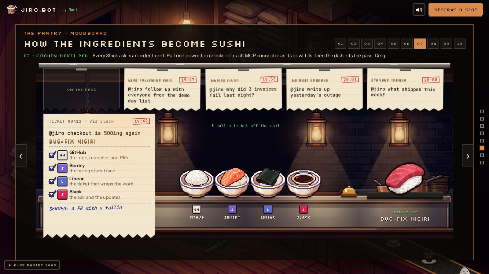
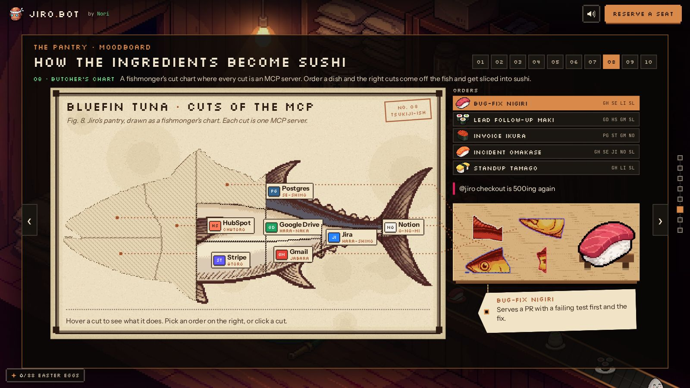
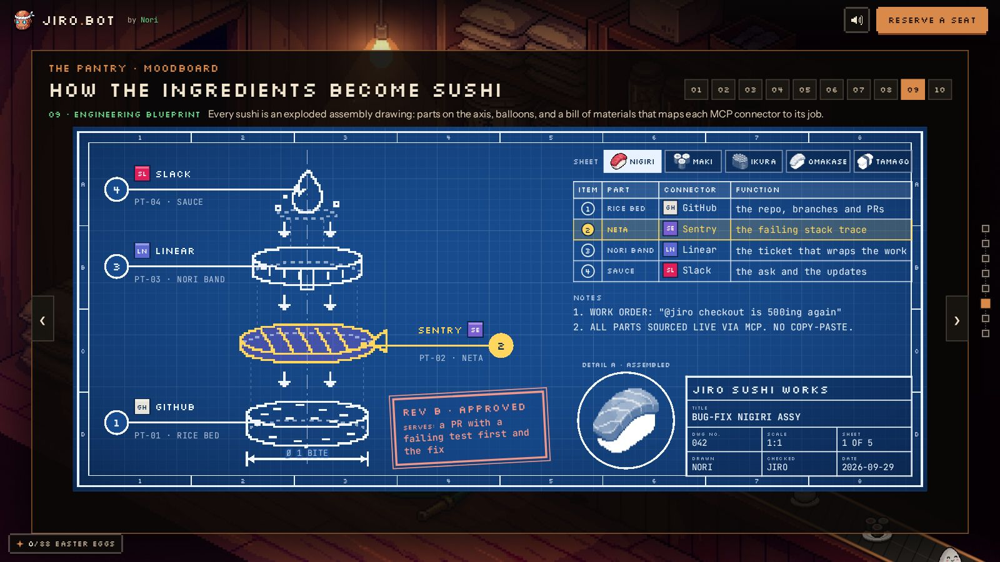
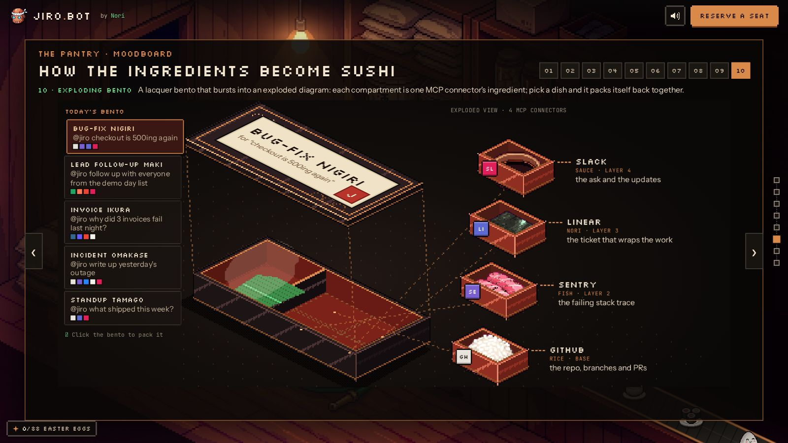

# 05 · The MCP moodboard (pantry scene)

This file is the recreation spec for the **MCP moodboard** that hangs in the pantry scene of Jiro's Restaurant: the shared data, the viewer, and all ten concept versions. Rebuild it from this file plus the committed assets in `public/items/` and `public/mood/`. Every number below comes from the shipped code (commit `a6cda8c`). Where a procedural renderer can't be described exactly in prose, the code itself is reproduced verbatim in the appendices.

- **Source files:** `src/moodboard/data.ts`, `viewer.ts`, `moodboard.css`, `v01.ts` to `v10.ts`, and `v01.css` to `v10.css` (23 files, 5,477 lines).
- **Assets:** `public/mood/v06/*`, `v07/*`, `v08/*`, and `v10/*` (33 files). Versions also use the dish sprites `public/items/{tuna,maki,ikura,salmon,tamago}.png`, plus `rock.png` and `mini-jiro.png` in v02.
- **Where it mounts:** `src/scenes/pantry.ts` calls `mountMoodboard(el, api)`.

## 0. Origin

The request that created it (Martin, verbatim):

> give me 10 moodboard iterations of showing how you could display the exploding diagram of different mcp connect on our website, so go creative and show a lot of different versions of how the ingredients come together to produce different sushi. build the moodboard into the full website to click through different versions

How the brief was interpreted:
- **The metaphor:** MCP connectors are ingredients, and the jobs Jiro does with them are sushi dishes.
- **Shared data:** all ten versions render the same 11 connectors and 5 recipes (`data.ts`), so the concepts can be compared side by side.
- **Where it lives:** the moodboard is a panel pinned up in the pantry scene. The panel has tabs `01` to `10`, prev/next arrows and ←/→ keys.

## 1. Where it sits in the site

- **Pantry scene** (`src/scenes/pantry.ts`): `pantry = { ...storage, id: "pantry", room: "MCP pantry", hold: 1.5, mount(el, api) { mountMoodboard(el, api); }, enter: undefined, leave: undefined }`.
  - It reuses the storage room's canvas, camera and belt exactly. Only the DOM layer differs.
  - At module load it calls `declareEggs(["mood-all"])`.
- **Scene order** (`src/main.ts`): `bar, office, dining, kitchen, storage, pantry, street, pond`.
- **Transition** `storage → pantry` (`src/transitions/storage-pantry.ts`):
  - `length: 0.35`
  - `route: "No move: the pantry is the storage room with the moodboard pinned up."`
  - `render(g, _t, now, api) { api.drawScene("storage", g, now); }`
  - The camera doesn't move. The storage DOM copy fades out and the moodboard fades in.
- **Dimming:** the storage room is "dimmed" only by the moodboard panel's own background, `rgba(10,8,7,.9)`. The canvas itself is not darkened.
- **Coordinate system:** the stage is `1920×1080` (`#stage, #ui` are `1920×1080`, scaled with `transform-origin: 0 0`). Everything below is in stage px unless stated as "art px" or "units".
- **Global CSS variables used everywhere** (from `src/style.css`):

| var | value |
|---|---|
| `--cream` | `#f3e6cf` |
| `--muted` | `#bfae95` |
| `--copper` | `#d98a4a` |
| `--green` | `#6fdc8c` |
| `--px` | `"Silkscreen", monospace` |
| `--sans` | `"Instrument Sans", system-ui, sans-serif` |
| `--mono` | `"JetBrains Mono", ui-monospace, monospace` |

- **Fonts:** loaded in `index.html` from Google Fonts: `Instrument+Sans:wght@400..700`, `JetBrains+Mono:wght@400;600`, `Silkscreen`.
  - v06 draws text onto a canvas using the literal family names `Silkscreen`, `'JetBrains Mono'` and `'Instrument Sans'`.
- **Global kicker/heading styles used by the panel header:**
  - `.kicker { font: 400 20px/1 var(--px); color: var(--copper); letter-spacing: .04em; margin: 0 0 22px; }`
  - `h2.px { font-size: 56px; line-height: 1.05; }` (the moodboard overrides this to 40px).
- **Screenshot/debug URL params** (engine, not moodboard):
  - `?seg=pantry&tt=0.5` renders the pantry segment at local progress 0.5.
  - `?t=5` freezes *scene canvas* time at 5 s.
  - The moodboard versions use `performance.now()`, so they keep animating under `?t=`.
  - Screenshot/debug modes skip the loader and the scroll hint.
- **Stage click guard:** the stage's canvas `click` and `pointerdown` handlers ignore any target inside `#ui .mood`, so clicks inside the moodboard never reach plates or the scene. Every version also calls `e.stopPropagation()` on its own click handlers.

## 2. Shared data (`src/moodboard/data.ts`)

### 2.1 Connectors (order matters: several versions use array index as "atomic number" or layout order)

| # | id | name | color | role | does |
|---|---|---|---|---|---|
| 1 | `sentry` | Sentry | `#7a5fd1` | fish | the failing stack trace |
| 2 | `github` | GitHub | `#e8e3da` | rice | the repo, branches and PRs |
| 3 | `linear` | Linear | `#5e6ad2` | nori | the ticket that wraps the work |
| 4 | `slack` | Slack | `#e01e5a` | sauce | the ask and the updates |
| 5 | `notion` | Notion | `#f3f1ec` | garnish | specs, runbooks, postmortems |
| 6 | `gdrive` | Google Drive | `#1fa463` | rice | docs and spreadsheets |
| 7 | `hubspot` | HubSpot | `#ff7a59` | fish | contacts and deal stages |
| 8 | `gmail` | Gmail | `#ea4335` | nori | threads and drafts |
| 9 | `stripe` | Stripe | `#635bff` | fish | invoices and payments |
| 10 | `jira` | Jira | `#2684ff` | nori | issues and sprints |
| 11 | `postgres` | Postgres | `#336791` | rice | read-only queries |

No official logo files are used anywhere. Each version draws its own pixel badge from brand colour and initials.

### 2.2 Recipes (verbatim; `ingredients` are in assembly order, base first)

| # | id | sushi | item (sprite `public/items/<item>.png`) | ingredients | order | serves |
|---|---|---|---|---|---|---|
| 1 | `bugfix` | Bug-fix nigiri | `tuna` | github, sentry, linear, slack | `@jiro checkout is 500ing again` | `a PR with a failing test first and the fix` |
| 2 | `leads` | Lead follow-up maki | `maki` | gdrive, hubspot, gmail, slack | `@jiro follow up with everyone from the demo day list` | `40 personalized drafts, logged in HubSpot` |
| 3 | `billing` | Invoice ikura | `ikura` | postgres, stripe, gmail, notion | `@jiro why did 3 invoices fail last night?` | `a reconciliation note and retry plan` |
| 4 | `incident` | Incident omakase | `salmon` | github, sentry, jira, notion, slack | `@jiro write up yesterday's outage` | `a postmortem with timeline and follow-up tickets` |
| 5 | `standup` | Standup tamago | `tamago` | github, linear, slack | `@jiro what shipped this week?` | `a 6-line changelog posted to #eng` |

Item sprite sizes (native): tuna 160×128, maki 160×133, ikura 160×160, salmon 160×125, tamago 160×126, rock 160×128, mini-jiro 160×152. These come from the site-wide item set, which is documented with the items.

`byId(id)` returns `CONNECTORS.find(c => c.id === id)!`.

### 2.3 The `MoodVersion` contract

```ts
export interface MoodVersion {
  n: number;
  title: string;
  /** One-line concept pitch shown under the tabs. */
  pitch: string;
  /**
   * Render into `el`, a 1640x700 stage-px box (position: relative, overflow hidden).
   * Return a cleanup function. Animations must be slow, loop-safe, and stop on cleanup.
   */
  mount(el: HTMLElement, ctx: MoodCtx): () => void;
}
export interface MoodCtx {
  base: string; // import.meta.env.BASE_URL
  sfx(name: "pop" | "blip" | "chime" | "whoosh" | "coin" | "bonk"): void;
  egg(id: string, text: string): void;
  reducedMotion: boolean;
}
```

Rules every version follows:
- **Self-contained:** everything lives inside the 1640×700 box, all CSS is scoped under `.mvNN`, and version-specific assets load from `${ctx.base}mood/vNN/`.
- **Cleanup:** the cleanup function cancels rAF, timers and Web Animations, removes listeners, and empties the box.
- **Reduced motion:** every version checks `ctx.reducedMotion` (`matchMedia("(prefers-reduced-motion: reduce)")`) and jumps straight to a final or representative state.
- **Sound:** sfx is only ever called with the six names above. The engine's sound synth (`src/engine/sfx.ts`):
  - `pop`: square 500→900 Hz, 0.08 s
  - `blip`: square 880→1320 Hz, 0.07 s
  - `coin`: 988 Hz + 1319 Hz
  - `whoosh`: filtered noise, 0.35 s
  - `bonk`: square 220→110 Hz
  - `chime`: sine 1568 Hz + 2093 Hz
- **Easter eggs:** `ctx.egg(id, text)` goes to `api.egg`. That records the text, and on first discovery shows a 3.6 s toast labelled "Easter egg n/t".
  - Only `mood-all` is pre-declared. The per-version egg ids join the declared total the first time they are found.

## 3. The viewer (`viewer.ts` + `moodboard.css`)

### 3.1 DOM

```html
<section class="mood" aria-label="MCP moodboard">
  <header>
    <div class="mood-title">
      <p class="kicker">The pantry · moodboard</p>
      <h2 class="px">How the ingredients become sushi</h2>
    </div>
    <nav class="mood-tabs" role="tablist"></nav>
  </header>
  <p class="mood-pitch"><b class="mood-name"></b><span></span></p>
  <div class="mood-stage"></div>
  <button class="mood-arrow prev" aria-label="Previous version">‹</button>
  <button class="mood-arrow next" aria-label="Next version">›</button>
</section>
```

- **Panel placement:** `place(root, 60, 96, 1800, 930)`, i.e. `position:absolute; left:60px; top:96px; width:1800px; height:930px` in the 1920×1080 stage.
- **Padding:** `22px 30px 0`, so the content width is 1740. `.mood-stage` is `1640×700` with `margin: 0 auto`, which puts the version box at x=50 inside the content box (stage x ≈ 60+30+50 = 140).
- **Vertical flow:** header (kicker + 40px h2, tabs aligned to the bottom-right), then the pitch line (`margin 14px 0 12px`, min-height 26px), then the stage.
- **Arrows:** `44×88`, absolutely positioned at `top: 470px` of the panel, `left:-2px` / `right:-2px`. They overlap the panel's left and right borders, over the stage's vertical middle.

### 3.2 Behaviour

- **Registry:** `VERSIONS = [v01 … v10]` in order.
- **Tabs:** one `<button role="tab">` per version.
  - Text is `String(n).padStart(2,"0")` (`01` to `10`) and `title` = the version title.
  - Click calls `e.stopPropagation(); show(i)`.
- **`show(i)`:**
  1. Wraps `i` modulo 10. It is a no-op if `i` is already current.
  2. Calls the previous cleanup, empties `.mood-stage`, and marks the tab `.on` with `aria-selected`.
  3. Sets `.mood-name` = `NN · Title` and `.mood-pitch span` = pitch.
  4. Creates `<div class="mood-box">` inside the stage and calls `v.mount(box, ctx)` inside try/catch. On a throw it logs the error and the box text becomes `This version fell off the belt.`
  5. Plays `api.sfx("blip")`.
  6. Adds `i` to a `seen` set. When all 10 have been seen it fires egg `mood-all`: "You tasted all ten versions. Jiro wants to know your favourite."
- **Arrows:** prev/next buttons call `show(cur∓1)` with stopPropagation, wrapping 10→01.
- **Keyboard:** a global `keydown` listener acts only while the pantry layer has class `live` and focus is not in an input/textarea. `ArrowRight` → next, `ArrowLeft` → prev, both with `preventDefault`.
- **Deep link:** `?mood=N` (1 to 10, clamped) chooses the initial version. The default is 01.
- **The `ctx` passed to versions:** `{ base: import.meta.env.BASE_URL, sfx: api.sfx, egg: api.egg, reducedMotion: api.reducedMotion }`.

### 3.3 Pointer-events rule (important)

`#ui` has `pointer-events: none`. The global rule only re-enables `button, a, .hot, video, .arcade, .answer, figure` inside `#ui .layer.live`. The moodboard needs arbitrary divs, canvases and SVG to be interactive, so `moodboard.css` ends with:

```css
#ui .layer.live .mood, #ui .layer.live .mood * { pointer-events: auto; }
```

- This makes *everything* inside the panel hit-testable, but only while the pantry layer is `live` (layer opacity > 0.5).
- Versions that need click-through overlays set `pointer-events: none` explicitly on those overlays. Examples: v02 `.fx`, v03 `.mv03-layer` (then `button { pointer-events: auto }`), v04 `.eq`, v05 map title, v06 tip/legend, v07 `.tickets`/`.bowls`, v08 `.pieces`/`.leaders`, v10 `.fx`/`.obi`/`.slip`/`.lab`.
  - v02 needs `.mv02 .fx, .mv02 .fx * { pointer-events: none !important; }` to beat the `*` rule.
- Some versions also add redundant rules such as `.layer.live .mv06 { pointer-events: auto; }`.

### 3.4 Panel CSS (verbatim)

```css
.mood { position: absolute; background: rgba(10, 8, 7, .9); border: 2px solid rgba(217, 138, 74, .55); box-shadow: 0 30px 90px rgba(0,0,0,.75); padding: 22px 30px 0; }
.mood header { display: flex; align-items: flex-end; justify-content: space-between; gap: 24px; }
.mood .kicker { margin-bottom: 10px; }
.mood h2.px { font-size: 40px; }
.mood-tabs { display: flex; gap: 6px; }
.mood-tabs button { font: 400 16px var(--px); width: 46px; height: 40px; background: #1a1612; color: var(--muted); border: 2px solid rgba(243,230,207,.18); cursor: pointer; }
.mood-tabs button:hover { color: var(--cream); border-color: var(--copper); }
.mood-tabs button.on { background: var(--copper); color: #1a0f07; border-color: var(--copper); }
.mood-pitch { font: 19px/1.35 var(--sans); color: #e7d8bf; margin: 14px 0 12px; min-height: 26px; }
.mood-pitch b { font: 400 17px var(--px); color: var(--green); margin-right: 14px; }
.mood-stage { position: relative; width: 1640px; height: 700px; margin: 0 auto; }
.mood-box { position: relative; width: 1640px; height: 700px; overflow: hidden; }
.mood-arrow { position: absolute; top: 470px; width: 44px; height: 88px; font: 44px var(--sans); background: rgba(26,22,18,.9); color: var(--cream); border: 2px solid rgba(243,230,207,.2); cursor: pointer; }
.mood-arrow.prev { left: -2px; }
.mood-arrow.next { right: -2px; }
.mood-arrow:hover { border-color: var(--copper); color: var(--copper); }
#ui .layer.live .mood, #ui .layer.live .mood * { pointer-events: auto; }
```

## 4. Easter eggs across the moodboard

| id | where | trigger | toast text |
|---|---|---|---|
| `mood-all` | viewer | view all 10 versions in one visit | You tasted all ten versions. Jiro wants to know your favourite. |
| `mv01-omakase` | v01 | pick all 5 dishes | Full omakase: you took every dish apart. Jiro approves of the craft. |
| `mood-v02-rocks` | v02 | throw out the 3rd sad rock | Three sad rocks. Jiro is starting a rock garden out back. |
| `mood-v02-all` | v02 | serve (click OUT) all 5 recipes | Every recipe crafted. Jiro awards you a copper spatula. |
| `v03-press` | v03 | click the `PRESS` label 3× | Jiro calibrates the press to exactly one kilonewton of care per nigiri. |
| `v03-all` | v03 | all 5 recipes have been selected (the auto-selected first one counts) | Every order off the line. The press never sleeps. |
| `v04-undiscovered` | v04 | click any `?` cell | Element N is still undiscovered. Any MCP server slots into the table. (N = 12…19) |
| `v04-flask` | v04 | click the reaction flask | Jiro's lab rule #1: never taste the reagents. Rule #2: except the tamago. |
| `mv05-river` | v05 | click the Sumida river band | A plate fell off the Linear line into the Sumida. Jiro filed a ticket for it. |
| `v06-orphan` | v06 | click an orbiting connector used by no recipe (never happens with current data: every connector is in ≥1 recipe) | `${name} is still orbiting. Nobody ordered it tonight, but Jiro keeps it warm.` |
| `v07-bell` | v07 | click the service bell | Order up! Jiro rings the pass bell for every merged PR. |
| `v08-eye` | v08 | click the tuna's eye | The tuna's eye follows you around the chart. It knows you want the otoro. |
| `mood-v09-checked` | v09 | click `CHECKED JIRO` in the title block | Checked by Jiro. Rice tolerance: plus or minus one grain. |
| `v10-hanko` | v10 | click the red `J` seal on the lid label | Jiro's hanko on every bento means one thing: the tests ran before it left the kitchen. |

---

## 5. v01 · Exploded isometric sushi



- **Title:** `Exploded isometric sushi`
- **Pitch:** `A technical exploded view: each layer of the dish floats apart and a leader line names the MCP connector that supplies it.`
- **Files:** `v01.ts` (728 lines), `v01.css`. No image assets except the dish sprites in `public/items/`.

### Layout (inside the 1640×700 box)

| element | position / size |
|---|---|
| background | `#0c0a09` + 24 px copper grid lines at 5 % alpha + radial glow `520×380` at (692, 380), copper 10 % |
| `.menu` (recipe picker + ticket) | left 22, top 22, width 340 |
| `.picks` buttons | 5 rows, 54 px tall, 6 px gap, 46 px dish icon + Silkscreen 17 px name, pixel 2 px frame; active = copper 3 px frame + `▸` |
| `.ticket` | 26 px below picks, `#120f0c`, 4 px Slack-pink left border. Contents: `SLACK ORDER #eng`, order (italic 19 px), `SERVED` (green), 64 px dish icon + bold sushi name + serves |
| `.fig` caption | left 404, top 18: `FIG. 01` (boxed mono) · sushi name · `exploded view · not to scale` |
| `.axis` | dash-dot copper centre line, x 691, top 30, 3×600 |
| `canvas.dish` | art 200×232 px, displayed 600×696 at left 392, top 0, `image-rendering: pixelated` (×3) |
| `svg.leads` | full-box 1640×700 overlay, pointer-events none |
| `.parts` list | left 1086, top 0, 540×700. Rows are vertically centred at `y = 44 + (648−44)·k/(n−1)`, top layer first |
| `.hold` button | left 404, bottom 16. Text `❚❚ Hold apart` / `▶ Breathe` |

Each parts row contains:
- a 54×54 badge with a stepped-corner clip-path. The background is the connector colour. Text is `#16110d` if luminance > 150, else `#fff8ec`.
- the connector name (Silkscreen 21 px).
- a mono copper tag `NN · role · part`.
- the `does` line (sans 19 px).

Badge initials:
- Se, GH, Li, Sl, Nt, GD, HS, GM, St, Ji, PG
- No for the pseudo-connector Nori
- Jr for the pseudo-connector Jiro

### The dishes (which layer maps to which connector)

v01 adds two **pseudo-connectors** that aren't in `data.ts`:
- `Nori` (`#6fdc8c`, "the cloud sandbox Jiro cooks in") is always the geta plate.
- `Jiro` (`#d98a4a`, "reads the week's merges, cooks the summary") is the tamago.

| dish | layers bottom → top (role · part → connector) |
|---|---|
| Bug-fix nigiri | plate · geta board → Nori; rice · shari rice → GitHub; fish · akami tuna → Sentry; nori · nori band → Linear; sauce · nikiri glaze → Slack |
| Lead follow-up maki | plate · geta → Nori; nori · nori wrap → Gmail; rice · shari rice → Google Drive; fish · salmon core → HubSpot; sauce · nikiri glaze → Slack |
| Invoice ikura | plate · geta → Nori; rice · shari rice → Postgres; nori · nori wall → Gmail; fish · ikura pearls → Stripe; garnish · cucumber fan → Notion |
| Incident omakase | plate · geta → Nori; rice → GitHub; fish · sake salmon → Sentry; nori · nori band → Jira; garnish · wasabi & negi → Notion; sauce · nikiri glaze → Slack (glaze only on the u<6 half) |
| Standup tamago | plate · geta → Nori; rice → GitHub; fish · tamago omelette → Jiro; nori · nori band → Linear; sauce · nikiri glaze → Slack |

### Rendering

Every layer is a small procedural solid. Each is a heightfield over a signed-distance footprint in world units (u, v, z).

**Rasterising (once per layer, cached per recipe):**
- Each layer is ray-marched once into its own low-res buffer holding colour and depth.
- Projection: `X = u − v`, `Y = (u+v)/2 − z`. This is a 2:1 isometric projection; the world origin sits at art px (100, 184).
- Rays march z from `zmax` down in 0.5 steps.

**Lighting:**
- `LIGHT = norm(−0.25, 0.6, 0.8)`
- brightness = `0.28 + 0.72·max(0, n·L)`
- Blinn specular with exponent 28

**Colour:**
- 4×4 Bayer ordered dithering quantises brightness into 5-step colour ramps (palette `RP` in Appendix B).
- Rim light: top pixels directly above side pixels get lifted.
- A 1 px `rgb(18,11,8)` outline goes around each silhouette. The glaze layer has no outline.

**Compositing (per frame):**
- Layers are composited through a z-buffer at integer offsets.
- The glaze blends 38 % over whatever it covers.
- A static dithered elliptical ground shadow (92×46 art px, alpha 150) sits under the plate.

Part geometry, palettes and materials are in Appendix B (`v01.ts` lines 9–511, verbatim).

### Animation

- **Breathing (explode/assemble) loop, period 12 000 ms:**
  - `ph = ((now − t0) mod 12000)/12000`
  - `c = 0.5 − 0.5·cos(2π·ph)`
  - `s = smoothstep(clamp((c − 0.1)/0.72))`
  - The dish is assembled around ph 0 and fully apart around ph 0.5.
- **Layer i height** (art px): `rest + round(G·i·s + bob + drop)`.
  - `G = min(30, floor((184−70)/(n−1)))`: 28 px for 5 layers, 22 px for 6.
- **Bob:** `s·1.3·sin(2π·now/6000 + 1.3·i)` art px.
- **Start:** `t0 = now − 0.45·12000`, so the first frame is already nearly fully exploded.
- **Recipe switch:**
  - `t0 = now − 0.5·12000`, so the new dish arrives fully exploded and the labels read first.
  - Each layer drops in from `(90 + 10·i)` art px above, delayed `110·i` ms, over 700 ms, ease-out cubic (`1−(1−t)³`).
  - Plays `pop`.
- **Redraw:** only when the key `offsets | active layer | recipe` changes.
- **Leader line per layer:**
  - SVG polyline `ax+4,ay → ax+26,ay → max(ax+26,1010),rowY → 1086,rowY`.
  - `ax = 392 + (100 + anchorX + 1)·3` and `ay = (184 − offset + anchorY)·3`.
  - The anchor is the midpoint of the rightmost opaque column of that layer's buffer.
  - Line style: dashed `6 4`, copper 55 %, 2 px, crisp edges.
  - A 9×9 copper square with a 2 px dark stroke marks the anchor.
- **Active layer** (hover or pin):
  - The active polyline turns solid cream, 3 px, and its dot turns green.
  - The active row gets a 6 % cream background.
  - Other rows drop to opacity .42 (`transition .25s steps(3)`).
  - All other layers on the canvas are darkened to about 37 % (`rgb·0.38 + 6`, etc.).
- The root gets class `assembled` when `s < 0.08`. No CSS uses it.

### Interactions

- **Picks** (left): `choose(id)`. Switch dish with the drop-in animation.
- **Hover the canvas:** per-pixel ownership map. Hovering a layer makes it active and shows a pointer cursor.
- **Click the canvas:**
  - On a layer: pin it, set `held = true` (breathing stops at full explode), `blip`.
  - On empty space: unpin.
- **Parts rows:** hover sets active; click toggles the pin and plays `blip`. Row clicks do not freeze the breathing.
- **Hold button:** toggles `held`. Releasing clears the pin and restarts from the exploded phase. Plays `blip`.
- **Auto-play:** none beyond the endless 12 s breathing. The dish never changes by itself.
- **Easter egg:** `mv01-omakase` after all 5 dishes have been picked (the initial bug-fix counts).
- **Reduced motion:** `held = true` from the start (static exploded view), no bob, no drop-in.

## 6. v02 · Crafting table



- **Title:** `Crafting table`
- **Pitch:** `A 3x3 crafting grid behind the counter: open the recipe book or drag connectors in yourself. The right combo crafts the dish; a wrong one makes a sad rock.`
- **Assets:** `items/<dish>.png`, `items/rock.png`, `items/mini-jiro.png`.

### Layout

| element | position / size |
|---|---|
| background | `#0e0b09` + radial copper glow 10 % at 60 % 40 % |
| `.book` (recipe book) | 24, 24, 392×652, wood panel |
| book head | `Recipe book` (Silkscreen 20) + `5 dishes` (mono copper), dark strip at inset 14, top 12, height 40 |
| `.recipes` | cream lined paper (`#ead8b3`/`#dfca9f` 36 px rules), inset 14, top 60 → bottom 58. Five 98 px rows: 80×64 dish icon, name (Silkscreen 17), row of 18 px colour pips (one per ingredient). Active row = dark `#2a1a0e` with copper ring and a pixel `▶` arrow |
| book foot | `Click a dish to watch Jiro fill the grid.` (sans 16, centred) |
| `.table` (crafting panel) | 444, 24, 1172×504. Header `Crafting · MCP` at 44, 18 |
| grid slots | 112×112, gap 8, origin (488, 92). Slot i at `x = 488 + (i%3)·120`, `y = 92 + ⌊i/3⌋·120`; recessed bevel look |
| `.arrow` | 866, 226, 112×72 stepped pixel arrow (clip-path). Fill states: empty dark; partial 45 % `#8a6a4a`; ready 100 % green + glow pulse `3.2s steps(8)`; bad 100 % `#6b6259` |
| `.out` (result slot) | 1006, 176, 184×184, copper ringed, `OUT` label 34 px above. Holds a 160×128 dish or rock |
| `.tip` (item tooltip, game style) | 1216, 70, width 372, dark violet `rgba(18,8,22,.94)` with purple (or copper when showing a dish) inner frame |
| `.count` | 488, 470: `SERVED n` and `ROCKS n` once rocks > 0 |
| `.clear` button | 760, 462 |
| `.chef` | 1508, 426, 80×76 `mini-jiro.png`, bob 2 px `4s steps(2)`. Speech bubble (cream, 3 px dark ring, pointer to the right) to his left; shown for 3200 ms per line |
| `.inv` (inventory panel) | 444, 552, 1172×124. Header `Inventory` + live `.inv-say` line (mono 15) |
| inventory tiles | 11 tiles 96×86 at `x = 452 + k·106`, `y = 586` in `CONNECTORS` order. Each has a 48 px badge + name (`Google Drive` → `G Drive`, Silkscreen 11). The role appears at top-right on hover |

- **Wood panels** share this look:
  - wood-grain gradients over `#4a2f1c → #3b2415`
  - a triple frame via box-shadow: `#1a0f08` 4 px, `#b86f36` 8 px, `#6e3c1a` 10 px
  - 8 px `#f0b27a` corner squares
- **Badges:**
  - stepped-corner clip-path square in the brand colour
  - ink `#1a1410` if luminance > 160, else `#fdf6ea`
  - initials: multi-word names use first letters (`GD`), otherwise the first two letters (`Se`, `Gi`, `Li`, `Sl`, `No`, `Hu`, `Gm`, `St`, `Ji`, `Po`)
  - sizes: 48 px normally, 76 px ("big", 30 px text) in slots and flyers

### Grid logic (`evaluate`)

The grid holds up to 9 connector ids, and order doesn't matter.

| state | condition | arrow | OUT | tip |
|---|---|---|---|---|
| empty | no items | dark | empty | `Empty grid` / `Pick a dish in the recipe book, or drag connectors from the inventory into the grid.` / `Any slot works. Order does not matter.` |
| duplicate | same connector twice | bad | rock | `Sad rock` / `Two of the same connector. Jiro only needs one of each.`. Jiro: `One of each, please.` |
| match | set equals a recipe's ingredient set | ready | dish | name (gold), `ordered  <order>` (mono blue), `SERVES` + serves (green 20 px), connector chips, `Click the dish to serve it.` |
| partial | set is a subset of ≥1 recipe | 45 % | empty | `Smells like <smallest such recipe>…` / `Still missing N:` + chips |
| rock | anything else | bad | rock | `Sad rock` / `Nothing on the menu uses A, B and C together.` / `Click the rock to throw it out.`. Jiro: `That is a rock, chef.` |

**On a new match (animated):**
- `chime`.
- The arrow fill runs 0→100 % over 520 ms `steps(8)`.
- The dish pops in `scale(.2) → 1.15 → 1` over 480 ms, delayed 480 ms, `steps(7)`.
- The tip slides in from −10 px over 300 ms, delayed 700 ms.
- At 520 ms, 14 sparks fly out. They are 8 px squares, gold (every 3rd green), at radius `90 + (k%4)·22`, over 700 ms `steps(7)`.
- At 900 ms Jiro says `Order up: <sushi lowercased>.`

**On a new rock:**
- `bonk`.
- The rock drops in: `translateY(−18px) rotate(−8deg) → 0` over 420 ms `steps(6)`.

**Clicking OUT (`take`):**
- **Rock:**
  - `rocks++`, `bonk`.
  - Jiro says `Into the rock garden.` the first time, then `Another one for the garden.`
  - The rock tumbles away: `translate(40px,260px) rotate(120deg)`, fading, 520 ms `steps(8)`.
  - Egg `mood-v02-rocks` fires at 3 rocks.
- **Dish:**
  - `served++`, `coin`.
  - Jiro says `["Hai! Served.", "To the counter!", "Shipped. Next?"][served % 3]`.
  - The dish floats up `translateY(−120px) scale(.6)` while fading, 520 ms `steps(8)`, with sparks.
  - Egg `mood-v02-all` fires once all 5 recipes have been served.
- In both cases the grid clears 440 ms later, with the badges shrinking out over 220 ms `steps(4)`.

### Auto-craft (book click, and the attract loop)

`autoCraft(r)` runs these steps:
1. Increments a generation counter.
2. Marks the book row.
3. Clears the grid (animated if it wasn't empty).
4. Sets `.inv-say` to `Jiro is gathering N connectors for <sushi>.`
5. Starts each ingredient k at `(hadItems ? 260 : 0) + k·340` ms:
   - the inventory tile flashes `.pick` (green ring) for 300 ms and plays `whoosh`
   - a 76 px badge "flyer" travels from `(tile.x+10, tile.y+8)` to `(slot.x+18, slot.y+10)` over 620 ms, `cubic-bezier(.3,.1,.3,1)`
   - the flight is an arc: at 50 % it is lifted by `min(−60, dy·0.25 − 110)` px at `scale(1.15)`
   - on landing: slot pulse `scale(1.08)` over 200 ms `steps(3)`, and `pop`
6. The last landing runs `evaluate(true)`.

Slot pattern (slot index 0–8 row-major, base first):

| ingredient count | slots |
|---|---|
| 1 | [4] |
| 2 | [7, 4] |
| 3 | [7, 4, 1] |
| 4 | [7, 4, 3, 5] |
| 5 | [7, 4, 3, 5, 1] |
| 6 | [7, 4, 3, 5, 1, 6] |

**Attract loop:**
- At 500 ms: `autoCraft(bugfix)`, `demoIdx = 1`, and `lastTouch` set so the next check passes.
- Then a check every 6000 ms: if the visitor has been idle > 9000 ms and nothing is busy or being dragged, auto-craft `RECIPES[demoIdx++ % 5]`.
- So with no input: bug-fix at 0.5 s, lead maki at 6.5 s, ikura at 12.5 s, and so on, forever.
- The demo never serves the dish. It stays in OUT until the next auto-craft clears the grid.

### Drag and drop (pointer events on the whole box, coordinates in local 1640×700)

- **Pointerdown** on an inventory tile or a filled slot:
  - cancels any running auto-craft
  - spawns a held badge (76 px, `rotate(−6deg) scale(1.08)`) centred on the pointer
  - captures the pointer and plays `blip`
  - picking from a slot empties that slot
- **Moving:** slot hit areas are the 112 px slot ± 4 px; the hovered slot gets a green ring.
- **Drop on a slot:** fills or replaces it, pulse + `pop`.
- **Tap without moving** (manhattan distance < 6 px):
  - on a tile: fills the first free slot of `[4,7,3,5,1,6,8,0,2]`
  - on a filled slot: removes it
- **Drop elsewhere:** the held badge shrinks away (`scale(.3)`, 220 ms `steps(4)`).
- Every drop re-evaluates the grid and clears the book highlight.
- **Hovering a tile** sets `.inv-say` to `<b style="color:brand">Name</b> · role · does`. GitHub and Notion render in cream. Mouse-out restores `MCP connectors. Drag any into the grid.`
- **Clear button:** cancels auto-craft and clears the grid (animated).

**Reduced motion:**
- Web Animations get duration 1 ms.
- The auto-craft step drops to 60 ms.
- No sparks.
- The grid clears instantly.

**Eggs:** `mood-v02-rocks` and `mood-v02-all` (see §4).

## 7. v03 · Assembly line



- **Title:** `Assembly line`
- **Pitch:** `A copper sushi factory: the Slack ticket clips on, the right MCP hoppers drop their ingredient, the press stamps, and a finished dish rolls off with its receipt.`
- **Preview params:** `?v03r=<0-4>` sets the initial recipe index. `&v03t=<ms>` jumps into the loop, e.g. `?mood=3&v03r=3&v03t=16500` shows the omakase press.

### How it's drawn

- One 1640×700 canvas. All machinery is drawn with `R(x,y,w,h,c)`, which fills rects on a grid of **4 px units** (world 410×175 units).
- A static background canvas is painted once and blitted every frame.
- All text is DOM on top.
- Drawing code is in Appendix B (`v03.ts` lines 7–233).
- Copper palette: `CU #d98a4a`, `CU_L #f0b27a`, `CU_D #8a4f24`, `CU_DD #4a2a14`, ink `#0b0a09`.

**Background:**
- dark wall with faint vertical panel lines every 34 units and a sparse speckle
- floor from unit y 94
- gantry beam at y 7 (x 4–318) with brackets over each station group
- press frame (x 318–356) with pillars
- belt frame at y 85–89 (x 2–358) with rivets every 10 units, end rollers at x 2 and 351, legs at x 24/110/196/282
- ticket hook at x 53
- printer box at x 362–408, y 3–14
- plate shelf at y 114

### Hoppers (11, grouped by station so every recipe travels strictly left → right)

- **Order:** sort `CONNECTORS` by role rank (rice 0, fish 1, nori 2, garnish 3, sauce 4), stable by original index. That gives: `github, gdrive, postgres | sentry, hubspot, stripe | linear, gmail, jira | notion | slack`.
- **Geometry:**
  - hopper h starts at unit `x0 = 9 + 28·h`; its centre is `x0 + 14`
  - copper body at units y 12–35, with a brand-colour badge (10×9 units) and a name plate
  - funnel from y 35 to 46, gate flaps at y 48
  - the ingredient "heap" peeks out of the top at y 9–13
- **Lamp:**
  - active: blinking green `mix(#2c5a3a, #b8ffcb, 0.75+0.25·sin(now/90))` + a glow square
  - used by the current recipe: `#4c9c66`
  - otherwise: dark
- **Unused hoppers** are drawn at alpha 0.38, and their DOM labels at opacity .4.
- **DOM per hopper:** a transparent 112×80 button at (36+112h, 56) containing the initials (GH, GD, PG, SE, HS, ST, LN, GM, JI, NO, SL) and the short name (`Google Drive` → `Drive`).
- **Station labels** (`RICE`, `FISH`, `NORI`, `GARNISH`, `SAUCE`) sit at top 0 above each group. A `PRESS` label button sits at (1296, 0).
- **Faint sign** in the middle of the wall: `LINE 03` + `connectors in · sushi out` (Silkscreen 44/18 px, copper at 7 % alpha, centred on x 36–1268, top 214).

### Per-order timeline (`build(recipe)`, ms from loop start)

- Start `t = 500`. The tray starts at unit x −17.
- `move(to)` duration = `380 + |Δx|/85·1000`, easing in/out quad.
- For each ingredient in order:
  - move under its hopper
  - `open` 380 (gate eases open)
  - `fall` 620 (the piece falls with `pp²`, i.e. gravity, from y 51 to the stack top)
  - `land` 420 (1-unit bounce for the first 35 %, dust pixels for the first 70 %)
  - `close` 320
  - `pause` 160
- Then:
  - move to the press (x 337), `press` 1600
  - move to x 350, `roll` 1100
  - `print` 1900, `hold` 3000, `clear` 900
- Total loop length: bug-fix, lead maki and ikura 23 198 ms; omakase 25 478 ms; tamago 20 918 ms.

**Tray and treads:**
- The 36-unit wooden tray moves between phases.
- Belt tread marks (every 5 units) are offset by `tx mod 5`, so the belt indexes with the tray like a stepper.
- The tray and stack are clipped at the belt end (unit x 357).

**Guides:** a dashed drop guide sits under each hopper this order uses. It is green for the next ingredient and dark once done.

**Stacking** (from `TRAY_TOP` unit 78 up):

| role | height added | shape |
|---|---|---|
| rice | 9 units | mound |
| fish | 3 units | slab, colour `mix(#f07f55, brand, .38)` with light stripes |
| garnish | 3 units | leaves |
| nori | nothing | an 8-unit-wide dark band wrapping from its landing height down to the tray, brand-tinted edges |
| sauce | nothing | drips on top, colour `mix(#4a2414, brand, .5)` |

**Press:**
- In the first 35 % of the phase the head descends to the stack top (`ease^1.5`).
- It holds until 55 %, then returns.
- At 35 % the order is "stamped": the stacked layers are replaced by the finished dish sprite (112 px wide, smoothed), squashed by the head height during the press.
- Steam puffs from 35 to 75 %, sparkle pixels from 35 to 45 %, and the press lamp glows between 30 and 60 %.

**Roll:**
- The tray runs off to unit 373.
- The dish arcs from x 350 to the plate at units (386, 110), with a 26 px hop and `rotate(sin(πq)·0.35)`.

**Print:**
- The receipt at (1464, 52), width 168, grows in 10 px steps like a thermal printer.
- The printer LED blinks every 160 ms.

**Counter:**
- The counter at (1456, 500) shows `ORDERS OUT` + a 4-digit number (orderNo−1).
- When the roll finishes it bumps to orderNo and turns green.

**Clear:** the dish fades, the ticket slides −60 px and rotates −4° while fading, and the receipt fades.

**Loop:** the same recipe restarts with `orderNo + 1`. The recipe never changes by itself.

### DOM panels

**Slack ticket** at (36, 400), width 360:
- cream `#f3e6cf` with a zig-zag bottom and a grey clip
- header: pink `S` square + `#ENG · SLACK ORDER`
- the order in 23 px 600 weight
- footer: dashed rule + `ticket #0043 · Bug-fix nigiri`
- The first order number is 43 (`orderNo` starts at 42 and is incremented on select).
- Clip-on animation over the first 1300 ms: drops from −70 px with a damped wobble `exp(−4q)·cos(14q)·7°`, fading in.

**Manifest** at (440, 404), width 880:
- heading `ON THE LINE` + `N MCP connectors → <sushi>`
- one 36 px row per ingredient: 32 px badge, name, role, does
- row opacity: .22 by default, .55 + a green `▾` when it's the next row, 1 once landed

**Receipt paper:**
- `JIRO'S KITCHEN`
- `order #00NN · served`
- `1× <sushi>`
- ingredients joined by ` + `
- `SERVES` + serves
- zig-zag bottom

**Bottom bar** (left 24, right 24, bottom 10): 5 flex buttons, each a 52×44 dish icon, name, and `N connectors`. The active one is copper.

### Interactions

- **Recipe button:** restarts the loop with that recipe, plays `coin`, and turns sound on for that loop only (`pop` per landing, `bonk` at the stamp, `chime` when it plates).
  - Automatic restarts are silent.
- **Hopper click:** shows the tip at top 204, near that hopper, for 3.2 s: name, role, does, `in: <dishes>`. Plays `blip`.
- **`PRESS` label click:** `bonk`. Egg `v03-press` fires on the 3rd click.
- **Egg `v03-all`:** all 5 recipes have been selected.
- **Reduced motion:** time is frozen at `hold.t0 + 200` (dish on the plate, receipt printed). A single frame is drawn, and button clicks redraw one frame.

## 8. v04 · Periodic table



- **Title:** `Periodic table`
- **Pitch:** `Connectors as elements, grouped by kitchen role. Pick a reaction: its elements lift out of the table and react into sushi.`

### Layout

- **Background:** 104 px faint cream grid over a dark radial gradient.
- **Table:** cell 96×96 on a step of 104. Cell (c, r) sits at `x = 36 + 104c`, `y = 40 + 104r`.

| connector | symbol | atomic no. | cell (c,r) | stage xy |
|---|---|---|---|---|
| Sentry | Se | 1 | (0,0) | 36, 40 |
| HubSpot | Hs | 7 | (0,1) | 36, 144 |
| Stripe | St | 9 | (0,2) | 36, 248 |
| GitHub | Gh | 2 | (1,1) | 140, 144 |
| Google Drive | Gd | 6 | (1,2) | 140, 248 |
| Postgres | Pg | 11 | (1,3) | 140, 352 |
| Linear | Li | 3 | (5,1) | 556, 144 |
| Gmail | Gm | 8 | (5,2) | 556, 248 |
| Jira | Ji | 10 | (5,3) | 556, 352 |
| Notion | No | 5 | (6,1) | 660, 144 |
| Slack | Sl | 4 | (7,0) | 764, 40 (sits alone top-right, like He) |

- **Undiscovered `?` cells** ("any MCP") at (2,2), (3,2), (4,2), (2,3), (3,3), (4,3), (6,2), (7,1), numbered 12–19.
- **Group colours:**

| numeral | group | colour | header over cell |
|---|---|---|---|
| I | Fish | `#ef7f5f` | (0,0) |
| II | Rice | `#eadcbe` | (1,1) |
| III | Nori | `#5fae74` | (5,1) |
| IV | Garnish | `#c3d85a` | (6,1) |
| V | Sauce | `#c9803f` | (7,0) |

  Each header is the numeral plus a 60×3 bar, placed 26 px above the cell.
- **Tile anatomy:**
  - Background is the group colour mixed 22 %→12 % into near-black. The frame is a 3 px inset in the group colour, with a 10 px darker foot.
  - Number top-left, brand-colour 12 px badge top-right.
  - Symbol in Silkscreen 36 px with a hard shadow; name in 11 px below.
  - `.big` variant: 176 px, 70 px symbol.
- **Legend** at (238, 32): `PERIODIC TABLE OF` / `MCP INGREDIENTS` (28 px) + a 2-column key of the groups.
- **Element card** at (910, 22), 700×196: a big tile plus `Group II · Rice`, the name (32 px), `Brings <does>.`, and `atomic no. N · in K of 5 reactions`.
  - With no hover it shows the current recipe's first ingredient.
  - Undiscovered cells show: `Undiscovered · group ?` / `Any MCP server` / `Plug in your own server and it takes a seat in the table.`
- **Reactions picker** at (910, 232), width 700: `REACTIONS` + 5 rows, each 38 px: `R1`…`R5`, a 34 px icon, the sushi name, and symbols joined by `·` (e.g. `Gh·Se·Li·Sl`). The active row has a copper frame and a 6 px copper left bar.
- **Bench** from y 462 to the bottom:
  - dark gradient, copper top line, shelf 22 px from the bottom
  - order line at (36, 482): pink `ORDER` tag + the order in mono 18

### Reaction sequence (`react(r)`)

**Immediately:**
- `whoosh`
- the picker row turns on and the root gets `.picking` (non-lit cells go to opacity .5, saturate .55)
- the recipe's cells get `.lit`, pulsing brightness 1.05↔1.35 over `2.4s steps(6)`
- the card updates and the order line is set
- the old equation pieces fade out over .3 s and are removed at 320 ms

**Element i** appears at `420 + i·260` ms at `(36 + 142i, 572)`:
- It flies from its table cell via Web Animations: 820 ms, `cubic-bezier(.45,.05,.3,1)`.
- At 45 % of the flight it is lifted 70 px, at `scale(1.12)`, rotated ±6°, starting at brightness 1.6.
- The source cell becomes a dashed ghost outline (hatched, number kept at .6).
- `pop`.
- Equation tiles lose the clip-path and gain a 22 px group-colour glow.

**`+` sign** after each element except the last: 700 ms after that element, at `(slotX + 96, 592)`, 44 px copper. Pops in over `.35s steps(4)`.

**Arrow** at `420 + n·260 + 520` ms, at `(arrowX, 492)` where `arrowX = 36 + 142n − 26`:
- A 16×19 pixel flask (SVG rects, drawn 96×114).
- Its liquid colour is the recipe's fish connector colour. With no fish, it uses the first ingredient that isn't github/notion.
- Four bubbles loop over `2.4s steps(12)`, delayed 0, .6, 1.2, 1.8 s. The surface jiggles over 1.2 s.
- Under the flask: a 160 px pixel arrow and `Jiro · Δ MCP`.
- `blip`.

**Product** 1100 ms later, at `(arrowX + 190, 514)`:
- A 150 px dish with a green radial halo (breathes over 4 s) and a 4 s `steps(8)` bob of −6 px.
- Text: `product · R#`, the sushi name (32 px), `SERVES` + serves.
- Pops in over `.6s steps(6)`. `chime`. `.picking` is removed, but the `:has(.lit)` rule keeps other cells dimmed.

**Auto-advance:** 9000 ms after the product appears, react to the next recipe, cycling. This stops permanently once the user picks a reaction or clicks a cell.

### Interactions

- **Cell hover:** lift −4 px, brightness 1.25, card shows that element.
- **Cell click:** reacts to the first recipe containing that element other than the current one (falls back to any recipe with it).
- **`?` cell click:** `bonk` + egg `v04-undiscovered`.
- **Equation tile hover:** updates the card.
- **Flask click:** `bonk` + egg `v04-flask`.
- **Reduced motion:** lift, gap and flight are 0; CSS animations are removed by `@media (prefers-reduced-motion)`; no auto-advance.

## 9. v05 · Nori Metro



- **Title:** `Nori Metro`
- **Pitch:** `A Tokyo subway map: every MCP connector is a line, every dish an interchange. Pick a station and watch the trains deliver its ingredients.`

### Map (SVG 1160×620 at 0,0, `shape-rendering: crispEdges`)

- **Background:**
  - dot grid: 2×2 dots every 24 px at cream 7 %
  - Sumida river: a stepped polygon `330,620 370,580 560,580 600,556 860,556 900,572 1160,572 1160,604 900,604 860,588 600,588 560,612 370,612 362,620`, filled with an 8 px water pattern (`#101a24` / `#15222f`)
  - river label `SUMIDA` at (640, 579), Silkscreen 14, fill `#2c4257`
- **Termini:** HTML badges at left 14, `top = 44 + 54i − 20`, in this order:

| i | connector | code |
|---|---|---|
| 0 | github | GH |
| 1 | linear | LN |
| 2 | slack | SL |
| 3 | sentry | SE |
| 4 | jira | JR |
| 5 | notion | NO |
| 6 | gdrive | GD |
| 7 | hubspot | HS |
| 8 | gmail | GM |
| 9 | stripe | ST |
| 10 | postgres | PG |

  Each badge is a 40 px cream square with a 5 px inset ring in the line colour, plus the name (Silkscreen 17).
- **Stations** (interchanges) are a left→right staircase:

| station | no. | x | cy | label |
|---|---|---|---|---|
| standup | N01 | 340 | 118 | above |
| bugfix | N02 | 505 | 200 | above |
| incident | N03 | 670 | 296 | above |
| leads | N04 | 830 | 390 | above |
| billing | N05 | 975 | 512 | right |

  - Parallel lines pass through a station 16 px apart, ordered by terminus order and centred on cy.
  - The station marker is a cream chamfered capsule, 30 wide, height `(k−1)·16 + 28`, with a 5 px black stroke and a 4 px highlight on top. The active station's stroke is copper.
  - An invisible hit rect (80 × h+100) sits over each station.
  - Labels are HTML buttons at `x + 22`: a copper `N0x` tag + the sushi name split onto two lines at the last space.
- **Lines** (octilinear):
  - Each line leaves its terminus at x 196.
  - For each station it serves (left→right), it runs horizontal, takes one 45° dog-leg ending 34 px before the station, and arrives horizontally at its slot.
  - `notion→billing` takes its dog-leg early, 20 px after leaving the previous station.
  - Each line ends 18 px past its last station.
  - Stroke: 14 px black casing under 8 px line colour, miter joins, square caps.
  - Route code is in Appendix B.
- **Title plate** at (760, 22), width 380, right-aligned: `NORI METRO` (30 px) / `MCP lines · all trains stop at Jiro`.
- **Station picker** at (0, 624), 1176×76: 5 buttons, each `N0x` tag + name, with a 6 px bottom stripe made of the ingredient colours.

### Right panel (1192, 0, 448×700, column, gap 10)

- **Sign:** cream station sign. Dark `N0x` + name (27 px), a 10 px stripe of the ingredient colours, and a green `SERVES` tag + serves.
- **Platform** (252 px tall):
  - yellow `ORDER` tag + the order
  - a stack area of slabs: a 150×18 bar in the connector colour, name, role; stacked every 30 px, base first
  - a plate, 150×14 at (44, bottom 26)
  - the dish, 128 px at (55, bottom 34)
  - the `READY` label at (220, bottom 60): green tag + `<sushi>, platform N0x`
  - a yellow tactile tenji strip (14 px) along the bottom
- **Board:** `ARRIVING LINES / STATUS`, one row per ingredient: code badge, name (gold), does (ellipsis), status.

### Selection and trains

**On selecting a station:**
- The root gets `.focus`:
  - every base line drops to opacity .16 (a later rule forces `.line.on` to .16 too)
  - termini go to .35 (active ones 1)
  - stations go to .45 (active 1)
  - labels go to .5 (active 1)
- For each ingredient, the stretch of its line from the terminus **up to this station** is redrawn on top at full colour. This is what reads as "lit".

**Trains**, one per ingredient:
- 34×16 black body with a 30×12 body in the line colour, two cream windows, a headlight and a shadow stripe.
- Departure: `0.4 + 0.9·i` s.
- Travel: 6 s along the highlighted path, ease-in-out quad, rotated to the segment angle, positions rounded.
- The loop is **18 s**. A train fades out over 1.2 s after arriving. All trains are hidden in the last 1.2 s.

**Platform choreography:**
- Status reads `waiting` → `N s` (countdown) → `arrived` (green).
- When train i arrives, slab i drops in (`translateY(−26px)`→0, `.35s steps(3)`).
- At `done = lastDeparture + 6 + 0.8` s:
  - the slabs "pack" (collapse to the bottom, `scaleY(.3)`, fade)
  - the dish pops in (`scale(.6)`→1, `steps(4)`)
- `READY` appears at done+0.5.
- The stack fades at 17.2 s, then the loop repeats.

**Initial state and interactions:**
- **Initial:** the Bug-fix station (RECIPES[0]). There is no auto-advance between stations.
- **Clicking** a station capsule, label or picker button selects that station and plays `blip`.
- **Clicking the river:** `bonk` + egg `mv05-river`.
- **Reduced motion:** t is fixed at 15 s (all arrived, dish shown). One frame is drawn.

## 10. v06 · Orbit



- **Title:** `Orbit`
- **Pitch:** `Every connector orbits Jiro's turntable like a pixel solar system; order a dish and its ingredients spiral in and fuse. Click the plate to blow it back apart.`
- **Assets:** `mood/v06/plate.png` (drawn 460 wide), `rice|fish|nori|sauce|garnish.png` (84 px wide, drawn at native size × depth scale).

### Canvas (1640×700, everything drawn per frame)

- **Background:**
  - vertical gradient `#07060b → #0c0908`
  - radial glow at (572, 402), radius 20→520: copper .26 → .10 → 0
- **Stars:** 190 of them, from a seeded LCG (`seed 6006`, `seed·16807 mod 2147483647`).
  - Positions snapped to 3 px.
  - 8 % are "big" plus-shaped (9×3 + 3×9); the rest are 3×3.
  - Colour: copper 20 %, else blue `#9fb8ff` 30 % of the rest, else cream.
  - Twinkle period one of 3, 4, 6, 8, 12 s; base alpha .25–.75.
- **Rings:** centre `CX,CY = 572,372`, `ry = 0.5·rx`.

| ring | rx | tag | period | dir | connectors (initial angle `a0 = k/len·2π + ri·0.7`) |
|---|---|---|---|---|---|
| 0 | 318 | `RICE RING` | 84 s | +1 | github, gdrive, postgres |
| 1 | 438 | `FISH + SAUCE` | 120 s | −1 | sentry, slack, hubspot, stripe |
| 2 | 548 | `NORI + GARNISH` | 168 s | +1 | linear, notion, gmail, jira |

  - Rings are dotted: `round(2π·rx/15)` dots, 3×3, every 4th at copper .55, the rest at .22. The dots drift with the ring.
  - The back half is drawn behind the plate and the front half in front.
  - The ring tag (JetBrains Mono 13, copper .72) sits at 196° on each ring. It is hidden while exploded.
- **Plate:**
  - `plate.png` at 460 wide, positioned so its surface centre (40 % down the sprite) is at CY.
  - Black .45 shadow ellipse (230×34) under it.
  - Two glints (plus shapes, `rgba(255,214,160,…)`) slide left→right along the copper band over 9 s.
  - When hovered, a dashed green ellipse outlines it.
- **Bodies:**
  - The ingredient sprite for the connector's role, at depth scale `0.82 + 0.2·sin(angle)`.
  - A pre-rendered **11×11 pixel badge** (3 px/pixel, 33 px): brand fill, lighter top/left edge, darker bottom/right, dark outline, no corners, with a 7×7 glyph mark from the `GLYPH` table (Appendix B). Ink is `#1a1612` if luminance > .7, else `#fbf5ea`. Drawn at `(x + 18s, y − 30s)`.
  - Name label below (Silkscreen 15, cream with a black shadow).
  - Draw order: back-half orbiters (y < CY, sorted by y), plate, sushi, moving bodies, front ring half, front orbiters.

### Recipe cycle

**`choose(r)`:**
- Ingredients of the previous recipe that aren't in r go back to orbit: 1.5 s, spin −0.7π, staggered 80 ms.
- Then `assemble()`: ingredient i spirals to plate slot `(CX ± 18 + (i−(n−1)/2)·6, CY + 30 − 18i)`.
  - It starts at `i·0.34` s and takes 1.8 s.
  - Spin is `1.5π` (or `0.9π` if coming from the exploded pose), alternating direction.
  - Easing is cubic in-out.
  - The spiral rotates the offset vector (with y un-squashed by TILT) by `spin·e` while scaling it by `1−e`.
- `whoosh`.

**Landing** (at `landAt`, the last start + 1.8 s):
- Phase becomes `assembled` and plays `chime`.
- **Flash:** a dashed cream ellipse expands from r 120 to 380 over 0.8 s, with 10 plus-sparks (copper/green) flying out.
- The stacked bodies fade out over 0.35 s while the dish sprite (1.2× native, centred on the plate) fades in.
  - Opacity eases toward its target at rate 7/s going up, 9/s going down.
  - A 0.35 s pop scale bump (+25 %), then a ±3 px bob every 4 s.
- A dark name plate with the sushi name (Silkscreen 22) appears above the plate.
- A hint box under the plate reads `▸ click the plate to explode it`, its green alpha pulsing.
- While a recipe is active, non-member orbiters draw at 50 % (95 % when hovered).

**`explode()`** (clicking the plate while assembled):
- Members fly to radial positions around the plate: 0.9 s, staggered 70 ms, scale 1.08.
  - Ellipse rx 332, ry 218, centre y CY−10.
  - Angles (degrees) for 3 parts: [−145, −35, 90]; for 4: [−148, −32, 32, 148]; for 5: [−146, −90, −34, 32, 148].
- The sushi drops to 28 % opacity. Non-members drop to 22 %. Ring tags hide.
- `pop`.
- Once a part is 70 % of the way there, its callout fades in:
  - a dotted copper leader from the plate rim to the part, with a 9×9 end square
  - a green 24 px number tag
  - the name in Silkscreen 20
  - `ROLE · layer N` in mono 13 copper
  - the `does` text in Instrument Sans 18
  - text is left/right-aligned by side, or placed above/below for near-vertical angles
- The hint changes to `▸ click the plate to reassemble`. While assembling it reads `assembling…`.
- Clicking the plate, or a member ingredient, while exploded reassembles.

### Interactions

- **Hovering a body** within 44 px (excluding members while assembled):
  - scale 1.12, pointer cursor
  - tooltip (310 px): name in its colour (dark colours lightened), role, does, `in <dishes>`
- **Clicking a non-member body:** chooses the next recipe that uses it, cycling through its recipes.
- **Clicking a body used by no recipe:** `bonk` + egg `v06-orphan`. Unreachable with the current data.
- **Panel** at right 22, top 20, width 430:
  - `TONIGHT'S ORDERS · PICK A DISH` + 5 rows (50 px): icon, name, 9 px colour dots
  - ticket (dashed copper): `THE ASK`, `PULLED INTO ORBIT` (numbered green chips), `SERVED` (green)
  - help line `Hover an orbiting ingredient to see what it brings. Click it to cook a dish that uses it.`
- **Legend** top-left: `MCP SOLAR SYSTEM` / `11 connectors in orbit · 3 rings by kitchen role`.
- **Auto-play:** at 450 ms it chooses bug-fix. After that the orbits turn forever, but the dish only changes on user input.
- **Reduced motion:** durations become 0.01 s; no orbit rotation, twinkle or glints.

## 11. v07 · Kitchen ticket rail



- **Title:** `Kitchen ticket rail`
- **Pitch:** `Every Slack ask is an order ticket. Pull one down: Jiro checks off each MCP connector as its bowl fills, then the dish hits the pass. Ding.`
- **Assets:** `mood/v07/bg.jpg` (1640×696 at brightness .82, saturate 1.05), `bowl.png`, `fish|rice|nori|garnish|sauce.png`.

### Layout

| element | position / size / look |
|---|---|
| vignette | `::after` gradient: .55 dark at top → clear by 34 % → clear at 80 % → .35 at bottom |
| heat-lamp glows | four 360×460 divs at top 150, centred on x 201, 519, 1101, 1427, `mix-blend-mode: screen`. Opacity breathes .8↔1: 6 s; 8 s; 8 s (delay −3 s); 6 s (delay −2 s) |
| rail | left 12 → right 12, top 16, 22 px stainless gradient + highlight streaks repeating every 420 px |
| rail tickets | 5 × 300×166 at `x = 30 + 318i`, y 26. Cream paper with 26 px rules and a zig-zag bottom. Grey clip on top; sushi name (Silkscreen 13 `#9a5a2a`) + red time stamp box rotated −3°; order in mono 18/600. Sway ±0.7° over 6 s, delay `−1.7i` s. Hover: pause, `translateY(6px) rotate(−1deg)` |
| pulled ticket slot | becomes a ghost frame reading `ON THE PASS` |
| hint | `↑ pull a ticket off the rail` at (690, 206), green, bobs 6 px over 3 s. Hidden after the first user click |
| pass ticket | (30, 204) 440×490, cream, zig-zag bottom, warm light gradient |
| bowls | 140×190 at top 424. `x = 492 + (700 − n·140)/2 + k·140` |
| bell | (1194, 488) 72×48 pixel SVG bell |
| `DING!` | (1166, 420), Silkscreen 30 gold with a glow |
| slate board | (1300, 512) 300×28, slides in from +420 px. Dish 160 px on it |
| `ORDER UP` | (1290, 580) 320 wide: green label + the sushi name (22 px) |

**Pass ticket contents:**
- header `TICKET #0412 · via Slack` + time stamp
- the order (mono 20/600)
- sushi name (Silkscreen 20)
- one row per ingredient: a checkbox with a pen-blue check, a 34 px badge, bold name, does. Uses the `.tight` variant when there are more than 4 rows.
- a handwritten serves line (italic mono, pen blue `#27358c`, rotated −1.2°)
- a red `SERVED` rubber stamp at bottom-right (`multiply`)

**Bowl contents:**
- `bowl.png` (140×112)
- the ingredient sprite by role, 96 wide, at a role-specific top offset: fish −8, rice −2, nori −6, garnish −26, sauce 12
- a tag at 142 px: 30 px badge + name
- the tag is greyscale until the bowl is full

**Other data:**
- Ticket numbers 412–416. Times `19:42, 19:47, 19:53, 20:01, 20:08`.
- Badge glyph = the capitals of the name, max 2 (GH, S, L, S, N, GD, HS, G, S, J, P). Ink is dark if luminance > 150.

### Sequence (`fire(i)`)

1. **Reset the pass:** board out, DING and ORDER UP off. Build the pass ticket and empty bowls. Mark rail ticket i as `.out`.
2. **Pull-down:**
   - The pass ticket starts at rail slot i's position: `translate(slotX−30, 26−204) scale(300/440) rotate(3deg)`, opacity .4.
   - It transitions to rest over .75 s `cubic-bezier(.3,1.3,.5,1)` (overshoot).
   - On replay or the same ticket it starts from `translateY(−14px)` at opacity 1 instead.
   - `whoosh`.
3. **Bowls:** at 500 + k·90 ms bowl k appears at half opacity, dropping 16 px, `steps(4)`.
4. **Check-offs:** line k is checked at `1300 + k·1050` ms. The stroke-dashoffset check draws over .35 s `steps(6)`.
   - 220 ms later bowl k fills: the ingredient drops from −140 px (.35 s ease-in), bumps 5 px, and `pop` plays.
5. **Finish** at `tEnd = 1300 + n·1050 + 300`:
   - the board slides in (.9 s `cubic-bezier(.2,.9,.3,1.05)`)
   - the bell rings: `chime`, `.5s steps(5)` wobble, `DING!` rises and fades over `1.6s steps(8)`
   - `ORDER UP` fades in (.6 s, delay .5 s)
6. **Typing:** at tEnd+700 the served line types `SERVED: <serves>` at 38 ms per char.
7. **Stamp:** 250 ms after typing ends, the `SERVED` stamp slams (`scale(2.2)→1`, .22 s) and `bonk` plays.

**Auto-play:**
- `fire(0)` runs 700 ms after mount.
- The next ticket fires `tEnd + 700 + len·38 + 6500` ms after the previous one started, e.g. 14.9 s for bug-fix (a 50-char line), so the first auto-advance happens 15.6 s after mount.
- This continues until the user clicks any rail ticket or the pass ticket.

**Interactions:**
- Rail ticket: fire it.
- Pass ticket: replay the current order.
- Bell: `chime` + ring + egg `v07-bell`.

**Reduced motion:** the final state is shown instantly: all ticked, bowls full, board in, text typed, stamped.

## 12. v08 · Butcher's chart



- **Title:** `Butcher's chart`
- **Pitch:** `A fishmonger's cut chart where every cut is an MCP server. Order a dish and the right cuts come off the fish and get sliced into sushi.`
- **Assets:** `mood/v08/parchment.png`, `ghost.png`, `board.png`, `knife.png`, `cut-*.png` (see §15.3 for how they were built).

### Layout

- **Chart**: 0..1100 × 700.
  - Background: `parchment.png` stretched to 1100×700, pixelated.
  - Double ink rule inset 14 px (4 px `#2b1a12` + a 2 px inner line) with 18 px corner squares.
  - Title at (44, 34): `BLUEFIN TUNA · CUTS OF THE MCP` (Silkscreen 34, the `·` in `#a4522a`).
  - Subtitle at (46, 80), italic sans 19: `Fig. 8. Jiro's pantry, drawn as a fishmonger's chart. Each cut is one MCP server.`
  - Stamp at top-right (right 40, top 34), rotated −4°: `NO. 08 / TSUKIJI-ISH`.
  - Readout (bottom 30, dotted top border). Default text: `Hover a cut to see what it does. Pick an order on the right, or click a cut.`
- **Fish:** native 520×221, drawn at 2× from `FX,FY = 30,164`.
  - `ghost.png` (the empty cavity: pale hatch + dotted outline) sits underneath at 1040 wide.
  - The 11 cut images are absolutely positioned divs in `.pieces` (a full-box overlay, z 2), so they can fly anywhere.
- **Cuts** (native px: bbox x,y,w,h, centroid cx,cy, label anchor tx,ty):

| cut id | label (jp) | connector | x | y | w | h | cx | cy | tx | ty |
|---|---|---|---|---|---|---|---|---|---|---|
| noten | nōten | linear | 5 | 51 | 135 | 76 | 78 | 99 | 68 | 86 |
| hoho | hoho | sentry | 3 | 127 | 137 | 59 | 83 | 149 | 84 | 148 |
| kama | kama | slack | 116 | 6 | 72 | 209 | 161 | 110 | 158 | 176 |
| sekami | se-kami | github | 188 | 3 | 97 | 84 | 231 | 53 | 238 | 62 |
| seshimo | se-shimo | postgres | 285 | 19 | 161 | 96 | 344 | 79 | 318 | 62 |
| chutoro | chūtoro | hubspot | 188 | 78 | 97 | 54 | 235 | 106 | 236 | 110 |
| otoro | ōtoro | stripe | 188 | 132 | 97 | 87 | 232 | 163 | 236 | 158 |
| haranaka | hara-naka | gdrive | 285 | 87 | 77 | 45 | 318 | 112 | 323 | 112 |
| jabara | jabara | gmail | 285 | 128 | 77 | 70 | 321 | 157 | 323 | 150 |
| harashimo | hara-shimo | jira | 362 | 108 | 84 | 48 | 395 | 125 | 404 | 126 |
| onomi | o-no-mi | notion | 446 | 29 | 71 | 165 | 474 | 112 | 476 | 112 |

  - Each cut's label is centred on its anchor: a cream box with a 2 px ink frame, a 30×24 badge (`ABBR`: SE, GH, LI, SL, NO, GD, HS, GM, ST, JI, PG), the connector name (sans 18 bold) and the jp name (Silkscreen 12, rust).
  - Picked cuts get the brand-colour frame.
- **Side panel** at 1120..1640:
  - `ORDERS` + 5 menu rows (40 px: icon, name, abbreviations). The active row is filled copper.
  - `.ask` at top 264: a 6×34 Slack-pink bar + the order.
  - `.board` at top 322, 520×232 (`board.png` 2×):
    - a plate at (348, 34), 160×160, with a small wooden geta drawn by pseudo-elements
    - the dish sprite 160×128
    - `knife.png` at (−40, 60), 248×32
  - Twine (3×82, striped) at (96, 548).
  - Paper tag at (70, 566), width 440, arrow-shaped clip with a punched hole. Rotated −1.5°. Contents: sushi name (rust Silkscreen) + `Serves <serves>.`

### Sequence (`select(i)` → `run(r)`)

- **`select`:** clears timers and resets any pieces (they transition home over .9 s). If there was a previous order it waits 800 ms before running.
- **t = 0:** the needed cuts get `.pick`. The order, tag text and dish sprite are set.
- **3200 ms:** `whoosh`. Needed cuts explode 34 px outward along the direction from the fish centre (dy weighted ×1.8). Transition .9 s `cubic-bezier(.5,0,.25,1)`, plus a 3 px brand-colour outline.
- **4700 + i·420 ms:** cut i flies to its board slot, scaled to fit (transition 1.05 s). Its label fades, it gets a drop shadow, and `blip` plays.
  - Board slots divide the zone `(1142, 348, 300×176)`: 1–3 pieces in one row; 4 in a 2×2 grid; 5 in 3 + 2 (second row centred).
  - Each slot is `(w−26)×(h−18)`.
- **tLand = 4700 + n·420 + 800:**
  - Leader paths are drawn from each cavity centroid → horizontal to x `1068 + 6i` → diagonal to the slot's left edge. Style: rust 3 px, dash `3 6`, crawling (dashoffset −18 over 2.4 s linear, infinite), with an 8×8 square at the centroid.
  - The knife sweeps across the board (`1.1s steps(11)`, translate −60→+200 px, +60 px down).
  - `whoosh`.
- **tLand + 250 + 110i:**
  - A white slash (68×6, −24°) flashes over slot i (1.2 s `steps(4)`).
  - Cut i becomes "sliced": `sepia(1) saturate(4.5) hue-rotate(-42deg) brightness(.78) contrast(1.2)` turns it raw-fish red, with a 6 px hop.
- **tLand + 1300:** the dish pops onto the plate (from `translateY(−24px) scale(.6)`, overshoot .45 s). `coin`.
- **tLand + 1700:** the tag and twine appear.
- **tLand + 10 700:** auto-advance to the next recipe, but only if the user hasn't clicked a menu row or a cut.

### Interactions

- **Hover:**
  - Uses a pixel-exact hit map (520×221) built from each cut image's alpha after the images decode. Pieces that have landed on the board are also hoverable.
  - The hovered cut lifts 6 px and gets its brand-colour outline.
  - The readout becomes `<badge> <JP NAME> · <Name> brings <does>.` with `In: <dishes>` below.
- **Click a cut:** selects the next recipe (after the current one) that uses it.
  - A cut on no recipe gets `bonk` + `<Name> is on the chart but not on today's menu. Jiro keeps it for specials.` Unreachable with the current data.
- **Click the eye** (within 22 px of native (63, 106), i.e. stage ≈ (156, 376)): egg `v08-eye`.
- **Menu row click:** selects that recipe and stops auto-advance.
- **Reduced motion:** the root gets `.rm` (no transitions or animations) and every timer is capped at 60 ms.

## 13. v09 · Engineering blueprint



- **Title:** `Engineering blueprint`
- **Pitch:** `Every sushi is an exploded assembly drawing: parts on the axis, balloons, and a bill of materials that maps each MCP connector to its job.`
- **No image assets** besides the dish sprites. Note: this version adds class `mv09` to the `.mood-box` itself and writes directly into it.

### Sheet (SVG 1640×700, crispEdges)

**Paper:**
- cyanotype `#164a8c`
- 20 px fine grid (white 7 %, 2 px) and 100 px major grid (13 %)
- radial vignette to `#061a3a` at .75

**Frame:**
- outer rect at 10 (4 px `#e9f2ff`), inner at 30 (2 px)
- zone ticks: 8 columns numbered 1–8 top and bottom; 4 rows A–D on both sides (Silkscreen 12)

**Exploded view** on the vertical axis x = 450:
- The axis is a dash-dot `28 8 4 8` line from y 44 to 656.
- Parts stack base-first from the bottom: `y_k = snap4(344 + sp·(n−1)/2 − k·sp)`, with `sp = min(150, 460/(n−1))`.
- Geometry per role comes from `geo()` in Appendix B. All strokes go through `stair()`, which turns every curve into H/V moves on a 4 px grid, so edges read as pixel line-art.

| role | drawing |
|---|---|
| rice (`RICE BED`) | cylinder rx 116, ry 26 with grain ticks |
| fish (`NETA`) | slab rx 128 with 5 diagonal stripes + a tail |
| nori (`NORI BAND`) | rx 104 band with a front flap |
| garnish (`GARNISH`) | a leaf 168 long with veins |
| sauce (`SAUCE`) | a teardrop with a shine, splash squares and a dashed puddle ellipse |

- Back edges are "hidden lines": dashed `8 8` at 55 %.
- Each part has a hidden silhouette filled with its brand colour, shown at .45 when highlighted.

**Balloons and labels:**
- Balloons are r 22 at x 84 (left) or 822 (right). Left if k = 0, k = n−1, or k is even.
- A leader runs from the balloon to 20 px inside the part edge, ending in a 12 px dot.
- Beside each balloon: a 30 px SVG badge (brand fill, ink `#0d2c55` if luminance > .6 else white), the name in caps (Silkscreen 19), and `PT-0k · ROLE` (mono 16).

**Between neighbouring parts** (gap > 24):
- two dashed projection lines
- two stroked + filled pixel arrows pointing down

**Other drawing furniture:**
- **Dimension** under the base, if it fits: ticks, arrowheads, `Ø 1 BITE`.
- **Detail circle:** r 92 at (1062, 564).
- **DETAIL A · ASSEMBLED:** at (970, 472), 184 px. It holds the dish sprite in greyscale with `screen` blend, fading in over .9 s `steps(5)` when plotting finishes.

### Right-hand panels (HTML)

- **Sheet picker** at (960, 44), width 652: `SHEET` + 5 buttons (44 px). Each has an icon (greyscale/screen unless active) + the last word of the sushi name in caps: `NIGIRI`, `MAKI`, `IKURA`, `OMAKASE`, `TAMAGO`. The active button is filled pale.
- **BOM table** at (960, 104), width 652:
  - headers `ITEM | PART | CONNECTOR | FUNCTION`
  - 40 px rows: a circled number, role, badge + name, does
- **Notes** 16 px below the table:
  - `NOTES`
  - `1. WORK ORDER: "<order>"`
  - `2. ALL PARTS SOURCED LIVE VIA MCP. NO COPY-PASTE.`
- **Title block** at (1176, 478), 436×194, 3-column grid:
  - `JIRO SUSHI WORKS`
  - `TITLE` `<SUSHI IN CAPS> ASSY`
  - `DWG NO.` 042 · `SCALE` 1:1 · `SHEET` `k OF 5`
  - `DRAWN` NORI · `CHECKED` JIRO (a button) · `DATE` 2026-09-29
- **Stamp** at (616, 514), width 292:
  - `REV B · APPROVED` / `SERVES:` + serves
  - salmon `#ff9c8a` 4 px border + 2 px outline offset 4, rotated −3°
  - slams from scale 1.25 when done

### Plot animation (on mount and on every sheet change)

1. **Collect:** all `.pl`, `.pl-grow` and `.pl-fade` elements in document order. That is the axis first, then each part (hidden lines, strokes, leader, dot, balloon, number, label group), then the between-part furniture, the dimension, and the detail circle.
2. **Timing:**
   - Strokes draw by `stroke-dashoffset`. Duration ∝ `40 + pathLength`, scaled so the whole sheet takes **5.5 s** regardless of size.
   - Lines marked `pl-grow` extend their endpoint, snapped to 4 px.
   - `pl-fade` items fade in over 280 ms in 25 % steps, starting when the pen reaches them.
3. **Pen:** a yellow `#ffd75e` crosshair with a white 8 px centre follows the current drawing point, snapped to 4 px.
4. **BOM rows** stay hidden (`.pend`) until their part starts plotting.
5. **Finish** (at end + 300 ms): the pen hides, the detail image fades in, the stamp slams, and `pop` plays.

### Highlight link and idle walk

- Hovering a part's hit rect (spanning balloon to part) or a BOM row highlights both in `#ffd75e`:
  - part strokes, leader, dot and label turn yellow
  - the balloon fills yellow with a navy number
  - the silhouette fills with the brand colour at .45
  - the BOM row gets a yellow tint and border
  - `blip` on change
- **Idle walk:** every 2400 ms, when not plotting and no user hover in the last 3 s, the highlight steps to the next row, cycling `0, 1, …, n−1, none`.
- **Recipe changes** happen only via the sheet buttons (`whoosh`). There is no auto-advance.
- **Egg:** clicking `CHECKED JIRO` plays `chime` + egg `mood-v09-checked`.
- **Reduced motion:** the plot finishes immediately.

## 14. v10 · Exploding bento



- **Title:** `Exploding bento`
- **Pitch:** `A lacquer bento that bursts into an exploded diagram: each compartment is one MCP connector's ingredient; pick a dish and it packs itself back together.`
- **Assets:** `mood/v10/rice|fish|nori|garnish|sauce.png` (96 px wide). Everything else is software-rasterised at runtime.

### Rendering model

- **1 art px = 3 stage px.**
- A tiny software rasteriser (`class R`: convex-polygon fill with an optional clip/exclude polygon, and Bresenham lines with optional dashes) draws into `Uint32Array` buffers. These are painted to canvases displayed with `image-rendering: pixelated`. See Appendix B.
- **Iso projection:** `P(x,y,z) = [ox + x − y, oy + (x+y)/2 − z]`. The world origin (0,0,0) is at stage (510, 396).
- **Tray:** 132×60×22 art units (X×Y×H), wall 3, floor 3.
  - `hollow(... "back")` paints the floor and inner walls: red floor `#7c2219` dithered with `#6a1c15` near the back edge, inner walls `#561711` / `#671b14`.
  - `"front"` paints the outer faces:
    - lacquer `#1d1416` / `#130d0f` with diagonal sheen stripes (`sheen(base, hi, period)`)
    - top rim `#2c1e20`
    - ink outlines `#070506`
    - edge highlight `#6a4640`
    - gold maki-e inner rim trim (`#d98a4a`, dark `#8f5328`)
    - a thin gold band near the foot
- **Tray back canvas extras:**
  - dashed ghost outlines (copper α150) of the empty compartment slots
  - a gold divider at x 49–51
  - a bamboo-leaf baran bed (greens `#3f8f4a` / `#2c6a36`, highlight `#6fdc8c`) in the main compartment
- **Canvas sizes:** tray canvases are 194×120 art px → 582×360 at (327, 327). The back is z 1, the front z 10.
- **Compartment layout** (`cells(n)`):
  - slots span x 51..129, y 3..57, in `ceil(n/2)` columns
  - each column splits into back/front halves at y 30
  - if n is odd, the last column is one full-depth cell
  - assignment order is column by column, back then front
- **Compartments:**
  - vermilion hollow boxes (`#b7402d` top, `#8f2e21` / `#6c2118` sides, `#d3654c` sheen, `#e58a6a` edge, dark red interior)
  - size `w = cell.w − 2`, `d = cell.d − 2`, `h = 16`, walls 2
  - each is a div holding a back canvas, the ingredient `` on the floor centre (width `min(130, (w+d)·3·0.72)`), a front canvas, and a 34 px badge on the front face
  - badge text is `GD`/`GH`/`HS`, else the first two letters
- **Compartment label** (right of the box; visible only when fully exploded): a dashed copper lead, the name (Silkscreen 21), `ROLE · BASE` or `ROLE · LAYER N` (mono copper), and the does text.
- **Lid** (flat):
  - 132×60×6, lacquer with sheen, gold inset border 4 px in
  - seigaiha wave dots: `#f2b877` at the back corner, dark gold at the front
  - a cream label drawn in iso via CSS `matrix(1,.5,−1,.5,0,0) translate(42px,33px)`, 330×114: the sushi name (Silkscreen 30), `for “<order minus "@jiro ">”`, and a red `J` hanko seal (40 px)
  - canvas 582×312
- **Standing lid** (`.lidup`, packed pose):
  - the lid stood on its long edge behind the tray: 132×6×60, canvas 420×393
  - label on its face via `matrix(1,.5,0,1)`: name only, 28 px, with a seal at top-right
- **Obi** (paper band, only when packed):
  - left face: cream strip 396×45 skewed `matrix(1,.5,0,1)` at stage (330, 429), carrying the serves text (sans 18/600)
  - right face: 180 px strip `matrix(1,−.5,0,1)` at +396/+198, carrying a red `SERVES` tag and a `JIRO` hanko box
- **Sushi:** the dish sprite (180 px wide) on the leaf at (408, 341). A sepia "ghost" silhouette at 22 % shows where it goes while unpacked.
- **Background canvas** (547×234 art px → 1641×702):
  - an iso dot grid (copper α38, every 12 units)
  - a dithered black shadow under the tray
  - the whole box sits over a radial gradient `#221815 → #120e0c → #0b0908`
- **Guides** (fx canvas, z 11): dashed (2 on / 2 off) copper α120 lines.
  - From 3 lid corners to the matching tray corners, while the lid tween > 0.6.
  - From each floating compartment back to its slot centre (with a 2-pixel gold dot), while that compartment's tween > 0.35.

### Poses and tweens (all cubic in-out)

- **Compartment tween k** (0 = packed, 1 = exploded):
  - For k < 0.3 it rises straight up from the packed slot to `packed.y − 3·(22+10)`.
  - After that it arcs (−40 px sine bump) to its stack position `(snap(958 + 21i), snap(690 − ch − i·dy))`, with `dy = min(150, (640 − ch)/(n−1))`.
  - The label shows from k 0.85 to 1. The badge shows when k > 0.1.
  - z-index is `40+i` while moving. When packed it is `3 + rank` (back-to-front by x+y), which puts it inside the tray between the back and front canvases.
- **Lid tween** (0 = standing, 1 = floating):
  - Below 0.3 the standing lid rises z 0→50 and fades in its last 20 %.
  - Above 0.3 the flat lid appears (fading in over the first 15 %) and moves from x −2, z 64 to x −6, z 120.
- **Bob** when fully exploded: compartments ±2 art px over 6000 ms (phase 1.3i); the lid ±2 (phase 11.7).

**`pack()`:**
- compartments descend with delays `i·280` ms, 1100 ms each
- `tS = n·280 + 900`
- the sushi drops in from −90 px (520 ms) at tS, `pop` at tS+380
- the lid swings to standing at tS+500 (1100 ms)
- the obi and slip slide in at tS+1500 (600 ms), `chime` at tS+1700
- clicks are locked until tS+2100

**`explode()`:**
- `whoosh`
- the obi (350 ms) and sushi (450 ms) go out
- the lid floats at +150 ms (1100 ms)
- compartments rise in reverse order at `450 + (n−1−i)·170` ms (1100 ms each)

**`choose(i)`:**
- the obi and sushi go out (200 ms) and the lid goes to floating (instant if already exploded)
- the compartments are rebuilt and fade/rise in 24 px (380 ms, staggered 90 ms)
- `blip` at 250 ms, `pack()` at 900 ms

**Initial state:** bug-fix, shown exploded with no animation. The slip, obi and sushi are hidden.

### Other UI

- **Picker** at (18, 18), width 282, z 60:
  - `TODAY'S BENTO` + 5 radio buttons: name (Silkscreen 17), order (sans 18), 12 px colour squares
  - the active button shifts 6 px right with a 6 px shadow
  - hint below: `▸ Click the bento to pack it` / `▸ Click the bento to explode it`
- **Caption** at (958, 16): `EXPLODED VIEW · N MCP CONNECTORS` or `PACKED AND READY TO SERVE`.
- **Order slip** at (1000, 170), width 400. Visible only when packed; fades and rises in with the obi.
  - `Order #0<142 + idx·37> · <sushi>`, i.e. #0142, #0179, #0216, #0253, #0290
  - the order (sans 20/600)
  - `INGREDIENTS`: badge + name + role per ingredient
  - `SERVED` + serves
  - `Packed by Jiro · tests ran` (green)
  - zig-zag bottom

### Interactions

- The whole scene is `role="button"`. Click, Enter or Space toggles pack/explode (ignored while locked).
- Recipe buttons: `choose(i)`.
- Clicking the red `J` seal on either lid label: `coin` + egg `v10-hanko`.
- **Auto-play:** none. It waits for input.
- **Reduced motion:** every tween is instant and every timer fires at 0 ms.

## 15. Asset provenance and rebuild

All raster assets under `public/mood/` are committed. Rebuilding does not require regenerating them. For completeness, here is how each set was made.

Image generation used `pipeline/gen_still.py OUT.png "prompt" [refs…]`:
- **Model:** Gemini `gemini-3-pro-image-preview` (env `IMG_MODEL`).
- **Image settings:** `imageSize` env `SIZE` (default `2K`), `aspectRatio` env `AR`.
- **Style suffix:** the script appends a fixed STYLE paragraph (16-bit pixel art, copper/wood/indigo/cream palette, the Jiro character description, "No text…").
- **Requirements:** the Python used was `~/.venv-sushi/bin/python` (PIL, numpy, scipy) and `GEMINI_API_KEY`.

Every prompt asked for a flat magenta `#FF00FF` background. It was then chroma-keyed out.

### 15.1 v06 (`public/mood/v06/`: plate 460×283, rice 84×62, fish 84×60, nori 84×62, sauce 84×63, garnish 84×75)

Reference image: `public/items/tuna.png`. Both prompts ran at `AR=16:9`.

`plate.png` prompt:
> A single large empty round sushi serving plate: glazed cream ceramic with an indigo rim band and a thin copper inner line, resting on a low round copper turntable base with riveted rim, seen from a 3/4 top-down angle so it is a wide ellipse, centered, filling most of the width. Flat solid magenta #FF00FF background everywhere around it, no shadow on the background. NO Jiro, NO robot, NO characters, no food, just the plate on the turntable.

`ingr.png` prompt:
> A sprite sheet of exactly five separate sushi ingredients in one horizontal row, evenly spaced with lots of empty space between them, each the same size: 1) a small mound of white sushi rice with visible grains, 2) a raw fish slice (pink-orange sashimi slab with white fat stripes), 3) a square sheet of dark green nori seaweed slightly curled, 4) a small round dish of dark soy sauce with a glossy highlight, 5) a green shiso leaf with a small dollop of wasabi. 3/4 top-down view matching the reference sushi sprite. Flat solid magenta #FF00FF background, no shadows on the background. NO Jiro, NO robot, NO characters, no text.

Keying and slicing (`/tmp/v06/key.py`, verbatim):

```python
from PIL import Image
import numpy as np
def key(p):
    a=np.array(Image.open(p).convert('RGBA')).astype(int)
    r,g,b=a[...,0],a[...,1],a[...,2]
    m=(r-g>90)&(b-g>90)
    a[m,3]=0
    return Image.fromarray(a.astype('uint8'))
def save(im,out,w):
    im=im.crop(im.getbbox())
    h=round(im.height*w/im.width)
    im=im.resize((w,h),Image.NEAREST); im.save(out); print(out,im.size)
O='/home/sprite/org/workspace/.local/jiro.bot/restaurant/public/mood/v06/'
save(key('plate.png'),O+'plate.png',460)
ing=key('ingr.png'); W=ing.width
arr=np.array(ing)[...,3]>0
cols=arr.any(0); 
# segments
segs=[];s=None
for x,c in enumerate(cols):
    if c and s is None: s=x
    if not c and s is not None:
        if x-s>40: segs.append((s,x))
        s=None
print(segs)
for name,(x0,x1) in zip(['rice','fish','nori','sauce','garnish'],segs):
    save(ing.crop((x0,0,x1,ing.height)),O+name+'.png',84)
```

Note the slicing order `rice, fish, nori, sauce, garnish` matches the prompt order. Each ingredient is scaled to 84 px wide (nearest).

### 15.2 v07 (`public/mood/v07/`: bg.jpg 1640×696, bowl 140×112, fish 96×77, rice 96×66, nori 96×72, garnish 96×90, sauce 96×51)

`bg.png` (AR=21:9):
> NO Jiro, NO characters, no people, no robot anywhere in this image. A restaurant kitchen pass seen straight-on at eye level, at night: in the lower fifth a long horizontal brushed stainless-steel pass counter (the shelf where finished plates wait) spanning the full width, with a thin copper trim edge. Above it, three warm heat lamps hang from the top on thin chains, casting soft amber cones of light down onto the counter. Behind: a very dark wall of small dark-indigo and charcoal subway tiles fading into deep shadow, very low contrast, mostly empty and dark so text and UI can sit on top. Along the very top edge, a horizontal stainless steel ticket rail bar spanning the full width (empty, no tickets). Moody, warm, quiet, lots of dark negative space in the middle.

(The generated image shows four hanging lanterns. The four `.glow` divs are positioned over them at x = 201, 519, 1101, 1427.)

`sheet.png` (AR=16:9):
> NO Jiro, NO characters, no robot, no people. A sprite sheet on a perfectly flat solid magenta #FF00FF background: two rows of five separate small objects, evenly spaced with lots of magenta gap between them, each object seen from a slight three-quarter top-down angle, same scale. Top row: five identical empty round shallow white-glazed ceramic prep bowls with a thin indigo rim line. Bottom row, each object alone (no bowl): 1) a raw salmon-orange fish fillet slice with white fat lines, 2) a small mound of glossy white sushi rice, 3) a folded dark green-black nori seaweed sheet, 4) a bright green shiso leaf with a small pinch of green wasabi, 5) a tiny puddle-shaped small dish of dark soy sauce. Crisp outlines, no shadows on the background, no text.

Post-processing (run in `/tmp/v07`, verbatim). First the background:

```python
bg=Image.open('bg.png').convert('RGB'); bg=bg.resize((1640,round(1640*bg.height/bg.width)),Image.LANCZOS); bg.save(O+'bg.jpg',quality=88)
```

Then the sprites. Only the first bowl of the top row is used, and the bottom row is split into 5 equal columns:

```python
from PIL import Image
import numpy as np
O='/home/sprite/org/workspace/.local/jiro.bot/restaurant/public/mood/v07/'
im=Image.open('sheet.png').convert('RGBA'); a=np.array(im).astype(int)
r,g,b=a[...,0],a[...,1],a[...,2]
mag=(r>170)&(b>170)&(g<120)
a[...,3]=np.where(mag,0,255)
im=Image.fromarray(a.astype('uint8'))
W,H=im.size
names=[['bowl']+[None]*4,['fish','rice','nori','garnish','sauce']]
for row,(y0,y1) in enumerate([(0,H*0.45),(H*0.6,H)]):
  for c in range(5):
    n=names[row][c]
    if not n: continue
    cell=im.crop((int(c*W/5),int(y0),int((c+1)*W/5),int(y1)))
    bb=cell.getbbox(); cell=cell.crop(bb)
    tw=140 if n=='bowl' else 96
    th=round(cell.height*tw/cell.width)
    cell=cell.resize((tw,th),Image.LANCZOS)
    arr=np.array(cell); arr[...,3]=np.where(arr[...,3]>128,255,0); Image.fromarray(arr).save(O+n+'.png'); print(n,cell.size)
```

### 15.3 v08 (`public/mood/v08/`)

Asset sizes:
- `parchment.png` 550×350 RGB, shown at 2×
- `ghost.png` 520×221
- `board.png` 260×116, shown at 2×
- `knife.png` 124×16, shown at 248×32
- 11 × `cut-<id>.png`, native-size pieces of the fish

**Step 1, the fish.** Three candidates were generated at AR=21:9 with this prompt; `fish3.png` was chosen:

> A single bluefin tuna fish in strict side profile, facing LEFT, horizontal, filling almost the whole width of the image, drawn as a vintage fishmonger's butcher chart illustration: hand-inked engraving look translated into crisp pixel art, dark sepia ink outlines, dark steel-indigo back, silver-cream belly with subtle ink hatching, yellow finlets, crescent tail fin on the right, pectoral fin, dorsal fins, big round eye, closed mouth. No cut lines, no dotted lines, no labels. Flat solid pure magenta #FF00FF background everywhere around the fish, no shadow, no ground, no parchment. IMPORTANT: this image contains NO robot, NO Jiro, NO character, NO person, NO hands — only the fish.

**Step 2, quantise to a 520 px wide sprite** (`fishq.png`, 520×221):

```python
from PIL import Image
im=Image.open('fish3.png').convert('RGB')
W=520; H=round(im.height*W/im.width)
s=im.resize((W,H),Image.BOX)
q=s.quantize(40,method=Image.Quantize.MEDIANCUT).convert('RGB')
o=Image.new('RGBA',(W,H)); p=q.load(); po=o.load()
for y in range(H):
  for x in range(W):
    r,g,b=p[x,y]
    if r>170 and b>150 and g<120 and abs(r-b)<90: po[x,y]=(0,0,0,0)
    else: po[x,y]=(r,g,b,255)
o.save('fishq.png')
```

**Step 3, cut the fish into 11 connector cuts** and build the ghost, parchment, board and knife (`/tmp/v08/build.py`, verbatim). The cut boundaries are hand-drawn polylines in native px:
- **G:** the gill line.
- **LAT:** the lateral line separating back (`se`) from belly (`hara`).
- **M:** the chutoro/otoro and haranaka/jabara split.
- **Vertical splits:** x = 188 (kama end), 285, 362, 446 (tail).

The script prints the `meta` JSON (bbox and centroid per cut), which was pasted into `CUTS` in `v08.ts`.

```python
# v08 butcher's chart assets: cut sprites, ghost, parchment, board, knife.
from PIL import Image, ImageDraw
import json, random
OUT = "/home/sprite/org/workspace/.local/jiro.bot/restaurant/public/mood/v08/"
src = Image.open("/tmp/v08/fishq.png").convert("RGBA")
W, H = src.size
p = src.load()
INK = (43, 26, 18, 255)

def interp(pts, v):  # pts [(a,b)], returns b at a=v
    for (a0, b0), (a1, b1) in zip(pts, pts[1:]):
        if a0 <= v <= a1:
            return b0 + (b1 - b0) * (v - a0) / max(1e-6, a1 - a0)
    return pts[0][1] if v < pts[0][0] else pts[-1][1]

G = [(0, 110), (77, 118), (110, 138), (140, 140), (173, 132), (221, 124)]  # y -> x
LAT = [(100, 88), (145, 82), (195, 78), (245, 80), (270, 85), (295, 87), (320, 95), (345, 103), (370, 110), (445, 115), (520, 115)]
M = [(186, 132), (285, 132), (362, 127)]
def cut(x, y):
    if x < interp(G, y):
        return "noten" if y < 127 else "hoho"
    if x < 188:
        return "kama"
    if x >= 446:
        return "onomi"
    if y < interp(LAT, x):
        return "sekami" if x < 285 else "seshimo"
    if x < 285:
        return "chutoro" if y < interp(M, x) else "otoro"
    if x < 362:
        return "haranaka" if y < interp(M, x) else "jabara"
    return "harashimo"

ids = {}
for y in range(H):
    for x in range(W):
        if p[x, y][3]:
            ids[(x, y)] = cut(x, y)
names = sorted(set(ids.values()))
# vintage mute
def mute(c):
    r, g, b, a = c
    t = 0.18
    return (round(r * (1 - t) + 214 * t), round(g * (1 - t) + 190 * t), round(b * (1 - t) + 150 * t), a)

meta = {}
ghost = Image.new("RGBA", (W, H))
gp = ghost.load()
for n in names:
    pts = [k for k, v in ids.items() if v == n]
    xs = [k[0] for k in pts]; ys = [k[1] for k in pts]
    x0, y0, x1, y1 = min(xs), min(ys), max(xs) + 1, max(ys) + 1
    im = Image.new("RGBA", (x1 - x0, y1 - y0))
    ip = im.load()
    for (x, y) in pts:
        border_int = any(ids.get((x + dx, y + dy), n) != n for dx, dy in ((1, 0), (-1, 0), (0, 1), (0, -1)))
        border_any = any(ids.get((x + dx, y + dy)) != n for dx, dy in ((1, 0), (-1, 0), (0, 1), (0, -1)))
        c = mute(p[x, y])
        if border_int and (x + y) % 3 != 0:
            c = INK
        ip[x - x0, y - y0] = c
        # ghost: pale cavity with dotted outline + sparse hatch
        if border_any:
            gp[x, y] = (110, 80, 52, 255) if (x + y) % 2 == 0 else (0, 0, 0, 0)
        elif (x - y) % 6 == 0:
            gp[x, y] = (196, 172, 132, 255)
        else:
            gp[x, y] = (226, 208, 174, 150)
    im.save(OUT + f"cut-{n}.png")
    cx = sum(xs) / len(xs); cy = sum(ys) / len(ys)
    meta[n] = dict(x=x0, y=y0, w=x1 - x0, h=y1 - y0, cx=round(cx), cy=round(cy))
ghost.save(OUT + "ghost.png")

# id map (one byte per pixel, index into names) as png L
idm = Image.new("L", (W, H), 0)
for (x, y), v in ids.items():
    idm.putpixel((x, y), names.index(v) + 1)
print(json.dumps(dict(W=W, H=H, names=names, meta=meta)))

# parchment 550x350 (displayed 2x = 1100x700)
random.seed(8)
PW, PH = 550, 350
par = Image.new("RGB", (PW, PH))
pp = par.load()
stains = [(random.randint(0, PW), random.randint(0, PH), random.randint(20, 70)) for _ in range(9)]
for y in range(PH):
    for x in range(PW):
        base = [236, 222, 192]
        n = random.random()
        d = 0
        for sx, sy, r in stains:
            dd = ((x - sx) ** 2 + (y - sy) ** 2) ** .5
            if dd < r: d += (1 - dd / r) * 14
        # edge burn
        e = min(x, y, PW - 1 - x, PH - 1 - y)
        if e < 18: d += (18 - e) * 1.6
        if n < 0.10: d += 7
        elif n > 0.97: d -= 5
        # dither quantize to steps of 6
        k = round(d / 6) * 6
        pp[x, y] = (base[0] - k, base[1] - round(k * 1.15), base[2] - round(k * 1.5))
par.save(OUT + "parchment.png")

# cutting board 260x120 (displayed 2x)
BW, BH = 260, 116
bd = Image.new("RGBA", (BW, BH), (0, 0, 0, 0))
bp = bd.load()
for y in range(BH):
    for x in range(BW):
        if y >= BH - 8:
            if 4 <= x < BW - 4:
                bp[x, y] = (122, 78, 44, 255) if y < BH - 4 else (0, 0, 0, 90)
            continue
        c = [214, 176, 124]
        g = (y * 7 + int(6 * __import__("math").sin(x / 23 + y / 9))) % 19
        if g == 0: c = [188, 148, 98]
        elif g == 1 and x % 3: c = [200, 162, 110]
        if random.random() < .04: c = [c[0] - 10, c[1] - 10, c[2] - 8]
        if y == 0 or x == 0 or x == BW - 1: c = [236, 204, 150]
        if y == BH - 9: c = [150, 104, 62]
        bp[x, y] = (*c, 255)
bd.save(OUT + "board.png")

# yanagiba knife 120x14
K = Image.new("RGBA", (124, 16), (0, 0, 0, 0))
kd = ImageDraw.Draw(K)
kd.polygon([(0, 8), (10, 3), (86, 3), (86, 12), (6, 12)], fill=(210, 214, 222, 255))
kd.line([(10, 3), (86, 3)], fill=(250, 250, 255, 255))
kd.line([(6, 12), (86, 12)], fill=(120, 124, 134, 255))
kd.line([(4, 10), (86, 10)], fill=(172, 176, 186, 255))
kd.rectangle([86, 2, 92, 13], fill=(40, 28, 22, 255))
kd.rectangle([92, 3, 123, 12], fill=(150, 98, 56, 255))
kd.line([(92, 4), (123, 4)], fill=(190, 132, 80, 255))
kd.line([(92, 11), (123, 11)], fill=(104, 64, 34, 255))
K.save(OUT + "knife.png")
```

### 15.4 v10 (`public/mood/v10/`: rice 96×78, fish 96×74, nori 96×70, garnish 96×69, sauce 96×68)

`ing.png` (AR=16:9, no reference image):
> A sprite sheet of exactly five separate sushi-ingredient food items, arranged in a single horizontal row with generous empty space between them, each viewed from a 3/4 top-down isometric angle, each roughly the same size, on a perfectly flat solid pure magenta #FF00FF background with no shadows on the background, no floor, no containers, no plates, no boxes. Left to right: 1) a small neat mound of glossy white sushi rice grains; 2) two thick raw fish slabs (pink-red tuna sashimi) with marbled lines; 3) a small stack of square dark green-black nori seaweed sheets with a slight sheen; 4) garnish: a green shiso leaf with a pink pickled ginger rosette and a small wasabi dollop; 5) a tiny round ceramic dish of dark soy sauce. IMPORTANT: NO Jiro, no robot, no characters, no people, no hands. Just the five food items.

Keying and slicing (verbatim):

```python
from PIL import Image
import numpy as np
im=Image.open('ing.png').convert('RGBA'); a=np.array(im).astype(int)
r,g,b=a[...,0],a[...,1],a[...,2]
mag=(r>180)&(b>180)&(g<110)
a[...,3]=np.where(mag,0,255)
# despill fringe
fr=(r>150)&(b>150)&(g<140)&~mag
a[...,3]=np.where(fr,0,a[...,3])
im=Image.fromarray(a.astype('uint8'))
W=im.width
names=['rice','fish','nori','garnish','sauce']
cols=np.where(a[...,3].any(axis=0))[0]
# split into groups by gaps
groups=[];s=cols[0];p=cols[0]
for c in cols[1:]:
    if c-p>30: groups.append((s,p)); s=c
    p=c
groups.append((s,p)); print(groups)
for n,(x0,x1) in zip(names,groups):
    crop=im.crop((x0,0,x1+1,im.height)); bb=crop.getbbox(); crop=crop.crop(bb)
    # downscale so width ~ 96px nearest-ish
    w=96; h=round(crop.height*w/crop.width)
    crop.resize((w,h),Image.NEAREST).save('/home/sprite/org/workspace/.local/jiro.bot/restaurant/public/mood/v10/'+n+'.png'); print(n,w,h)
```

### 15.5 Everything else is code

v01 and v03 are fully procedural canvas pixel art. v02, v04, v05 and v09 are DOM/SVG with CSS pixel styling. v10's bento, lids, compartments and guides are software-rasterised at runtime (only the food sprites are images). v06's badges and v09's parts are generated at runtime.

## 16. Screenshots and verification

Regenerate the images in this doc with `/home/sprite/org/workspace/.local/pw/mood-docs.mjs`:
- Playwright Chromium, viewport 1600×900.
- For each N it loads `http://localhost:3000/?seg=pantry&tt=0.5&t=5&mood=N` with `waitUntil: "networkidle"`, waits 7000 ms, and saves `docs/img/mood-vNN.jpg` as JPEG q80.
- Run with `cd /home/sprite/org/workspace/.local/pw && node mood-docs.mjs`, with the Vite dev server on port 3000.
- The last run reported `no errors` (no `pageerror`s).

What each screenshot should show at 7 s:

| v | expected state at 7 s |
|---|---|
| 01 | Bug-fix nigiri fully exploded (the breathing cycle starts at phase 0.45), 5 leader lines |
| 02 | Jiro auto-crafting Lead follow-up maki (the 2nd attract-loop recipe), badges mid-flight |
| 03 | Bug-fix tray under hopper LINEAR, 2 layers stacked, manifest rows 1–2 lit |
| 04 | Bug-fix equation complete: GH + SE + LI + SL → flask → tuna product |
| 05 | Bug-fix station, GitHub/Sentry arrived, Linear 1 s, Slack 2 s |
| 06 | Bug-fix nigiri assembled on the turntable, "click the plate to explode it" |
| 07 | Ticket #0412 on the pass, all 4 lines ticked, typing "SERVED: …", dish on the board |
| 08 | Bug-fix cuts on the board, sliced; tuna nigiri on the plate; tag showing |
| 09 | Bug-fix nigiri sheet fully plotted; BOM highlight walking; REV B stamp |
| 10 | Bug-fix bento exploded (initial state), lid floating, 4 compartments stacked right |

Recreation checklist:
1. Recreate `data.ts` exactly (§2). Colours, roles and recipe order drive the layout in every version.
2. Recreate the viewer and `moodboard.css` (§3), including the `.mood *` pointer-events rule.
3. Recreate the versions from §5 to §14, using the verbatim CSS in Appendix A and the verbatim art code in Appendix B.
4. Drop the assets in `public/mood/` (committed), or rebuild them via §15.
5. Take the 10 screenshots and compare them with the images embedded above.

---

## Appendix A · Verbatim CSS for every version

### A.1 `src/moodboard/v01.css`

```css
.mv01 { position: absolute; inset: 0; color: var(--cream);
  background:
    linear-gradient(rgba(217,138,74,.05) 1px, transparent 1px) 0 0 / 24px 24px,
    linear-gradient(90deg, rgba(217,138,74,.05) 1px, transparent 1px) 0 0 / 24px 24px,
    radial-gradient(ellipse 520px 380px at 692px 380px, rgba(217,138,74,.10), transparent 70%),
    #0c0a09; }
.mv01 button, .mv01 canvas, .mv01 .parts li { pointer-events: auto; }
.mv01 .k { font: 400 15px var(--px); color: var(--muted); letter-spacing: .06em; text-transform: uppercase; margin: 0 0 10px; }
.mv01 .k span { font: 13px var(--mono); color: #8f8069; text-transform: none; margin-left: 8px; }
.mv01 .k.g { color: var(--green); margin-top: 18px; }

/* recipe picker */
.mv01 .menu { position: absolute; left: 22px; top: 22px; width: 340px; }
.mv01 .picks { display: flex; flex-direction: column; gap: 6px; }
.mv01 .picks button { display: flex; align-items: center; gap: 12px; height: 54px; padding: 0 12px 0 6px; background: #17130f; color: #d9c8ab; border: 0; cursor: pointer; text-align: left;
  font: 400 17px var(--px); box-shadow: 0 -2px 0 0 rgba(243,230,207,.14), 0 2px 0 0 rgba(243,230,207,.14), -2px 0 0 0 rgba(243,230,207,.14), 2px 0 0 0 rgba(243,230,207,.14); }
.mv01 .picks button img { width: 46px; height: 46px; image-rendering: pixelated; }
.mv01 .picks button:hover { color: var(--cream); background: #221a13; }
.mv01 .picks button.on { background: #2a1a0e; color: #ffd9b3; box-shadow: 0 -3px 0 0 var(--copper), 0 3px 0 0 var(--copper), -3px 0 0 0 var(--copper), 3px 0 0 0 var(--copper); }
.mv01 .picks button.on::after { content: "▸"; margin-left: auto; color: var(--copper); }

.mv01 .ticket { margin-top: 26px; padding: 16px 16px 14px; background: #120f0c; border-left: 4px solid #e01e5a; }
.mv01 .ord { font: italic 19px/1.35 var(--sans); color: #efe0c6; margin: 0; }
.mv01 .srv { display: flex; gap: 12px; align-items: center; margin: 0; font: 18px/1.3 var(--sans); color: #e7d8bf; }
.mv01 .srv img { width: 64px; height: 64px; image-rendering: pixelated; flex: none; }
.mv01 .srv b { display: block; font: 400 16px var(--px); color: var(--cream); margin-bottom: 4px; }

/* drawing */
.mv01 .axis { position: absolute; left: 691px; top: 30px; width: 3px; height: 600px;
  background: repeating-linear-gradient(rgba(217,138,74,.35) 0 12px, transparent 12px 20px, rgba(217,138,74,.35) 20px 23px, transparent 23px 31px); }
.mv01 .fig { position: absolute; left: 404px; top: 18px; margin: 0; display: flex; gap: 12px; align-items: baseline; }
.mv01 .fig span { font: 13px var(--mono); color: var(--copper); border: 1px solid rgba(217,138,74,.5); padding: 2px 6px; }
.mv01 .fig b { font: 400 18px var(--px); color: var(--cream); font-weight: 400; }
.mv01 .fig em { font: 13px var(--mono); color: #7d705f; font-style: normal; }
.mv01 canvas.dish { position: absolute; left: 392px; top: 0; width: 600px; height: 696px; image-rendering: pixelated; }
.mv01 svg.leads { position: absolute; left: 0; top: 0; pointer-events: none; overflow: visible; }
.mv01 svg.leads polyline { fill: none; stroke: rgba(217,138,74,.55); stroke-width: 2; shape-rendering: crispEdges; stroke-dasharray: 6 4; }
.mv01 svg.leads polyline.on { stroke: var(--cream); stroke-dasharray: none; stroke-width: 3; }
.mv01 svg.leads rect { fill: var(--copper); stroke: #140c07; stroke-width: 2; }
.mv01 svg.leads rect.on { fill: var(--green); }

.mv01 .hold { position: absolute; left: 404px; bottom: 16px; font: 400 14px var(--px); color: var(--muted); background: #17130f; border: 2px solid rgba(243,230,207,.18); padding: 7px 12px; cursor: pointer; }
.mv01 .hold:hover { color: var(--cream); border-color: var(--copper); }

/* parts list */
.mv01 .parts { list-style: none; margin: 0; padding: 0; position: absolute; left: 1086px; top: 0; width: 540px; height: 700px; }
.mv01 .parts li { position: absolute; left: 0; right: 0; transform: translateY(-50%); display: flex; gap: 16px; align-items: center; padding: 8px 10px 8px 12px; cursor: pointer; transition: opacity .25s steps(3); }
.mv01 .parts li:hover, .mv01 .parts li.on { background: rgba(243,230,207,.06); }
.mv01 .parts li.dim { opacity: .42; }
.mv01 .bdg { flex: none; width: 54px; height: 54px; display: grid; place-items: center; background: var(--c); color: var(--t); font: 400 20px var(--px);
  clip-path: polygon(0 6px, 6px 6px, 6px 0, calc(100% - 6px) 0, calc(100% - 6px) 6px, 100% 6px, 100% calc(100% - 6px), calc(100% - 6px) calc(100% - 6px), calc(100% - 6px) 100%, 6px 100%, 6px calc(100% - 6px), 0 calc(100% - 6px));
  box-shadow: inset 0 -6px 0 rgba(0,0,0,.28), inset 0 6px 0 rgba(255,255,255,.22); }
.mv01 .nm { margin: 0 0 4px; font: 400 21px var(--px); color: var(--cream); display: flex; align-items: baseline; gap: 12px; }
.mv01 .nm i { font: 13px var(--mono); font-style: normal; color: var(--copper); text-transform: uppercase; letter-spacing: .04em; }
.mv01 .does { margin: 0; font: 19px/1.3 var(--sans); color: #d9c8ab; }
```

### A.2 `src/moodboard/v02.css`

```css
/* v02 · Crafting table. Everything scoped under .mv02 (local 1640x700 box). */
.mv02 { position: absolute; inset: 0; color: var(--cream); user-select: none; -webkit-user-select: none;
  background:
    radial-gradient(ellipse 60% 70% at 60% 40%, rgba(217,138,74,.10), transparent 70%),
    #0e0b09; }
.mv02 img { image-rendering: pixelated; }
.mv02 button { font: inherit; color: inherit; background: none; border: 0; padding: 0; cursor: pointer; }

/* Wood + copper frame shared by the panels */
.mv02 .book, .mv02 .table, .mv02 .inv { position: absolute;
  background:
    repeating-linear-gradient(0deg, transparent 0 38px, rgba(0,0,0,.38) 38px 40px),
    repeating-linear-gradient(90deg, rgba(255,210,160,.035) 0 3px, transparent 3px 11px, rgba(0,0,0,.05) 11px 13px, transparent 13px 29px),
    linear-gradient(#4a2f1c, #3b2415);
  box-shadow:
    0 0 0 4px #1a0f08, 0 0 0 8px #b86f36, 0 0 0 10px #6e3c1a,
    inset 0 4px 0 rgba(255,200,140,.12), inset 0 -6px 0 rgba(0,0,0,.35), 0 18px 40px rgba(0,0,0,.6); }
.mv02 .book::before, .mv02 .table::before, .mv02 .inv::before {
  content: ""; position: absolute; inset: -8px; pointer-events: none;
  background:
    linear-gradient(#f0b27a,#f0b27a) 0 0/8px 8px no-repeat,
    linear-gradient(#f0b27a,#f0b27a) 100% 0/8px 8px no-repeat,
    linear-gradient(#f0b27a,#f0b27a) 0 100%/8px 8px no-repeat,
    linear-gradient(#f0b27a,#f0b27a) 100% 100%/8px 8px no-repeat; }

/* ---------- Recipe book ---------- */
.mv02 .book { left: 24px; top: 24px; width: 392px; height: 652px; padding: 0; }
.mv02 .book::after { content: ""; position: absolute; left: 14px; right: 14px; top: 60px; bottom: 58px; pointer-events: none;
  box-shadow: inset 0 0 0 3px #7a5230; }
.mv02 .book-head { position: absolute; left: 14px; right: 14px; top: 12px; height: 40px; display: flex; align-items: center; justify-content: space-between; padding: 0 12px;
  background: #1c120b; box-shadow: inset 0 0 0 2px #b86f36; }
.mv02 .book-head .px { font: 400 20px var(--px); color: var(--cream); letter-spacing: .03em; }
.mv02 .book-head em { font: 13px var(--mono); font-style: normal; color: var(--copper); }
.mv02 .recipes { list-style: none; margin: 0; padding: 0; position: absolute; left: 14px; right: 14px; top: 60px; bottom: 58px;
  background: repeating-linear-gradient(0deg, #ead8b3 0 34px, #dfca9f 34px 36px); display: flex; flex-direction: column; justify-content: space-evenly; padding: 6px 10px; }
.mv02 .recipes button { position: relative; display: grid; grid-template-columns: 88px 1fr; grid-template-rows: auto auto; align-items: center; column-gap: 12px; row-gap: 6px;
  width: 100%; height: 98px; padding: 6px 10px; text-align: left; color: #2a1a0e; }
.mv02 .recipes button img { grid-row: 1 / 3; width: 80px; height: 64px; justify-self: center; filter: drop-shadow(0 3px 0 rgba(60,30,10,.35)); }
.mv02 .recipes .rn { font: 400 17px/1.1 var(--px); align-self: end; }
.mv02 .recipes .pips { display: flex; gap: 6px; align-self: start; }
.mv02 .recipes .pips b { width: 18px; height: 18px; background: var(--c); box-shadow: inset -3px -3px 0 rgba(0,0,0,.28), 0 0 0 2px #2a1a0e; }
.mv02 .recipes button:hover { background: rgba(217,138,74,.22); }
.mv02 .recipes button.on { background: #2a1a0e; color: var(--cream); box-shadow: 0 0 0 3px var(--copper); }
.mv02 .recipes button.on .pips b { box-shadow: inset -3px -3px 0 rgba(0,0,0,.28), 0 0 0 2px #f3e6cf; }
.mv02 .recipes button.on::after { content: ""; position: absolute; right: 12px; top: 50%; margin-top: -10px; width: 12px; height: 20px; background: var(--copper);
  clip-path: polygon(0 0, 50% 0, 50% 20%, 75% 20%, 75% 40%, 100% 40%, 100% 60%, 75% 60%, 75% 80%, 50% 80%, 50% 100%, 0 100%); }
.mv02.busy .recipes button { cursor: progress; }
.mv02 .book-foot { position: absolute; left: 14px; right: 14px; bottom: 14px; margin: 0; font: 16px/1.3 var(--sans); color: #e7d3b5; text-align: center; }

/* ---------- Crafting table ---------- */
.mv02 .table { left: 444px; top: 24px; width: 1172px; height: 504px; }
.mv02 .table header { position: absolute; left: 44px; top: 18px; font: 400 22px var(--px); color: var(--cream); letter-spacing: .04em; text-shadow: 0 3px 0 rgba(0,0,0,.5); }
.mv02 .table header span { color: var(--copper); }

.mv02 .slot, .mv02 .out { position: absolute; width: 112px; height: 112px; background: #1b120c;
  box-shadow: inset 4px 4px 0 #0b0705, inset -4px -4px 0 #5c3a22, 0 0 0 3px #26170d; display: grid; place-items: center; transition: background .15s; }
.mv02 .slot.hover { background: #3a2716; box-shadow: inset 4px 4px 0 #0b0705, inset -4px -4px 0 #5c3a22, 0 0 0 3px var(--green); }
.mv02 .slot.full { cursor: grab; }
.mv02 .slot .sn { position: absolute; bottom: 8px; left: 0; right: 0; text-align: center; font: 400 11px var(--px); color: var(--cream); white-space: nowrap; text-shadow: 0 2px 0 #000; }
.mv02 .slot .bdg { margin-top: -14px; }

.mv02 .arrow { position: absolute; left: 866px; top: 226px; width: 112px; height: 72px; }
.mv02 .arrow, .mv02 .arrow .fill { clip-path: polygon(0 34%, 56% 34%, 56% 8%, 64% 8%, 64% 17%, 72% 17%, 72% 26%, 80% 26%, 80% 35%, 88% 35%, 88% 44%, 100% 44%, 100% 56%, 88% 56%, 88% 65%, 80% 65%, 80% 74%, 72% 74%, 72% 83%, 64% 83%, 64% 92%, 56% 92%, 56% 66%, 0 66%); }
.mv02 .arrow { background: #20150d; }
.mv02 .arrow .fill { position: absolute; left: 0; top: 0; bottom: 0; width: 0; clip-path: none; background: var(--cream); }
.mv02 .arrow.part .fill { width: 45%; background: #8a6a4a; }
.mv02 .arrow.ready .fill { width: 100%; background: var(--green); }
.mv02 .arrow.ready { animation: mv02-glow 3.2s steps(8) infinite; }
.mv02 .arrow.bad .fill { width: 100%; background: #6b6259; }
@keyframes mv02-glow { 0%,100% { filter: drop-shadow(0 0 0 rgba(111,220,140,0)); } 50% { filter: drop-shadow(0 0 10px rgba(111,220,140,.8)); } }

.mv02 .out { left: 1006px; top: 176px; width: 184px; height: 184px; box-shadow: inset 5px 5px 0 #0b0705, inset -5px -5px 0 #5c3a22, 0 0 0 4px #b86f36, 0 0 0 7px #26170d; }
.mv02 .out::before { content: "OUT"; position: absolute; top: -34px; left: 0; right: 0; text-align: center; font: 400 14px var(--px); color: var(--muted); letter-spacing: .1em; }
.mv02 .out.has { cursor: pointer; background: radial-gradient(circle at 50% 55%, rgba(111,220,140,.18), transparent 70%), #1b120c; }
.mv02 .out.rock { background: #1b120c; }
.mv02 .out.has:hover { box-shadow: inset 5px 5px 0 #0b0705, inset -5px -5px 0 #5c3a22, 0 0 0 4px var(--green), 0 0 0 7px #26170d; }
.mv02 .out-in { display: grid; place-items: center; width: 160px; height: 128px; }
.mv02 .out-in img { width: 160px; height: 128px; filter: drop-shadow(0 6px 0 rgba(0,0,0,.45)); }
.mv02 .out.rock img { filter: grayscale(.2) drop-shadow(0 6px 0 rgba(0,0,0,.45)); }

/* Item tooltip (game-style) */
.mv02 .tip { position: absolute; left: 1216px; top: 70px; width: 372px; padding: 18px 20px 16px; background: rgba(18,8,22,.94);
  box-shadow: 0 0 0 3px #0a040c, inset 0 0 0 3px #3b1f5e, inset 0 0 0 5px rgba(18,8,22,.94), 0 12px 30px rgba(0,0,0,.6); }
.mv02 .tip.dish { box-shadow: 0 0 0 3px #0a040c, inset 0 0 0 3px #b86f36, inset 0 0 0 5px rgba(18,8,22,.94), 0 12px 30px rgba(0,0,0,.6); }
.mv02 .tip p { margin: 0; }
.mv02 .tip .t-name { font: 400 22px/1.2 var(--px); color: var(--cream); margin-bottom: 12px; }
.mv02 .tip.dish .t-name { color: #ffd88a; }
.mv02 .tip .rockname { color: #b9b1a6; }
.mv02 .tip .t-order { font: 15px/1.4 var(--mono); color: #9ec3ff; margin-bottom: 14px; }
.mv02 .tip .t-order::before { content: "ordered  "; color: var(--muted); }
.mv02 .tip .t-serves { font: 500 20px/1.35 var(--sans); color: var(--green); margin-bottom: 14px; }
.mv02 .tip .t-serves span { display: block; font: 400 12px var(--px); color: var(--muted); letter-spacing: .1em; margin-bottom: 4px; }
.mv02 .tip .t-body { font: 19px/1.4 var(--sans); color: #e7d8bf; margin-bottom: 10px; }
.mv02 .tip .t-chips { display: flex; flex-wrap: wrap; gap: 6px; margin-bottom: 12px; }
.mv02 .tip .chip { font: 13px var(--mono); padding: 3px 7px 3px 18px; background: #2a1830; color: var(--cream); position: relative; }
.mv02 .tip .chip::before { content: ""; position: absolute; left: 6px; top: 50%; margin-top: -4px; width: 8px; height: 8px; background: var(--c); }
.mv02 .tip .t-hint { font: 14px var(--mono); color: #a58fb8; }

.mv02 .count { position: absolute; left: 488px; top: 470px; display: flex; gap: 20px; font: 400 15px var(--px); color: var(--muted); }
.mv02 .count b { font-weight: 400; color: var(--green); margin-left: 6px; }
.mv02 .clear { position: absolute; left: 760px; top: 462px; font: 400 14px var(--px) !important; padding: 7px 12px !important; background: #1c120b !important; color: var(--muted) !important; box-shadow: inset 0 0 0 2px #6e4a2c; }
.mv02 .clear:hover { color: var(--cream) !important; box-shadow: inset 0 0 0 2px var(--copper); }

/* ---------- Inventory ---------- */
.mv02 .inv { left: 444px; top: 552px; width: 1172px; height: 124px; }
.mv02 .inv header { position: absolute; left: 0; right: 0; top: -2px; height: 30px; display: flex; align-items: center; gap: 18px; padding: 0 12px; }
.mv02 .inv header .px { font: 400 14px var(--px); color: var(--copper); letter-spacing: .08em; }
.mv02 .inv-say { font: 15px var(--mono); color: #e7d8bf; white-space: nowrap; overflow: hidden; text-overflow: ellipsis; }
.mv02 .tile { position: absolute; width: 96px; height: 86px; background: #1b120c; cursor: grab; touch-action: none;
  box-shadow: inset 3px 3px 0 #0b0705, inset -3px -3px 0 #5c3a22; display: flex; flex-direction: column; align-items: center; justify-content: flex-start; padding-top: 7px; }
.mv02 .tile:hover { background: #33210f; box-shadow: inset 3px 3px 0 #0b0705, inset -3px -3px 0 #5c3a22, 0 0 0 3px var(--copper); }
.mv02 .tile.pick { background: #2d3a24; box-shadow: inset 3px 3px 0 #0b0705, inset -3px -3px 0 #5c3a22, 0 0 0 3px var(--green); }
.mv02 .tile .tn { font: 400 11px var(--px); margin-top: 6px; color: var(--cream); white-space: nowrap; }
.mv02 .tile .role { position: absolute; right: 4px; top: 3px; font: 9px var(--mono); color: var(--muted); text-transform: uppercase; opacity: 0; }
.mv02 .tile:hover .role { opacity: 1; }

/* Pixel connector badge: brand colour, stepped corners, initials. */
.mv02 .bdg { --s: 48px; width: var(--s); height: var(--s); display: grid; place-items: center; background: var(--c); color: var(--k); position: relative;
  clip-path: polygon(0 12%, 6% 12%, 6% 6%, 12% 6%, 12% 0, 88% 0, 88% 6%, 94% 6%, 94% 12%, 100% 12%, 100% 88%, 94% 88%, 94% 94%, 88% 94%, 88% 100%, 12% 100%, 12% 94%, 6% 94%, 6% 88%, 0 88%);
  box-shadow: inset 0 -6px 0 rgba(0,0,0,.25), inset 0 5px 0 rgba(255,255,255,.22); }
.mv02 .bdg i { font: 400 20px/1 var(--px); font-style: normal; letter-spacing: -.02em; text-shadow: 0 2px 0 rgba(0,0,0,.18); }
.mv02 .bdg.big { --s: 76px; box-shadow: inset 0 -8px 0 rgba(0,0,0,.25), inset 0 6px 0 rgba(255,255,255,.22); }
.mv02 .bdg.big i { font-size: 30px; }

/* Flying / held items and sparks */
.mv02 .fx { position: absolute; inset: 0; pointer-events: none; z-index: 5; }
.mv02 .flyer { position: absolute; width: 76px; height: 76px; filter: drop-shadow(0 8px 0 rgba(0,0,0,.45)); }
.mv02 .flyer.held { transform: rotate(-6deg) scale(1.08); }
.mv02 .spark { position: absolute; width: 8px; height: 8px; margin: -4px 0 0 -4px; background: #ffd88a; }
.mv02 .spark.g { background: var(--green); }

#ui .layer.live .mv02 { pointer-events: auto; }
.mv02 .fx, .mv02 .fx * { pointer-events: none !important; }
.mv02 .chef { position: absolute; left: 1508px; top: 426px; width: 80px; height: 76px; pointer-events: none; }
.mv02 .chef img { width: 80px; height: 76px; filter: drop-shadow(0 4px 0 rgba(0,0,0,.5)); animation: mv02-bob 4s steps(2) infinite; }
@keyframes mv02-bob { 0%,100% { transform: translateY(0); } 50% { transform: translateY(-2px); } }
.mv02 .chef .say { position: absolute; right: 92px; top: 14px; margin: 0; white-space: nowrap; background: var(--cream); color: #1b130d; font: 18px/1 var(--sans); padding: 10px 14px;
  box-shadow: 0 0 0 3px #1b130d, 0 6px 0 rgba(0,0,0,.5); opacity: 0; transform: translateY(6px); transition: opacity .2s, transform .2s steps(3); }
.mv02 .chef .say::after { content: ""; position: absolute; right: -12px; top: 12px; width: 12px; height: 12px; background: var(--cream); clip-path: polygon(0 0, 100% 50%, 0 100%); }
.mv02 .chef .say.on { opacity: 1; transform: none; }
```

### A.3 `src/moodboard/v03.css`

```css
.mv03 { position: absolute; inset: 0; background: #0e0b09; color: var(--cream); overflow: hidden; }
.mv03 .mv03-cv { position: absolute; left: 0; top: 0; width: 1640px; height: 700px; image-rendering: pixelated; }
.mv03 .mv03-layer { position: absolute; inset: 0; pointer-events: none; }
.mv03 button { pointer-events: auto; }

.mv03 .mv03-station { position: absolute; top: 0; height: 20px; font: 400 14px/20px var(--px); color: var(--copper); text-align: center; text-transform: uppercase; letter-spacing: .12em; }
.mv03 .mv03-hop { position: absolute; top: 56px; width: 112px; height: 80px; padding: 0; background: none; border: 0; cursor: pointer; }
.mv03 .mv03-hop i { position: absolute; left: 36px; top: 8px; width: 40px; height: 36px; font: 400 18px/36px var(--px); font-style: normal; text-align: center; }
.mv03 .mv03-hop span { position: absolute; left: 16px; width: 80px; top: 52px; height: 20px; font: 400 13px/20px var(--px); color: #f3e6cf; text-align: center; white-space: nowrap; letter-spacing: -.02em; }
.mv03 .mv03-hop:not(.in) span, .mv03 .mv03-hop:not(.in) i { opacity: .4; }
.mv03 .mv03-hop:hover span { color: var(--copper); }
.mv03 .mv03-hop:focus-visible { outline: 2px solid var(--green); }

.mv03 .mv03-press { position: absolute; left: 1296px; top: 0; width: 104px; height: 20px; font: 400 14px/20px var(--px); color: var(--copper); background: none; border: 0; cursor: pointer; text-transform: uppercase; letter-spacing: .12em; }
.mv03 .mv03-press.on { color: var(--green); }

.mv03 .mv03-tip { position: absolute; top: 204px; width: 320px; padding: 12px 16px; background: #1a1410; border: 2px solid var(--copper); font: 18px/1.35 var(--sans); color: var(--cream); opacity: 0; transform: translateY(6px); transition: opacity .25s, transform .25s; pointer-events: none; z-index: 3; }
.mv03 .mv03-tip.on { opacity: 1; transform: none; }
.mv03 .mv03-tip b { font: 400 16px var(--px); color: var(--cream); }
.mv03 .mv03-tip em { font: 13px var(--mono); font-style: normal; color: var(--copper); text-transform: uppercase; margin-left: 8px; }
.mv03 .mv03-tip small { display: block; margin-top: 6px; font: 13px var(--mono); color: var(--muted); }

/* Slack ticket, clipped under the start of the belt */
.mv03 .mv03-ticket { position: absolute; left: 36px; top: 400px; width: 360px; padding: 16px 20px 22px; background: #f3e6cf; color: #1a120b; transform-origin: 178px -12px; clip-path: polygon(0 0, 100% 0, 100% calc(100% - 8px), 95% 100%, 90% calc(100% - 8px), 85% 100%, 80% calc(100% - 8px), 75% 100%, 70% calc(100% - 8px), 65% 100%, 60% calc(100% - 8px), 55% 100%, 50% calc(100% - 8px), 45% 100%, 40% calc(100% - 8px), 35% 100%, 30% calc(100% - 8px), 25% 100%, 20% calc(100% - 8px), 15% 100%, 10% calc(100% - 8px), 5% 100%, 0 calc(100% - 8px)); }
.mv03 .mv03-ticket .clip { position: absolute; left: 164px; top: 0; width: 28px; height: 10px; background: #8c8378; box-shadow: inset 0 -3px 0 #5b544c; }
.mv03 .mv03-ticket header { display: flex; align-items: center; gap: 10px; font: 600 14px var(--mono); color: #6a5a48; text-transform: uppercase; letter-spacing: .04em; }
.mv03 .mv03-ticket header i { display: inline-block; width: 24px; height: 24px; background: #e01e5a; color: #fff; font: 400 15px/24px var(--px); font-style: normal; text-align: center; }
.mv03 .mv03-ticket p { margin: 12px 0 12px; font: 600 23px/1.25 var(--sans); }
.mv03 .mv03-ticket footer { font: 13px var(--mono); color: #7a6a56; border-top: 2px dashed #cbb99c; padding-top: 8px; }

/* manifest of what dropped */
.mv03 .mv03-man { position: absolute; left: 440px; top: 404px; width: 880px; }
.mv03 .mv03-man h4 { margin: 0 0 8px; font: 400 16px var(--px); color: var(--copper); text-transform: uppercase; letter-spacing: .08em; }
.mv03 .mv03-man h4 em { font: 15px var(--mono); font-style: normal; color: var(--muted); text-transform: none; letter-spacing: 0; margin-left: 12px; }
.mv03 .mv03-man .row { display: grid; grid-template-columns: 34px 160px 90px 1fr; align-items: center; gap: 14px; height: 36px; opacity: .22; transition: opacity .4s, transform .4s; }
.mv03 .mv03-man .row i { width: 32px; height: 32px; font: 400 14px/32px var(--px); font-style: normal; text-align: center; }
.mv03 .mv03-man .row b { font: 400 17px var(--px); color: var(--cream); }
.mv03 .mv03-man .row em { font: 14px var(--mono); font-style: normal; color: var(--copper); text-transform: uppercase; }
.mv03 .mv03-man .row span { font: 20px var(--sans); color: #e7d8bf; }
.mv03 .mv03-man .row.next { opacity: .55; }
.mv03 .mv03-man .row.next b::after { content: " ▾"; color: var(--green); }
.mv03 .mv03-man .row.lit { opacity: 1; }

/* receipt hanging from the printer */
.mv03 .mv03-receipt { position: absolute; left: 1464px; top: 52px; width: 168px; height: 0; overflow: hidden; }
.mv03 .mv03-receipt .paper { background: #f6eedf; color: #1a120b; padding: 10px 12px 14px; }
.mv03 .mv03-receipt h5 { margin: 0; font: 400 13px var(--px); text-align: center; text-transform: uppercase; }
.mv03 .mv03-receipt .meta { margin: 2px 0 0; font: 11px var(--mono); text-align: center; color: #7a6a56; }
.mv03 .mv03-receipt hr { border: 0; border-top: 2px dashed #cbb99c; margin: 8px 0; }
.mv03 .mv03-receipt .dish { margin: 0; font: 700 16px/1.2 var(--sans); }
.mv03 .mv03-receipt .ings { margin: 4px 0 0; font: 11px/1.35 var(--mono); color: #6a5a48; }
.mv03 .mv03-receipt h6 { margin: 0; font: 400 12px var(--px); color: #2f8a4c; text-transform: uppercase; }
.mv03 .mv03-receipt .serves { margin: 4px 0 8px; font: 600 18px/1.22 var(--sans); }
.mv03 .mv03-receipt .bars { display: none; height: 16px; background: repeating-linear-gradient(90deg, #1a120b 0 2px, transparent 2px 4px, #1a120b 4px 5px, transparent 5px 8px); }

.mv03 .mv03-count { position: absolute; left: 1456px; top: 500px; width: 176px; text-align: center; }
.mv03 .mv03-count small { display: block; font: 400 12px var(--px); color: var(--muted); text-transform: uppercase; letter-spacing: .1em; }
.mv03 .mv03-count b { display: inline-block; margin-top: 6px; padding: 4px 10px; background: #1a1410; border: 2px solid #4a2a14; font: 400 26px var(--px); color: var(--copper); letter-spacing: .12em; }
.mv03 .mv03-count.bump b { color: var(--green); }

/* recipe buttons */
.mv03 .mv03-bar { position: absolute; left: 24px; right: 24px; bottom: 10px; display: flex; gap: 10px; }
.mv03 .mv03-bar button { flex: 1; display: grid; grid-template-columns: 52px 1fr; grid-template-rows: 26px 18px; align-items: center; column-gap: 8px; height: 56px; padding: 0 12px 0 6px; background: #1a1612; border: 2px solid rgba(243,230,207,.18); color: var(--cream); cursor: pointer; text-align: left; }
.mv03 .mv03-bar button img { grid-row: 1 / 3; width: 52px; height: 44px; object-fit: contain; }
.mv03 .mv03-bar button span { font: 400 16px var(--px); align-self: end; white-space: nowrap; }
.mv03 .mv03-bar button small { font: 12px var(--mono); color: var(--muted); align-self: start; }
.mv03 .mv03-bar button:hover { border-color: var(--copper); }
.mv03 .mv03-bar button.on { border-color: var(--copper); background: #2a1a0e; box-shadow: inset 0 -4px 0 var(--copper); }
.mv03 .mv03-bar button.on span { color: var(--copper); }

.mv03 .mv03-sign { position: absolute; left: 36px; width: 1232px; top: 214px; text-align: center; font: 400 44px var(--px); color: rgba(217,138,74,.07); text-transform: uppercase; letter-spacing: .2em; }
.mv03 .mv03-sign span { display: block; font-size: 18px; letter-spacing: .3em; margin-top: 4px; }
.mv03 .mv03-receipt .paper { clip-path: polygon(0 0, 100% 0, 100% calc(100% - 6px), 90% 100%, 80% calc(100% - 6px), 70% 100%, 60% calc(100% - 6px), 50% 100%, 40% calc(100% - 6px), 30% 100%, 20% calc(100% - 6px), 10% 100%, 0 calc(100% - 6px)); }
```

### A.4 `src/moodboard/v04.css`

```css
.mv04 { position: absolute; inset: 0; color: var(--cream); font-family: var(--sans);
  background:
    linear-gradient(rgba(243,230,207,.035) 2px, transparent 2px) 0 0 / 104px 104px,
    linear-gradient(90deg, rgba(243,230,207,.035) 2px, transparent 2px) 0 0 / 104px 104px,
    radial-gradient(ellipse at 30% 30%, #1d1814 0%, #0e0c0a 70%);
  image-rendering: pixelated; }
.mv04 button { font: inherit; color: inherit; background: none; border: 0; padding: 0; cursor: pointer; }
.mv04 .kick { font: 400 15px var(--px); color: var(--copper); letter-spacing: .06em; text-transform: uppercase; margin: 0; }

/* --- element tile ------------------------------------------------------- */
.mv04 .t { position: relative; width: 96px; height: 96px; box-sizing: border-box;
  background: linear-gradient(color-mix(in srgb, var(--g) 22%, #15110e), color-mix(in srgb, var(--g) 12%, #110e0b));
  box-shadow: inset 0 0 0 3px var(--g), inset 0 -10px 0 0 color-mix(in srgb, var(--g) 55%, #000), inset 3px 3px 0 3px rgba(255,255,255,.08);
  clip-path: polygon(0 3px, 3px 3px, 3px 0, calc(100% - 3px) 0, calc(100% - 3px) 3px, 100% 3px, 100% calc(100% - 3px), calc(100% - 3px) calc(100% - 3px), calc(100% - 3px) 100%, 3px 100%, 3px calc(100% - 3px), 0 calc(100% - 3px));
  text-align: center; }
.mv04 .t .n { position: absolute; left: 9px; top: 7px; font: 400 14px/1 var(--px); font-style: normal; color: color-mix(in srgb, var(--g) 70%, #fff); }
.mv04 .t .badge { position: absolute; right: 9px; top: 8px; width: 12px; height: 12px; background: var(--brand);
  box-shadow: 0 0 0 2px #0b0a09, inset -3px -3px 0 rgba(0,0,0,.28), inset 3px 3px 0 rgba(255,255,255,.3); }
.mv04 .t .s { display: block; padding-top: 25px; font: 400 36px/1 var(--px); color: #fbf3e4; text-shadow: 3px 3px 0 rgba(0,0,0,.55); }
.mv04 .t .nm { display: block; margin-top: 5px; font: 400 11px/1 var(--px); color: #d8c9b0; white-space: nowrap; overflow: hidden; }
.mv04 .t.unk { --g: #4a433a; background: #13100d; box-shadow: inset 0 0 0 2px rgba(243,230,207,.13); }
.mv04 .t.unk .s { color: #4f473d; text-shadow: none; }
.mv04 .t.unk .n, .mv04 .t.unk .nm { color: #5f574b; }
.mv04 .t.big { width: 176px; height: 176px; flex: none;
  box-shadow: inset 0 0 0 5px var(--g), inset 0 -18px 0 0 color-mix(in srgb, var(--g) 55%, #000), inset 5px 5px 0 5px rgba(255,255,255,.08); }
.mv04 .t.big .n { font-size: 22px; left: 16px; top: 14px; }
.mv04 .t.big .badge { width: 20px; height: 20px; right: 16px; top: 14px; box-shadow: 0 0 0 3px #0b0a09, inset -5px -5px 0 rgba(0,0,0,.28), inset 5px 5px 0 rgba(255,255,255,.3); }
.mv04 .t.big .s { font-size: 70px; padding-top: 44px; text-shadow: 5px 5px 0 rgba(0,0,0,.55); }
.mv04 .t.big .nm { font-size: 17px; margin-top: 8px; }
.mv04 .t.big.unk { box-shadow: inset 0 0 0 3px rgba(243,230,207,.18); }

/* --- table --------------------------------------------------------------- */
.mv04 .cell { position: absolute; width: 96px; height: 96px; transition: opacity .4s, transform .3s, filter .4s; }
.mv04 .cell:hover { transform: translateY(-4px); filter: brightness(1.25); z-index: 2; }
.mv04 .cell:focus-visible { outline: 3px solid var(--green); outline-offset: 3px; }
.mv04.picking .cell:not(.lit), .mv04 .tbl:has(.lit) .cell:not(.lit) { opacity: .5; filter: saturate(.55); }
.mv04 .cell.lit .t { animation: v04lit 2.4s steps(6) infinite; }
@keyframes v04lit { 0%, 100% { filter: brightness(1.05); } 50% { filter: brightness(1.35); } }
/* lifted out: the slot stays as a ghost outline */
.mv04 .cell.gone { opacity: 1 !important; filter: none !important; }
.mv04 .cell.gone .t { animation: none; background: repeating-linear-gradient(45deg, rgba(243,230,207,.05) 0 4px, transparent 4px 8px);
  box-shadow: inset 0 0 0 2px color-mix(in srgb, var(--g) 70%, transparent); }
.mv04 .cell.gone .t { clip-path: none; box-shadow: none; outline: 3px dashed color-mix(in srgb, var(--g) 75%, transparent); outline-offset: -3px; }
.mv04 .cell.gone .t > * { opacity: 0; }
.mv04 .cell.gone .t .n { opacity: .6; }
.mv04 .ghead { position: absolute; width: 96px; text-align: center; font: 400 15px/1 var(--px); color: var(--g); }
.mv04 .ghead::after { content: ""; display: block; margin: 5px auto 0; width: 60px; height: 3px; background: var(--g); opacity: .6; }

.mv04 .legend { position: absolute; width: 316px; }
.mv04 .legend h3 { font: 400 28px/1.05 var(--px); margin: 6px 0 14px; color: var(--cream); text-shadow: 3px 3px 0 #000; }
.mv04 .legend ul { list-style: none; margin: 0; padding: 0; display: grid; grid-template-columns: 1fr 1fr; gap: 9px 12px; }
.mv04 .legend li { font: 400 15px/1 var(--px); color: #e7d8bf; display: flex; align-items: center; gap: 9px; }
.mv04 .legend li i { width: 18px; height: 18px; background: color-mix(in srgb, var(--g) 25%, #15110e); box-shadow: inset 0 0 0 3px var(--g); }

/* --- element card -------------------------------------------------------- */
.mv04 .card { position: absolute; left: 910px; top: 22px; width: 700px; height: 196px; display: flex; gap: 26px; align-items: center;
  padding: 10px; box-sizing: border-box; background: rgba(20,16,13,.85); box-shadow: inset 0 0 0 2px rgba(243,230,207,.12); }
.mv04 .card .info { min-width: 0; }
.mv04 .card .grp { margin: 0 0 8px; font: 400 16px var(--px); }
.mv04 .card h4 { margin: 0 0 8px; font: 400 32px/1 var(--px); color: var(--cream); }
.mv04 .card .does { margin: 0 0 10px; font: 22px/1.3 var(--sans); color: #efe2cb; }
.mv04 .card .meta { margin: 0; font: 15px var(--mono); color: var(--muted); }

/* --- reaction picker ---------------------------------------------------- */
.mv04 .picker { position: absolute; left: 910px; top: 232px; width: 700px; }
.mv04 .picker .kick { margin-bottom: 6px; }
.mv04 .picker button { display: flex; align-items: center; gap: 12px; width: 100%; height: 38px; margin-bottom: 3px; padding: 0 10px; box-sizing: border-box;
  background: rgba(26,22,18,.7); box-shadow: inset 0 0 0 2px rgba(243,230,207,.08); text-align: left; transition: background .2s; }
.mv04 .picker button:hover { background: #2a221b; box-shadow: inset 0 0 0 2px rgba(217,138,74,.6); }
.mv04 .picker button.on { background: #3a2718; box-shadow: inset 0 0 0 2px var(--copper), inset 6px 0 0 var(--copper); }
.mv04 .picker i { font: 400 14px var(--px); font-style: normal; color: var(--copper); width: 26px; }
.mv04 .picker img { width: 34px; height: 34px; image-rendering: pixelated; object-fit: contain; }
.mv04 .picker span { flex: 1; font: 600 19px var(--sans); color: var(--cream); }
.mv04 .picker em { font: 15px var(--mono); font-style: normal; color: var(--muted); }
.mv04 .picker button.on em { color: var(--green); }

/* --- bench + equation --------------------------------------------------- */
.mv04 .bench { position: absolute; left: 0; right: 0; top: 462px; bottom: 0; background: linear-gradient(#17120e, #0f0c0a);
  box-shadow: inset 0 3px 0 rgba(217,138,74,.45), inset 0 6px 0 rgba(0,0,0,.6); }
.mv04 .bench .shelf { position: absolute; left: 0; right: 0; bottom: 22px; height: 6px; background: #2a1f16; box-shadow: 0 -3px 0 #3d2c1e; }
.mv04 .order { position: absolute; left: 36px; top: 482px; margin: 0; font: 18px var(--mono); color: #d9c9ad; }
.mv04 .order b { font: 400 14px var(--px); color: #0b0a09; background: #e01e5a; padding: 3px 7px 2px; margin-right: 10px; font-weight: 400; }
.mv04 .eq { position: absolute; inset: 0; pointer-events: none; }
.mv04 .piece { position: absolute; pointer-events: auto; transition: opacity .3s; }
.mv04 .piece.out { opacity: 0; }
.mv04 .piece.el { z-index: 5; }
.mv04 .piece.el .t { box-shadow: inset 0 0 0 3px var(--g), inset 0 -10px 0 0 color-mix(in srgb, var(--g) 55%, #000), 0 0 22px color-mix(in srgb, var(--g) 35%, transparent); clip-path: none; }
.mv04 .plus { width: 46px; text-align: center; font: 400 44px/56px var(--px); color: var(--copper); animation: v04in .35s steps(4) both; }
@keyframes v04in { from { opacity: 0; transform: scale(.4); } }

.mv04 .arrow { width: 160px; animation: v04in .4s steps(4) both; }
.mv04 .arrow .flask { position: relative; width: 96px; height: 114px; margin: 0 auto; cursor: pointer; }
.mv04 .arrow .flask svg { display: block; }
.mv04 .arrow .flask .lq, .mv04 .arrow .flask .surf { fill: var(--liq); }
.mv04 .arrow .flask .surf { filter: brightness(1.4); animation: v04surf 1.2s steps(2) infinite; }
@keyframes v04surf { 50% { transform: translateY(.4px); } }
.mv04 .bub { position: absolute; width: 8px; height: 8px; background: color-mix(in srgb, var(--liq) 60%, #fff); left: 44px; bottom: 30px; opacity: 0;
  animation: v04bub 2.4s steps(12) infinite; }
.mv04 .bub.b2 { left: 34px; animation-delay: .6s; width: 6px; height: 6px; }
.mv04 .bub.b3 { left: 54px; animation-delay: 1.2s; }
.mv04 .bub.b4 { left: 42px; animation-delay: 1.8s; width: 6px; height: 6px; }
@keyframes v04bub { 0% { opacity: 0; transform: translate(0, 0); } 10% { opacity: 1; } 55% { opacity: 1; transform: translate(0, -62px); }
  80% { opacity: .6; transform: translate(6px, -104px); } 100% { opacity: 0; transform: translate(-4px, -128px); } }
.mv04 .arrow .arr { display: block; fill: var(--cream); margin-top: 2px; }
.mv04 .arrow .cond { margin: 0; text-align: center; font: 15px var(--mono); color: var(--muted); }

.mv04 .prod { display: flex; align-items: center; gap: 22px; animation: v04pop .6s steps(6) both; }
@keyframes v04pop { 0% { opacity: 0; transform: scale(.5); } 60% { opacity: 1; transform: scale(1.08); } }
.mv04 .prod .dish { position: relative; width: 150px; height: 150px; flex: none; }
.mv04 .prod .halo { position: absolute; inset: -16px; background: radial-gradient(circle, rgba(111,220,140,.28), transparent 62%); animation: v04halo 4s ease-in-out infinite; }
@keyframes v04halo { 50% { opacity: .45; } }
.mv04 .prod img { position: relative; width: 150px; height: 150px; image-rendering: pixelated; animation: v04bob 4s steps(8) infinite; }
@keyframes v04bob { 50% { transform: translateY(-6px); } }
.mv04 .prod .txt { width: 520px; }
.mv04 .prod .tag { margin: 0 0 6px; font: 15px var(--mono); color: var(--green); }
.mv04 .prod h4 { margin: 0 0 10px; font: 400 32px/1.05 var(--px); color: var(--cream); text-shadow: 3px 3px 0 #000; }
.mv04 .prod .serves { margin: 0; font: 21px/1.3 var(--sans); color: #efe2cb; }
.mv04 .prod .serves b { font: 400 14px var(--px); color: var(--copper); margin-right: 8px; }

@media (prefers-reduced-motion: reduce) {
  .mv04 * { animation: none !important; }
}
```

### A.5 `src/moodboard/v05.css`

```css
.mv05 { position: absolute; inset: 0; background: #0e0c0a; color: var(--cream); overflow: hidden; }
.mv05 .map { position: absolute; left: 0; top: 0; }
.mv05 .map .line path { transition: opacity .5s; }
.mv05.focus .map .line { opacity: .16; transition: opacity .5s; }
.mv05.focus .map .line.on { opacity: 1; }
.mv05 .map .station { transition: opacity .5s; cursor: pointer; }
.mv05.focus .map .station { opacity: .45; }
.mv05.focus .map .station.on { opacity: 1; }
.mv05 .map .station.on polygon { stroke: var(--copper); }
.mv05 .map .hit { cursor: pointer; }
.mv05 .map .river { cursor: pointer; }
.mv05 .map .river-t { font: 400 14px var(--px); fill: #2c4257; letter-spacing: .3em; }

/* terminus badges */
.mv05 .termini { position: absolute; left: 14px; top: 0; }
.mv05 .term { position: absolute; left: 0; height: 40px; display: flex; align-items: center; gap: 10px; transition: opacity .5s; white-space: nowrap; }
.mv05.focus .term { opacity: .35; }
.mv05.focus .term.on { opacity: 1; }
.mv05 .term i { font: 400 16px/1 var(--px); font-style: normal; width: 40px; height: 40px; display: grid; place-items: center; background: #f3e6cf; color: #0b0a09; box-shadow: inset 0 0 0 5px var(--c), 0 0 0 3px #0b0a09; }
.mv05 .term span { font: 400 17px/1 var(--px); color: var(--cream); }
.mv05 .term.on span { color: #fff8ea; }

/* station labels */
.mv05 .labels { position: absolute; left: 0; top: 0; }
.mv05 .st-label { position: absolute; transform: translate(0, -100%); display: flex; align-items: flex-start; gap: 8px; padding: 6px 9px; text-align: left; background: #0e0c0a; border: 2px solid rgba(243,230,207,.25); color: var(--cream); cursor: pointer; white-space: nowrap; transition: opacity .5s, border-color .3s; }
.mv05 .st-label.right { transform: translate(0, -50%); }
.mv05.focus .st-label { opacity: .5; }
.mv05 .st-label.on, .mv05 .st-label:hover { opacity: 1; border-color: var(--copper); }
.mv05 .st-label i { font: 400 13px/1 var(--mono); font-style: normal; color: #0b0a09; background: var(--copper); padding: 3px 4px; }
.mv05 .st-label b { font: 400 18px/1.1 var(--px); }

.mv05 .map-title { position: absolute; left: 760px; top: 22px; width: 380px; text-align: right; pointer-events: none; }
.mv05 .map-title b { display: block; font: 400 30px/1 var(--px); color: var(--cream); letter-spacing: .04em; }
.mv05 .map-title span { display: block; margin-top: 6px; font: 13px var(--mono); color: var(--muted); }

/* picker */
.mv05 .picker { position: absolute; left: 0; top: 624px; width: 1176px; height: 76px; display: flex; gap: 8px; }
.mv05 .picker button { position: relative; flex: 1; display: flex; gap: 10px; align-items: center; text-align: left; padding: 6px 10px 12px; background: #1a1612; border: 2px solid rgba(243,230,207,.16); color: var(--muted); cursor: pointer; }
.mv05 .picker button:hover { border-color: var(--copper); color: var(--cream); }
.mv05 .picker button.on { border-color: var(--copper); color: var(--cream); background: #2a1c12; }
.mv05 .picker i { font: 400 13px/1 var(--mono); font-style: normal; background: #f3e6cf; color: #0b0a09; padding: 6px 5px; }
.mv05 .picker button.on i { background: var(--copper); }
.mv05 .picker span { font: 400 16px/1.15 var(--px); }
.mv05 .picker em { position: absolute; left: 0; right: 0; bottom: 0; display: flex; height: 6px; }
.mv05 .picker u { display: block; flex: 1; height: 6px; }

/* right panel */
.mv05 .panel { position: absolute; left: 1192px; top: 0; width: 448px; height: 700px; display: flex; flex-direction: column; gap: 10px; }
.mv05 .sign { background: #f3e6cf; color: #0b0a09; padding: 12px 16px 12px; box-shadow: inset 0 0 0 3px #0b0a09, 0 0 0 3px #3a2c20; }
.mv05 .sign-top { display: flex; align-items: center; gap: 12px; }
.mv05 .sign-no { font: 400 15px/1 var(--mono); font-style: normal; background: #0b0a09; color: var(--cream); padding: 6px 6px; box-shadow: inset 0 0 0 2px var(--copper); }
.mv05 .sign-name { font: 400 27px/1.05 var(--px); }
.mv05 .sign-stripe { display: flex; height: 10px; margin: 10px -16px 8px; }
.mv05 .sign-stripe u { flex: 1; display: block; box-shadow: inset 0 -2px 0 rgba(0,0,0,.25); }
.mv05 .sign-serves { margin: 0; font: 19px/1.3 var(--sans); }
.mv05 .sign-serves span { font: 400 13px var(--px); background: #0b0a09; color: var(--green); padding: 3px 6px; margin-right: 8px; vertical-align: 2px; }

.mv05 .platform { position: relative; height: 252px; flex: none; background: linear-gradient(#16120f, #1c1713); box-shadow: inset 0 0 0 2px rgba(243,230,207,.12); overflow: hidden; }
.mv05 .announce { margin: 0; padding: 10px 14px; font: 18px/1.3 var(--sans); color: #e7d8bf; border-bottom: 2px solid rgba(243,230,207,.08); }
.mv05 .announce span { font: 400 12px var(--px); color: #0b0a09; background: #e8c547; padding: 3px 6px; margin-right: 8px; vertical-align: 2px; }
.mv05 .tenji { position: absolute; left: 0; right: 0; bottom: 0; height: 14px; background: repeating-linear-gradient(90deg, #e8c547 0 10px, #b8962c 10px 12px); box-shadow: 0 -4px 0 #0b0a09; }
.mv05 .plate { position: absolute; left: 44px; bottom: 26px; width: 150px; height: 14px; background: #d6cab4; box-shadow: 0 4px 0 #8a7e6a, 0 -2px 0 #f3e6cf; }
.mv05 .dish { position: absolute; left: 55px; bottom: 34px; width: 128px; height: 128px; image-rendering: pixelated; opacity: 0; transform: translateY(8px) scale(.6); transition: opacity .4s, transform .4s steps(4); }
.mv05 .dish.in { opacity: 1; transform: none; }
.mv05 .stack { position: absolute; left: 44px; bottom: 44px; width: 400px; height: 170px; transition: opacity .6s; }
.mv05 .stack.out { opacity: 0; }
.mv05 .slab { position: absolute; left: 0; display: flex; align-items: center; gap: 12px; opacity: 0; transform: translateY(-26px); transition: opacity .35s, transform .35s steps(3), bottom .5s steps(5); }
.mv05 .slab.in { opacity: 1; transform: none; }
.mv05 .slab u { display: block; width: 150px; height: 18px; background: var(--c); box-shadow: inset 0 -5px 0 rgba(0,0,0,.28), inset 0 3px 0 rgba(255,255,255,.18), 0 0 0 3px #0b0a09; }
.mv05 .slab span { font: 400 16px/1 var(--px); color: var(--cream); }
.mv05 .slab em { font: 13px var(--mono); font-style: normal; color: var(--muted); }
.mv05 .slab.packed { opacity: 0; bottom: 0 !important; transform: scaleY(.3); }

.mv05 .board { flex: 1; background: #0a0908; box-shadow: inset 0 0 0 2px rgba(243,230,207,.12); padding: 8px 12px; }
.mv05 .board-h { display: flex; justify-content: space-between; font: 400 13px var(--px); color: #8c7d67; padding-bottom: 5px; border-bottom: 2px dashed rgba(243,230,207,.1); }
.mv05 .rows { list-style: none; margin: 0; padding: 0; }
.mv05 .rows li { display: grid; grid-template-columns: 34px 1fr 80px; align-items: center; gap: 10px; padding: 5px 0; border-bottom: 2px solid rgba(243,230,207,.05); }
.mv05 .rows i { font: 400 12px/1 var(--px); font-style: normal; width: 30px; height: 30px; display: grid; place-items: center; background: #f3e6cf; color: #0b0a09; box-shadow: inset 0 0 0 4px var(--c); }
.mv05 .rows b { display: block; font: 400 15px/1.1 var(--px); color: #f0b35a; }
.mv05 .rows span { display: block; font: 18px/1.2 var(--sans); color: var(--muted); white-space: nowrap; overflow: hidden; text-overflow: ellipsis; }
.mv05 .rows em { font: 400 14px var(--px); font-style: normal; color: #f0b35a; text-align: right; }
.mv05 .rows em.arr { color: var(--green); }
.mv05.focus .map .line.on { opacity: .16; }
.mv05 .ready { position: absolute; left: 220px; bottom: 60px; width: 210px; margin: 0; opacity: 0; transition: opacity .4s; }
.mv05 .ready.in { opacity: 1; }
.mv05 .ready span { display: inline-block; font: 400 14px/1 var(--px); color: #0b0a09; background: var(--green); padding: 5px 7px; margin-bottom: 8px; }
.mv05 .ready em { display: block; font: 18px/1.3 var(--sans); font-style: normal; color: var(--cream); }
```

### A.6 `src/moodboard/v06.css`

```css
.mv06 { position: absolute; inset: 0; background: #07060b; }
.layer.live .mv06 { pointer-events: auto; }
.mv06 canvas { position: absolute; left: 0; top: 0; width: 1640px; height: 700px; image-rendering: pixelated; }
.mv06 .mv06-k { font: 13px var(--mono); letter-spacing: .08em; text-transform: uppercase; color: var(--copper); margin: 0 0 8px; }
.mv06 .mv06-legend { position: absolute; left: 24px; top: 20px; pointer-events: none; }
.mv06 .mv06-legend p:last-child { font: 16px var(--sans); color: var(--muted); margin: 0; }
.mv06 .mv06-panel { position: absolute; right: 22px; top: 20px; width: 430px; bottom: 20px; display: flex; flex-direction: column; gap: 14px; }
.mv06 .mv06-menu { display: flex; flex-direction: column; gap: 6px; }
.mv06 .mv06-menu button { display: grid; grid-template-columns: 58px 1fr auto; align-items: center; gap: 12px; height: 50px; padding: 0 14px 0 6px; background: rgba(26,22,18,.88); border: 2px solid rgba(243,230,207,.16); color: var(--cream); cursor: pointer; text-align: left; }
.mv06 .mv06-menu button:hover { border-color: rgba(217,138,74,.7); }
.mv06 .mv06-menu button.on { border-color: var(--copper); background: rgba(217,138,74,.16); box-shadow: inset 4px 0 0 var(--copper); }
.mv06 .mv06-menu img { width: 56px; height: 45px; image-rendering: pixelated; object-fit: contain; }
.mv06 .mv06-menu .nm { font: 16px var(--px); }
.mv06 .mv06-menu .dots { display: flex; gap: 4px; }
.mv06 .mv06-menu .dots i { width: 9px; height: 9px; box-shadow: 0 0 0 2px #0b0a09; }
.mv06 .mv06-ticket { flex: none; background: rgba(243,230,207,.05); border: 2px dashed rgba(217,138,74,.4); padding: 16px 18px; }
.mv06 .mv06-order { font: 19px/1.35 var(--sans); color: var(--cream); margin: 0 0 14px; }
.mv06 .mv06-serves { font: 19px/1.35 var(--sans); color: var(--green); margin: 0; }
.mv06 .mv06-chips { display: flex; flex-wrap: wrap; gap: 6px 8px; margin-bottom: 14px; }
.mv06 .mv06-chips span { display: inline-flex; align-items: center; gap: 7px; font: 15px var(--px); color: var(--cream); background: #1a1612; padding: 4px 9px 4px 4px; border: 2px solid rgba(243,230,207,.12); }
.mv06 .mv06-chips b { font: 12px var(--mono); color: #0b0a09; background: var(--green); padding: 1px 5px; }
.mv06 .mv06-chips i { width: 10px; height: 10px; box-shadow: 0 0 0 2px #0b0a09; }
.mv06 .mv06-tip { position: absolute; width: 310px; padding: 12px 14px; background: rgba(11,10,9,.95); border: 2px solid var(--copper); pointer-events: none; opacity: 0; transition: opacity .15s; }
.mv06 .mv06-tip.on { opacity: 1; }
.mv06 .mv06-tip b { font: 400 18px var(--px); }
.mv06 .mv06-tip .role { font: 12px var(--mono); color: var(--copper); margin-left: 10px; }
.mv06 .mv06-tip p { font: 18px/1.3 var(--sans); color: var(--cream); margin: 6px 0 0; }
.mv06 .mv06-tip p.uses { font: 14px var(--mono); color: var(--muted); }
.mv06 .mv06-help { font: 16px/1.35 var(--sans); color: var(--muted); margin: 0; padding-left: 12px; border-left: 3px solid rgba(111,220,140,.5); }
```

### A.7 `src/moodboard/v07.css`

```css
/* v07 — Kitchen ticket rail */
.mv07 { position: absolute; inset: 0; background: #0b0a09; overflow: hidden; --paper: #f3e6cf; --ink7: #2a1d12; --pen: #27358c; --stampred: #c2362f; }
.mv07 img { image-rendering: pixelated; user-select: none; -webkit-user-drag: none; }
.mv07 .bg { position: absolute; left: 0; top: 0; width: 1640px; height: 696px; filter: brightness(.82) saturate(1.05); }
.mv07::after { content: ""; position: absolute; inset: 0; pointer-events: none; background: linear-gradient(180deg, rgba(8,6,5,.55) 0, rgba(8,6,5,0) 34%, rgba(8,6,5,0) 80%, rgba(8,6,5,.35) 100%); }

/* heat lamps: warm glow that breathes on a 6 s / 8 s cycle (divides 24 s) */
.mv07 .glow { position: absolute; top: 150px; width: 360px; height: 460px; margin-left: -180px; pointer-events: none; mix-blend-mode: screen;
  background: radial-gradient(ellipse 30% 16% at 50% 28%, rgba(255,190,110,.55), transparent 70%), radial-gradient(ellipse 50% 60% at 50% 88%, rgba(255,150,70,.22), transparent 70%);
  animation: v07glow 6s ease-in-out infinite; }
.mv07 .glow.g2 { animation-duration: 8s; }
.mv07 .glow.g3 { animation-duration: 8s; animation-delay: -3s; }
.mv07 .glow.g4 { animation-delay: -2s; }
@keyframes v07glow { 0%, 100% { opacity: .8; } 50% { opacity: 1; } }

/* stainless ticket rail */
.mv07 .rail { position: absolute; left: 12px; right: 12px; top: 16px; height: 22px; z-index: 2;
  background: linear-gradient(180deg, #d9d4cc 0 3px, #9e9890 3px 8px, #6c665f 8px 14px, #3c3834 14px 19px, #1c1a18 19px);
  box-shadow: 0 6px 0 rgba(0,0,0,.45); }
.mv07 .rail b { position: absolute; inset: 4px 0 auto; height: 2px; background: repeating-linear-gradient(90deg, transparent 0 120px, rgba(255,255,255,.55) 120px 150px, transparent 150px 420px); }

/* hanging order tickets */
.mv07 .tickets { position: absolute; inset: 0; z-index: 3; pointer-events: none; }
.mv07 .rt { position: absolute; width: 300px; height: 166px; padding: 18px 16px 10px; text-align: left; cursor: pointer; pointer-events: auto; border: 0;
  background: var(--paper); color: var(--ink7); transform-origin: 50% 0; animation: v07sway 6s ease-in-out infinite;
  clip-path: polygon(0 0, 100% 0, 100% 94%, 94% 100%, 88% 94%, 82% 100%, 76% 94%, 70% 100%, 64% 94%, 58% 100%, 52% 94%, 46% 100%, 40% 94%, 34% 100%, 28% 94%, 22% 100%, 16% 94%, 10% 100%, 4% 94%, 0 100%);
  filter: drop-shadow(0 6px 0 rgba(0,0,0,.4)); transition: opacity .4s, transform .3s; }
.mv07 .rt::before { content: ""; position: absolute; inset: 0; background: repeating-linear-gradient(180deg, transparent 0 25px, rgba(120,90,60,.1) 25px 26px); pointer-events: none; }
.mv07 .rt:hover { animation-play-state: paused; transform: translateY(6px) rotate(-1deg); }
.mv07 .rt .clip { position: absolute; left: 50%; top: -2px; width: 44px; height: 12px; margin-left: -22px; background: #8f8a83; box-shadow: inset 0 3px 0 #cfc9c0, inset 0 -3px 0 #4a4541; }
.mv07 .rt-h { display: flex; justify-content: space-between; align-items: center; font: 600 16px/1 var(--mono); color: #7a6450; letter-spacing: .04em; }
.mv07 .stamp-t { color: var(--stampred); border: 2px solid currentColor; padding: 2px 5px; transform: rotate(-3deg); font: 600 16px/1 var(--mono); display: inline-block; }
.mv07 .rt-o { display: block; margin-top: 14px; font: 600 18px/1.3 var(--mono); height: 72px; overflow: hidden; }
.mv07 .rt-d { font-size: 13px; color: #9a5a2a; letter-spacing: .02em; }
.mv07 .rt-ghost { display: none; }
.mv07 .rt.out { background: rgba(243,230,207,.08); color: transparent; filter: none; animation: none; transform: none; box-shadow: inset 0 0 0 2px rgba(243,230,207,.3); }
.mv07 .rt.out > span:not(.clip):not(.rt-ghost) { visibility: hidden; }
.mv07 .rt.out .rt-ghost { display: grid; place-items: center; position: absolute; inset: 0; color: rgba(243,230,207,.55); font-size: 15px; }
@keyframes v07sway { 0%, 100% { transform: rotate(-.7deg); } 50% { transform: rotate(.7deg); } }

.mv07 .hint { position: absolute; left: 690px; top: 206px; z-index: 4; font-size: 15px; color: var(--green); letter-spacing: .04em; text-shadow: 0 2px 0 #000; animation: v07hint 3s ease-in-out infinite; transition: opacity .4s; }
.mv07 .hint.gone { opacity: 0; }
@keyframes v07hint { 0%, 100% { transform: translateY(0); } 50% { transform: translateY(-6px); } }

/* the ticket on the pass */
.mv07 .pass-ticket { position: absolute; left: 30px; top: 204px; width: 440px; height: 490px; z-index: 6; box-sizing: border-box; padding: 18px 22px 16px; cursor: pointer;
  background: var(--paper); color: var(--ink7); transform-origin: 0 0; opacity: 0;
  clip-path: polygon(0 0, 100% 0, 100% 97%, 96% 100%, 92% 97%, 88% 100%, 84% 97%, 80% 100%, 76% 97%, 72% 100%, 68% 97%, 64% 100%, 60% 97%, 56% 100%, 52% 97%, 48% 100%, 44% 97%, 40% 100%, 36% 97%, 32% 100%, 28% 97%, 24% 100%, 20% 97%, 16% 100%, 12% 97%, 8% 100%, 4% 97%, 0 100%); }
.mv07 .pass-ticket.drop { transition: transform .75s cubic-bezier(.3,1.3,.5,1), opacity .4s; }
.mv07 .pass-ticket::before { content: ""; position: absolute; inset: 0; pointer-events: none; background: repeating-linear-gradient(180deg, transparent 0 27px, rgba(120,90,60,.09) 27px 28px), radial-gradient(ellipse at 70% 0, rgba(255,200,120,.25), transparent 60%); }
.mv07 .pass-ticket header { display: flex; justify-content: space-between; align-items: center; font: 600 16px/1 var(--mono); color: #7a6450; letter-spacing: .04em; padding-bottom: 10px; border-bottom: 2px dashed rgba(42,29,18,.35); }
.mv07 .pass-ticket .ord { margin: 10px 0 4px; font: 600 20px/1.3 var(--mono); }
.mv07 .pass-ticket h3 { margin: 0 0 8px; font-size: 20px; color: #9a5a2a; letter-spacing: .02em; }
.mv07 .pass-ticket ol { list-style: none; margin: 0; padding: 8px 0 0; border-top: 2px dashed rgba(42,29,18,.35); }
.mv07 .pass-ticket li { display: grid; grid-template-columns: 26px 34px auto; grid-template-rows: auto auto; column-gap: 10px; align-items: center; padding: 5px 0; min-height: 44px; }
.mv07 .pass-ticket li b { font: 700 19px/1.1 var(--sans); grid-column: 3; }
.mv07 .pass-ticket li .does { grid-column: 3; font: 18px/1.15 var(--sans); color: #6b5642; }
.mv07 .pass-ticket li .box, .mv07 .pass-ticket li .bdg { grid-row: 1 / span 2; }
.mv07 .pass-ticket ol.tight li { min-height: 36px; padding: 2px 0; }
.mv07 .pass-ticket ol.tight li b { font-size: 18px; }
.mv07 .pass-ticket ol.tight li .does { line-height: 1.05; }
.mv07 .pass-ticket ol.tight li .does { font-size: 18px; }
.mv07 .box { width: 20px; height: 20px; border: 3px solid var(--ink7); position: relative; background: rgba(255,255,255,.35); }
.mv07 .box svg { position: absolute; left: -4px; top: -9px; width: 30px; height: 30px; overflow: visible; }
.mv07 .box path { fill: none; stroke: var(--pen); stroke-width: 2.2; stroke-linecap: square; stroke-dasharray: 16; stroke-dashoffset: 16; transition: stroke-dashoffset .35s steps(6); }
.mv07 li.done .box path { stroke-dashoffset: 0; }
.mv07 li { transition: opacity .3s; }
.mv07 .pass-ticket li:not(.done) b, .mv07 .pass-ticket li:not(.done) .does { opacity: .55; }
.mv07 .served { margin: 8px 0 0; min-height: 50px; padding-top: 10px; border-top: 2px dashed rgba(42,29,18,.35); }
.mv07 .served .hand { font: italic 600 19px/1.3 var(--mono); color: var(--pen); display: block; transform: rotate(-1.2deg); transform-origin: 0 50%; }
.mv07 .served .hand:empty::after { content: "…"; opacity: .3; }
.mv07 .stamp { position: absolute; right: 20px; bottom: 16px; z-index: 2; font-size: 22px; color: var(--stampred); border: 3px solid currentColor; padding: 4px 10px; transform: rotate(-10deg) scale(2.2); opacity: 0; transition: transform .22s cubic-bezier(.5,0,.8,.3), opacity .15s; mix-blend-mode: multiply; }
.mv07 .pass-ticket.stamped .stamp { opacity: .9; transform: rotate(-10deg) scale(1); }

/* pixel connector badges */
.mv07 .bdg { display: grid; place-items: center; width: 34px; height: 34px; background: var(--bc); color: var(--bt); font: 400 14px/1 var(--px); font-style: normal;
  box-shadow: 0 -3px 0 #1a130c, 0 3px 0 #1a130c, -3px 0 0 #1a130c, 3px 0 0 #1a130c, inset 0 3px 0 rgba(255,255,255,.35), inset 0 -3px 0 rgba(0,0,0,.25); }
.mv07 .bdg.big { width: 30px; height: 30px; font-size: 13px; }

/* mise-en-place bowls on the pass */
.mv07 .bowls { position: absolute; inset: 0; z-index: 4; pointer-events: none; }
.mv07 .bowl { position: absolute; top: 424px; width: 140px; height: 190px; pointer-events: auto; opacity: 0; transform: translateY(-16px); transition: opacity .35s, transform .35s steps(4); }
.mv07 .bowl.set { opacity: .5; transform: none; }
.mv07 .bowl.full { opacity: 1; }
.mv07 .bowl .cer { position: absolute; left: 0; top: 0; width: 140px; height: 112px; filter: drop-shadow(0 5px 0 rgba(0,0,0,.35)); }
.mv07 .bowl .ing { position: absolute; left: 22px; width: 96px; z-index: 1; opacity: 0; transform: translateY(-140px); transition: transform .35s cubic-bezier(.5,0,.9,.5), opacity .1s; }
.mv07 .bowl .ing.fish { top: -8px; } .mv07 .bowl .ing.rice { top: -2px; } .mv07 .bowl .ing.nori { top: -6px; }
.mv07 .bowl .ing.garnish { top: -26px; } .mv07 .bowl .ing.sauce { top: 12px; }
.mv07 .bowl.full .ing { opacity: 1; transform: none; animation: v07bump .3s .35s steps(3); }
@keyframes v07bump { 50% { transform: translateY(-5px); } }
.mv07 .bowl .tag { position: absolute; left: 6px; right: 6px; top: 142px; display: flex; flex-direction: column; align-items: center; gap: 8px; }
.mv07 .bowl .tag .px { font-size: 14px; color: var(--cream); text-shadow: 0 2px 0 #000; white-space: nowrap; }
.mv07 .bowl:not(.full) .tag { filter: grayscale(1) brightness(.6); }

/* service bell + plated dish */
.mv07 .bell { position: absolute; left: 1194px; top: 488px; width: 72px; height: 48px; padding: 0; border: 0; background: none; cursor: pointer; z-index: 5; transform-origin: 50% 100%; }
.mv07 .bell svg { width: 72px; height: 48px; display: block; filter: drop-shadow(0 4px 0 rgba(0,0,0,.4)); }
.mv07 .bell.ring { animation: v07ring .5s steps(5); }
@keyframes v07ring { 20% { transform: rotate(-8deg) translateY(2px); } 40% { transform: rotate(7deg); } 60% { transform: rotate(-4deg); } 80% { transform: rotate(2deg); } }
.mv07 .ding { position: absolute; left: 1166px; top: 420px; z-index: 7; font: 400 30px/1 var(--px); color: #ffd36a; text-shadow: 0 3px 0 #6b3f1c, 0 0 18px rgba(255,190,90,.7); opacity: 0; pointer-events: none; }
.mv07 .ding.on { animation: v07ding 1.6s steps(8) forwards; }
@keyframes v07ding { 0% { opacity: 0; transform: translateY(10px) scale(.6); } 15% { opacity: 1; transform: translateY(-6px) scale(1.1); } 70% { opacity: 1; transform: translateY(-16px); } 100% { opacity: 0; transform: translateY(-26px); } }

.mv07 .board { position: absolute; left: 1300px; top: 512px; width: 300px; height: 28px; z-index: 5; background: linear-gradient(180deg, #3b3531 0 6px, #25211e 6px 22px, #141210 22px); box-shadow: 0 6px 0 rgba(0,0,0,.45);
  transform: translateX(420px); transition: transform .9s cubic-bezier(.2,.9,.3,1.05); }
.mv07 .board.in { transform: none; }
.mv07 .board .dish { position: absolute; left: 70px; bottom: 16px; width: 160px; filter: drop-shadow(0 4px 0 rgba(0,0,0,.35)); }
.mv07 .orderup { position: absolute; left: 1290px; top: 580px; width: 320px; z-index: 5; text-align: center; opacity: 0; transition: opacity .6s .5s; }
.mv07 .orderup.on { opacity: 1; }
.mv07 .orderup .px { display: block; font-size: 16px; color: var(--green); letter-spacing: .08em; }
.mv07 .orderup b { display: block; margin-top: 6px; font: 400 22px/1.1 var(--px); color: var(--cream); text-shadow: 0 2px 0 #000; }
```

### A.8 `src/moodboard/v08.css`

```css
.mv08 { position: absolute; inset: 0; --ink8: #2b1a12; --paper8: #f1e4c6; }
.live .mv08 { pointer-events: auto; }
.mv08 img { image-rendering: pixelated; user-select: none; }

/* Parchment chart */
.mv08 .chart { position: absolute; left: 0; top: 0; width: 1100px; height: 700px; background-size: 1100px 700px; image-rendering: pixelated; }
.mv08 .rule { position: absolute; inset: 14px; border: 4px solid var(--ink8); box-shadow: inset 0 0 0 4px transparent, inset 0 0 0 6px rgba(43,26,18,.55); pointer-events: none; }
.mv08 .rule::before, .mv08 .rule::after { content: ""; position: absolute; width: 18px; height: 18px; background: var(--ink8); }
.mv08 .rule::before { left: -11px; top: -11px; box-shadow: 1066px 0 0 var(--ink8), 0 658px 0 var(--ink8), 1066px 658px 0 var(--ink8); }
.mv08 .rule::after { display: none; }
.mv08 .ttl { position: absolute; left: 44px; top: 34px; margin: 0; font: 400 34px/1 var(--px); color: var(--ink8); text-transform: uppercase; letter-spacing: .02em; }
.mv08 .ttl span { color: #a4522a; }
.mv08 .sub { position: absolute; left: 46px; top: 80px; margin: 0; font: italic 19px/1.3 var(--sans); color: #5a3f2c; }
.mv08 .stamp { position: absolute; right: 40px; top: 34px; margin: 0; padding: 8px 12px; font: 400 14px/1.3 var(--px); color: #a4522a; border: 3px solid #a4522a; text-align: center; transform: rotate(-4deg); opacity: .85; text-transform: uppercase; }
.mv08 .ghost { position: absolute; pointer-events: none; }
.mv08 .readout { position: absolute; left: 44px; right: 44px; bottom: 30px; margin: 0; min-height: 54px; display: flex; flex-wrap: wrap; align-items: center; gap: 4px 10px; font: 19px/1.3 var(--sans); color: #3c281b; border-top: 3px dotted rgba(43,26,18,.5); padding-top: 12px; }
.mv08 .readout b { font: 400 18px/1 var(--px); color: #a4522a; }
.mv08 .readout .dash { color: #8a6a50; }
.mv08 .readout strong { font-weight: 700; color: var(--ink8); }
.mv08 .readout .uses { flex-basis: 100%; font: 16px/1.2 var(--mono); color: #6a4c36; padding-left: 40px; }

/* Pixel badge */
.mv08 .bdg { display: inline-grid; place-items: center; width: 30px; height: 24px; background: var(--c); font: 400 12px/1 var(--px); font-style: normal; box-shadow: 0 -2px 0 var(--ink8), 0 2px 0 var(--ink8), -2px 0 0 var(--ink8), 2px 0 0 var(--ink8), 0 4px 0 rgba(0,0,0,.35); flex: none; }

/* Cuts */
.mv08 .pieces { position: absolute; inset: 0; pointer-events: none; z-index: 2; }
.mv08 .cut { position: absolute; transform-origin: 0 0; transition: transform .9s cubic-bezier(.5,0,.25,1), filter .25s; }
.mv08 .cut > img { display: block; width: 100%; height: 100%; }
.mv08 .cut.hov, .mv08 .cut.pick.out { filter: drop-shadow(3px 0 0 var(--c)) drop-shadow(-3px 0 0 var(--c)) drop-shadow(0 3px 0 var(--c)) drop-shadow(0 -3px 0 var(--c)); }
.mv08 .cut.hov { z-index: 3; }
.mv08 .cut.hov:not(.out) { transform: translate(0, -6px); transition-duration: .2s; }
.mv08 .cut.board { transition-duration: 1.05s; z-index: 2; filter: drop-shadow(0 6px 0 rgba(40,20,10,.35)); }
.mv08 .cut.board.hov { filter: drop-shadow(3px 0 0 var(--c)) drop-shadow(-3px 0 0 var(--c)) drop-shadow(0 3px 0 var(--c)) drop-shadow(0 -3px 0 var(--c)); }
.mv08 .cut.sliced > img { animation: mv08-slice .5s steps(3) both; filter: sepia(1) saturate(4.5) hue-rotate(-42deg) brightness(.78) contrast(1.2); }
@keyframes mv08-slice { 40% { transform: translateY(-6px); } 100% { transform: none; } }

.mv08 .lbl { position: absolute; transform: translate(-50%, -50%); display: flex; align-items: center; gap: 8px; padding: 5px 9px 4px 6px; gap: 7px; background: var(--paper8); white-space: nowrap; box-shadow: 0 -2px 0 var(--ink8), 0 2px 0 var(--ink8), -2px 0 0 var(--ink8), 2px 0 0 var(--ink8); transition: opacity .3s; }
.mv08 .lbl span { display: grid; gap: 3px; }
.mv08 .lbl b { font: 700 18px/1 var(--sans); color: var(--ink8); }
.mv08 .lbl em { font: 400 12px/1 var(--px); font-style: normal; color: #a4522a; text-transform: uppercase; }
.mv08 .cut.pick .lbl { background: #fff4da; box-shadow: 0 -2px 0 var(--c), 0 2px 0 var(--c), -2px 0 0 var(--c), 2px 0 0 var(--c); }
.mv08 .cut.board .lbl { opacity: 0; }

/* Leader lines */
.mv08 .leaders { position: absolute; left: 0; top: 0; pointer-events: none; z-index: 1; }
.mv08 .leaders path { fill: none; stroke: #a4522a; stroke-width: 3; stroke-dasharray: 3 6; animation: mv08-crawl 2.4s linear infinite; opacity: .9; }
.mv08 .leaders rect { fill: #a4522a; }
@keyframes mv08-crawl { to { stroke-dashoffset: -18; } }

/* Side: orders, board, tag */
.mv08 .side { position: absolute; left: 1120px; top: 0; width: 520px; height: 700px; }
.mv08 .k { margin: 0 0 8px; font: 400 15px/1 var(--px); color: var(--muted, #bfae95); text-transform: uppercase; letter-spacing: .08em; }
.mv08 .menu { display: grid; gap: 5px; }
.mv08 .menu button { display: flex; align-items: center; gap: 10px; height: 40px; padding: 0 12px 0 6px; background: #1a1612; color: var(--cream); border: 2px solid rgba(243,230,207,.18); cursor: pointer; text-align: left; }
.mv08 .menu button img { width: 40px; height: 32px; object-fit: contain; }
.mv08 .menu button span { flex: 1; font: 400 17px/1 var(--px); }
.mv08 .menu button em { font: 13px/1 var(--mono); font-style: normal; color: #bfae95; }
.mv08 .menu button:hover { border-color: var(--copper); }
.mv08 .menu button.on { background: var(--copper); border-color: var(--copper); color: #1a0f07; }
.mv08 .menu button.on em { color: #3b2010; }
.mv08 .ask { position: absolute; left: 0; top: 264px; width: 520px; margin: 0; display: flex; gap: 12px; align-items: center; font: 19px/1.25 var(--sans); color: var(--cream); }
.mv08 .ask i { width: 6px; height: 34px; background: #e01e5a; flex: none; }
.mv08 .board { position: absolute; left: 0; top: 322px; width: 520px; height: 232px; background-size: 520px 232px; image-rendering: pixelated; }
.mv08 .plate { position: absolute; left: 348px; top: 34px; width: 160px; height: 160px; display: grid; place-items: center; }
.mv08 .plate::before { content: ""; position: absolute; left: 4px; right: 4px; bottom: 30px; height: 20px; background: #6b4128; box-shadow: 0 -4px 0 #9a6238, 0 0 0 0 transparent; }
.mv08 .plate::after { content: ""; position: absolute; left: 18px; width: 18px; bottom: 14px; height: 16px; background: #4a2c1a; box-shadow: 106px 0 0 #4a2c1a, 0 6px 0 rgba(0,0,0,.25), 106px 6px 0 rgba(0,0,0,.25); }
.mv08 .sushi { position: relative; width: 160px; height: 128px; opacity: 0; transform: translateY(-24px) scale(.6); transition: opacity .3s, transform .45s cubic-bezier(.3,1.6,.5,1); }
.mv08 .sushi.on { opacity: 1; transform: none; }
.mv08 .knife { position: absolute; left: -40px; top: 60px; width: 248px; height: 32px; opacity: 0; z-index: 3; }
.mv08 .board.cutting .knife { animation: mv08-knife 1.1s steps(11) both; }
@keyframes mv08-knife { 0% { opacity: 0; transform: translate(-60px, 0); } 10% { opacity: 1; } 85% { opacity: 1; } 100% { opacity: 0; transform: translate(200px, 60px); } }
.mv08 .slash { position: absolute; width: 68px; height: 6px; background: #fff8e6; transform: rotate(-24deg); box-shadow: 0 2px 0 rgba(43,26,18,.4); animation: mv08-slash 1.2s steps(4) both; z-index: 4; }
@keyframes mv08-slash { 0% { opacity: 0; transform: rotate(-24deg) scaleX(0); } 30% { opacity: 1; transform: rotate(-24deg) scaleX(1); } 100% { opacity: 0; transform: rotate(-24deg) scaleX(1); } }

.mv08 .tag { position: absolute; left: 70px; top: 566px; width: 440px; min-height: 112px; box-sizing: border-box; padding: 12px 18px 12px 52px; background: var(--paper8); color: var(--ink8); clip-path: polygon(24px 0, 100% 0, 100% 100%, 24px 100%, 0 50%); opacity: 0; transform: rotate(-1.5deg) translateY(-10px); transition: opacity .4s, transform .5s; }
.mv08 .tag.on { opacity: 1; transform: rotate(-1.5deg); }
.mv08 .tag .hole { position: absolute; left: 20px; top: 50%; width: 8px; height: 8px; margin-top: -7px; background: #120d0a; box-shadow: 0 0 0 3px #d98a4a; }
.mv08 .tag .tn { margin: 0 0 6px; font: 400 18px/1 var(--px); color: #a4522a; text-transform: uppercase; }
.mv08 .tag .ts { margin: 0; font: 19px/1.3 var(--sans); }
.mv08 .twine { position: absolute; left: 96px; top: 548px; width: 3px; height: 82px; background: repeating-linear-gradient(#c9a878 0 4px, #8a6a48 4px 8px); opacity: 0; transition: opacity .4s; }
.mv08 .twine.on { opacity: 1; }

.mv08.rm .cut, .mv08.rm .sushi, .mv08.rm .tag { transition: none; }
.mv08.rm .leaders path, .mv08.rm .board.cutting .knife, .mv08.rm .slash, .mv08.rm .cut.sliced > img { animation: none; }
```

### A.9 `src/moodboard/v09.css`

```css
.mv09 { background: #164a8c; color: #e9f2ff; }
.mv09 .sheet { position: absolute; left: 0; top: 0; }
.mv09 .sheet text { font-family: var(--px); fill: #e9f2ff; }
.mv09 .zone { font-size: 12px; opacity: .8; }
.mv09 .draw .ln, .mv09 .draw .leader, .mv09 .draw .dim, .mv09 .draw .arrow { fill: none; stroke: #f2f7ff; stroke-width: 4; stroke-linecap: square; }
.mv09 .draw .hidden { fill: none; stroke: rgba(233,242,255,.55); stroke-width: 4; stroke-dasharray: 8 8; }
.mv09 .draw .axis { stroke: rgba(233,242,255,.7); stroke-width: 2; stroke-dasharray: 28 8 4 8; }
.mv09 .draw .proj { stroke: rgba(233,242,255,.3); stroke-width: 2; stroke-dasharray: 6 6; }
.mv09 .draw .detl { fill: none; stroke: rgba(233,242,255,.35); stroke-width: 2; stroke-dasharray: 6 6; }
.mv09 .draw .fillarrow, .mv09 .draw .dimh, .mv09 .draw .dot { fill: #f2f7ff; }
.mv09 .draw .balloon, .mv09 .draw .det { fill: #164a8c; stroke: #f2f7ff; stroke-width: 4; }
.mv09 .draw .det { fill: none; }
.mv09 .draw .bn { font-size: 22px; }
.mv09 .draw .lbl { font-size: 19px; }
.mv09 .draw .sub { font-family: var(--mono); font-size: 16px; fill: rgba(233,242,255,.72); letter-spacing: .04em; }
.mv09 .draw .bdg-t { font-family: var(--px); font-size: 13px; }
.mv09 .draw .sil { fill: var(--brand); opacity: 0; transition: opacity .25s steps(3); }
.mv09 .draw .hit { fill: transparent; cursor: crosshair; }
.mv09 .draw .part.hot .ln, .mv09 .draw .part.hot .leader { stroke: #ffd75e; }
.mv09 .draw .part.hot .dot { fill: #ffd75e; }
.mv09 .draw .part.hot .sil { opacity: .45; }
.mv09 .draw .part.hot .balloon { fill: #ffd75e; stroke: #ffd75e; }
.mv09 .draw .part.hot .bn { fill: #0d2c55; }
.mv09 .draw .part.hot .lbl { fill: #ffd75e; }

.mv09 .sheets { position: absolute; left: 960px; top: 44px; width: 652px; display: flex; align-items: center; gap: 6px; }
.mv09 .sheets .lbl { font: 400 14px var(--px); color: rgba(233,242,255,.7); margin-right: 4px; }
.mv09 .sheets button { flex: 1; height: 44px; display: flex; align-items: center; justify-content: center; gap: 4px; padding: 0 4px; background: rgba(8,32,70,.55); color: #e9f2ff; border: 2px solid rgba(233,242,255,.5); font: 400 14px var(--px); cursor: pointer; }
.mv09 .sheets button img { width: 32px; height: 32px; image-rendering: pixelated; filter: grayscale(1) brightness(1.5); mix-blend-mode: screen; }
.mv09 .sheets button:hover { border-color: #ffd75e; color: #ffd75e; }
.mv09 .sheets button.on { background: #e9f2ff; color: #0d2c55; border-color: #e9f2ff; }
.mv09 .sheets button.on img { filter: none; mix-blend-mode: normal; }

.mv09 .bom { position: absolute; left: 960px; top: 104px; width: 652px; border-collapse: collapse; font: 18px var(--mono); color: #e9f2ff; }
.mv09 .bom th { font: 400 14px var(--px); text-align: left; padding: 6px 8px; border: 2px solid #e9f2ff; background: rgba(233,242,255,.12); letter-spacing: .04em; }
.mv09 .bom td { padding: 0 8px; height: 40px; border: 2px solid rgba(233,242,255,.75); white-space: nowrap; transition: opacity .3s steps(3); }
.mv09 .bom th:first-child, .mv09 .bom td:first-child { width: 40px; text-align: center; }
.mv09 .bom td.role { font: 400 14px var(--px); color: rgba(233,242,255,.8); width: 92px; }
.mv09 .bom td:nth-child(3) { width: 176px; }
.mv09 .bom tr { cursor: crosshair; }
.mv09 .bom tr.pend td { opacity: 0; }
.mv09 .bom tr.hot td { background: rgba(255,215,94,.18); color: #ffd75e; border-color: #ffd75e; }
.mv09 .bom .num { display: inline-block; width: 26px; height: 26px; line-height: 24px; border: 2px solid currentColor; border-radius: 50%; font: 400 14px/24px var(--px); font-style: normal; }
.mv09 .bom tr.hot .num { background: #ffd75e; color: #0d2c55; }
.mv09 .bdg { display: inline-block; width: 26px; height: 26px; margin-right: 10px; vertical-align: middle; font: 400 12px/26px var(--px); font-style: normal; text-align: center; box-shadow: 0 0 0 2px #0a2346; position: relative; top: -2px; }

.mv09 .notes { position: absolute; left: 960px; top: 362px; width: 636px; font: 18px/1.4 var(--mono); color: #e9f2ff; }
.mv09 .notes b { font: 400 14px var(--px); letter-spacing: .06em; opacity: .75; }
.mv09 .notes p { margin: 4px 0 0; }

.mv09 .detail { position: absolute; left: 970px; top: 472px; width: 184px; height: 184px; display: grid; place-items: center; }
.mv09 .detail span { position: absolute; top: -24px; left: 0; width: 184px; text-align: center; font: 400 13px var(--px); color: rgba(233,242,255,.8); white-space: nowrap; }
.mv09 .detail img { width: 136px; height: 136px; image-rendering: pixelated; filter: grayscale(1) contrast(1.25) brightness(1.35); mix-blend-mode: screen; opacity: 0; transition: opacity .9s steps(5); }
.mv09 .detail.on img { opacity: 1; }

.mv09 .tblock { position: absolute; left: 1176px; top: 478px; width: 436px; height: 194px; display: grid; grid-template-columns: repeat(3, 1fr); grid-template-rows: 44px 52px 1fr 1fr; border: 4px solid #e9f2ff; border-right: 0; border-bottom: 0; box-sizing: border-box; font: 17px var(--mono); color: #e9f2ff; background: rgba(8,32,70,.35); }
.mv09 .tblock > * { border-right: 2px solid #e9f2ff; border-bottom: 2px solid #e9f2ff; padding: 2px 8px; display: flex; flex-direction: column; justify-content: center; text-align: left; font: inherit; color: inherit; background: none; border-top: 0; border-left: 0; }
.mv09 .tblock small { font: 400 10px var(--px); opacity: .7; letter-spacing: .06em; }
.mv09 .tb-co { grid-column: 1 / -1; font: 400 22px var(--px) !important; letter-spacing: .06em; justify-content: center; }
.mv09 .tb-ti { grid-column: 1 / -1; }
.mv09 .tb-ti b { font: 600 18px var(--mono); }
.mv09 .tb-ck { cursor: pointer; }
.mv09 .tb-ck:hover { color: #ffd75e; }

.mv09 .stamp { position: absolute; left: 616px; top: 514px; width: 292px; padding: 10px 14px 12px; color: #ff9c8a; border: 4px solid #ff9c8a; outline: 2px solid #ff9c8a; outline-offset: 4px; transform: rotate(-3deg) scale(1.25); opacity: 0; transition: opacity .2s steps(2), transform .25s steps(3); background: rgba(22,74,140,.6); }
.mv09 .stamp.on { opacity: .95; transform: rotate(-3deg) scale(1); }
.mv09 .stamp b { display: block; font: 400 20px var(--px); letter-spacing: .06em; margin-bottom: 4px; }
.mv09 .stamp .st-l { font: 400 13px var(--px); margin-right: 8px; }
.mv09 .stamp .st-s { font: 600 18px/1.3 var(--mono); }
.mv09 .draw .dimt { stroke: #164a8c; stroke-width: 8px; paint-order: stroke; stroke-linejoin: round; }
```

### A.10 `src/moodboard/v10.css`

```css
.mv10 { position: absolute; inset: 0; overflow: hidden; background: radial-gradient(ellipse 60% 70% at 42% 62%, #221815 0%, #120e0c 55%, #0b0908 100%); color: var(--cream); }
.mv10 canvas { image-rendering: pixelated; display: block; }
.mv10 .bg { position: absolute; left: 0; top: 0; width: 1641px; height: 702px; }

.mv10 .pick { position: absolute; left: 18px; top: 18px; width: 282px; z-index: 60; }
.mv10 .pk { font: 400 15px var(--px); color: var(--copper); letter-spacing: .06em; text-transform: uppercase; margin: 0 0 12px; }
.mv10 .list { display: flex; flex-direction: column; gap: 8px; }
.mv10 .list button { text-align: left; background: rgba(26, 20, 17, .92); border: 0; color: var(--cream); padding: 10px 12px 10px 14px; cursor: pointer; box-shadow: 0 -2px 0 0 rgba(243,230,207,.14), 0 2px 0 0 rgba(243,230,207,.14), -2px 0 0 0 rgba(243,230,207,.14), 2px 0 0 0 rgba(243,230,207,.14); display: grid; gap: 4px; transition: transform .12s steps(2); }
.mv10 .list button:hover { box-shadow: 0 -2px 0 0 var(--copper), 0 2px 0 0 var(--copper), -2px 0 0 0 var(--copper), 2px 0 0 0 var(--copper); }
.mv10 .list button.on { background: #3a1712; box-shadow: 0 -2px 0 0 var(--copper), 0 2px 0 0 var(--copper), -2px 0 0 0 var(--copper), 2px 0 0 0 var(--copper), 6px 6px 0 0 rgba(0,0,0,.5); transform: translateX(6px); }
.mv10 .list button b { font: 400 17px/1.1 var(--px); color: var(--cream); }
.mv10 .list button.on b { color: #ffd9a8; }
.mv10 .list button span { font: 18px/1.2 var(--sans); color: #bfae95; }
.mv10 .list button em { display: flex; gap: 4px; }
.mv10 .list button em i { width: 12px; height: 12px; background: var(--c); box-shadow: 0 0 0 2px #0b0908; }
.mv10 .hint { white-space: nowrap; font: 14px var(--mono); color: #8f8270; margin: 16px 0 0; letter-spacing: .04em; }
.mv10 .hint::before { content: "▸ "; color: var(--green); }

.mv10 .scene { position: absolute; inset: 0; cursor: pointer; outline: none; }
.mv10 .scene > * { position: absolute; left: 0; top: 0; }
.mv10 .tray-b, .mv10 .tray-f { left: 327px; top: 327px; width: 582px; height: 360px; }
.mv10 .tray-b { z-index: 1; }
.mv10 .tray-f { z-index: 10; }
.mv10 .fx { width: 1641px; height: 702px; z-index: 11; pointer-events: none; }
.mv10 .ghost, .mv10 .sushi { width: 180px; image-rendering: pixelated; z-index: 2; pointer-events: none; }
.mv10 .ghost { filter: brightness(0) invert(.75) sepia(1) hue-rotate(-20deg); }
.mv10 .sushi { filter: drop-shadow(0 6px 0 rgba(0,0,0,.45)); }

.mv10 .ins { will-change: transform; }
.mv10 .ins > canvas { position: absolute; left: 0; top: 0; width: 100%; height: 100%; }
.mv10 .ins .food { position: absolute; image-rendering: pixelated; filter: drop-shadow(0 3px 0 rgba(0,0,0,.4)); }
.mv10 .badge { position: absolute; width: 34px; height: 34px; display: grid; place-items: center; font: 400 14px/1 var(--px); font-style: normal; background: var(--c); box-shadow: 0 -3px 0 0 #0b0908, 0 3px 0 0 #0b0908, -3px 0 0 0 #0b0908, 3px 0 0 0 #0b0908, inset 0 -3px 0 rgba(0,0,0,.25), inset 0 3px 0 rgba(255,255,255,.25); }
.mv10 .lab { position: absolute; display: flex; align-items: flex-start; gap: 10px; width: 420px; pointer-events: none; }
.mv10 .lab .lead { flex: none; width: 34px; height: 3px; margin-top: 12px; background: repeating-linear-gradient(90deg, var(--copper) 0 6px, transparent 6px 9px); }
.mv10 .lab b { display: block; font: 400 21px/1 var(--px); color: var(--cream); }
.mv10 .lab em { display: block; font: 13px/1 var(--mono); font-style: normal; color: var(--copper); text-transform: uppercase; letter-spacing: .08em; margin: 6px 0 4px; }
.mv10 .lab p { margin: 0; font: 19px/1.25 var(--sans); color: #e7d8bf; }

.mv10 .lid { z-index: 50; will-change: transform; }
.mv10 .lid canvas { width: 582px; height: 312px; }
.mv10 .lbl { position: absolute; width: 330px; height: 114px; transform-origin: 0 0; transform: matrix(1, .5, -1, .5, 0, 0) translate(42px, 33px); background: #efe2c6; box-shadow: inset 0 0 0 3px #d9c7a3, 0 0 0 3px #0b0908; padding: 12px 18px; box-sizing: border-box; display: flex; flex-direction: column; justify-content: center; }
.mv10 .dish { font: 400 30px/1 var(--px); color: #1a0f07; letter-spacing: .01em; }
.mv10 .ord { font: 17px/1.2 var(--sans); color: #6b4a2e; margin-top: 8px; white-space: nowrap; overflow: hidden; text-overflow: ellipsis; max-width: 250px; }
.mv10 .seal { position: absolute; right: 12px; bottom: 12px; width: 40px; height: 40px; display: grid; place-items: center; font: 400 24px/1 var(--px); font-style: normal; color: #f7e9d2; background: #b8342a; box-shadow: 0 0 0 3px #7e1f18; cursor: pointer; }

.mv10 .obi { z-index: 12; pointer-events: none; transform: translateY(var(--oy, 0)); }
.mv10 .obi-l, .mv10 .obi-r { position: absolute; top: 0; height: 45px; transform-origin: 0 0; background: #efe2c6; box-shadow: inset 0 3px 0 #fff6e4, inset 0 -3px 0 #c9b48e; box-sizing: border-box; display: flex; align-items: center; }
.mv10 .obi-l { left: 0; width: 396px; transform: matrix(1, .5, 0, 1, 0, 0); padding: 0 16px; }
.mv10 .obi-r { left: 396px; top: 198px; width: 180px; transform: matrix(1, -.5, 0, 1, 0, 0); justify-content: center; gap: 12px; }
.mv10 .sv { font: 400 12px/1 var(--px); color: #efe2c6; background: #b8342a; padding: 6px 6px; flex: none; }
.mv10 .st { font: 600 18px/1.08 var(--sans); color: #1a120c; text-wrap: balance; }
.mv10 .hanko { font: 400 11px/1 var(--px); font-style: normal; color: #b8342a; box-shadow: 0 0 0 3px #b8342a; padding: 4px 5px; }

.mv10 .cap { left: 958px; top: 16px; margin: 0; font: 14px var(--mono); color: #8f8270; letter-spacing: .06em; text-transform: uppercase; z-index: 5; }
.mv10 .lidup { z-index: 0; will-change: transform; }
.mv10 .lidup canvas { width: 420px; height: 393px; }
.mv10 .lbl2 { position: absolute; width: 348px; height: 90px; transform-origin: 0 0; transform: matrix(1, .5, 0, 1, 0, 0); background: #efe2c6; box-shadow: inset 0 0 0 3px #d9c7a3, 0 0 0 3px #0b0908; padding: 12px 18px; box-sizing: border-box; display: flex; flex-direction: column; justify-content: center; }
.mv10 .lbl2 .seal { bottom: auto; top: 14px; }

.mv10 .slip { left: 1000px; top: 170px; width: 400px; z-index: 5; background: #efe2c6; color: #1a120c; padding: 20px 24px 30px; box-sizing: border-box; box-shadow: 8px 8px 0 rgba(0,0,0,.45); clip-path: polygon(0 0, 100% 0, 100% calc(100% - 10px), 95% 100%, 90% calc(100% - 10px), 85% 100%, 80% calc(100% - 10px), 75% 100%, 70% calc(100% - 10px), 65% 100%, 60% calc(100% - 10px), 55% 100%, 50% calc(100% - 10px), 45% 100%, 40% calc(100% - 10px), 35% 100%, 30% calc(100% - 10px), 25% 100%, 20% calc(100% - 10px), 15% 100%, 10% calc(100% - 10px), 5% 100%, 0 calc(100% - 10px)); pointer-events: none; opacity: 0; }
.mv10 .slip p { margin: 0; }
.mv10 .slip .no { font: 400 15px var(--px); color: #8a3a22; border-bottom: 3px dashed #c9b48e; padding-bottom: 10px; }
.mv10 .slip .q { font: 600 20px/1.25 var(--sans); margin: 12px 0 14px; }
.mv10 .slip .h { font: 13px var(--mono); text-transform: uppercase; letter-spacing: .1em; color: #8a6a48; margin-bottom: 6px; }
.mv10 .slip ul { list-style: none; margin: 0 0 14px; padding: 0; display: grid; gap: 6px; }
.mv10 .slip li { display: flex; align-items: center; gap: 10px; font: 18px var(--sans); }
.mv10 .slip li i { width: 26px; height: 26px; display: grid; place-items: center; font: 400 11px/1 var(--px); font-style: normal; background: var(--c); box-shadow: 0 0 0 2px #1a120c; }
.mv10 .slip li em { margin-left: auto; font: 13px var(--mono); font-style: normal; color: #8a6a48; text-transform: uppercase; }
.mv10 .slip .sv2 { font: 19px/1.3 var(--sans); }
.mv10 .slip .ok { margin-top: 14px; font: 400 13px var(--px); color: #2d7a45; }
.mv10 .lbl2 .dish { font-size: 25px; line-height: 1.05; max-width: 280px; }
.mv10 .lbl2 .ord { display: none; }
.mv10 .lbl2 .dish { font-size: 28px; }
```

## Appendix B · Verbatim art-defining code

Prose can't reproduce these procedural renderers pixel-for-pixel, so the exact code is reproduced here. Line ranges refer to the files at commit `a6cda8c`.

### B.1 `src/moodboard/v01.ts` lines 9–511 (palette, math, rasteriser, materials, dish parts, recipe→layers)

```ts
const S = 3; // stage px per art pixel
const CW = 200, CH = 232; // art canvas (600x696 stage px)
const OX = 100, OY = 184; // screen position of world origin (u=v=z=0) in art px
const CX = 392; // canvas left in stage px
const LBL_X = 1086; // where leader lines end / labels start

type RGB = [number, number, number];
type Ramp = RGB[];
const hex = (h: string): RGB => [parseInt(h.slice(1, 3), 16), parseInt(h.slice(3, 5), 16), parseInt(h.slice(5, 7), 16)];
const ramp = (...h: string[]): Ramp => h.map(hex);

const RP = {
  wood: ramp("#2e1b0f", "#5a3820", "#8a5a32", "#b98049", "#dca66c"),
  woodDark: ramp("#160c07", "#2a180d", "#422714", "#5d381c", "#734626"),
  rice: ramp("#58524b", "#968d82", "#cdc3b3", "#ece4d5", "#fffaf0"),
  tuna: ramp("#3a0a10", "#6e1520", "#a3263a", "#cf4552", "#f08a8c"),
  salmon: ramp("#6a2410", "#b24a22", "#e6763f", "#f6a26a", "#ffd6b3"),
  salmonFat: ramp("#80503e", "#c3957e", "#efcab4", "#ffe6d6", "#fff6ee"),
  tamago: ramp("#5e420c", "#a57a14", "#dcae2e", "#f4d35e", "#fff2ae"),
  tamagoBrown: ramp("#4a2e0a", "#7a4c12", "#a86e20", "#cc9434", "#e4b456"),
  nori: ramp("#040806", "#0b1710", "#142a1c", "#21412c", "#4c7a5a"),
  ikura: ramp("#4a1004", "#9a2c08", "#e0520e", "#ff8f30", "#fff0c4"),
  wasabi: ramp("#1f3a10", "#3d6a1c", "#6a9e2c", "#9ccb4a", "#dcf596"),
  negi: ramp("#2c4a1c", "#4f7f2e", "#86b852", "#c3e68c", "#f2ffd8"),
  soy: ramp("#0e0603", "#241108", "#43230f", "#6a3b1b", "#f8dcb4"),
};

// ---------- math helpers ----------
const clamp = (x: number, a = 0, b = 1) => (x < a ? a : x > b ? b : x);
const fract = (x: number) => x - Math.floor(x);
const hash = (i: number, j: number) => fract(Math.sin(i * 127.1 + j * 311.7) * 43758.5453);
function vnoise(x: number, y: number) {
  const i = Math.floor(x), j = Math.floor(y), fx = x - i, fy = y - j;
  const sx = fx * fx * (3 - 2 * fx), sy = fy * fy * (3 - 2 * fy);
  const a = hash(i, j), b = hash(i + 1, j), c = hash(i, j + 1), d = hash(i + 1, j + 1);
  return a + (b - a) * sx + (c - a) * sy + (a - b - c + d) * sx * sy;
}
function sdRR(u: number, v: number, hu: number, hv: number, r: number) {
  const qx = Math.abs(u) - hu + r, qy = Math.abs(v) - hv + r;
  return Math.min(Math.max(qx, qy), 0) + Math.hypot(Math.max(qx, 0), Math.max(qy, 0)) - r;
}
const sdEl = (u: number, v: number, a: number, b: number) => (Math.hypot(u / a, v / b) - 1) * Math.min(a, b);
const BAYER = [0, 8, 2, 10, 12, 4, 14, 6, 3, 11, 1, 9, 15, 7, 13, 5];
const nrm = (x: number, y: number, z: number): RGB => { const l = Math.hypot(x, y, z) || 1; return [x / l, y / l, z / l]; };
const LIGHT = nrm(-0.25, 0.6, 0.8);
const HALF = (() => { const vv = nrm(1, 1, 1); return nrm(LIGHT[0] + vv[0], LIGHT[1] + vv[1], LIGHT[2] + vv[2]); })();

// ---------- shapes ----------
interface HB { b: number; t: number; }
interface MP { u: number; v: number; z: number; top: boolean; br: number; spec: number; n: RGB; }
interface Shape {
  ru: number; rv: number; zmin: number; zmax: number;
  /** Inside footprint? Sets bottom/top heights (local z). */
  f(u: number, v: number, o: HB): boolean;
  sdf(u: number, v: number): number;
  mat(p: MP): [Ramp, number];
}
interface Buf { x0: number; y0: number; w: number; h: number; col: Uint8ClampedArray; near: Float32Array; ax: number; ay: number; }

function raster(sh: Shape, outline = true): Buf {
  const ext = sh.ru + sh.rv;
  const x0 = Math.floor(-ext) - 2, x1 = Math.ceil(ext) + 2;
  const y0 = Math.floor(-ext / 2 - sh.zmax) - 2, y1 = Math.ceil(ext / 2 - sh.zmin) + 2;
  const w = x1 - x0, h = y1 - y0;
  const col = new Uint8ClampedArray(w * h * 4), near = new Float32Array(w * h).fill(-1e9);
  const kind = new Uint8Array(w * h); // 0 empty, 1 side, 2 top
  const o: HB = { b: 0, t: 0 }, q: HB = { b: 0, t: 0 };
  const tAt = (u: number, v: number, fb: number) => (sh.f(u, v, q) ? q.t : fb);
  for (let y = 0; y < h; y++) for (let x = 0; x < w; x++) {
    const X = x0 + x + 0.5, Y = y0 + y + 0.5;
    for (let z = sh.zmax; z >= sh.zmin; z -= 0.5) {
      const s = Y + z, u = (X + 2 * s) / 2, v = (2 * s - X) / 2;
      if (Math.abs(u) > sh.ru || Math.abs(v) > sh.rv) continue;
      if (!sh.f(u, v, o) || z > o.t + 0.01 || z < o.b) continue;
      const top = o.t - z < 0.6;
      let n: RGB;
      if (top) {
        const e = 0.6;
        const du = tAt(u + e, v, o.t) - tAt(u - e, v, o.t), dv = tAt(u, v + e, o.t) - tAt(u, v - e, o.t);
        n = nrm(-du / (2 * e), -dv / (2 * e), 1);
      } else {
        const e = 0.5;
        n = nrm(sh.sdf(u + e, v) - sh.sdf(u - e, v), sh.sdf(u, v + e) - sh.sdf(u, v - e), 0);
      }
      const ld = n[0] * LIGHT[0] + n[1] * LIGHT[1] + n[2] * LIGHT[2];
      const hd = Math.max(0, n[0] * HALF[0] + n[1] * HALF[1] + n[2] * HALF[2]);
      const br = 0.28 + 0.72 * Math.max(0, ld);
      const [rp, b] = sh.mat({ u, v, z, top, br, spec: Math.pow(hd, 28), n });
      const X0 = x0 + x, Y0 = y0 + y;
      const d = (BAYER[(Y0 & 3) * 4 + (X0 & 3)] / 16 - 0.47) * 0.7;
      const idx = Math.max(0, Math.min(rp.length - 1, Math.round(b * (rp.length - 1) + d)));
      const c = rp[idx], k = y * w + x;
      col[k * 4] = c[0]; col[k * 4 + 1] = c[1]; col[k * 4 + 2] = c[2]; col[k * 4 + 3] = 255;
      near[k] = u + v + z;
      kind[k] = top ? 2 : 1;
      break;
    }
  }
  // Rim light: top pixels sitting directly above a side pixel get a lift.
  for (let y = 0; y < h - 1; y++) for (let x = 0; x < w; x++) {
    const k = y * w + x;
    if (kind[k] === 2 && kind[k + w] === 1) for (let c = 0; c < 3; c++) col[k * 4 + c] = col[k * 4 + c] * 0.72 + 255 * 0.28 * (col[k * 4 + c] / 255 + 0.35);
  }
  // Dark 1px outline around the silhouette.
  const add: number[] = [];
  for (let y = 0; y < h; y++) for (let x = 0; x < w; x++) {
    const k = y * w + x;
    if (kind[k] || !outline) continue;
    let best = -1e9;
    if (x > 0 && kind[k - 1]) best = Math.max(best, near[k - 1]);
    if (x < w - 1 && kind[k + 1]) best = Math.max(best, near[k + 1]);
    if (y > 0 && kind[k - w]) best = Math.max(best, near[k - w]);
    if (y < h - 1 && kind[k + w]) best = Math.max(best, near[k + w]);
    if (best > -1e9) add.push(k, best);
  }
  for (let i = 0; i < add.length; i += 2) {
    const k = add[i];
    col[k * 4] = 18; col[k * 4 + 1] = 11; col[k * 4 + 2] = 8; col[k * 4 + 3] = 255;
    near[k] = add[i + 1];
  }
  // Anchor for the leader line: rightmost opaque column, middle of its run.
  let ax = -1e9, sy = 0, cnt = 0;
  for (let x = w - 1; x >= 0 && ax < -1e8; x--) for (let y = 0; y < h; y++) if (col[(y * w + x) * 4 + 3]) { ax = x; sy += y; cnt++; }
  return { x0, y0, w, h, col, near, ax: x0 + ax, ay: y0 + (cnt ? sy / cnt : 0) };
}

// ---- material helpers ----
function riceMat(p: MP): [Ramp, number] {
  const a = p.top ? p.u : (p.u - p.v) * 0.7, b = p.top ? p.v : p.z * 1.3;
  const row = Math.floor(b / 1.8), off = (row & 1) * 0.5;
  const gi = Math.floor(a / 2.8 + off), cell = hash(gi, row);
  const fu = fract(a / 2.8 + off);
  let br = p.br + (cell - 0.5) * 0.22 + (fu < 0.18 ? -0.2 : 0) + p.spec * 0.25;
  if (p.top) br += 0.08;
  return [RP.rice, br];
}
function woodMat(p: MP): [Ramp, number] {
  if (p.z < 3.9 && !p.top) return [RP.woodDark, p.br + 0.2];
  const g = fract(p.v * 0.32 + 0.9 * vnoise(p.u * 0.05, p.v * 0.15));
  const br = p.br + (g < 0.16 ? -0.2 : 0) + (vnoise(p.u * 0.3, p.v * 2) - 0.5) * 0.12 + (p.top ? 0 : -0.05);
  return [RP.wood, br];
}
const noriMat = (p: MP): [Ramp, number] => [RP.nori, p.br * 0.9 + (hash(Math.floor(p.u * 1.3), Math.floor((p.v + p.z) * 1.3)) - 0.5) * 0.2 + p.spec * 0.9];

// ---------- dish parts ----------
interface Part { shape: Shape; rest: number; role: string; part: string; glaze?: boolean; }

const geta = (): Part => ({
  role: "plate", part: "geta board", rest: 0,
  shape: {
    ru: 57, rv: 35, zmin: 0, zmax: 8,
    sdf: (u, v) => sdRR(u, v, 56, 34, 4),
    f(u, v, o) {
      if (sdRR(u, v, 56, 34, 4) > 0) return false;
      const leg = Math.abs(Math.abs(u) - 38) < 4;
      o.b = leg ? 0 : 4; o.t = 8;
      return true;
    },
    mat: woodMat,
  },
});

// Nigiri rice mound, world top = 7 + riceTop.
const nigiriD = (u: number, v: number) => Math.max(0, 1 - 0.8 * (u / 40) ** 2 - 0.6 * (v / 19) ** 2);
const nigiriRice = (): Part => ({
  role: "rice", part: "shari rice", rest: 7,
  shape: {
    ru: 40, rv: 20, zmin: 0, zmax: 16,
    sdf: (u, v) => sdRR(u, v, 38, 18, 14),
    f(u, v, o) {
      const s = sdRR(u, v, 38, 18, 14);
      if (s > 0) return false;
      let t = 9 + 4 * nigiriD(u, v) + (vnoise(u * 0.6, v * 0.9) - 0.5) * 1.1;
      if (s > -3.5) t -= (3.5 + s) ** 2 * 0.45;
      o.b = 0; o.t = Math.max(0.5, t);
      return true;
    },
    mat: riceMat,
  },
});

// Draped fish slab over the rice; world surface via fishTop.
const FISH_REST = 17;
const fishSdf = (u: number, v: number) => sdRR(u, v, 44, 21, 9);
const fishBot = (u: number, v: number) => 3.5 * Math.max(0, 1 - 0.8 * (u / 44) ** 2 - 0.6 * (v / 21) ** 2);
function fishLocalTop(u: number, v: number) {
  let t = fishBot(u, v) + 4.6 - 2.2 * (u / 44) ** 2;
  const s = fishSdf(u, v);
  if (s > -2.5) t -= (2.5 + s) ** 2 * 0.35;
  return t;
}
const fishWorldTop = (u: number, v: number) => FISH_REST + fishLocalTop(u, v);

function fishSlab(kind: "tuna" | "salmon"): Part {
  return {
    role: "fish", part: kind === "tuna" ? "akami tuna" : "sake salmon", rest: FISH_REST,
    shape: {
      ru: 45, rv: 22, zmin: 0, zmax: 10,
      sdf: fishSdf,
      f(u, v, o) {
        if (fishSdf(u, v) > 0) return false;
        o.b = fishBot(u, v); o.t = Math.max(o.b + 0.6, fishLocalTop(u, v));
        return true;
      },
      mat(p) {
        const w = 0.35 * vnoise(p.u * 0.08, p.v * 0.12);
        if (kind === "tuna") {
          const st = fract((p.u * 0.9 + p.v * 0.55) / 8 + w);
          return [RP.tuna, p.br * 0.84 + (st < 0.1 ? 0.18 : 0) + p.spec * 0.9 + (p.top ? 0.04 : -0.06)];
        }
        const st = fract((p.u * 0.85 - p.v * 0.9) / 7.5 + w);
        return [st < 0.2 ? RP.salmonFat : RP.salmon, p.br + p.spec * 0.8 + (p.top ? 0.04 : -0.06)];
      },
    },
  };
}

const tamagoBlock = (): Part => ({
  role: "fish", part: "tamago omelette", rest: 16,
  shape: {
    ru: 42, rv: 22, zmin: 0, zmax: 12,
    sdf: (u, v) => sdRR(u, v, 41, 21, 3),
    f(u, v, o) {
      if (sdRR(u, v, 41, 21, 3) > 0) return false;
      o.b = 0; o.t = 10 + 0.6 * nigiriD(u, v);
      return true;
    },
    mat(p) {
      if (!p.top) return [RP.tamago, p.br + (fract(p.z / 2.6) < 0.22 ? -0.16 : 0.02)];
      const brown = vnoise(p.u * 0.42, p.v * 0.5) > 0.74;
      return [brown ? RP.tamagoBrown : RP.tamago, p.br + p.spec * 0.3];
    },
  },
});
const TAMAGO_TOP = 26;

/** Nori band across the short axis, draped over a surface and wrapping down its sides. */
function band(surf: (u: number, v: number) => number, half: number, rest: number): Part {
  return {
    role: "nori", part: "nori band", rest,
    shape: {
      ru: 7, rv: half + 6, zmin: -12, zmax: 14,
      sdf: (u, v) => sdRR(u, v, 6, half + 5, 1),
      f(u, v, o) {
        if (sdRR(u, v, 6, half + 5, 1) > 0) return false;
        const av = Math.abs(v);
        o.b = av <= half ? surf(u, v) - rest : surf(u, Math.sign(v) * half) - rest - (av - half) * 2.2;
        o.t = o.b + 1.4;
        return true;
      },
      mat: noriMat,
    },
  };
}

/** Nigiri garnish: a dab of wasabi and a few negi rings. */
function garnish(surf: (u: number, v: number) => number, rest: number): Part {
  const W = [-27, 1];
  const rings = [[-14, -9], [-17, 8], [-35, -8], [-33, 10]];
  const sd = (u: number, v: number) => {
    let d = Math.hypot(u - W[0], v - W[1]) - 6;
    for (const [a, b] of rings) d = Math.min(d, Math.abs(Math.hypot(u - a, v - b) - 2.6) - 1);
    return d;
  };
  return {
    role: "garnish", part: "wasabi & negi", rest,
    shape: {
      ru: 42, rv: 20, zmin: -3, zmax: 12,
      sdf: sd,
      f(u, v, o) {
        if (sd(u, v) > 0) return false;
        const base = surf(u, v) - rest;
        const dw = Math.hypot(u - W[0], v - W[1]);
        o.b = base - 0.5;
        o.t = dw < 6 ? base + 4.6 * Math.sqrt(1 - (dw / 6) ** 2) + (vnoise(u, v) - 0.5) * 0.8 : base + 1.4;
        return true;
      },
      mat(p) {
        const w = Math.hypot(p.u - W[0], p.v - W[1]) < 6.2;
        return w ? [RP.wasabi, p.br + (vnoise(p.u * 1.2, p.v * 1.2) - 0.5) * 0.3 + p.spec * 0.3] : [RP.negi, p.br + 0.1];
      },
    },
  };
}

/** Brushed nikiri glaze: a thin translucent film of wavy brush strokes over the top surface. */
function sauce(surf: (u: number, v: number) => number, rest: number, foot: (u: number, v: number) => number, ru: number, rv: number): Part {
  const stroke = (u: number, v: number) => fract((v + 1.4 * Math.sin(u * 0.16) + 0.6 * Math.sin(u * 0.41 + 2)) / 5.2) < 0.5;
  const tip = (u: number, v: number) => foot(u, v) + 2.5 + 3 * vnoise(v * 0.4, 7.3) * (u > 0 ? 1 : 0.4);
  return {
    role: "sauce", part: "nikiri glaze", rest, glaze: true,
    shape: {
      ru, rv, zmin: -4, zmax: 10,
      sdf: foot,
      f(u, v, o) {
        if (tip(u, v) > 0 || !stroke(u, v)) return false;
        const base = surf(u, v) - rest;
        o.b = base - 0.3; o.t = base + 0.9;
        return true;
      },
      mat: (p) => [RP.soy, 0.4 + p.br * 0.35 + p.spec * 2.4 + (vnoise(p.u * 0.5, p.v * 2) - 0.5) * 0.25],
    },
  };
}

// Maki (one big cross-section roll)
const MAKI_R = 32;
const makiRing = (): Part => ({
  role: "nori", part: "nori wrap", rest: 7,
  shape: {
    ru: MAKI_R + 1, rv: MAKI_R + 1, zmin: 0, zmax: 23,
    sdf: (u, v) => Math.abs(Math.hypot(u, v) - (MAKI_R - 1.4)) - 1.4,
    f(u, v, o) {
      const r = Math.hypot(u, v);
      if (r > MAKI_R || r < MAKI_R - 2.8) return false;
      o.b = 0; o.t = 21.5;
      return true;
    },
    mat: noriMat,
  },
});
const makiRice = (): Part => ({
  role: "rice", part: "shari rice", rest: 7,
  shape: {
    ru: MAKI_R, rv: MAKI_R, zmin: 0, zmax: 24,
    sdf: (u, v) => Math.max(Math.hypot(u, v) - (MAKI_R - 2.8), 11 - Math.hypot(u, v)),
    f(u, v, o) {
      const r = Math.hypot(u, v);
      if (r > MAKI_R - 2.8 || r < 11) return false;
      o.b = 0; o.t = 20.6 + (vnoise(u * 0.7, v * 0.7) - 0.4) * 1.4;
      return true;
    },
    mat: riceMat,
  },
});
const makiCore = (): Part => ({
  role: "fish", part: "salmon core", rest: 7,
  shape: {
    ru: 12, rv: 12, zmin: 0, zmax: 24,
    sdf: (u, v) => Math.hypot(u, v) - 11,
    f(u, v, o) {
      const r = Math.hypot(u, v);
      if (r > 11) return false;
      o.b = 0; o.t = 21.2 + 1.0 * (1 - (r / 11) ** 2);
      return true;
    },
    mat(p) {
      const a = Math.atan2(p.v, p.u), fat = p.top && fract(a / (Math.PI / 3) + Math.hypot(p.u, p.v) * 0.05) < 0.12;
      return [fat ? RP.salmonFat : RP.salmon, p.br + p.spec * 0.8];
    },
  },
});

// Gunkan (ikura)
const gunRice = (): Part => ({
  role: "rice", part: "shari rice", rest: 7,
  shape: {
    ru: 28, rv: 19, zmin: 0, zmax: 14,
    sdf: (u, v) => sdEl(u, v, 27, 18),
    f(u, v, o) {
      const s = sdEl(u, v, 27, 18);
      if (s > 0) return false;
      let t = 9 + 3 * Math.max(0, 1 - (u / 27) ** 2 - (v / 18) ** 2) + (vnoise(u * 0.6, v * 0.9) - 0.5) * 1.1;
      if (s > -3) t -= (3 + s) ** 2 * 0.45;
      o.b = 0; o.t = t;
      return true;
    },
    mat: riceMat,
  },
});
const gunWall = (): Part => ({
  role: "nori", part: "nori wall", rest: 7,
  shape: {
    ru: 32, rv: 23, zmin: 0, zmax: 20,
    sdf: (u, v) => Math.max(sdEl(u, v, 31, 22), -sdEl(u, v, 28.4, 19.4)),
    f(u, v, o) {
      if (sdEl(u, v, 31, 22) > 0 || sdEl(u, v, 28.4, 19.4) < 0) return false;
      o.b = 0; o.t = 19;
      return true;
    },
    mat: noriMat,
  },
});
const PEARLS: number[][] = (() => {
  const out: number[][] = [];
  const sp = 6.2;
  for (let j = -4; j <= 4; j++) for (let i = -6; i <= 6; i++) {
    const u = i * sp + (j & 1) * sp * 0.5 + (hash(i, j) - 0.5) * 1.2, v = j * sp * 0.87 + (hash(j, i) - 0.5) * 1.2;
    if (sdEl(u, v, 25.5, 16.5) < -1) out.push([u, v]);
  }
  return out;
})();
const IKURA_REST = 19;
function pearlTop(u: number, v: number) {
  let best = -1;
  for (const [a, b] of PEARLS) {
    const d2 = (u - a) ** 2 + (v - b) ** 2;
    if (d2 < 3.3 * 3.3) best = Math.max(best, 3.3 + Math.sqrt(3.3 * 3.3 - d2));
  }
  return best;
}
const ikura = (): Part => ({
  role: "fish", part: "ikura pearls", rest: IKURA_REST,
  shape: {
    ru: 29, rv: 20, zmin: 0, zmax: 8,
    sdf(u, v) { let d = 1e9; for (const [a, b] of PEARLS) d = Math.min(d, Math.hypot(u - a, v - b) - 3.3); return d; },
    f(u, v, o) {
      const t = pearlTop(u, v);
      if (t < 0) return false;
      o.b = 0; o.t = t;
      return true;
    },
    mat: (p) => [RP.ikura, p.br * 0.95 + p.spec * 2.4 + (p.top ? 0.05 : 0)],
  },
});
const cucumber = (): Part => {
  const C = [-10, 5], R0 = 7.5;
  const surf = (u: number, v: number) => (pearlTop(u, v) > 0 ? IKURA_REST + pearlTop(u, v) : IKURA_REST + 3);
  const rest = 25;
  return {
    role: "garnish", part: "cucumber fan", rest,
    shape: {
      ru: 20, rv: 15, zmin: -4, zmax: 8,
      sdf: (u, v) => Math.hypot(u - C[0], v - C[1]) - R0,
      f(u, v, o) {
        const r = Math.hypot(u - C[0], v - C[1]);
        if (r > R0) return false;
        o.b = Math.max(surf(C[0], C[1]) - rest, 0) + (u - C[0]) * 0.12; o.t = o.b + 1.4;
        return true;
      },
      mat(p) {
        const r = Math.hypot(p.u - C[0], p.v - C[1]);
        if (!p.top || r > R0 - 1.3) return [RP.wasabi, p.br * 0.6];
        const a = Math.atan2(p.v - C[1], p.u - C[0]);
        const seed = Math.abs(r - 3.3) < 0.9 && fract(a / (Math.PI / 3)) < 0.35;
        return [RP.negi, p.br + (seed ? -0.25 : 0.1)];
      },
    },
  };
};

// ---------- recipes → layered dishes ----------
interface Layer extends Part { conn: Connector; buf?: Buf; }
const NORI: Connector = { id: "nori", name: "Nori", color: "#6fdc8c", role: "rice", does: "the cloud sandbox Jiro cooks in" };
const JIRO: Connector = { id: "jiro", name: "Jiro", color: "#d98a4a", role: "fish", does: "reads the week's merges, cooks the summary" };
const INITIALS: Record<string, string> = { sentry: "Se", github: "GH", linear: "Li", slack: "Sl", notion: "Nt", gdrive: "GD", hubspot: "HS", gmail: "GM", stripe: "St", jira: "Ji", postgres: "PG", nori: "No", jiro: "Jr" };

function dish(id: string): Layer[] {
  const c = byId;
  const nigiriTop = (u: number, v: number) => fishWorldTop(u, v);
  switch (id) {
    case "bugfix": return [
      { ...geta(), conn: NORI }, { ...nigiriRice(), conn: c("github") }, { ...fishSlab("tuna"), conn: c("sentry") },
      { ...band(nigiriTop, 21, 21), conn: c("linear") },
      { ...sauce(nigiriTop, 22, fishSdf, 45, 22), conn: c("slack") },
    ];
    case "incident": return [
      { ...geta(), conn: NORI }, { ...nigiriRice(), conn: c("github") }, { ...fishSlab("salmon"), conn: c("sentry") },
      { ...band(nigiriTop, 21, 21), conn: c("jira") },
      { ...garnish(nigiriTop, 21), conn: c("notion") },
      { ...sauce(nigiriTop, 22, (u, v) => Math.max(fishSdf(u, v), 6 - u), 45, 22), conn: c("slack") },
    ];
    case "standup": {
      const top = (u: number, v: number) => {
        if (sdRR(u, v, 41, 21, 3) <= 0) return TAMAGO_TOP + 0.6 * nigiriD(u, v);
        return 18; // wrapping down the sides
      };
      return [
        { ...geta(), conn: NORI }, { ...nigiriRice(), conn: c("github") }, { ...tamagoBlock(), conn: JIRO },
        { ...band(top, 21, 23), conn: c("linear") },
        { ...sauce(top, 24, (u, v) => sdRR(u, v, 41, 21, 3), 42, 22), conn: c("slack") },
      ];
    }
    case "leads": {
      const top = () => 28.5;
      return [
        { ...geta(), conn: NORI }, { ...makiRing(), conn: c("gmail") }, { ...makiRice(), conn: c("gdrive") }, { ...makiCore(), conn: c("hubspot") },
        { ...sauce(top, 27, (u, v) => Math.hypot(u, v) - (MAKI_R - 3), MAKI_R, MAKI_R), conn: c("slack") },
      ];
    }
    default: return [ // billing
      { ...geta(), conn: NORI }, { ...gunRice(), conn: c("postgres") }, { ...gunWall(), conn: c("gmail") }, { ...ikura(), conn: c("stripe") },
      { ...cucumber(), conn: c("notion") },
    ];
  }
}

const cache = new Map<string, Layer[]>();
function build(id: string) {
  let L = cache.get(id);
  if (!L) {
    L = dish(id);
    for (const l of L) l.buf = raster(l.shape, !l.glaze);
    cache.set(id, L);
  }
  return L;
}

function textOn(hexc: string) {
  const [r, g, b] = hex(hexc);
  return 0.299 * r + 0.587 * g + 0.114 * b > 150 ? "#16110d" : "#fff8ec";
}
const esc = (s: string) => s.replace(/[&<>"]/g, (m) => ({ "&": "&amp;", "<": "&lt;", ">": "&gt;", '"': "&quot;" })[m]!);
```

### B.2 `src/moodboard/v03.ts` lines 7–233 (units, hopper order, timeline builder, pixel art for ingredients/background/hoppers/tray/press/plate)

```ts
const U = 4;
const W = 1640, H = 700;
const ROLE_RANK: Record<Connector["role"], number> = { rice: 0, fish: 1, nori: 2, garnish: 3, sauce: 4 };
/** Hoppers are grouped by station so every recipe travels strictly left → right. */
const ORDER = [...CONNECTORS].sort((a, b) => ROLE_RANK[a.role] - ROLE_RANK[b.role] || CONNECTORS.indexOf(a) - CONNECTORS.indexOf(b));
const INITIALS: Record<string, string> = { github: "GH", gdrive: "GD", postgres: "PG", sentry: "SE", hubspot: "HS", stripe: "ST", linear: "LN", gmail: "GM", jira: "JI", notion: "NO", slack: "SL" };
const initials = (c: Connector) => INITIALS[c.id] ?? c.name.slice(0, 2).toUpperCase();
const short = (c: Connector) => c.name.replace(/^Google /, "");

const HX0 = 9, PITCH = 28;
const hopperCx = (h: number) => HX0 + h * PITCH + 14;
const GATE_Y = 48;
const TRAY_TOP = 78;
const PRESS_X = 337;
const END_X = 350;
const BELT_END = 357;
const TRAY_START = -17; // (TRAY_END - TRAY_START) % 5 === 0 keeps the tread pattern seamless
const TRAY_END = 373;
const HEAD_REST = 40;
const PLATE = { x: 386, y: 110 };

const CU = "#d98a4a", CU_L = "#f0b27a", CU_D = "#8a4f24", CU_DD = "#4a2a14";
const INK = "#0b0a09";

type Kind = "move" | "open" | "fall" | "land" | "close" | "pause" | "press" | "roll" | "print" | "hold" | "clear";
interface Ph { k: Kind; t0: number; t1: number; i?: number; from?: number; to?: number }
interface Plan { ph: Ph[]; dur: number; hoppers: number[] }

function build(r: Recipe): Plan {
  const ph: Ph[] = [];
  let t = 500, x = TRAY_START;
  const add = (k: Kind, d: number, extra: Partial<Ph> = {}) => { ph.push({ k, t0: t, t1: t + d, ...extra }); t += d; };
  const move = (to: number) => { add("move", 380 + (Math.abs(to - x) / 85) * 1000, { from: x, to }); x = to; };
  const hoppers = r.ingredients.map((id) => ORDER.findIndex((c) => c.id === id));
  hoppers.forEach((h, i) => {
    move(hopperCx(h));
    add("open", 380, { i }); add("fall", 620, { i }); add("land", 420, { i }); add("close", 320, { i }); add("pause", 160);
  });
  move(PRESS_X); add("press", 1600); move(END_X); add("roll", 1100); add("print", 1900); add("hold", 3000); add("clear", 900);
  return { ph, dur: t, hoppers };
}

// ---------- tiny colour + pixel helpers ----------
function hex(c: string) { const n = parseInt(c.slice(1), 16); return [(n >> 16) & 255, (n >> 8) & 255, n & 255]; }
function mix(a: string, b: string, t: number) {
  const A = hex(a), B = hex(b);
  return "#" + A.map((v, k) => Math.round(v + (B[k] - v) * t).toString(16).padStart(2, "0")).join("");
}
const lum = (c: string) => { const [r, g, b] = hex(c); return (0.299 * r + 0.587 * g + 0.114 * b) / 255; };
const clamp = (v: number, a = 0, b = 1) => Math.max(a, Math.min(b, v));
const ease = (p: number) => (p < 0.5 ? 2 * p * p : 1 - Math.pow(-2 * p + 2, 2) / 2);
const lerp = (a: number, b: number, p: number) => a + (b - a) * p;

let g: CanvasRenderingContext2D;
function R(x: number, y: number, w: number, h: number, c: string) {
  g.fillStyle = c;
  g.fillRect(Math.round(x) * U, Math.round(y) * U, Math.round(w) * U, Math.round(h) * U);
}

// ---------- ingredient art (units; cx integer) ----------
function rice(cx: number, yb: number) {
  const rows = [14, 20, 24, 26, 26, 26, 26, 24, 20];
  const n = rows.length;
  rows.forEach((w, r) => {
    const y = yb - n + r, x = cx - w / 2;
    R(x, y, w, 1, r === n - 1 ? "#c7b89e" : r < 2 ? "#fffaf0" : "#efe6d4");
    for (let k = 1; k < w - 1; k++) if ((k * 7 + r * 5) % 11 === 0 && r < n - 1) R(x + k, y, 1, 1, "#d8cab0");
    R(x, y, 1, 1, r === n - 1 ? "#b3a386" : "#e2d6c0");
    if (r > 1 && r < n - 1) R(x + w - 2, y, 2, 1, "#d8cab0");
  });
}
function fish(cx: number, yTop: number, c: Connector) {
  const base = mix("#f07f55", c.color, 0.38), light = mix(base, "#ffffff", 0.42), dark = mix(base, "#000000", 0.32);
  const rows: [number, number][] = [[22, -1], [28, 0], [30, 0], [30, 0], [28, 1]];
  rows.forEach(([w, o], r) => {
    const x = cx - w / 2 + o, y = yTop + r;
    R(x, y, w, 1, r === 4 ? dark : base);
    if (r < 4) for (let k = 0; k < w; k++) if ((k - r * 2 + 40) % 6 === 0) R(x + k, y, 2, 1, light);
  });
  R(cx - 11, yTop, 4, 1, light);
}
function fishFlat(cx: number, yb: number, c: Connector) {
  const base = mix("#f07f55", c.color, 0.38);
  R(cx - 13, yb - 3, 26, 2, base); R(cx - 12, yb - 1, 24, 1, mix(base, "#000000", 0.32));
  for (let k = 0; k < 26; k += 6) R(cx - 13 + k, yb - 3, 2, 1, mix(base, "#ffffff", 0.42));
}
function noriBand(cx: number, top: number, bottom: number, c: Connector) {
  R(cx - 4, top, 8, bottom - top, "#16211a");
  for (let y = top; y < bottom; y++) if ((y * 3) % 4 === 1) R(cx - 2 + (y % 4), y, 1, 1, "#26382b");
  const edge = mix(c.color, "#16211a", 0.2);
  R(cx - 4, top, 1, bottom - top, edge); R(cx + 3, top, 1, bottom - top, edge);
}
function garnish(cx: number, yb: number, c: Connector) {
  R(cx - 7, yb - 2, 4, 2, "#3d9a5a"); R(cx - 3, yb - 4, 3, 4, "#6fdc8c"); R(cx - 2, yb - 5, 1, 1, "#b8ffcb");
  R(cx + 1, yb - 3, 4, 3, "#4fbf73"); R(cx + 5, yb - 2, 2, 2, "#3d9a5a");
  R(cx - 9, yb - 1, 1, 1, c.color); R(cx + 8, yb - 1, 1, 1, c.color); R(cx + 3, yb - 4, 1, 1, "#f3e6cf"); R(cx - 5, yb - 3, 1, 1, "#f3e6cf");
}
function sauceCol(c: Connector) { return mix("#4a2414", c.color, 0.5); }
function sauce(cx: number, top: number, c: Connector) {
  const col = sauceCol(c), hi = mix(col, "#ffffff", 0.5);
  R(cx - 6, top - 1, 12, 1, col); R(cx - 9, top, 18, 1, col);
  R(cx - 9, top + 1, 2, 3, col); R(cx + 7, top + 1, 1, 2, col); R(cx + 1, top + 1, 2, 5, col); R(cx + 1, top + 6, 1, 1, col);
  R(cx - 4, top + 1, 1, 2, col);
  R(cx - 4, top - 1, 3, 1, hi); R(cx + 1, top + 2, 1, 1, hi);
}
function piece(c: Connector, cx: number, yb: number) {
  switch (c.role) {
    case "rice": rice(cx, yb); break;
    case "fish": fishFlat(cx, yb, c); break;
    case "nori": R(cx - 9, yb - 2, 18, 2, "#16211a"); R(cx - 9, yb - 2, 18, 1, mix(c.color, "#16211a", 0.3)); break;
    case "garnish": garnish(cx, yb, c); break;
    case "sauce": { const col = sauceCol(c); R(cx, yb - 3, 2, 3, col); R(cx - 1, yb - 9, 2, 3, col); R(cx, yb - 15, 2, 3, col); break; }
  }
}
/** Draws (or just measures) the stacked layers on the tray; returns the top y. */
function stack(cx: number, layers: Connector[], bounce: number, draw = true) {
  let top = TRAY_TOP;
  layers.forEach((c, k) => {
    const dy = k === layers.length - 1 ? bounce : 0;
    if (c.role === "rice") { if (draw) rice(cx, top + dy); top -= 9; }
    else if (c.role === "fish") { if (draw) fish(cx, top - 3 + dy, c); top -= 3; }
    else if (c.role === "garnish") { if (draw) garnish(cx, top + dy, c); top -= 3; }
    else if (c.role === "nori") { if (draw) noriBand(cx, top + dy, TRAY_TOP, c); }
    else if (draw) sauce(cx, top + dy, c);
  });
  return top;
}
function heap(c: Connector, cx: number) {
  switch (c.role) {
    case "rice": R(cx - 8, 11, 16, 2, "#efe6d4"); R(cx - 5, 10, 10, 1, "#fffaf0"); R(cx - 2, 9, 4, 1, "#fffaf0"); R(cx - 4, 11, 1, 1, "#d8cab0"); R(cx + 3, 12, 1, 1, "#d8cab0"); break;
    case "fish": { const b = mix("#f07f55", c.color, 0.38); R(cx - 8, 11, 16, 2, b); R(cx - 6, 10, 12, 1, mix(b, "#ffffff", 0.3)); R(cx - 3, 9, 7, 1, b); R(cx - 6, 12, 12, 1, mix(b, "#000000", 0.3)); break; }
    case "nori": R(cx - 9, 10, 18, 3, "#16211a"); R(cx - 9, 11, 18, 1, "#26382b"); R(cx - 7, 9, 14, 1, mix(c.color, "#16211a", 0.3)); break;
    case "garnish": R(cx - 7, 11, 14, 2, "#3d9a5a"); R(cx - 4, 10, 3, 1, "#6fdc8c"); R(cx + 1, 9, 2, 2, "#4fbf73"); R(cx - 6, 10, 1, 1, "#f3e6cf"); R(cx + 5, 10, 1, 1, "#f3e6cf"); break;
    case "sauce": { const s = sauceCol(c); R(cx - 9, 11, 18, 2, s); R(cx - 6, 11, 4, 1, mix(s, "#ffffff", 0.45)); break; }
  }
}

// ---------- static background ----------
function paintBackground(bg: CanvasRenderingContext2D) {
  const keep = g; g = bg;
  R(0, 0, 410, 175, "#0e0b09");
  for (let x = 0; x < 410; x += 34) R(x, 0, 1, 104, "#15100c");
  for (let y = 0; y < 104; y += 2) for (let x = (y / 2) % 2; x < 410; x += 2) if ((x * 13 + y * 7) % 23 === 0) R(x, y, 1, 1, "#18120e");
  // floor
  R(0, 94, 410, 1, "#241a12"); R(0, 95, 410, 80, "#0a0807");
  for (let x = 0; x < 410; x += 6) R(x, 96, 1, 1, "#140f0b");
  // gantry beam + station brackets
  R(4, 7, 314, 2, CU_D); R(4, 7, 314, 1, "#a3622f");
  for (let x = 8; x < 318; x += 14) R(x, 7, 1, 1, CU_L);
  let s = 0;
  while (s < ORDER.length) {
    let e = s; while (e + 1 < ORDER.length && ORDER[e + 1].role === ORDER[s].role) e++;
    const x0 = HX0 + s * PITCH + 3, x1 = HX0 + e * PITCH + 25;
    R(x0, 5, x1 - x0, 1, "#5a3a22"); R(x0, 5, 1, 2, "#5a3a22"); R(x1 - 1, 5, 1, 2, "#5a3a22");
    s = e + 1;
  }
  // press frame
  R(318, 8, 38, 5, CU); R(318, 8, 38, 1, CU_L); R(318, 12, 38, 1, CU_D);
  for (const x of [320, 353]) R(x, 10, 1, 1, "#f5c89a");
  R(321, 13, 3, 69, "#3b2616"); R(322, 13, 1, 69, "#5a3a22");
  R(350, 13, 3, 69, "#3b2616"); R(351, 13, 1, 69, "#5a3a22");
  R(328, 13, 18, 8, CU_D); R(328, 13, 18, 1, CU); R(330, 15, 14, 4, CU_DD);
  // belt frame, rollers, legs
  R(2, 85, 356, 4, CU_D); R(2, 85, 356, 1, CU); R(2, 88, 356, 1, CU_DD);
  for (let x = 6; x < 356; x += 10) R(x, 86, 1, 1, "#f5c89a");
  for (const x of [2, 351]) { R(x, 80, 6, 8, "#3b3530"); R(x + 1, 79, 4, 10, "#3b3530"); R(x + 2, 82, 2, 2, "#8c8378"); }
  for (const x of [24, 110, 196, 282]) { R(x, 89, 3, 5, CU_DD); R(x - 1, 93, 5, 1, CU_D); }
  R(53, 89, 1, 11, "#8c8378"); // ticket hook
  // printer (top right)
  R(362, 3, 46, 11, "#2a2622"); R(362, 3, 46, 1, "#4a433c"); R(362, 13, 46, 1, "#1a1714");
  R(362, 3, 2, 11, CU_D); R(406, 3, 2, 11, CU_D);
  R(366, 12, 38, 1, INK);
  R(384, 0, 2, 3, "#3b3530");
  // plate shelf
  R(362, 114, 46, 2, CU_D); R(362, 114, 46, 1, CU); R(366, 116, 2, 4, CU_DD); R(402, 116, 2, 4, CU_DD);
  g = keep;
}

function drawHopper(h: number, c: Connector, inRecipe: boolean, active: boolean, gateA: number, now: number) {
  const x0 = HX0 + h * PITCH, cx = x0 + 14;
  R(x0 + 5, 9, 1, 3, "#5a3a22"); R(x0 + 22, 9, 1, 3, "#5a3a22");
  heap(c, cx);
  R(x0 + 2, 12, 24, 2, CU_L); R(x0 + 2, 13, 24, 1, CU);
  R(x0 + 3, 14, 22, 21, CU); R(x0 + 3, 14, 2, 21, CU_L); R(x0 + 22, 14, 3, 21, CU_D); R(x0 + 3, 34, 22, 1, CU_D);
  for (const [a, b] of [[5, 16], [21, 16], [5, 32], [21, 32]]) R(x0 + a, b, 1, 1, "#f5c89a");
  // badge
  R(x0 + 8, 15, 12, 11, CU_DD);
  R(x0 + 9, 16, 10, 9, c.color); R(x0 + 9, 16, 10, 1, mix(c.color, "#ffffff", 0.35)); R(x0 + 9, 24, 10, 1, mix(c.color, "#000000", 0.35));
  // name plate
  R(x0 + 4, 27, 20, 6, CU_DD); R(x0 + 4, 32, 20, 1, "#2a180b");
  // funnel
  for (let r = 0; r <= 10; r++) {
    const w = 22 - Math.round((r * 14) / 10) - (Math.round((r * 14) / 10) % 2);
    const x = cx - w / 2, y = 35 + r;
    R(x, y, w, 1, CU); R(x, y, 1, 1, CU_L); R(x + w - 2, y, 2, 1, CU_D);
  }
  R(cx - 4, 46, 8, 2, CU_D); R(cx - 3, 46, 6, 2, CU_DD);
  // lamp
  const blink = active ? 0.75 + 0.25 * Math.sin(now / 90) : 1;
  R(cx - 1, 38, 2, 2, active ? mix("#2c5a3a", "#b8ffcb", blink) : inRecipe ? "#4c9c66" : "#3a2a1e");
  if (active) { g.fillStyle = "rgba(111,220,140,.22)"; g.fillRect((cx - 3) * U, 36 * U, 6 * U, 6 * U); }
  // gate flaps (hinged at the chute walls)
  const ang = gateA * Math.PI * 0.5;
  for (let k = 0; k < 4; k++) {
    R(cx - 4 + Math.round(k * Math.cos(ang)), GATE_Y + Math.round(k * Math.sin(ang)), 1, 1, CU_L);
    R(cx + 3 - Math.round(k * Math.cos(ang)), GATE_Y + Math.round(k * Math.sin(ang)), 1, 1, CU_L);
  }
}

function drawTray(tx: number) {
  R(tx - 18, TRAY_TOP, 36, 2, "#b07a47"); R(tx - 18, TRAY_TOP, 36, 1, "#cf9a62"); R(tx - 18, TRAY_TOP + 2, 36, 1, "#7a4f2a");
  R(tx - 15, TRAY_TOP + 3, 4, 1, "#4a2f18"); R(tx + 11, TRAY_TOP + 3, 4, 1, "#4a2f18");
}

function drawPress(headBottom: number, glow: boolean) {
  const top = headBottom - 8;
  R(335, 21, 4, top - 21, "#9a9187"); R(335, 21, 1, top - 21, "#c9c0b4");
  R(324, top, 26, 7, CU); R(324, top, 26, 1, CU_L); R(348, top, 2, 7, CU_D);
  R(325, top + 7, 24, 1, CU_L);
  R(335, top + 2, 4, 3, glow ? "#b8ffcb" : "#2c5a3a");
}

function drawPlate() {
  const y = PLATE.y;
  R(370, y, 32, 1, "#fbf5ea"); R(368, y + 1, 36, 1, "#e9e1d2"); R(369, y + 2, 34, 1, "#b9ae9c"); R(373, y + 3, 26, 1, "#8f8474");
  R(376, y, 20, 1, "#6fdc8c");
}
```

### B.3 `src/moodboard/v04.ts` lines 10–66 (groups, symbols, table positions, tile markup, pixel flask)

```ts
const GROUPS: { role: Role; label: string; col: string; roman: string }[] = [
  { role: "fish", label: "Fish", col: "#ef7f5f", roman: "I" },
  { role: "rice", label: "Rice", col: "#eadcbe", roman: "II" },
  { role: "nori", label: "Nori", col: "#5fae74", roman: "III" },
  { role: "garnish", label: "Garnish", col: "#c3d85a", roman: "IV" },
  { role: "sauce", label: "Sauce", col: "#c9803f", roman: "V" },
];
const groupOf = (r: Role) => GROUPS.find((g) => g.role === r)!;

const SYM: Record<string, string> = {
  sentry: "Se", github: "Gh", linear: "Li", slack: "Sl", notion: "No", gdrive: "Gd",
  hubspot: "Hs", gmail: "Gm", stripe: "St", jira: "Ji", postgres: "Pg",
};

// Grid placement (col, row). Ragged like a real periodic table: sauce sits alone top-right like He.
const POS: Record<string, [number, number]> = {
  sentry: [0, 0], hubspot: [0, 1], stripe: [0, 2],
  github: [1, 1], gdrive: [1, 2], postgres: [1, 3],
  linear: [5, 1], gmail: [5, 2], jira: [5, 3],
  notion: [6, 1],
  slack: [7, 0],
};
// The "transition block": undiscovered elements, i.e. any other MCP server.
const UNKNOWN: [number, number][] = [[2, 2], [3, 2], [4, 2], [2, 3], [3, 3], [4, 3], [6, 2], [7, 1]];

const CELL = 96, STEP = 104, TX = 36, TY = 40;
const EQ_Y = 572, EQ_X = 36, PLUS_W = 46;
const cellXY = (c: number, r: number) => [TX + c * STEP, TY + r * STEP] as const;

function tile(c: Connector | null, n: number, big = false): string {
  if (!c) {
    return `<div class="t unk${big ? " big" : ""}"><i class="n">${n}</i><b class="s">?</b><span class="nm">any MCP</span></div>`;
  }
  const g = groupOf(c.role);
  return `<div class="t${big ? " big" : ""}" style="--g:${g.col};--brand:${c.color}">
    <i class="n">${n}</i><em class="badge"></em><b class="s">${SYM[c.id]}</b><span class="nm">${c.name}</span></div>`;
}

// 16x20 pixel flask, drawn as SVG rects (crisp).
function flaskSVG(): string {
  const rows: [number, number][] = [
    [5, 10], [6, 9], [6, 9], [6, 9], [6, 9], [6, 9], [5, 10], [4, 11], [3, 12], [2, 13],
    [1, 14], [1, 14], [0, 15], [0, 15], [0, 15], [0, 15], [0, 15], [1, 14], [2, 13],
  ];
  let glass = "", liquid = "", shine = "";
  rows.forEach(([a, b], y) => {
    for (let x = a; x <= b; x++) {
      const edge = x === a || x === b || y === rows.length - 1 || (y === 0);
      if (edge) glass += `<rect x="${x}" y="${y}" width="1" height="1"/>`;
      else if (y >= 9) liquid += `<rect x="${x}" y="${y}" width="1" height="1"/>`;
    }
  });
  shine = `<rect x="3" y="11" width="1" height="3"/><rect x="4" y="10" width="1" height="1"/>`;
  return `<svg viewBox="0 0 16 19" width="96" height="114" shape-rendering="crispEdges">
    <g class="lq">${liquid}</g><rect class="surf" x="2" y="9" width="12" height="1"/>
    <g fill="#d9ecef" opacity=".85">${glass}</g><g fill="#fff" opacity=".7">${shine}</g></svg>`;
}
```

### B.4 `src/moodboard/v05.ts` lines 8–118 (metro geometry: termini, stations, octilinear routing, train path helpers)

```ts
const NS = "http://www.w3.org/2000/svg";
const MAP_W = 1160;
const MAP_H = 620;
const TERM_X = 196; // where lines leave the terminus badges
const SLOT = 16; // spacing of parallel lines through a station
const LINE_W = 8;

/** Terminus order top → bottom, picked so the lines barely cross. */
const ORDER = ["github", "linear", "slack", "sentry", "jira", "notion", "gdrive", "hubspot", "gmail", "stripe", "postgres"];
const CODE: Record<string, string> = {
  github: "GH", linear: "LN", slack: "SL", sentry: "SE", jira: "JR", notion: "NO",
  gdrive: "GD", hubspot: "HS", gmail: "GM", stripe: "ST", postgres: "PG",
};
/** Station positions along the map (left → right staircase). */
const STATIONS: Record<string, { x: number; cy: number; no: string; label: "above" | "right" }> = {
  standup: { x: 340, cy: 118, no: "N01", label: "above" },
  bugfix: { x: 505, cy: 200, no: "N02", label: "above" },
  incident: { x: 670, cy: 296, no: "N03", label: "above" },
  leads: { x: 830, cy: 390, no: "N04", label: "above" },
  billing: { x: 975, cy: 512, no: "N05", label: "right" },
};
/** Legs that take their 45° dog-leg right after leaving the previous station. */
const EARLY = new Set(["notion:billing"]);
const STATION_ORDER = ["standup", "bugfix", "incident", "leads", "billing"];

const termY = (i: number) => 44 + i * 54;
const TRAVEL = 6; // seconds a train takes from terminus to platform (slow)
const DEPART_GAP = 0.9;
const CYCLE = 18;

type Pt = [number, number];

function slotY(stationId: string, lineId: string) {
  const r = RECIPES.find((q) => q.id === stationId)!;
  const members = ORDER.filter((l) => r.ingredients.includes(l));
  const k = members.length;
  return STATIONS[stationId].cy + (members.indexOf(lineId) - (k - 1) / 2) * SLOT;
}

/** Octilinear route: horizontal, one 45° dog-leg, arrive horizontally. */
function leg(from: Pt, to: Pt, early = false): Pt[] {
  const [x1, y1] = from;
  const [x2, y2] = to;
  const dy = y2 - y1;
  if (dy === 0) return [to];
  if (early) {
    const a = x1 + 20;
    const b = a + Math.abs(dy);
    return [[a, y1], [b, y2], [x2, y2]];
  }
  const end = x2 - 34;
  const start = Math.max(x1 + 16, end - Math.abs(dy));
  const run = end - start;
  const reach = Math.min(Math.abs(dy), run);
  const ym = y1 + Math.sign(dy) * reach;
  return [[start, y1], [end, ym], ...(ym !== y2 ? [[end + 4, y2] as Pt] : []), [x2, y2]];
}

interface Line { id: string; pts: Pt[]; stopIdx: Record<string, number>; }

function buildLines(): Line[] {
  return ORDER.map((id, i) => {
    const pts: Pt[] = [[TERM_X, termY(i)]];
    const stopIdx: Record<string, number> = {};
    for (const s of STATION_ORDER) {
      const r = RECIPES.find((q) => q.id === s)!;
      if (!r.ingredients.includes(id)) continue;
      pts.push(...leg(pts[pts.length - 1], [STATIONS[s].x, slotY(s, id)], EARLY.has(`${id}:${s}`)));
      stopIdx[s] = pts.length - 1;
    }
    const last = pts[pts.length - 1];
    pts.push([last[0] + 18, last[1]]);
    return { id, pts, stopIdx };
  });
}

function lenOf(pts: Pt[]) {
  let L = 0;
  for (let i = 1; i < pts.length; i++) L += Math.hypot(pts[i][0] - pts[i - 1][0], pts[i][1] - pts[i - 1][1]);
  return L;
}
function pointAt(pts: Pt[], d: number): { x: number; y: number; a: number } {
  for (let i = 1; i < pts.length; i++) {
    const [ax, ay] = pts[i - 1];
    const [bx, by] = pts[i];
    const s = Math.hypot(bx - ax, by - ay);
    if (d <= s || i === pts.length - 1) {
      const f = s === 0 ? 0 : Math.min(1, d / s);
      return { x: ax + (bx - ax) * f, y: ay + (by - ay) * f, a: (Math.atan2(by - ay, bx - ax) * 180) / Math.PI };
    }
    d -= s;
  }
  const p = pts[pts.length - 1];
  return { x: p[0], y: p[1], a: 0 };
}

function svg<K extends keyof SVGElementTagNameMap>(tag: K, attrs: Record<string, string | number>, parent?: Element) {
  const e = document.createElementNS(NS, tag);
  for (const [k, v] of Object.entries(attrs)) e.setAttribute(k, String(v));
  parent?.appendChild(e);
  return e;
}

/** Chamfered pixel capsule (station marker). */
function pill(x: number, y: number, w: number, h: number) {
  const c = 4;
  return `${x + c},${y} ${x + w - c},${y} ${x + w},${y + c} ${x + w},${y + h - c} ${x + w - c},${y + h} ${x + c},${y + h} ${x},${y + h - c} ${x},${y + c}`;
}

const esc = (s: string) => s.replace(/&/g, "&amp;").replace(/</g, "&lt;");
const ease = (t: number) => (t < 0.5 ? 2 * t * t : 1 - Math.pow(-2 * t + 2, 2) / 2);
```

### B.5 `src/moodboard/v06.ts` lines 8–93 (rings, glyphs, pixel badge renderer)

```ts
const W = 1640, H = 700;
const CX = 572, CY = 372; // centre of the plate surface
const PLATE_W = 460;
const TILT = 0.5; // ry / rx for every orbit
const RINGS = [
  { rx: 318, tag: "RICE RING", period: 84, dir: 1 },
  { rx: 438, tag: "FISH + SAUCE", period: 120, dir: -1 },
  { rx: 548, tag: "NORI + GARNISH", period: 168, dir: 1 },
];
const RING_OF: Record<Connector["role"], number> = { rice: 0, fish: 1, sauce: 1, nori: 2, garnish: 2 };
const ROLE_LABEL: Record<Connector["role"], string> = { rice: "RICE", fish: "FISH", sauce: "SAUCE", nori: "NORI", garnish: "GARNISH" };

// 7x7 pixel glyphs for the badges (not logos, just marks).
const GLYPH: Record<string, string> = {
  github: ".#...#..#####.########.###.########.#####..#.#.#.",
  slack: "..#.#....#.#..#######..#.#..#######..#.#....#.#..",
  linear: "..####..#...###...#.##..#..##.#...###...#..####..",
  sentry: "...#.....#.#....#.#...#.#.#..#.#.#.#.#...####.###",
  notion: "##...#####..######.####.######..#####...####...##",
  gdrive: "...#.....###....#.#...##.##..#...#.##...#########",
  hubspot: ".....#......#...###...#...#..#...#...###...#.....",
  gmail: "#########...###.#.#.##..#..##.....##.....########",
  stripe: "..####..#......#.......###.......#......#..####..",
  jira: "...#.....#.#...#.#.#.#.#.#.#.#.#.#...#.#.....#...",
  postgres: ".#####.#########.###########.###.##..#..#...#....",
};

const ease = (u: number) => (u < 0.5 ? 4 * u * u * u : 1 - Math.pow(-2 * u + 2, 3) / 2);
const clamp = (v: number, a = 0, b = 1) => Math.max(a, Math.min(b, v));
const snap = (v: number) => Math.round(v / 3) * 3;

type Mode = "orbit" | "plate" | "out";
interface Pt { x: number; y: number; s: number }
interface Body {
  c: Connector;
  ring: number;
  a0: number;
  mode: Mode;
  prev: Mode;
  t0: number;
  dur: number;
  spin: number;
  from: Pt | null;
  slot: number;
  n: number;
  last: Pt;
}

function shade(hex: string, f: number) {
  const n = parseInt(hex.slice(1), 16);
  const ch = (v: number) => Math.round(clamp(f > 0 ? v + (255 - v) * f : v * (1 + f), 0, 255));
  return `rgb(${ch(n >> 16)},${ch((n >> 8) & 255)},${ch(n & 255)})`;
}
function luminance(hex: string) {
  const n = parseInt(hex.slice(1), 16);
  return (0.299 * (n >> 16) + 0.587 * ((n >> 8) & 255) + 0.114 * (n & 255)) / 255;
}

/** Pre-render an 11x11 pixel badge (3 px per pixel) per connector. */
function makeBadge(c: Connector): HTMLCanvasElement {
  const P = 3, G = 11;
  const cv = document.createElement("canvas");
  cv.width = cv.height = G * P;
  const g = cv.getContext("2d")!;
  const px = (x: number, y: number, col: string) => { g.fillStyle = col; g.fillRect(x * P, y * P, P, P); };
  for (let y = 0; y < G; y++) for (let x = 0; x < G; x++) {
    const corner = (x === 0 || x === G - 1) && (y === 0 || y === G - 1);
    if (corner) continue;
    const edge = x === 0 || y === 0 || x === G - 1 || y === G - 1 || ((x === 1 || x === G - 2) && (y === 1 || y === G - 2));
    if (edge) { px(x, y, "#0b0a09"); continue; }
    let col = c.color;
    if (y === 1 || x === 1) col = shade(c.color, 0.35);
    else if (y === G - 2 || x === G - 2) col = shade(c.color, -0.35);
    px(x, y, col);
  }
  const ink = luminance(c.color) > 0.7 ? "#1a1612" : "#fbf5ea";
  const gl = GLYPH[c.id] ?? "";
  for (let i = 0; i < 49; i++) if (gl[i] === "#") px(2 + (i % 7), 2 + Math.floor(i / 7), ink);
  return cv;
}

function img(src: string) {
  const i = new Image();
  i.src = src;
  return i;
}
```

### B.6 `src/moodboard/v08.ts` lines 8–46 (fish placement, cut table, board geometry)

```ts
/** Native fish sprite is 520x221, drawn at 2x. Cut boxes are in native px. */
const S = 2;
const FX = 30;
const FY = 164;
const FISH_CX = FX + 260 * S;
const FISH_CY = FY + 110 * S;

interface Cut { id: string; jp: string; conn: string; x: number; y: number; w: number; h: number; cx: number; cy: number; tx: number; ty: number }

// Box/centroid come from the asset build (public/mood/v08/cut-*.png); tx/ty = label anchor (native, global).
const CUTS: Cut[] = [
  { id: "noten", jp: "nōten", conn: "linear", x: 5, y: 51, w: 135, h: 76, cx: 78, cy: 99, tx: 68, ty: 86 },
  { id: "hoho", jp: "hoho", conn: "sentry", x: 3, y: 127, w: 137, h: 59, cx: 83, cy: 149, tx: 84, ty: 148 },
  { id: "kama", jp: "kama", conn: "slack", x: 116, y: 6, w: 72, h: 209, cx: 161, cy: 110, tx: 158, ty: 176 },
  { id: "sekami", jp: "se-kami", conn: "github", x: 188, y: 3, w: 97, h: 84, cx: 231, cy: 53, tx: 238, ty: 62 },
  { id: "seshimo", jp: "se-shimo", conn: "postgres", x: 285, y: 19, w: 161, h: 96, cx: 344, cy: 79, tx: 318, ty: 62 },
  { id: "chutoro", jp: "chūtoro", conn: "hubspot", x: 188, y: 78, w: 97, h: 54, cx: 235, cy: 106, tx: 236, ty: 110 },
  { id: "otoro", jp: "ōtoro", conn: "stripe", x: 188, y: 132, w: 97, h: 87, cx: 232, cy: 163, tx: 236, ty: 158 },
  { id: "haranaka", jp: "hara-naka", conn: "gdrive", x: 285, y: 87, w: 77, h: 45, cx: 318, cy: 112, tx: 323, ty: 112 },
  { id: "jabara", jp: "jabara", conn: "gmail", x: 285, y: 128, w: 77, h: 70, cx: 321, cy: 157, tx: 323, ty: 150 },
  { id: "harashimo", jp: "hara-shimo", conn: "jira", x: 362, y: 108, w: 84, h: 48, cx: 395, cy: 125, tx: 404, ty: 126 },
  { id: "onomi", jp: "o-no-mi", conn: "notion", x: 446, y: 29, w: 71, h: 165, cx: 474, cy: 112, tx: 476, ty: 112 },
];

const ABBR: Record<string, string> = { sentry: "SE", github: "GH", linear: "LI", slack: "SL", notion: "NO", gdrive: "GD", hubspot: "HS", gmail: "GM", stripe: "ST", jira: "JI", postgres: "PG" };
const cutOf = (conn: string) => CUTS.find((c) => c.conn === conn)!;

function lum(hex: string) {
  const n = parseInt(hex.slice(1), 16);
  return (0.299 * (n >> 16) + 0.587 * ((n >> 8) & 255) + 0.114 * (n & 255)) / 255;
}
function badge(conn: string) {
  const c = byId(conn);
  return `<i class="bdg" style="--c:${c.color};color:${lum(c.color) > 0.6 ? "#2b1a12" : "#fff"}">${ABBR[conn]}</i>`;
}

// Board geometry (stage px).
const BX = 1120, BY = 322;
const PIECE_ZONE = { x: BX + 22, y: BY + 26, w: 300, h: 176 };
```

### B.7 `src/moodboard/v09.ts` lines 9–131 (pixel staircase paths, part geometry, badges)

```ts
const W = 1640, H = 700;
const AX = 450; // centre axis of the exploded view
const BAL_L = 84, BAL_R = 822;
const HOT = "#ffd75e";

type Pt = [number, number];

const ABBR: Record<string, string> = {
  sentry: "SE", github: "GH", linear: "LN", slack: "SL", notion: "NO", gdrive: "GD",
  hubspot: "HS", gmail: "GM", stripe: "ST", jira: "JI", postgres: "PG",
};
const ROLE: Record<Connector["role"], string> = {
  rice: "RICE BED", fish: "NETA", nori: "NORI BAND", garnish: "GARNISH", sauce: "SAUCE",
};

const snap = (v: number) => Math.round(v / 4) * 4;

/** Staircase path through points: only H/V moves on a 4px grid, so strokes read as pixel line-art. */
function stair(pts: Pt[], close = false): string {
  const s = pts.map(([x, y]) => [snap(x), snap(y)] as Pt).filter((p, i, a) => i === 0 || p[0] !== a[i - 1][0] || p[1] !== a[i - 1][1]);
  if (!s.length) return "";
  let d = `M${s[0][0]} ${s[0][1]}`;
  let [cx, cy] = s[0];
  for (let i = 1; i < s.length; i++) {
    const [x, y] = s[i];
    if (x !== cx) d += `H${x}`;
    if (y !== cy) d += `V${y}`;
    cx = x; cy = y;
  }
  return close ? d + "Z" : d;
}

/** Straight line sampled finely so stair() turns it into an even pixel staircase. */
function seg(a: Pt, b: Pt): Pt[] {
  const n = Math.ceil(Math.hypot(b[0] - a[0], b[1] - a[1]) / 2);
  return Array.from({ length: n + 1 }, (_, i) => [a[0] + ((b[0] - a[0]) * i) / n, a[1] + ((b[1] - a[1]) * i) / n] as Pt);
}

function arc(cx: number, cy: number, rx: number, ry: number, a0: number, a1: number): Pt[] {
  const n = Math.max(8, Math.ceil(Math.abs(a1 - a0) * Math.max(rx, ry) / 3));
  const out: Pt[] = [];
  for (let i = 0; i <= n; i++) {
    const a = a0 + (a1 - a0) * (i / n);
    out.push([cx + rx * Math.cos(a), cy + ry * Math.sin(a)]);
  }
  return out;
}

interface PartGeo { strokes: string[]; hidden: string[]; sil: string; hw: number; top: number; bot: number }

/** Cylinder-ish solid: top rim, sides, front bottom rim; back bottom rim is a hidden (dashed) line. */
function cyl(rx: number, ry: number, yt: number, yb: number) {
  const P = Math.PI;
  return {
    top: stair(arc(0, yt, rx, ry, 0, 2 * P), true),
    topFront: stair(arc(0, yt, rx, ry, 0, P)),
    topBack: stair(arc(0, yt, rx, ry, P, 2 * P)),
    sides: `M${snap(-rx)} ${snap(yt)}V${snap(yb)}M${snap(rx)} ${snap(yt)}V${snap(yb)}`,
    front: stair(arc(0, yb, rx, ry, 0, P)),
    back: stair(arc(0, yb, rx, ry, P, 2 * P)),
    sil: stair([...arc(0, yt, rx, ry, P, 2 * P), ...arc(0, yb, rx, ry, 0, P)], true),
  };
}

function geo(role: Connector["role"]): PartGeo {
  const P = Math.PI;
  if (role === "rice") {
    const c = cyl(116, 26, -16, 20);
    const grains = [[-64, -26], [-20, -34], [24, -24], [64, -14], [-40, -8], [8, -8], [-88, -16], [76, -30], [44, -2], [-72, 28], [-24, 36], [30, 32], [78, 22]]
      .map(([x, y]) => `M${x} ${y}h12`).join("");
    return { strokes: [c.top, c.sides, c.front, grains], hidden: [c.back], sil: c.sil, hw: 116, top: -44, bot: 48 };
  }
  if (role === "fish") {
    const c = cyl(128, 30, -12, 4);
    const stripes = [-80, -44, -8, 28, 64].map((x) => stair(seg([x - 12, -34], [x + 16, 10]))).join("");
    const tail = stair([...seg([128, -12], [152, -32]), ...seg([152, -32], [152, 12]), ...seg([152, 12], [128, -2])]);
    return { strokes: [c.top, c.sides, c.front, stripes, tail], hidden: [c.back], sil: c.sil, hw: 128, top: -44, bot: 36 };
  }
  if (role === "nori") {
    const c = cyl(104, 22, -16, 14);
    const tex = [-72, -44, -16, 12, 40, 68].map((x) => `M${x} ${snap(14 + 22 * Math.sqrt(1 - (x / 104) ** 2)) - 12}v-12`).join("");
    const flap = `M-12 ${snap(-16 + 22) - 4}v${40}h24v-40`;
    return { strokes: [c.topBack, c.topFront, c.sides, c.front, tex, flap], hidden: [c.back], sil: c.sil, hw: 104, top: -40, bot: 40 };
  }
  if (role === "garnish") {
    const up: Pt[] = [], dn: Pt[] = [];
    for (let i = 0; i <= 40; i++) {
      const u = i / 40, x = -84 + 168 * u, h = 26 * Math.sin(P * u) ** 0.8;
      up.push([x, -h]); dn.push([x, h]);
    }
    const outline = stair([...up, ...dn.reverse()], true);
    const vein = `M-80 0H92L108 -12`.replace("L108 -12", "h8v-4h8v-4h4");
    const side = [-48, -16, 16, 48].map((x) => stair(seg([x, 0], [x + 20, -16])) + stair(seg([x, 0], [x + 20, 16]))).join("");
    return { strokes: [outline, vein, side], hidden: [], sil: outline, hw: 96, top: -28, bot: 28 };
  }
  // sauce: a teardrop with a shine and two splash drops
  const drop: Pt[] = [];
  for (let i = 0; i <= 60; i++) {
    const t = (i / 60) * 2 * P;
    drop.push([36 * Math.sin(t) * Math.sin(t / 2), -40 * Math.cos(t) + 4]);
  }
  const outline = stair(drop, true);
  const shine = stair(arc(0, 16, 16, 18, P * 1.05, P * 1.45));
  const splash = "M-60 32h8v8h-8zM52 24h8v8h-8zM-44 12h4v4h-4z";
  return { strokes: [outline, shine, splash], hidden: [stair(arc(0, 48, 56, 8, 0, 2 * P), true)], sil: outline, hw: 40, top: -40, bot: 56 };
}

function lum(hex: string) {
  const n = parseInt(hex.slice(1), 16);
  return (0.299 * (n >> 16) + 0.587 * ((n >> 8) & 255) + 0.114 * (n & 255)) / 255;
}

const esc = (s: string) => s.replace(/&/g, "&amp;").replace(/</g, "&lt;");

function badgeSvg(c: Connector, x: number, y: number) {
  const ink = lum(c.color) > 0.6 ? "#0d2c55" : "#ffffff";
  return `<g class="badge" transform="translate(${x} ${y})"><rect x="0" y="0" width="30" height="30" fill="${c.color}" stroke="#0a2346" stroke-width="2"/><rect x="2" y="2" width="26" height="4" fill="rgba(255,255,255,.35)"/><text x="15" y="21" text-anchor="middle" style="fill:${ink}" class="bdg-t">${ABBR[c.id]}</text></g>`;
}

function badgeHtml(c: Connector) {
  const ink = lum(c.color) > 0.6 ? "#0d2c55" : "#ffffff";
  return `<i class="bdg" style="background:${c.color};color:${ink}">${ABBR[c.id]}</i>`;
}
```

### B.8 `src/moodboard/v10.ts` lines 8–252 (software rasteriser, palettes, tray/lid/compartment builders, tweens)

```ts
const S = 3; // stage px per art px
const X = 132, Y = 60, H = 22, T = 3, F = 3; // tray (world units = art px)
const LID_H = 6;
const TX = 510, TY = 396; // stage position of world (0,0,0)
const MAIN_X1 = 49, DIV_X1 = 51; // main compartment x∈[T,49], divider [49,51], slots [51,X-T]

type Pt = [number, number];
type Col = number | ((x: number, y: number) => number);

const rgba = (hex: string, a = 255) => {
  const n = parseInt(hex.slice(1), 16);
  return (((a & 255) << 24) | ((n & 255) << 16) | (n & 0xff00) | ((n >> 16) & 255)) >>> 0;
};

const PAL = {
  lacTop: rgba("#2c1e20"), lacL: rgba("#1d1416"), lacR: rgba("#130d0f"), lacSheen: rgba("#4a3134"), lacEdge: rgba("#6a4640"),
  ink: rgba("#070506"), gold: rgba("#d98a4a"), goldDk: rgba("#8f5328"), goldHi: rgba("#f2b877"),
  redFloor: rgba("#7c2219"), redFloorDk: rgba("#6a1c15"), redWallA: rgba("#561711"), redWallB: rgba("#671b14"),
  vermTop: rgba("#b7402d"), vermL: rgba("#8f2e21"), vermR: rgba("#6c2118"), vermSheen: rgba("#d3654c"), vermEdge: rgba("#e58a6a"),
  cellFloor: rgba("#3a1512"), cellFloorDk: rgba("#301110"), cellWallA: rgba("#4a1a14"), cellWallB: rgba("#5a2018"),
  ghost: rgba("#d98a4a", 150),
};

/** Tiny software rasterizer so iso edges come out as clean 2:1 pixel steps. */
class R {
  buf: Uint32Array;
  constructor(public w: number, public h: number) { this.buf = new Uint32Array(w * h); }
  set(x: number, y: number, c: number) {
    x = Math.floor(x); y = Math.floor(y);
    if (x < 0 || y < 0 || x >= this.w || y >= this.h || !(c >>> 24)) return;
    this.buf[y * this.w + x] = c;
  }
  static inside(p: Pt[], x: number, y: number) {
    let pos = false, neg = false;
    for (let i = 0; i < p.length; i++) {
      const [x0, y0] = p[i], [x1, y1] = p[(i + 1) % p.length];
      const c = (x1 - x0) * (y - y0) - (y1 - y0) * (x - x0);
      if (c > 0) pos = true; else if (c < 0) neg = true;
      if (pos && neg) return false;
    }
    return true;
  }
  poly(p: Pt[], col: Col, clip?: Pt[], excl?: Pt[]) {
    const xs = p.map((q) => q[0]), ys = p.map((q) => q[1]);
    const x0 = Math.max(0, Math.floor(Math.min(...xs))), x1 = Math.min(this.w - 1, Math.ceil(Math.max(...xs)));
    const y0 = Math.max(0, Math.floor(Math.min(...ys))), y1 = Math.min(this.h - 1, Math.ceil(Math.max(...ys)));
    for (let y = y0; y <= y1; y++) for (let x = x0; x <= x1; x++) {
      const cx = x + 0.5, cy = y + 0.5;
      if (!R.inside(p, cx, cy)) continue;
      if (clip && !R.inside(clip, cx, cy)) continue;
      if (excl && R.inside(excl, cx, cy)) continue;
      this.set(x, y, typeof col === "number" ? col : col(x, y));
    }
  }
  line(a: Pt, b: Pt, c: number, dash = 0) {
    let x0 = Math.floor(a[0]), y0 = Math.floor(a[1]);
    const x1 = Math.floor(b[0]), y1 = Math.floor(b[1]);
    const dx = Math.abs(x1 - x0), dy = -Math.abs(y1 - y0), sx = x0 < x1 ? 1 : -1, sy = y0 < y1 ? 1 : -1;
    let err = dx + dy, i = 0;
    for (;;) {
      if (!dash || (i % (dash * 2)) < dash) this.set(x0, y0, c);
      i++;
      if (x0 === x1 && y0 === y1) break;
      const e2 = 2 * err;
      if (e2 >= dy) { err += dy; x0 += sx; }
      if (e2 <= dx) { err += dx; y0 += sy; }
    }
  }
  clear() { this.buf.fill(0); }
  paint(cv: HTMLCanvasElement) {
    cv.width = this.w; cv.height = this.h;
    cv.getContext("2d")!.putImageData(new ImageData(new Uint8ClampedArray(this.buf.buffer as ArrayBuffer), this.w, this.h), 0, 0);
    return cv;
  }
}

type Proj = (x: number, y: number, z: number) => Pt;
const projAt = (ox: number, oy: number): Proj => (x, y, z) => [ox + x - y, oy + (x + y) / 2 - z];

/** Canvas box (art px) holding a w×d×h iso box, and the local position of its world origin. */
function boxCanvas(w: number, d: number, h: number) {
  const r = new R(w + d + 2, Math.ceil((w + d) / 2) + h + 2);
  return { r, P: projAt(d + 1, h + 1) };
}

/** Stage position (snapped) of the top-left of a boxCanvas whose origin sits at world (x,y,z). */
function divPos(x: number, y: number, z: number, d: number, h: number): Pt {
  const sx = TX + S * (x - y) - S * (d + 1), sy = TY + S * ((x + y) / 2 - z) - S * (h + 1);
  return [snap(sx), snap(sy)];
}
const snap = (v: number) => Math.round(v / S) * S;
const stageOf = (x: number, y: number, z: number): Pt => [TX + S * (x - y), TY + S * ((x + y) / 2 - z)];

interface Pal { top: number; l: number; r: number; sheen: number; edge: number; floor: number; floorDk: number; wallA: number; wallB: number }
const TRAY: Pal = { top: PAL.lacTop, l: PAL.lacL, r: PAL.lacR, sheen: PAL.lacSheen, edge: PAL.lacEdge, floor: PAL.redFloor, floorDk: PAL.redFloorDk, wallA: PAL.redWallA, wallB: PAL.redWallB };
const CELL: Pal = { top: PAL.vermTop, l: PAL.vermL, r: PAL.vermR, sheen: PAL.vermSheen, edge: PAL.vermEdge, floor: PAL.cellFloor, floorDk: PAL.cellFloorDk, wallA: PAL.cellWallA, wallB: PAL.cellWallB };

const sheen = (base: number, hi: number, period: number) => (x: number, y: number) => {
  const k = ((x + 2 * y) % period + period) % period;
  if (k < 3) return hi;
  if (k < 5) return (x + y) & 1 ? hi : base;
  return base;
};
const dith = (a: number, b: number) => (x: number, y: number) => ((x + y) & 1 ? a : b);

/** Hollow lacquer box. part "back" = floor + inner walls, "front" = outer faces + rim. */
function hollow(r: R, P: Proj, w: number, d: number, h: number, t: number, f: number, pal: Pal, part: "back" | "front") {
  const open: Pt[] = [P(t, t, h), P(w - t, t, h), P(w - t, d - t, h), P(t, d - t, h)];
  if (part === "back") {
    const floorTop = (P(t, t, f)[1] + 2);
    r.poly(open, (x, y) => (y < floorTop + 2 ? dith(pal.floor, pal.floorDk)(x, y) : pal.floor));
    r.poly([P(t, t, h), P(t, d - t, h), P(t, d - t, f), P(t, t, f)], pal.wallA, open);
    r.poly([P(t, t, h), P(w - t, t, h), P(w - t, t, f), P(t, t, f)], pal.wallB, open);
    r.line(P(t, t, f), P(w - t, t, f), pal.floorDk);
    r.line(P(t, t, f), P(t, d - t, f), pal.floorDk);
    return;
  }
  const top: Pt[] = [P(0, 0, h), P(w, 0, h), P(w, d, h), P(0, d, h)];
  r.poly([P(0, d, 0), P(w, d, 0), P(w, d, h), P(0, d, h)], sheen(pal.l, pal.sheen, 46));
  r.poly([P(w, 0, 0), P(w, d, 0), P(w, d, h), P(w, 0, h)], sheen(pal.r, pal.l, 38));
  r.poly(top, pal.top, undefined, open);
  // outlines + gold maki-e trim
  r.line(P(0, d, 0), P(w, d, 0), PAL.ink); r.line(P(w, d, 0), P(w, 0, 0), PAL.ink);
  r.line(P(0, d, 0), P(0, d, h), PAL.ink); r.line(P(w, 0, 0), P(w, 0, h), PAL.ink);
  r.line(P(0, 0, h), P(w, 0, h), PAL.ink); r.line(P(0, 0, h), P(0, d, h), PAL.ink);
  r.line(P(0, d, h), P(w, d, h), pal.edge); r.line(P(w, d, h), P(w, 0, h), pal.edge);
  r.line(P(w, d, 0), P(w, d, h), pal.edge);
  r.line(P(t, t, h), P(w - t, t, h), PAL.gold); r.line(P(t, t, h), P(t, d - t, h), PAL.gold);
  r.line(P(t, d - t, h), P(w - t, d - t, h), PAL.goldDk); r.line(P(w - t, t, h), P(w - t, d - t, h), PAL.goldDk);
  if (h > 8) { // thin gold band near the foot
    r.line(P(0, d, 2), P(w, d, 2), PAL.goldDk); r.line(P(w, d, 2), P(w, 0, 2), PAL.goldDk);
  }
}

interface Cell { x: number; y: number; w: number; d: number }
function cells(n: number): Cell[] {
  const cols = Math.ceil(n / 2), x0 = DIV_X1, x1 = X - T, y0 = T, y1 = Y - T;
  const cw = (x1 - x0) / cols, out: Cell[] = [];
  for (let c = 0; c < cols; c++) {
    const cx0 = Math.round(x0 + c * cw), cx1 = Math.round(x0 + (c + 1) * cw);
    const full = c === cols - 1 && n % 2 === 1;
    if (full) out.push({ x: cx0, y: y0, w: cx1 - cx0, d: y1 - y0 });
    else {
      const ym = Math.round((y0 + y1) / 2);
      out.push({ x: cx0, y: y0, w: cx1 - cx0, d: ym - y0 }, { x: cx0, y: ym, w: cx1 - cx0, d: y1 - ym });
    }
  }
  return out;
}

function trayCanvases(n: number) {
  const back = boxCanvas(X, Y, H), front = boxCanvas(X, Y, H);
  hollow(back.r, back.P, X, Y, H, T, F, TRAY, "back");
  const P = back.P, open: Pt[] = [P(T, T, H), P(X - T, T, H), P(X - T, Y - T, H), P(T, Y - T, H)];
  // ghost outlines of the empty compartment slots
  for (const c of cells(n)) {
    const q: Pt[] = [P(c.x + 1, c.y + 1, F), P(c.x + c.w - 1, c.y + 1, F), P(c.x + c.w - 1, c.y + c.d - 1, F), P(c.x + 1, c.y + c.d - 1, F)];
    for (let i = 0; i < 4; i++) back.r.line(q[i], q[(i + 1) % 4], PAL.ghost, 2);
  }
  // divider between the main compartment and the ingredient slots
  const z1 = H - 1;
  back.r.poly([P(MAIN_X1, T, z1), P(DIV_X1, T, z1), P(DIV_X1, Y - T, z1), P(MAIN_X1, Y - T, z1)], PAL.gold, open);
  back.r.poly([P(DIV_X1, T, F), P(DIV_X1, Y - T, F), P(DIV_X1, Y - T, z1), P(DIV_X1, T, z1)], sheen(PAL.lacR, PAL.lacSheen, 30), open);
  // bamboo-leaf baran bed in the main compartment
  const leaf = rgba("#3f8f4a"), leafDk = rgba("#2c6a36"), leafHi = rgba("#6fdc8c");
  const bx0 = T + 6, bx1 = MAIN_X1 - 6, by0 = T + 8, by1 = Y - T - 8;
  const bed: Pt[] = [P(bx0, by0 + 6, F), P(bx0 + 10, by0, F), P(bx1, by0, F), P(bx1 - 4, by1, F), P(bx0 + 4, by1, F)];
  back.r.poly(bed, (x, y) => ((x - 2 * y) % 7 === 0 ? leafDk : leaf), open);
  back.r.line(P(bx0 + 2, (by0 + by1) / 2, F), P(bx1 - 2, (by0 + by1) / 2, F), leafHi);
  hollow(front.r, front.P, X, Y, H, T, F, TRAY, "front");
  return { back: back.r.paint(document.createElement("canvas")), front: front.r.paint(document.createElement("canvas")) };
}

function lidCanvas() {
  const { r, P } = boxCanvas(X, Y, LID_H);
  const w = X, d = Y, h = LID_H;
  r.poly([P(0, d, 0), P(w, d, 0), P(w, d, h), P(0, d, h)], sheen(PAL.lacL, PAL.lacSheen, 46));
  r.poly([P(w, 0, 0), P(w, d, 0), P(w, d, h), P(w, 0, h)], sheen(PAL.lacR, PAL.lacL, 38));
  r.poly([P(0, 0, h), P(w, 0, h), P(w, d, h), P(0, d, h)], sheen(PAL.lacTop, PAL.lacSheen, 70));
  const g: Pt[] = [P(4, 4, h), P(w - 4, 4, h), P(w - 4, d - 4, h), P(4, d - 4, h)];
  for (let i = 0; i < 4; i++) r.line(g[i], g[(i + 1) % 4], PAL.gold);
  // maki-e seigaiha waves in the back corner
  for (let k = 0; k < 3; k++) for (let a = 0; a < 7; a++) {
    const cx = 12 + k * 9, cy = 10;
    const ang = Math.PI + (a / 6) * Math.PI;
    const [px, py] = P(cx + Math.cos(ang) * 4, cy + Math.sin(ang) * 4 + 4, h);
    r.set(px, py, PAL.goldHi);
  }
  for (let k = 0; k < 3; k++) for (let a = 0; a < 7; a++) {
    const cx = w - 14 - k * 9, cy = d - 10;
    const ang = Math.PI + (a / 6) * Math.PI;
    const [px, py] = P(cx + Math.cos(ang) * 4, cy + Math.sin(ang) * 4 + 4, h);
    r.set(px, py, PAL.goldDk);
  }
  r.line(P(0, d, 0), P(w, d, 0), PAL.ink); r.line(P(w, d, 0), P(w, 0, 0), PAL.ink);
  r.line(P(0, 0, h), P(w, 0, h), PAL.ink); r.line(P(0, 0, h), P(0, d, h), PAL.ink);
  r.line(P(0, d, 0), P(0, d, h), PAL.ink); r.line(P(w, 0, 0), P(w, 0, h), PAL.ink);
  r.line(P(0, d, h), P(w, d, h), PAL.goldHi); r.line(P(w, d, h), P(w, 0, h), PAL.gold);
  r.line(P(0, d, 1), P(w, d, 1), PAL.goldDk); r.line(P(w, d, 1), P(w, 0, 1), PAL.goldDk);
  return r.paint(document.createElement("canvas"));
}

/** The lid stood up on its edge behind the tray (packed pose): thin in y, tall in z. */
const UP_D = 6, UP_Y0 = -9;
function lidUpCanvas() {
  const w = X, d = UP_D, h = Y;
  const { r, P } = boxCanvas(w, d, h);
  r.poly([P(0, d, 0), P(w, d, 0), P(w, d, h), P(0, d, h)], sheen(PAL.lacTop, PAL.lacSheen, 70));
  r.poly([P(w, 0, 0), P(w, d, 0), P(w, d, h), P(w, 0, h)], PAL.lacR);
  r.poly([P(0, 0, h), P(w, 0, h), P(w, d, h), P(0, d, h)], PAL.lacL);
  const g: Pt[] = [P(4, d, 4), P(w - 4, d, 4), P(w - 4, d, h - 4), P(4, d, h - 4)];
  for (let i = 0; i < 4; i++) r.line(g[i], g[(i + 1) % 4], PAL.gold);
  for (let k = 0; k < 3; k++) for (let a = 0; a < 7; a++) {
    const ang = Math.PI + (a / 6) * Math.PI;
    r.set(...P(10 + k * 9 + Math.cos(ang) * 4, d, h - 12 - Math.sin(ang) * 4), PAL.goldHi);
    r.set(...P(w - 30 + k * 9 + Math.cos(ang) * 4, d, 14 - Math.sin(ang) * 4), PAL.goldDk);
  }
  r.line(P(0, d, 0), P(w, d, 0), PAL.ink); r.line(P(0, d, 0), P(0, d, h), PAL.ink);
  r.line(P(0, 0, h), P(w, 0, h), PAL.ink); r.line(P(w, 0, 0), P(w, 0, h), PAL.ink);
  r.line(P(0, d, h), P(w, d, h), PAL.goldHi); r.line(P(w, d, 0), P(w, d, h), PAL.gold);
  return r.paint(document.createElement("canvas"));
}

const ROLE_ART: Record<Connector["role"], string> = { rice: "rice", fish: "fish", nori: "nori", garnish: "garnish", sauce: "sauce" };

const lum = (hex: string) => {
  const n = parseInt(hex.slice(1), 16);
  return (0.299 * (n >> 16) + 0.587 * ((n >> 8) & 255) + 0.114 * (n & 255)) / 255;
};
const mono = (name: string) => (name === "Google Drive" ? "GD" : name === "GitHub" ? "GH" : name === "HubSpot" ? "HS" : name.slice(0, 2));

interface Tw { from: number; to: number; t0: number; dur: number }
const ease = (p: number) => (p < 0.5 ? 4 * p * p * p : 1 - Math.pow(-2 * p + 2, 3) / 2);
const twv = (tw: Tw, now: number) => {
  if (tw.dur <= 0) return now >= tw.t0 ? tw.to : tw.from;
  const p = Math.max(0, Math.min(1, (now - tw.t0) / tw.dur));
  return tw.from + (tw.to - tw.from) * ease(p);
};
const clamp01 = (v: number) => Math.max(0, Math.min(1, v));
const lerp = (a: number, b: number, t: number) => a + (b - a) * t;

interface Piece {
  el: HTMLElement; k: Tw; appear: Tw; cell: Cell; w: number; d: number; h: number;
  packed: Pt; lift: Pt; stack: Pt; lab: HTMLElement; badge: HTMLElement; i: number;
}
```
