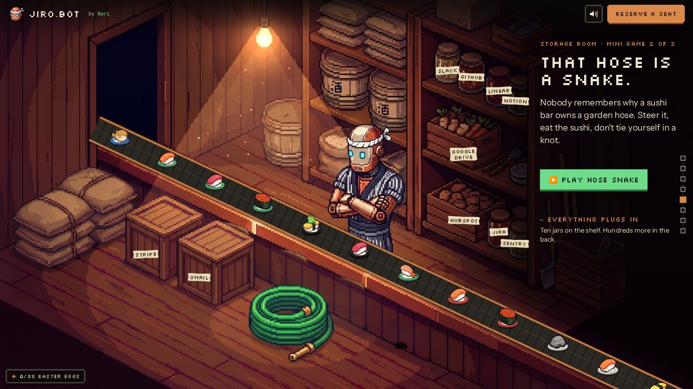
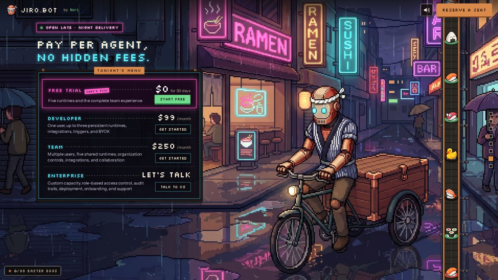
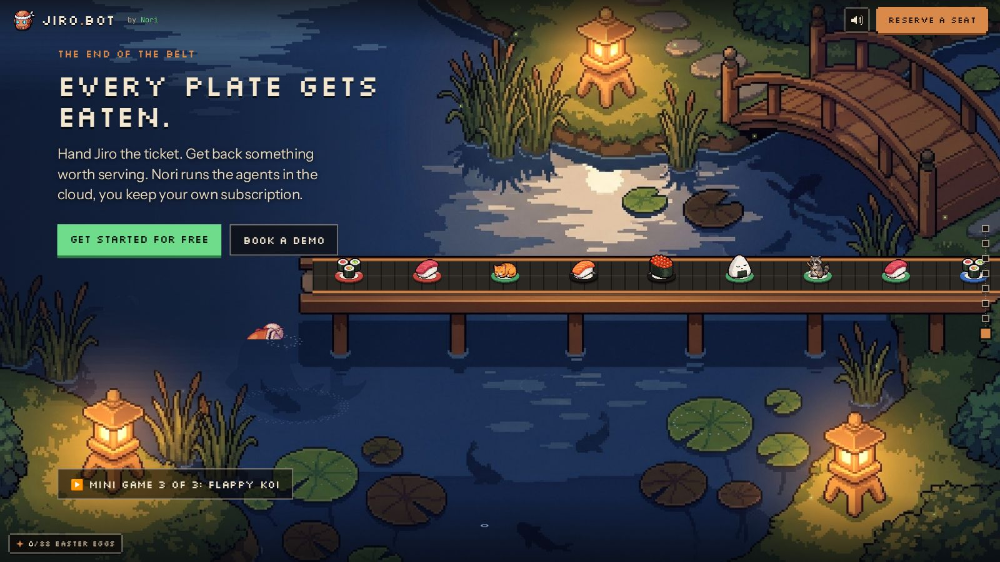
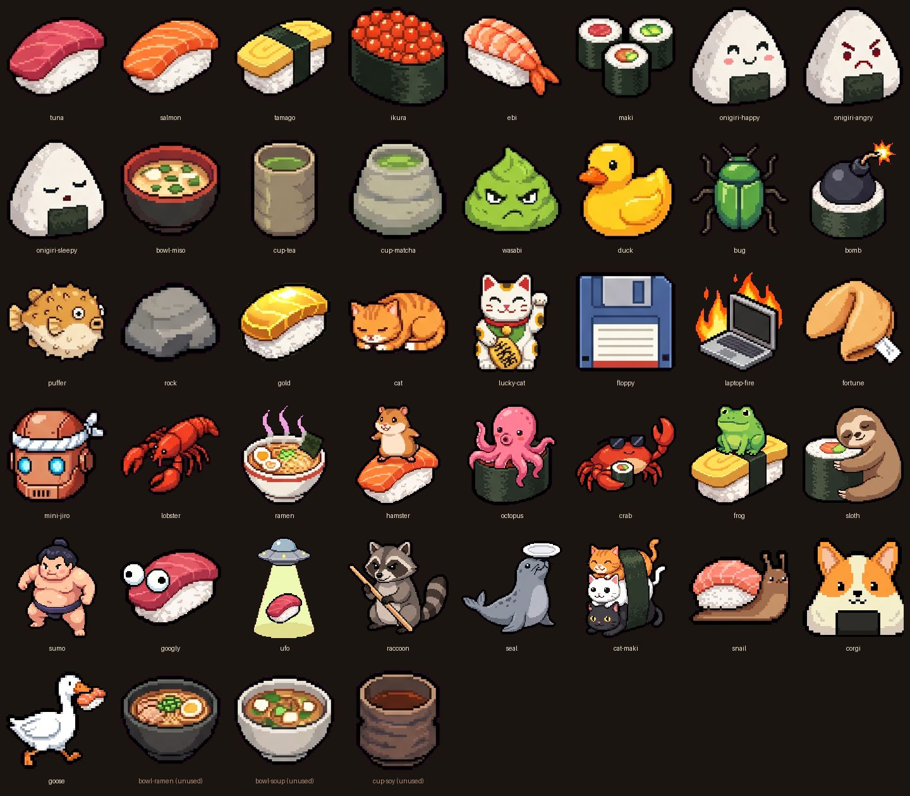

# 03 — Scenes: storage, pantry, street, pond · Mini game · Belt item catalogue

Recreation spec for the back half of Jiro's Restaurant (V3, branch
`restaurant-belt-v3`). Everything here is in **stage space** (fixed 1920×1080
logical canvas, see the engine doc) unless it says "internal px" (game canvas).
Times are seconds. `now` is the global scene clock (`performance.now()/1000`,
or the frozen `?freeze=<s>` value; `?t=` no longer freezes). `LOOP = 24`,
`BELT_SPEED = 46` px/s, `PLATE_GAP = 130` world px, so one plate **slot** passes
every `130/46 = 2.826 s`; roughly half the slots are empty (01-engine §7.4).

Source files covered:

| File | Role |
|---|---|
| `src/scenes/storage.ts`, `storage.css` | Storage room: integrations jars, soot sprites, mouse-trap, hose (decoration + egg) |
| `src/scenes/pantry.ts` | Pantry = storage canvas + MCP moodboard DOM |
| `src/scenes/street.ts`, `street.css` | Night street, red light: Jiro on a delivery bicycle, pricing board |
| `src/scenes/pond.ts`, `pond.css` | Koi pond ending: koi fates per plate, fish shadows, wind, final CTA, footer, Flappy Koi entry |
| `src/games/arcade.ts`, `games.css` | Shared 16-bit arcade cabinet overlay |
| `src/games/flappy.ts` | Flappy Koi (the only mini game) |
| `src/engine/items.ts`, `public/items/*.png` | Belt item catalogue |

Canonical scroll order (from `src/main.ts`):
`bar, office, dining, kitchen, storage, pantry, street, pond`, with transitions
`kitchen>storage (kitchen-storage-f), storage>pantry, pantry>street (file storage-street.ts, export pantryStreet), street>pond`.

> **BIBLE.md is stale; the code is the truth.** (1) **Hose Snake was removed in
> V3** (`src/games/snake.ts` deleted in f2abe2f); Flappy Koi is the only mini
> game. Whack-a-Bug was dropped earlier. (2) There is **no `yard` scene**;
> `public/art/yard.jpg` is committed but unused. The integrations live on the
> storage jar labels. (3) The street is no longer the cargo trike: V3 replaced it
> with Jiro on a delivery bicycle at a red light (`public/art/street-trike.jpg`
> keeps the old art, unused). The `.whack-*`/`.mole*` CSS is gone from
> `games.css`; a few leftover rules in `style.css` are dead code.

---

## Reference screenshots

> **Stale (pre-V3).** These images were rendered from the PR #6 build: the street
> shot still shows the cargo trike, storage lacks the soot sprites / trap, the
> contact sheet lacks the 20 V3 items, and the koi-jump crop used the old fixed
> "every third plate jumps" timing. Re-render with
> `cd tools && node qa/seg.mjs /tmp/docshots storage:0.5 street:0.5 pond:0.5 --t=5`
> (`--t` sets `?freeze=`). A leap is no longer at a fixed time: use
> `window.__pond` (see Scene 8) or `tools/qa/pond-fate.mjs` to find one.

| Storage | Street | Pond |
|---|---|---|
|  |  |  |




---

## Shared engine facts you need for these scenes

These come from `src/engine/*` (documented in full elsewhere); they are repeated
here only where they affect the numbers below.

- **SceneDef fields used here:** `id, room, art, mood, hold, belt, surfaces, under(g, now, api), over(g, now, api), mount(el, api), click(x, y, api)`.
  Draw order per frame: art (`drawImage(art, 0, 0, 1920, 1080)`) → `under` →
  belt tread + plates (`drawBeltFull(g, belt, now, undefined, drag.hidden)`) →
  dragged / rested plates → `over`.
- **Belt (01-engine §7):** one belt with **global plate ids**. Slot `id` sits at
  local `u = now·46 + belt.phase − id·130`; `belt.phase` is **written by the
  engine** at `start()` (`setChain`), so read it lazily, never at module load.
  Only `slotOccupied(id)` slots carry a plate (~47 %, clustered runs, big gaps);
  plates chat, ~1 in 30 falls off (`plateBehaviour(id, now)`, `.gone` for the rest
  of the journey), and the item/glaze depend only on the id (`itemOf(id)`,
  `rimFor(id)`), so a plate is the same object from the bar wall to the koi.
  `platesOn(path, now)` returns the visible plates with life applied. Default
  style `"full"`: shadow, tread `#2b2723`, crescent **slats** every 26 world px,
  rails `#6d3f22` 7 px under `#c9814a` 4 px.
- **Fades:** `fadeIn`/`fadeOut` are world-px alpha ramps at the start/end of
  an open path (plate alpha = `u/fadeIn`, `(U−u)/fadeOut`). Default 40 each.
- **Plate sprite (01-engine §7.8):** one ceramic style in three near-identical
  cream glazes (`rimFor(id)`), diameter `round(plate·s)`. Item image fit inside
  `0.86d × 0.92d`, bottom at `y + round(0.1d)`. Animal items hop 1 px when
  `floor((x + 0.5y)/18) & 3 === 0`. Rested plates may grow legs and potter (01-engine §8).
- **Helpers (`src/engine/fx.ts`):**
  - `wave(now, period, phase=0) = sin(((now % 24)/period)·2π + phase)`.
  - `glow(g, x, y, r, color, now, amt=.08, period=6, seed=0)`: additive
    (`lighter`) radial gradient `color → transparent`, radius
    `r·(1 + amt·(0.6·wave(now,period,seed) + 0.4·wave(now,period/3,seed·2.1)))`,
    filled over a `2.6r` square.
  - `shade(g, x, y, w, h, alpha, feather, side)`: linear gradient of
    `rgba(8,6,5,alpha)` solid until `feather` px from the open edge, then to 0.
  - `motes(g, now, x0, y0, w, h, n, color="rgba(255,220,160,.7)")`: n 3×3 px
    dust motes rising bottom→top of the box, periods 12/18/24 s by `i % 3`,
    x = `x0 + ((i·0.618) % 1)·w + 14·sin(2πf + i)`, alpha `0.6·sin(πf)`.
- **DOM helpers (`src/engine/dom.ts`):** `html(el, markup)` appends the first
  element; `place(el, x, y, w?, h?)` sets absolute stage px; `hotspot(parent, x, y, w, h, title, fn)`
  makes an invisible `<button class="hit">` with `title` and `aria-label`
  (click `stopPropagation`); `bubble(parent, x, y, text, ms=2600, cls="")`
  shows a `.bubble` (cream `#f3e6cf` box, `#1b130d` text, 22px/1.35 sans,
  3px `#1b130d` border, pops in via `.on`, removed after `ms` + 300 ms).
- **Eggs:** `api.egg(id, text)` fires once per id ever (localStorage
  `jiro-eggs`, notes in `jiro-egg-notes`), shows a toast with a green
  "`<id>` found!" tab. Every scene calls `declareEggs([...])` at module load
  so the total counter (shown as e.g. `0/88 EASTER EGGS`) is known up front.
- **Surfaces:** a dragged plate may be dropped where its bottom centre is inside
  a `poly`; it rests at `scale` and toasts `say` (the first park anywhere
  also fires the global `plate-parked` egg).
- **Plate click (engine default):** plays `item.sfx ?? "pop"`, shows a spark
  (`boom` burst for `sfx:"boom"`, coin burst for `sfx:"coin"`), cycles through
  `item.say` per item id (session counter), and calls `api.egg(item.egg, line)`
  if the item has an egg, else `api.toast(line)`.
- **Shared CSS tokens (`src/style.css`):** `--ink #0b0a09`, `--cream #f3e6cf`,
  `--muted #bfae95`, `--copper #d98a4a`, `--green #6fdc8c`, `--pink #ff5fc8`,
  `--cyan #5ff0ff`, `--px "Silkscreen", monospace`,
  `--sans "Instrument Sans", system-ui, sans-serif`,
  `--mono "JetBrains Mono", ui-monospace, monospace`.
  `.kicker` 20px/1 px-font copper, letter-spacing .04em, margin 0 0 22px.
  `.px` px-font, cream, `text-shadow: 0 4px 0 rgba(0,0,0,.6)`; `h2.px` 56px/1.05.
  `.lede` 27px/1.45 `#e7d8bf`, margin-top 24px, max-width 34ch,
  `text-shadow: 0 2px 8px rgba(0,0,0,.8)`. `.ctas` flex gap 16 margin-top 38.
  `.btn` 20px/1 px-font, padding 18px 24px; `.btn.primary` green bg, `#07130b`
  text, `box-shadow: 0 5px 0 #2d7a45`; `.btn.ghost` `rgba(10,8,7,.6)` bg,
  cream text, `2px solid rgba(243,230,207,.5)`. `.foot` flex space-between,
  16px mono, muted; links cream. `.game-start { position:absolute }`.
- **Sound effects (`src/engine/sfx.ts`, WebAudio synth):** `pop` square 500→900 Hz 80 ms;
  `blip` square 880→1320 Hz 70 ms; `quack` two sawtooth chirps 420→260 / 400→250;
  `boom` low-passed noise 0.6 s + sine 120→40; `coin` square 988 Hz then 1319 Hz;
  `meow` triangle 700→1000 then 1000→500; `splash` noise 0.5 s lp 2200;
  `whoosh` noise 0.35 s lp 900; `bonk` square 220→110; `sneeze` triangle 900→1400 + noise;
  `patter` five tiny square ticks (1200–1560 Hz, 60 ms apart); `chime` sine 1568 + 2093 Hz.

---

## Scene 5 — `storage` (Storage room)

### Purpose and mood

Quiet, dim, warm back-of-house store room. A single bare bulb sways on its cord
over rice sacks, sake barrels and a pickle-jar shelf; Jiro stands arms-crossed
behind the belt guarding the rice and glances down at plates passing in front of
him. The ten pickling jars / crates carry masking-tape labels with the
integration names ("Everything plugs in"); they rattle when a plate rides past
below them. A soot-sprite family lives in the notch between the rice sacks, a
mouse eyes a mouse-trap baited with a tiny salmon nigiri, and the coiled green
garden hose on the floor is **decoration only** since Hose Snake was removed
(it flicks a forked tongue now and then; clicking it is an egg). Right third of
the frame falls into shadow; that is where the copy sits.

SceneDef: `id "storage"`, `room "Storage"` (side-rail label), `art "art/storage.jpg"`,
`mood "quiet"`, `hold 1.1` viewport heights. All overlays sit on the art's
**4 px pixel grid** (`P = 4`, `snap(v) = round(v/4)·4`); every ambient motion is a
pure function of `now` with periods dividing 24 s (`m24(now) = now mod 24`).

### Art

`public/art/storage.jpg` — 1920×1080 RGB JPEG (380,894 bytes, unchanged in V3). Generated with
Gemini (`pipeline/gen_still.py`, model `gemini-3-pro-image-preview`, 2K 16:9,
Jiro canon ref), then hand-edited; first-pass prompt is in
`pipeline/first_pass.tsv` row `storage` (the whack-a-mole sack grid it asks for
was painted out). Key content and coordinates (stage px):

| Feature | Where |
|---|---|
| Dark doorway (belt enters from it) | x ≈ 265–470, y ≈ 40–400, upper left |
| Bare hanging bulb | `BULB = (732, 106)`; cord from top edge. Cut out at runtime (box x 700–764, y 0–136) |
| Painted light cone | from bulb down-left to the floor, apex ~ (731,120), base ~505–930 at y≈450 |
| Painted belt bed (stone slats, copper rail) | diagonal from (262, 357) to off-canvas (1880, 1119); centre line `y = 441 + 0.471·(x − 440)` |
| Rice sack stack | x ≈ 40–380, y ≈ 470–740 (left); dark notch between sacks at `SOOT = (272, 690)` (soot sprites) |
| Stripe crate / Gmail crate | lids ≈ (352–553, 548–648) and (502–698, 618–718) |
| Rice tub (white bucket) | (732–838, 280–460) |
| Two sake barrels (酒) | (890–1020, 140–300) and (1020–1130, 195–360) |
| Top shelf of stacked sacks | (880–1130, 0–150) |
| Jiro (arms crossed, behind belt) | head ≈ (960–1080, 345–480), body to y ≈ 700; painted eyes incl. outline `[967,416,13,22]` and `[995,419,20,23]` |
| Pickle jars shelf | (1205–1465, 115–320), carrot crate (1180–1380, 300–450), potato crate (1180–1400, 500–650), lower jars (1350–1465, 580–690) |
| Spoons / utensils on shelf | ≈ (1340–1465, 400–490) |
| Tool crate (dark, right) | (1545–1740, 630–860) |
| Coiled green garden hose + brass nozzle | coil ≈ (690–925, 790–960), nozzle mouth `NOZZLE = (804, 992)` |
| Mouse hole (code-drawn) | `MOUSE = (1112, 965)` at the foot of the belt's front skirt |
| Mouse-trap (code-drawn) | back corner `TRAP = (1148, 1008)` on the floor |

No sprite sheets: everything else is code-drawn or cut from the painting.

**Runtime cut-outs** (`buildCuts`, once, from an offscreen copy of the art):

- **Bulb:** in box (700, 0, 64×136) the sprite is the cord (X 728–737 for Y < 42),
  the socket (X 718–746 for Y < 78) and every glass pixel with G > 165 inside
  X 704–759, plus a 2 px fringe per row. A background patch is built per row by
  linearly blending the clean pixels 6 px outside the masked span.
- **Jiro's eyes:** `EYE_BOX (960, 412, 56×32)` copied as-is; the faceplate
  colour per row (`faceRow`, y 400–459) is sampled from column x 988.

### Belt

```ts
belt: { pts: [[262, 357, 0.96], [1880, 1119, 1.04]], width: 72, plate: 54, fadeIn: 80, fadeOut: 20 }
```

- Straight diagonal down-right, scale 0.96 → 1.04 (slight perspective). Screen
  length 1788.5 px, world length ≈ 1788 → ~14 slots, typically 4–9 plates.
- Style default `"full"`: the code tread is drawn **over** the painted bed and
  matches its 72 px width (the painted rails show at the edges).
- `fadeIn: 80` — plates fade in over the first 80 world px as they come out of
  the doorway; `fadeOut: 20` — near-instant fade at the bottom-right edge (off
  canvas anyway).
- `phase` is chained by the engine (01-engine §7.2); pantry reuses the same belt
  object, so storage and pantry share it.

### Surfaces (drag-and-park)

| # | Polygon | scale | say |
|---|---|---|---|
| 1 | `[352,600] [450,548] [553,596] [455,648]` | 1 | "On the Stripe crate. Billing has been notified." |
| 2 | `[502,670] [596,618] [698,665] [604,718]` | 1 | "Parked on the Gmail crate. Marked as read, never eaten." |
| 3 | `[45,560] [160,500] [250,470] [378,518] [300,566] [200,600] [60,612]` | 0.95 | "A plate on a rice sack. The rice is thrilled to meet its future." |
| 4 | `[892,140] [1018,140] [1018,196] [892,196]` | 0.8 | "On the sake barrel. The plate is now eighteen years old." |
| 5 | `[1028,198] [1130,198] [1130,252] [1028,252]` | 0.8 | "Second sake barrel. Jiro counts this as a pairing." |
| 6 | `[732,280] [838,280] [838,345] [732,345]` | 0.85 | "In the rice tub. Closest this plate has been to its origin story." |
| 7 | `[880,30] [1130,30] [1130,150] [880,150]` | 0.75 | "Top shelf. Good. Nobody can reach it, including you." |
| 8 | `[1190,330] [1380,330] [1380,372] [1190,372]` | 0.8 | "On the carrots. Google Drive has filed it as carrot_plate_final." |
| 9 | `[1340,400] [1465,400] [1465,490] [1340,490]` | 0.8 | "Filed next to the spoons. Jiro approves the taxonomy." |
| 10 | `[1190,510] [1390,510] [1390,552] [1190,552]` | 0.85 | "On the HubSpot potatoes. It is now a qualified lead." |
| 11 | `[1545,640] [1740,640] [1740,705] [1545,705]` | 0.9 | "On the tool crate. Dark in here. It will be found in 2031." |

Rule in the source comment: "Plates rest on crate lids, sack tops, barrel lids,
the tub and the free shelf boards. Not on the floor." Rested plates may grow legs
and potter about (engine, 01-engine §8).

### Ambient animation (`under`, in this exact order)

Click state is kept in **scene time** (`lastNow` = `now` of the last frame):
`flickerAt, hissAt, sootAt, snapAt` (all −99 initially).

1. `lastNow = now`; `buildCuts(art)` (once).
2. `plates = platesOn(storage.belt, now)`; `near = plates.some(|x − 990| < 70)`.
3. **Bulb flicker check:** `since = now − flickerAt`;
   `off = since ∈ [0, 1.2) && floor(since·10) % 3 === 1`.
4. **Bulb pendulum** (`bulb()`): draw the background patch, then the bulb sprite
   in 4 px rows, each shifted by `bulbDx(now, y) = snap(8·wave(now, 8)·min(1, y/130))`
   (the cord barely moves at the top, the glass swings ±8 px, stepped on the grid).
   `bx = 732 + bulbDx(now, 106)`.
5. **If lit:**
   - `glow(g, bx, 106, 110, "rgba(255,210,140,.30)", now, 0.06, 8)` — halo follows the bulb.
   - `glow(g, 720, 360, 330, "rgba(255,190,110,.09)", now, 0.08, 8, 1)` — soft room fill.
   - **Light cone** `cone(g, now, bx)`: `k = 0.5 + 0.5·wave(now, 8)`; vertical
     gradient y 106 → 470 from `rgba(255,205,130, 0.07 + 0.04k)` to 0, composite
     `lighter`, polygon `(bx−14, 120) (bx+14, 120) (930 + 3(bx−732), 450) (505 + 3(bx−732), 450)`
     (the cone swings 3× as far as the bulb at the floor).
   - **Dust** `dust()`: 14 motes, 4×4 `#ffe3ad`, snapped. Mote i: period
     `[24,12,8][i%3]`, `f = frac(now/per + 0.381i)`,
     `y = 170 + frac(0.618i)·250 − 18·sin(2πf)`, cone half-width `30 + 0.62(y − 120)`,
     `x = 716 + (frac(0.7548i) − 0.5)·1.6·half + 6·sin(4πf + i)`,
     alpha `0.22 + 0.4·(0.5 + 0.5·sin(2πf + 1.3i))`.
   - **If off:** `shade(g, 0, 0, 1300, 1080, 0.35, 10, "left")` instead.
6. **Jiro** `jiro(near)`: shut when `now % 6 ∈ (3.1, 3.24)` **or**
   `now % 24 ∈ (15.42, 15.54)` (double blink at 15.1/15.42). `down = near && !shut ? 4 : 0`.
   If shut or down: repaint each `EYES` rect row by row with `faceRow[y − 400]`
   (fallback `#c1a88f`), re-ink the face outline `#1d1614 (964, 418, 3×17)`, then
   either a closed lid `#1d1614` at `(x+1, snap(y + h/2) − 2, w − 2, 4)` or the
   eyes redrawn from the cut 4 px lower (**glance down at the passing plate**).
7. **Soot sprites** `soots(plateNear)` (`plateNear` = a plate within 90 px of x 272),
   ink `#0b0909`, eyes `#f4efe2`, all on the 4 px grid:
   - Parent: 8×6 blob (`..####.. / .######. / ######## ×3 / .######.`), clipped to
     the notch rect (256, 638, 36×36). In each 12 s cycle `u`: rises over 0–1 s,
     stays until 9, sinks 9–10, hidden 10–12; `y0 = snap(674 − 20·up)`. Looks
     right (u 3–5.5) and left (u 6.5–8); eyes drop one row (look down at the plate)
     while `plateNear`; blinks for 0.12 s every 3.4 s.
   - Fuzz: up to 5 rim hairs, re-rolled 6× a second (`h01(k·31 + i, seed) > 0.6`).
   - Two 5×4 babies (`.###. / ##### / ##### / .###.`) at the sack foot:
     (280, 694) bobs 4 px for the first 0.5 s of every 2 s; (244, 698) hops 8 px
     for 0.4 s every 8 s, sways 4 px every 2 s and turns its eyes toward the
     other at `t % 12 ∈ (7, 9)`. Blinks every 4 s / 6 s.
   - Click (`sootAt`): the family hides for 2.2 s (out in 0.15 s, back over the last 0.4 s).
8. **Mouse** `mouse()`: stepped 4 px arch hole `#0c0706` around `MOUSE`; peek
   `t = now % 12`, `out = t < 5 ? sin(πt/5) : 0`, `p = min(1, 1.6·out)`,
   `dy = snap((1 − p)·20)`, clipped to (1096, 949, 32×20). Grid pixels: head
   (−8,−8,16,12) `#8a7f78`, ears, inner ears `#d9a1a1`, eyes 4×4 `#0b0a09`, nose
   `#e79aa0`; eyes and nose shift 4 px right (looking at the trap) at `t ∈ (1.2, 3.8)`.
   Hidden while the trap is snapped (2.5 s).
9. **Mouse-trap** `trap()`: an isometric pixel board, cells
   `trapCell(i, j, h) = (1148 + 4(i − j), 1008 + 4·floor((i + j)/2) − 4h)`, 12×5 cells:
   outline `#2a160c`, top `#b3834e` with grain `#8e6238`, front edges `#6e4526` /
   `#5a371f`, shadow `#1a0e08`; trigger `#9a948a` at cells (7–8, 2); bait = tiny
   salmon nigiri (rice `#f1ead8/#e2d8c2`, salmon `#f08a5d/#ffb48a`). Spring bar
   (`#d6d0c4`, ends `#7d776e`) armed flat at i = 1; for 0.12 s after a click it
   stands upright at i = 4; then it lies over the bait at i = 8, h 2, bait squashed,
   until 2.5 s have passed. Spring coil `#5f5a53` at the hinge.
10. **Hose tongue** `tongue()`: forked tongue `#c8323f` out of `NOZZLE`, frames
    `n = 1,2,3,2,1` over 0.72 s (`<.12, <.25, <.45, <.6, <.72`). Ambient once per
    loop at `m24 ∈ (17, 17.72)`; on click two flicks (`since % 0.75`) for 1.5 s.
11. **Right-side shade for the copy:** `shade(g, 1470, 0, 450, 760, 0.35, 200, "right")`.
12. **Label rattle** `rattle(plates)`: per label, `a = max(1 − |plate.x − label.x|/44)`;
    when `a > 0`, `--r = tilt + 2.2a·sin(10π·now + i)` deg and
    `--dy = −round(2a·|sin(10π·now + i)|)` px; CSS vars are written only when they change.

No `over` layer.

### DOM layout (`mount`)

All positions are stage px inside the scene layer (`.scene-ui[data-id="storage"]`).

1. **Copy block** `<section class="copy st-copy">` at left 1496, top 112, width 360:
   - kicker: `Storage · the tool shelf`
   - h2.px: `Everything plugs in.`
   - lede: `Slack, GitHub, Linear, Notion, Stripe, Gmail, plus hundreds more. Jiro works in the tools your team already uses.`
   - `<p class="st-plugs">Tap a jar to read the label</p>`: margin-top 26,
     16px/1 px-font, copper, letter-spacing .04em, `text-shadow: 0 2px 0 #000`;
     `::before` content `"\2190  "` (← and two spaces) in green.
   There is no game button any more.
2. **Ten tape labels** — one `<button class="st-tape">` per entry of
   `INTEGRATIONS = ["Slack","GitHub","Linear","Notion","Google Drive","Sentry","Jira","HubSpot","Stripe","Gmail"]`
   (in that order, from `src/content/copy.ts`). Inner HTML = name with the
   first space replaced by `<br>` (so "Google<br>Drive"), `title` = name,
   `left/top` = centre, `--r` = tilt.

   | i | Integration | centre (x, y) | tilt | Quip (bubble) | Sits on |
   |---|---|---|---|---|---|
   | 0 | Slack | 1240, 196 | −3° | "Slack: fermented daily. Very chatty jar." | top-left jar |
   | 1 | GitHub | 1306, 214 | 2° | "GitHub: every jar is a fork of the one before it." | 2nd jar |
   | 2 | Linear | 1382, 252 | −2° | "Linear: pickled in exactly the order it was filed." | 3rd jar |
   | 3 | Notion | 1428, 280 | 3° | "Notion: the jar is also a database. Of pickles." | 4th jar |
   | 4 | Google Drive | 1284, 428 | −2° | "Google Drive: 14 carrots, all named final_final_v3." | carrot crate |
   | 5 | Sentry | 1426, 676 | 2° | "Sentry: if this jar makes a noise, Jiro already knows why." | lower-right jar |
   | 6 | Jira | 1382, 644 | −3° | "Jira: labelled, prioritised, story-pointed. Still a jar." | lower jar |
   | 7 | HubSpot | 1285, 612 | 2° | "HubSpot: potatoes, each with a lifecycle stage." | potato crate |
   | 8 | Stripe | 404, 706 | −2° | "Stripe: the crate that pays for the other crates." | left crate |
   | 9 | Gmail | 552, 770 | 2° | "Gmail: crate of unread mail. 4,012 envelopes." | right crate |

   Tape CSS (`storage.css`): absolute,
   `transform: translate(-50%, calc(-50% + var(--dy, 0px))) rotate(var(--r, 0deg))`,
   `font: 400 15px/1.05 var(--px)`, letter-spacing .02em, colour `#2a170c`,
   centred, background `#eadcb8`, padding `4px 6px 3px`, no border, pointer,
   nowrap, `box-shadow: inset 0 -2px 0 rgba(120,90,50,.35), 0 2px 0 rgba(0,0,0,.55)`,
   torn-tape `clip-path: polygon(0 8%, 6% 0, 50% 6%, 94% 0, 100% 10%, 97% 50%, 100% 92%, 92% 100%, 50% 94%, 8% 100%, 0 90%, 3% 50%)`.
   Hover/focus-visible: background `#f6ecd0`, lifts to `translate(-50%, calc(-54% + var(--dy)))`, no outline.

   Click: `stopPropagation`, `sfx("pop")`, bubble at `(min(x + 30, 1500), y − 70)`
   with the quip, 2800 ms, class `st-say`. Tracks a `Set` of opened indices:
   first open → egg `storage-jars` "Pickled integrations. Do not open before 2031.";
   all 10 opened → egg `storage-all-jars` "You opened every jar. Jiro plugs into all of them anyway."

Other scene CSS (`storage.css`):
`.copy { text-shadow: 0 2px 0 #000, 0 0 24px rgba(0,0,0,.8) }`,
`.copy h2.px { font-size: 40px }`, `.copy .kicker { font-size: 17px; margin-bottom: 18px }`,
`.copy .lede { font-size: 24px }`, `.st-say { font-size: 20px; max-width: 360px }`.

### Hotspots and easter eggs

`declareEggs(["storage-bulb", "storage-jars", "storage-mouse", "storage-jiro", "storage-all-jars", "storage-hose", "storage-soot", "storage-trap"])`

| Hotspot (title) | Rect x, y, w, h | Trigger effect | SFX | Egg id → text |
|---|---|---|---|---|
| "Light bulb" | 704, 20, 60, 120 | `flickerAt = lastNow` → 1.2 s stutter | blip | `storage-bulb` → "The bulb has never been turned off. Jiro doesn't do cold starts." |
| "Mouse hole" | 1090, 939, 44, 32 | — | blip | `storage-mouse` → "Not a bug. The mouse is a feature. It pays rent in crumbs." |
| "Mouse-trap" | 1124, 992, 80, 52 | `snapAt = lastNow` → trap snaps, mouse hides (ignored while snapped) | bonk | `storage-trap` → "Snap. The bait was a salmon nigiri. The mouse has filed a bug report: expected cheese." |
| "Garden hose" | 690, 790, 235, 215 | `hissAt` → tongue flicks 1.5 s + `hiss()` (0.9 s white noise, high-pass 3800 Hz, gain .16, own `AudioContext`, respects the sound toggle) | hiss | `storage-hose` → "Hssss. Nobody ordered the hose, and now nobody wants to move it." |
| "Something between the sacks" | 220, 634, 96, 80 | `sootAt` → soot family hides 2.2 s | patter | `storage-soot` → "A soot sprite family lives between the rice sacks. They only eat the grains that fall off the belt." |
| "Jiro" | 915, 345, 200, 180 | bubble at (1060, 300), 2600 ms, class `st-say`, cycling lines | chime | on the 3rd click: `storage-jiro` → "Jiro, arms crossed, guarding the rice like production data." |
| 10 tape labels | see table | quip bubble | pop | `storage-jars`, `storage-all-jars` |

Jiro lines, in order (cycling):
1. "Inventory: rice, sake, one hose. Nobody ordered the hose."
2. "Put a plate on a crate. Not the floor. We have standards."
3. "Every sack is load-tested. By sitting on it."

---

## Scene 6 — `pantry` (MCP pantry)

The pantry is **the storage room again**, same art, same camera, same belt, same
ambient, same surfaces, dimmed behind the MCP moodboard panel. Only the DOM changes.

```ts
export const pantry: SceneDef = {
  ...storage,
  id: "pantry",
  room: "MCP pantry",
  hold: 1.5,
  mount(el, api) { mountMoodboard(el, api); },
  enter: undefined,
  leave: undefined,
};
declareEggs(["mood-all"]);
```

- Because it spreads `storage`, it inherits `art`, `belt`, `surfaces`, `under`
  (bulb, soot sprites, mouse, trap, tongue, rattle) and `mood`. It shares the
  **same belt object**, so the chain gives it the same phase (01-engine §7.2):
  the plates simply keep riding, same ids, same items (no per-scene item keys
  since V3). No new ambient or eggs in `pantry.ts` itself.
- `pantry-soot` ("Rice smuggler") is **not** a pantry egg: it is declared and
  fired by the `pantry>street` transition (`storage-street.ts`, soot sprite
  smuggling a grain of rice; see the transitions doc).
- The dimming and all moodboard content live in `src/moodboard/viewer.ts`
  (+ `v01…v10`, documented in the moodboard doc), not here. The viewer fires
  `mood-all` → "You tasted all ten versions. Jiro wants to know your favourite."
  once all 10 versions have been viewed.
- Transition `storage>pantry` (`src/transitions/storage-pantry.ts`): length
  0.35 viewport heights, route "No move: the pantry is the storage room with the
  moodboard pinned up.", `render` just calls `api.drawScene("storage", g, now)`.
  The storage copy fades out and the moodboard fades in (DOM layer swap).
- The next transition leaves from the pantry: `pantry>street`
  (`storage-street.ts`, export `pantryStreet`), which reads `storage.belt`.

---

## Scene 7 — `street` (Delivery)

### Purpose and mood

Rainy neon night street, **red light**. Jiro waits on an upright city delivery
bicycle (front basket, okamochi delivery box on the rear rack), right foot down,
relaxed. Nothing travels: the whole scene is an **idle loop of `LOOP = 24 s`**
(breathing, blinks, a glance back at the box, a look up into the rain, the
traffic light cycling). V3 replaced the PR #6 cargo trike with this scene; the
mood follows Martin's night-street motorcycle reference, as a bicycle. The belt
is a **vertical delivery conveyor clamped to the utility pole** at the right
edge, running straight from above the frame to below it; it never touches the
bike. The dark shuttered wall on the left carries the lit, bolted-on **pricing
menu board**.

SceneDef: `id "street"`, `room "Delivery"`, `art "art/street.jpg"`,
`mood "bustling"`, `hold 1.6`.

### Art

- `public/art/street.jpg` — 1920×1080 RGB (467,806 bytes), **replaced in V3**
  (f2abe2f). The old trike painting is kept as `public/art/street-trike.jpg`
  (492,619 bytes, unused). The overlays sit on the art's 4 px grid. Key coordinates:

  | Feature | Where |
  |---|---|
  | Dark wall + roller shutter (copy area) | x 0–700, y 0–700 |
  | Pedestrian with umbrella (left edge) | x 0–140, y 330–750 |
  | Pink bowl neon sign | x 765–880, y 0–150 |
  | Pink RAMEN neon (horizontal) | x 890–1125, y 55–240; the "R" at ~ (893–947, 78–166) |
  | Awning | x 780–1150, y 180–300 |
  | Ramen shop doorway noren (sways) | x 782–852, y 298–372 |
  | Ramen shop window + diner, cyan window neon | x 775–1100, y 280–650; neon ≈ (910–1025, 340–450) |
  | Sidewalk menu sign (A-frame) | x 905–1000, y 495–650 |
  | Amber vertical RAMEN sign / paper lantern | x 1170–1255, y 10–250 / ≈ (1160–1195, 350–420) |
  | Cyan vertical SUSHI sign | x 1305–1380, y 65–290 |
  | Horizontal traffic light on the pole arm | box ≈ (1410–1665, 95–195); lamps red (1457,143), amber (1537,143), green (1615,143) |
  | Purple "BAR" sign | ≈ (1590–1700, 230–295) |
  | Jiro's head (with hachimaki) | polygon `HEAD` (1194–1336, 324–486); eyes region (1206, 404, 74×42); eye glows (1223,427), (1262,423) |
  | Jiro's torso (happi) | polygon `TORSO` (1180–1360, 470–604) |
  | Handlebar bell (code-drawn) | (1172, 664) |
  | Front basket | ≈ (1055–1190, 700–800) |
  | Headlamp / front rim | lamp ≈ (1102, 815); rim glint (1066, 842) |
  | Okamochi box on the rear rack | lid top x 1394–1506, y 632–668; box to y ≈ 730 |
  | Wet kerb / street with neon puddles | kerb y ≈ 690–800; street y 780–1080 |
  | Storm drain grate | x 555–700, y 805–835 |
  | Black utility pole with rungs (the belt's mount) | x ≈ 1700–1790, full height |
  | Right-edge pedestrian with umbrella (the "PM") | x 1790–1920, y 340–740 |

- `public/art/street/` (RGBA overlays):

  | File | Size | Content | Drawn at |
  |---|---|---|---|
  | `r-off.png` | 54×88 | RAMEN "R" with its tube **off** | (893, 78) |
  | `blink.png` | 74×42 | faceplate with both eyes closed (dark lid bar + cyan underline) | (1206 + hx, 404 + hy) |
  | `glance.png` | 74×42 | eyes moved 4 px right (glance back at the box) | same |
  | `lookup.png` | 74×42 | eyes moved 4 px up (look into the rain) | same |
  | `cat.png` / `cat-blink.png` | 64×80 | small cat under a wagasa umbrella on the doorstep, eyes open / shut | (800, 664) |

  `tools/art/street/eyes.py` generates `blink/glance/lookup.png` from
  `street.jpg`: it finds the blue eye pixels in the (1206, 404, 74×42) crop,
  fills the bare faceplate with the per-row median cream, re-stamps the eyes
  offset (+4, 0) / (0, −4) or draws closed lids, and keeps only changed pixels
  (alpha = |diff| > 6).

### Belt

```ts
export const BELT_X = 1740;
belt: { pts: [[1740, -70, 1], [1740, 1150, 1]], width: 58, plate: 52, fadeIn: 0, fadeOut: 0 }
```

Straight vertical top→bottom at x 1740, length 1220 (≈9 slots), no
fades (plates enter and leave off-canvas). Default `"full"` style draws the
dark tread + slats + copper rails over the pole. `BELT_X` and the path ends are
exported for the transitions: `pantry>street` arrives at the top,
`street>pond` leaves at the bottom.

### Surfaces

| # | Polygon | say |
|---|---|---|
| 1 | `[1394,626] [1506,626] [1506,668] [1394,668]` | "Strapped onto the delivery box. ETA: whenever the light turns green. Again." |
| 2 | `[1062,700] [1188,700] [1188,742] [1062,742]` | "Dropped in the front basket. Free delivery, zero stars for presentation." |
| 3 | `[868,700] [1060,690] [1060,770] [868,776]` | "Left on the kerb. Jiro rang twice." |
| 4 | `[1002,472] [1064,472] [1064,498] [1002,498]` | "Parked on the ramen shop's windowsill. The chef inside is filing a merge conflict." |
| 5 | `[905,494] [1000,494] [1000,522] [905,522]` | "Balanced on the sidewalk sign. Today's special just got more special." |
| 6 | `[1414,86] [1662,86] [1662,108] [1414,108]` | "On top of the traffic light. Red means stop, and so does this plate." |
| 7 | `[790,190] [1140,250] [1150,300] [790,290]` | "Plate on the awning. The rain is now pre-washing it." |
| 8 | `[160,250] [760,250] [760,284] [160,284]` | "Plate on top of the menu board. Now it costs $0 and a ladder." |
| 9 | `[150,772] [772,772] [772,806] [150,806]` | "Parked on the menu board's ledge. Pricing now includes one free nigiri." |

No `scale` set → the plate keeps the scale it was picked up at (1).

### Ambient animation

Helpers: `lt(now) = ((now % 24) + 24) % 24`; hash `h(i, k=1) = frac(sin(i·127.1·k + k·311.7)·43758.5453)`.
Egg one-shots: `fxAt = { lamp, rOut, blink, bell, box, light, cat, look }` (−99 initially),
set from `performance.now()/1000`; `since(k, now) = now − fxAt[k]` (same clock unless frozen).

**Traffic light** `signal(now)`: loop red 0–16 s, **green 16–20.5** (Jiro keeps
waiting), amber 20.5–22.5, red 22.5–24. After a click: green for 2.4 s, then amber
until 3.4 s. Drawing: red → `glow(1457, 143, 80, "rgba(255,50,50,.22)", now, .06, 3)`
only (the red lamp is painted). Otherwise the unlit amber cell `(1500,104,76×82)`
of the art is copied over the red lamp at (1420, 104); the lit lamp (green
`#3dffa6` at x 1615 / amber `#ffb43a` at x 1537, y 143) is a 4 px stepped disc:
r 28 `#0c1a14` outline, r 24 core, r 12 highlight `rgba(255,255,255,.55)` at
(−4, −4); `rehue()` (composite `hue`, radial ellipse) turns the baked red
reflections green/amber on the road (1570, 1010, rx 210, ry 90, α .75) and around
the light (1540, 150, 150×70, α .6); glows r 90 at the lamp and r 260 at (1480, 1000).

**Jiro** (`drawJiro`, whole-pixel shifts of clipped art polygons):

- `breath` = −1 px when `wave(now, 4, 0.3) > 0.35`; `lean` = +1 px right at `lt ∈ [3.6, 7.6)`.
- **Glance** back at the box `lt ∈ [9, 11.4)`: head +1/+1, `glance.png`, eye glows +4 x.
- **Look up** into the rain `lt ∈ [18.8, 20.9)` (or 2.2 s after the puddle egg):
  head −1 y, `lookup.png`, glows −4 y. A drop falls onto the faceplate
  (x 1242, `lt` 19.7–20.1, quadratic) and splits into three droplets until 20.5.
- Torso shifted `(lean, breath)`, head `(lean + glance, breath + glance − up)`.
- **Blink**: `lt % 6 ∈ (2.2, 2.34)`, double blink `(14.56, 14.68)` + `(14.8, 14.9)`,
  startled blink when the drop hits `(20.15, 20.32)`; Jiro click → three quick
  blinks for 0.9 s (`floor(s/0.15) % 3 === 0`). Blink draws `blink.png`; open
  eyes get two `glow(…, 22, "rgba(110,240,255,.2)", now, .1, 4[, 1])`.
- **Hachimaki drip** every 6 s at the knot tail (1316, 371)+shift: grows 0–3.8 s,
  falls 88 px 3.8–4.25, splashes on the shoulder (y 462) until 4.6.

**`under`** (in order):

1. **Neon halos breathe** (`glow` calls, exactly):
   - `(1005,150) r190 rgba(255,80,190,.13) amt .12 period 6` — RAMEN sign
   - `(820,70) r110 rgba(255,80,190,.10) .12, 8, seed 2` — bowl sign
   - `(1207,130) r130 rgba(255,190,90,.10) .1, 12, seed 1` — amber RAMEN
   - `(1342,175) r150 rgba(80,240,255,.12) .14, 4, seed 3` — SUSHI
   - `(1645,255) r90 rgba(200,110,255,.12) .12, 6, seed 4` — BAR
   - `(965,395) r90 rgba(80,240,255,.10) .1, 8, seed 5` — cyan window neon
   - `(1175,385) r60 rgba(255,170,80,.18) .08, 12, seed 6` — paper lantern
2. **RAMEN "R" sputter** `rIsOut(now)`:
   - If the egg fired within 1.6 s: out when `floor((now − rOut)·9) % 3 !== 1`.
   - Otherwise out during `lt` windows `[6.0,6.07) [6.16,6.21) [6.3,6.36) [17.4,17.46) [17.55,18.3)`.
   - Out → `r-off.png` at (893, 78). On → `glow(920, 122, 50, "rgba(255,95,200,.10)", now, 0.2, 3)`.
3. **Noren sway** `drawNoren`: the art strip x 782–852, y 298–372 redrawn in 2 px rows,
   row offset `round(k·(2.2·wave(now, 6, 0.02y) + 0.8·wave(now, 2, 1 + 0.05y)))`,
   `k = (y/74)^1.4` (the hem moves, the rod does not).
4. **Traffic light** `drawSignal` (above).
5. **Puddle neon shimmer:** `SHIMMER` spots `[x, y, w, rgb]`:
   `[965,870,70,"95,240,255"] [940,915,60,"255,95,200"] [1640,1030,60,"200,110,255"] [830,1055,70,"255,95,200"] [1560,940,50,"255,120,120"] [1880,990,40,"255,160,90"]`.
   For each spot i and k = 0..4: alpha `0.12 + 0.12·(0.5 + 0.5·wave(now, [6,8,12][(i+k)%3], 1.3i + k))`,
   dx `round(wave(now, 12, i + 0.7k)·6)`, y `y + 5k − 10`, width `round(w·(0.4 + 0.6·h(5i + k, 2)))`,
   rect `(round(x − ww/2 + dx + (k%2)·9), yy, ww, 2)`.
6. **Rain ripples:** 15 `RIPPLES` = `[120,905] [330,960] [520,890] [690,1010] [260,1045] [880,985] [990,880] [1380,1040] [1500,1005] [1840,930] [1250,1060] [60,1000] [610,945] [1600,1060] [1300,990]`.
   Period `P = i odd ? 3 : 4`; `f = frac(now/P + h(i,5))`; only while `f ≤ 0.6`: `q = f/0.6`,
   pixel-crisp ring `pxRing` (2×1 px dabs on even x, deduplicated) rx `round(3 + 16q)`,
   ry `round(1 + 5q)`, `rgba(190,215,255, 0.4·(1−q))`; a trailing second ring
   (`q − 0.35`) at `0.22·(1−q)` once `q > 0.35`.
7. **Headlight sweep** of a car turning off-frame, `lt ∈ [12, 14.4)`: `q = (lt−12)/2.4`,
   `a = sin(πq)`, centre `x = 2150 − 2500q`; additive horizontal gradient band
   `rgba(255,240,200, .17a)` over (x ± 220, 790–1080) and `.05a` over (x ± 160, 300–790).
8. **Bike headlamp:** `boost = max(0, 1 − since(lamp)/1.4)`;
   `glow(1102, 815, 40 + 40·boost, rgba(255,230,160, .35 + .4·boost), now, .06, 4, 1)`;
   light pool: additive radial gradient centre (950, 960), r 200, inner alpha
   `0.07 + 0.015·wave(now,6) + 0.14·boost`, squashed ×0.35 vertically, rect (740, 700, 420, 520).
9. **Art fix:** a stray axle stub behind the rear tyre is covered with the clean
   patch above it: `drawImage(art, 1486, 827, 56, 25 → 1486, 851)`.
10. **Jiro** (above).
11. **Delivery box** `drawBox`: closed → a thin steam wisp through the lid seam,
    `steam(g, 1446, 636, now, 1.5, 54, 3, 0.12)`. Peek (click, 2.6 s): lid lift
    `round(14·min(1, s/0.2, (2.6 − s)/0.25))`; dark inside `#1a0b08`, warm glow
    `(1450, 652) r70`, an item from `PEEK = [onigiri-sleepy, googly, hamster, ufo, frog]`
    (cycling per click) 40 px wide rising out of the box (clipped to 1398–1502 × 600–656),
    then the lid strip `(1392, 626, 118×30)` redrawn `lift` px higher.
12. **Bell** `drawBell` at (1172, 664): copper bell pixels (`#2a1a12` outline, `#c9814a`,
    highlight `#f0b27a`, `#6d3f22` base + stem). Click → jiggles ±1 px at 12 Hz for
    1.2 s with three pairs of sound-wave dashes spreading outward.
13. **Cat** `drawCat` at (800, 664): shadow `rgba(0,0,0,.35)` (806, 740, 52×4);
    `cat.png`, or `cat-blink.png` when `lt % 8 ∈ (5.1, 5.28)` or 0.5 s after a
    click; click hop −2 px for 0.3 s. A drop gathers on the umbrella rim
    (861, 701) and falls 38 px every 4 s.
14. **Spoke glint** on the front rim: `tw = max(0, wave(now, 12, 0.4))`; when `tw > 0.2`:
    alpha `(tw − 0.2)·0.9`, `#fff4dc` 3×3 at (1065, 841), then at 0.6× alpha a
    13×1 / 1×13 cross centred on (1066, 842).

**`over`** (rain, above the belt): `drizzle(g, now, n, alpha, len, periods)` —
`rgba(185,205,255,alpha)`; drop i: `P = periods[i % len]`, `f = frac(now/P + h(i,3))`,
`x = round(h(i,7)·2000 − 70f)`, `y = round(−40 + 1160f)`; each streak is three
1 px-wide segments of `round(len/3)` stepping 1 px left (crisp slant).
Two layers: `drizzle(now, 120, 0.2, 16, [2, 2.4, 3])` (far) and
`drizzle(now, 60, 0.3, 24, [1.5, 1.6, 2])` (near). Every period divides 24, so it loops.

### DOM: the pricing board

Data (`PRICING` in `src/content/copy.ts`):

```ts
title: "Pay per agent, no hidden fees.",
plans: [
  { name: "Free trial", price: "$0", unit: "for 30 days", included: "Five runtimes and the complete team experience", cta: "Start free", href: LINKS.start, hot: true },
  { name: "Developer", price: "$99", unit: "/month", included: "One user, up to three persistent runtimes, integrations, triggers, and BYOK", cta: "Get started", href: LINKS.start },
  { name: "Team", price: "$250", unit: "/month", included: "Multiple users, five shared runtimes, organization controls, integrations, and collaboration", cta: "Get started", href: LINKS.start },
  { name: "Enterprise", price: "Let's talk", unit: "", included: "Custom capacity, role-based access control, audit trails, deployment, onboarding, and support", cta: "Talk to us", href: LINKS.enterprise },
]
```

`LINKS.start = "https://noriagentic.com/"`,
`LINKS.enterprise = "mailto:amol@noriagentic.com?subject=Nori%20Sessions%20Enterprise"`.

Markup (title split on the first comma: lead `Pay per agent`, tail `no hidden fees.`):

```html
<section class="copy st-board">
  <p class="st-open"><i></i>Open late · night delivery</p>
  <h2 class="px st-title">Pay per agent,<br><em>no hidden fees.</em></h2>
  <div class="st-menu">
    <span class="st-tag">Tonight's menu</span>
    <!-- per plan -->
    <article class="st-row hot?">
      <div class="st-line">
        <h3>{name}</h3>[<span class="st-pick">chef's pick</span> if hot]
        <span class="st-dots"></span>
        <p class="st-price">{price}[<small>{unit}</small> if unit]</p>
      </div>
      <p class="st-inc">{included}</p>
      <a class="btn primary|ghost" href target="_blank" rel="noopener">{cta}</a>
    </article>
  </div>
</section>
```

`primary` for the hot row, `ghost` for the rest.

CSS (`street.css`, all scoped `.scene-ui[data-id="street"]`):

- `.st-board`: absolute, left 140, top 88, width 640.
- `.st-open`: inline-flex, centred, gap 12; 15px/1 px-font, letter-spacing .08em,
  `#ffd7f2`; padding `9px 14px 8px`; `2px solid rgba(255,95,200,.85)`;
  `box-shadow: 0 0 12px rgba(255,95,200,.45), inset 0 0 10px rgba(255,95,200,.25)`;
  `text-shadow: 0 0 6px rgba(255,95,200,.9)`; bg `rgba(14,6,16,.7)`; margin `0 0 22px`;
  `animation: st-buzz 12s steps(1,end) infinite`.
  `.st-open i`: 8×8 green square, `box-shadow 0 0 8px green`, `st-dot 4s ease-in-out infinite`.
- `.st-title`: 44px/1.12, `#fff3de`, `text-shadow: 0 0 10px rgba(95,240,255,.35), 0 4px 0 rgba(0,0,0,.7)`, margin `0 0 26px`.
  `em`: normal style, cyan, `text-shadow: 0 0 12px rgba(95,240,255,.7), 0 4px 0 rgba(0,0,0,.7)`, `st-buzz 8s steps(1,end) -3s infinite`.
- `.st-menu`: relative; background = `repeating-linear-gradient(0deg, rgba(255,255,255,.012) 0 2px, transparent 2px 4px)` over `rgba(9,8,16,.88)`;
  `border: 4px solid #2a1c16`; `outline: 2px solid rgba(95,240,255,.5)`, `outline-offset: -10px` (the inner neon tube);
  `box-shadow: 0 0 0 2px #0b0706, 0 0 26px rgba(95,240,255,.18), 0 12px 0 rgba(0,0,0,.45)`; padding `30px 26px 18px`.
  `::before/::after` = two bolts: 10×10 at top −10, left 18 / right 18, bg `#8a5a3a`,
  `box-shadow: 0 0 0 2px #1a100c, inset -3px -3px 0 #5a3622`.
- `.st-tag`: absolute, centred on the top edge (left 50%, top −17, translateX −50%),
  14px/1 px-font, letter-spacing .18em, `#1a0f07` on copper, padding `7px 12px 6px`, `box-shadow: 0 3px 0 #7a4220`, nowrap.
- `.st-row`: grid `1fr auto`, column-gap 18, row-gap 6, align end, padding 14,
  `border-bottom: 2px dashed rgba(243,230,207,.12)` (none on last).
  `.st-line` spans both columns, flex baseline gap 10.
  `h3`: 19px/1 px-font, uppercase, letter-spacing .06em, cyan, `text-shadow: 0 0 8px rgba(95,240,255,.55)`.
  `.st-dots`: flex 1, min-width 20, 2px tall, align centre, margin-top 8, `repeating-linear-gradient(90deg, rgba(243,230,207,.35) 0 4px, transparent 4px 10px)`.
  `.st-price`: 30px/1 px-font `#fff3de`; `small`: 15px sans, muted, margin-left 6.
  `.st-inc`: 17px/1.35 sans `#e6dff0`, margin 0.
  `.btn`: 14px, padding `10px 12px 9px`, centred, nowrap, min-width 138. `.btn.ghost`: bg `rgba(10,8,7,.5)`, border colour `rgba(95,240,255,.4)`.
- `.st-row.hot` (Free trial): margin `0 -8px 6px`, padding `16px 22px`, `2px solid rgba(255,95,200,.9)`,
  bg `rgba(40,8,34,.55)`, `box-shadow: 0 0 16px rgba(255,95,200,.4), inset 0 0 14px rgba(255,95,200,.16)`,
  `animation: st-glow 6s ease-in-out infinite`; its `h3` pink with `text-shadow 0 0 10px rgba(255,95,200,.8)`; its price 36px white.
  `.st-pick`: 11px/1 px-font, `#1b0716` on pink, padding `4px 6px 3px`, letter-spacing .06em, `rotate(-4deg)`, `box-shadow 0 0 10px rgba(255,95,200,.6)`.
- `.st-foot` (defined, unused): 12px mono `rgba(191,174,149,.7)`, right aligned.
- Keyframes:
  - `st-buzz`: `0%,100% {opacity:1} 61% {.72} 61.6% {1} 62.4% {.8} 63% {1}` (with `steps(1,end)` → instant dips like a real tube).
  - `st-glow`: `0%,100% box-shadow 0 0 14px rgba(255,95,200,.36), inset 0 0 12px rgba(255,95,200,.14)`; `50% 0 0 22px …,.5 / inset 0 0 18px …,.2`.
  - `st-dot`: `0%,100% opacity 1; 50% .45`.
  - `prefers-reduced-motion: reduce` → all animations in the scene off.

### Hotspots and easter eggs

`declareEggs(["street-bell", "street-lamp", "street-box", "street-light", "street-cat", "street-neon", "street-jiro", "street-pm", "street-drain", "street-special", "street-puddle"])`

Hotspots in mount order (later ones win where they overlap):

| Hotspot | Rect x, y, w, h | Effect | SFX | Bubble (x, y) text | Egg id → text |
|---|---|---|---|---|---|
| "Bike bell" | 1140, 646, 70, 44 | `fxAt.bell` → bell jiggles 1.2 s | chime, chime again after 220 ms | (1010, 580) "Ring ring. Delivery for main." | `street-bell` → "Every delivery ships with tests." |
| "Bike lamp" | 1070, 790, 64, 56 | `fxAt.lamp` → lamp flare 1.4 s | blip | (960, 760) "High beams on. The cat is unimpressed." | `street-lamp` → "Dynamo lamp. Jiro generates his own light, like a good README." |
| "Delivery box" | 1384, 592, 134, 146 | `fxAt.box` → lid peek 2.6 s, next `PEEK` item | pop | (1300, 520) line i of 5, cycling: "A very sleepy onigiri. Do not wake the onigiri." · "It's looking back at you." · "A hamster. It came with the order. Nobody ordered it." · "That's… a UFO. Tonight's order is for table 42, orbit 3." · "Just a frog. Ribbit is the delivery confirmation." | `street-box` → "Never peek into a delivery box. Jiro peeks every time." |
| "Traffic light" | 1408, 96, 264, 104 | `fxAt.light` → green 2.4 s, amber 1 s | blip | (1060, 250) "Green? I'll wait for the second approval." | `street-light` → "It turned green. He's still waiting. Required reviewers: 2." |
| "Jiro" | 1190, 320, 150, 170 | `fxAt.blink` → triple blink 0.9 s | blip | (1000, 250) "Tips? I only accept well-scoped tickets." | `street-jiro` → "Jiro delivers 24/7. He does not know what a weekend is." |
| "Cat with an umbrella" | 796, 660, 72, 86 | `fxAt.cat` → blink + hop | meow | (880, 600) "Mrrp. (It's my umbrella. Get your own.)" | `street-cat` → "The cat has a better umbrella than you, and it knows." |
| "Ramen sign" | 880, 40, 260, 200 | `fxAt.rOut` → R flickers out 1.6 s | bonk | — | `street-neon` → "The R in RAMEN has been flickering since 2019. Ticket status: won't fix." |
| "Person with umbrella" | 1796, 350, 110, 260 | — | quack | (1560, 300) "“Can it ship tonight?”" (curly quotes) | `street-pm` → "That's the PM. He has followed the bike for three blocks." |
| "Storm drain" | 540, 790, 180, 60 | — | splash | (470, 700) "(from the drain) …works on my machine…" | `street-drain` → "Something down there is still running the legacy cron job." |
| "Puddle" | 880, 800, 150, 110 | `fxAt.look` → Jiro looks up 2.2 s | splash | (820, 740) "Forecast: light rain, 90% chance of sashimi." | `street-puddle` → "Jiro checks the sky. The sky checks back. Still raining." |
| "Sidewalk menu sign" | 905, 495, 95, 150 | — | coin | (820, 430) "Today's special: zero-downtime deploy. Side of rollback, free." | `street-special` → "Chef recommends: the Free trial. Thirty days, no chopsticks required." |

Bubbles use the default 2600 ms. `soot-rice` (a soot sprite on the
street>pond garden) is declared in `main.ts` and belongs to the transitions doc.

---

## Scene 8 — `pond` (Koi pond, the ending)

### Purpose and mood

Quiet night garden, top-down-ish: a long wooden pier runs in from the right edge
and stops over open water on the left. The belt runs along the pier and simply
ends; every **real** plate (occupied slot that did not fall off earlier) tips off
the end and gets a deterministic **fate** from its global id: the big koi
**leaps** and swallows it in mid-air, or **waits** at the surface under the pier
end, gaping, and slurps it, or (rarely) **misses** and a smaller fish steals it.
Around that the garden breathes: fish shadows glide under the surface and leave
ripple rings, the big koi idles in a slow circle under the pier end, wind gusts
bend the reeds and roll over the grass, lantern glints shimmer, fireflies drift.
Punchline copy: "Every plate gets eaten." Final CTAs, footer, Flappy Koi.

SceneDef: `id "pond"`, `room "Koi pond"`, `art "art/pond.jpg"`, `mood "quiet"`, `hold 1.8`.

**Art pixel grid.** `pond.jpg` is 238 art pixels wide: `GP = 1920/238 ≈ 8.067`
stage px, offset `GX = 7.45`, `GY = 3.1`. Overlays (rings, shadows, reeds,
sheen, glints, moon dashes) are drawn as whole art cells:
`gx(i) = round(GX + i·GP)`, `ci(x) = floor((x − GX)/GP)`, `cell(g, i, j, w=1)`
fills cells `i..i+w−1` of row `j`.

### Art

- `public/art/pond.jpg` — 1920×1080 RGB (391,921 bytes). Source `art/src/pond.png` (2752×1536).

  | Feature | Where |
  |---|---|
  | Open dark water (copy area) | x 0–800, y 0–520 (moon-dark) |
  | Pier deck (plank top with scalloped tiles) | x 578–1920, deck top y ≈ 495–600; posts at x ≈ 650, 880, 1105, 1335, 1565, 1795 down to y ≈ 680 |
  | Pier end / lip | x = 578 |
  | Moon reflection on the water | x ≈ 830–1380, y ≈ 300–480 |
  | Top island with stone lantern | lantern ≈ (1105–1220, 15–205), reeds around |
  | Arched wooden bridge | x 1385–1920, y 20–450 (top right) |
  | Left bank + stone lantern | lantern ≈ (155–275, 745–945) |
  | Right bank + stone lantern | lantern ≈ (1580–1700, 790–990) |
  | Lily pads | e.g. (1238,385), (1368,400), (605,910), (780,945), (1292,930), (1365,812), (1505,862) … |
  | Painted shadow koi silhouettes | several, static (the moving shadows are drawn in code) |
- Masks, `public/art/pond/` (1920×1080 RGBA, white with alpha = mask), made by
  `tools/art/pond/masks.py` from the per-art-cell colours (`cells.py`):
  - `water.png` — bluish cells (`b − r > 18 && b − g > 8`, plus bright moonlit
    water), opened by 1 cell. Fish shadows and the idle koi are clipped to it (so
    they pass under lily pads and the pier).
  - `grass.png` — yellow-green cells inside four hand-drawn bank polygons
    (left bank, right bank, top island, top-right corner), **minus** the six reed
    boxes (the reeds move by themselves; the sheen stays off them).
- Koi sprites, `public/end/` (all RGBA, facing right, transparent):

  | File | Size | Content | Mouth anchor (mx, my) in sprite px |
  |---|---|---|---|
  | `koi-rise.png` | 169×264 | C-curved koi, head up-right, mouth wide open | 155, 86 |
  | `koi-rise2.png` | 173×264 | same pose, tail flicked (2nd swim frame) | 159, 86 |
  | `koi-gulp.png` | 178×264 | same pose, mouth closed, cheeks full | 172, 88 |
  | `koi-dive.png` | 160×264 | koi head-down, tail up (dive) | 8, 250 (drawn flipped) |
  | `koi.png` | 330×456 | large leaping koi (legacy, unused since Flappy draws its own koi) | — |

  Source sheet: `art/src/koi-sprite.png` (2752×1536).

### Belt

```ts
const END_X = 600, PIER_Y = 530, LIP_X = 578, PLATE = 54, GRAV = 500;
belt = { pts: [[1950, 530], [600, 530]], width: 62, plate: 54, fadeIn: 20, fadeOut: 0 }
```

Horizontal, right→left along the pier deck, length `U = 1350`. Plates come in
from off-canvas right and stay fully opaque to the very end (`fadeOut: 0`); the
`over` layer takes each real plate over at the belt end with the same id, item
(`itemOf(id)`) and glaze (`rimFor(id)`), so the hand-off is seamless. Default
`"full"` tread. `belt.phase` is the chained value (read lazily).

### Surfaces

`pad(cx, cy, rx, ry)` = 12-point ellipse polygon, point i = `(cx + rx·cos(i·2π/12), cy + ry·sin(i·2π/12))`.
`LILY = "Lily pad rated for one (1) nigiri."`

| # | Polygon | scale | say |
|---|---|---|---|
| 1 | `[578,568] [1920,568] [1920,602] [578,602]` (pier) | 1 | "Parked on the pier. The koi is watching." |
| 2 | bridge `[1510,165] [1600,165] [1700,195] [1800,245] [1880,300] [1920,340] [1920,440] [1880,420] [1800,330] [1700,268] [1600,228] [1510,215]` | 0.72 | "On the bridge. Mind the trolls." |
| 3 | lantern L `[163,790] [190,774] [240,774] [274,790] [256,806] [180,806]` | 0.85 | "Lantern-top dining. Very romantic." |
| 4 | lantern R `[1590,838] [1615,820] [1672,820] [1702,838] [1682,853] [1610,853]` | 0.85 | "Lantern-top dining. Very romantic." |
| 5 | lantern top `[1108,56] [1135,40] [1188,40] [1216,56] [1196,69] [1130,69]` | 0.62 | "Lantern-top dining. Very romantic." |
| 6 | `pad(1365, 812, 76, 44)` | 0.9 | LILY |
| 7 | `pad(605, 910, 76, 46)` | 0.95 | LILY |
| 8 | `pad(1505, 862, 46, 28)` | 0.9 | LILY |
| 9 | `pad(780, 945, 70, 34)` | 0.95 | LILY |
| 10 | `pad(1292, 930, 58, 38)` | 0.95 | LILY |
| 11 | `pad(1368, 400, 54, 30)` | 0.7 | LILY |
| 12 | `pad(1238, 385, 40, 22)` | 0.7 | LILY |
| 13 | left grass `[0,760] [150,740] [300,800] [390,880] [470,960] [500,1080] [0,1080]` | 0.95 | "Picnic on the grass. Watch for ants." |
| 14 | right grass `[1580,780] [1700,700] [1920,650] [1920,1080] [1640,1080] [1562,990] [1562,900]` | 0.95 | "Picnic on the grass. Watch for ants." |
| 15 | top island `[880,30] [1000,0] [1390,0] [1390,130] [1370,250] [1250,272] [1100,272] [1000,255] [900,200]` | 0.62 | "Picnic on the grass. Watch for ants." |

"Open water is not one of them" — drops on water are not accepted.

### Primitives

- **`ring(g, x, y, age, life=2.6, r0=14, grow=70, alpha=.34, rings=2)`** — pixel
  ripple on the art grid. Nothing outside `[0, life + 0.45(rings−1)]`. `r0` is
  raised to ≥ 18. Fill `#a9c2f0`. Ring k: `a = age − 0.45k` (skip outside
  `[0, life]`), `f = a/life`, `rx = r0 + grow·√f`, `ry = 0.36rx`, alpha
  `alpha·(1 − f)²·(1 − 0.35k)`. `n = max(16, ceil(2π·rx/(GP/2)))` samples; the
  sides are left open like a painted ripple (skip samples with
  `|cos| > 0.93` when `rx > 40`, else `> 0.75`), each sample fills one art cell (deduplicated).
- **`splash(g, x, y, age, big=1)`** — `life = 0.9·big`, nothing outside
  `[0, life]`. Fill `#dceaff`. `n = round(10·big)` droplets; droplet i:
  `sp = 2i/(n−1) − 1`, `vx = 70·sp·big`, `vy = −(140 + ((37i) % 5)·30)·big`,
  position `x + vx·age`, `y + vy·age + 260·age²`; hidden once below `y + 2`;
  alpha `0.85·(1 − age/life)`; size 5 px when `i % 3 === 0`, else 4 px.
- **`drawKoi(g, api, frame, x, y, rot, waterY, flip=false, under=0.16)`** —
  anchors the sprite so its mouth point `(mx, my)` lands on `(round x, round y)`,
  rotated by `rot`, optionally mirrored, `imageSmoothingEnabled = false`.
  Pass 1: the sprite clipped to `y < waterY`. Pass 2 (if `under > 0`): a baked,
  fully tinted copy (`source-atop` `#0b1a38`, cached per URL) clipped to
  `y ≥ waterY` at `globalAlpha = 3·under`.
- **`lips(x, y, lift, closed)`** — koi head poking straight up out of the water:
  `drawKoi(closed ? gulp : rise, x, y − lift, −1.35 rad, waterY = y, false, 0.12)`.
- **Fish shadows `fishCells(g, hx, hy, ang, shape, swim, amp=.55)`** — rasterises
  a fish on the art grid with its head at (hx, hy), heading `ang`: for each cell,
  `a` = distance behind the head in cells (`−0.2 … len`), `u = a/len`, spine
  offset `amp·sin(swim − 0.6a)·u^1.4·1.6`, half-width `profile(u)·w` (0.5→1 head,
  1 body, tapering to 0.32, tail fin flaring to 1.07), forked tail (`u > 0.9`,
  hollow centre). Shapes: `KOI {len 11, w 1.6}`, `BIG {16, 1.9}`, `SMALL {7, 0.95}`.
- **`loopAt(pts, f)`** — closed Catmull-Rom loop through `pts`, `f` in turns.

### Ambient animation — `under` (in order)

Everything is a pure function of `now` (periods divide 24 s) and of the belt clock.

1. **Reeds** `drawReeds`: six clumps cut straight from the art,
   `REEDS [x0, y0, x1, base, amp, seed]` =
   `[836,64,1100,300,2.1,0] [1255,140,1365,330,1.8,1.3] [0,520,195,736,1.9,2.1] [275,700,505,926,2.2,3.4] [1598,612,1725,772,1.7,4.2] [1622,370,1728,462,1.2,5.1]`.
   `lean = amp·(1.15·gust(mid) − 0.45·gust(mid + 420)) + 0.42·wave(now, 8, seed) + 0.2·wave(now, 3, 2seed)`
   (bend with the gust, spring back past upright after it). Each art-cell row
   above `base` is redrawn shifted by `round(lean·h^1.6)` whole cells,
   `h` = height above the base / clump height.
2. **Grass wind sheen** `drawGrassWind`: in 3-row slabs, each cell column gets a
   level from `v = gust(x + 0.3(y − 540), now) + 0.12·wave(now, 6, 0.21i + 0.13j)`
   (`> .8` → 3, `> .5` → 2, `> .25` → 1): colours `rgba(226,232,150,.07)`,
   `rgba(226,232,150,.13)`, `rgba(236,240,170,.19)`; runs are filled on a scratch
   canvas, masked by `grass.png` (`destination-in`) and composited.
   **Wind:** `gust(x, now) = bump(x − A, 330) + 0.5·bump(x − B, 420)`,
   `bump(d, w) = exp(−d²/w²)`, `A = (now mod 12)/12·4400 − 1200`,
   `B = ((now + 9) mod 24)/24·4400 − 1200`: one strong gust front crosses the
   garden left→right every 12 s, a soft breeze every 24 s.
3. **Fish shadows** `drawShadows(busy)` on the scratch canvas, masked by `water.png`:
   - Five swimmers `{pts, per, shape, ph, rise, alpha}` on closed loops (the copy column stays calm):

     | pts | per | shape | ph | rise | alpha |
     |---|---|---|---|---|---|
     | (700,790) (930,725) (1180,745) (1230,820) (1060,880) (850,860) | 24 | KOI | 0 | .18, .62 | .30 |
     | (1470,440) (1260,470) (960,455) (880,400) (1030,372) (1420,380) | 24 | KOI | .4 | .35, .85 | .26 |
     | (1010,1000) (1180,955) (1430,990) (1380,1050) (1150,1062) | 24 | KOI | .7 | .5 | .28 |
     | (1360,705) (1560,690) (1590,750) (1440,770) (1310,750) | 12 | SMALL | .2 | .3 | .30 |
     | (80,590) (260,560) (370,610) (250,690) (100,672) | 24 | KOI | .15 | .72 | .22 |

     `fr = now/per + ph`; heading from `loopAt(fr − 0.004)`; `near` = `bump(Δ·per, 1.1)`
     to the closest `rise` point; fill `#000614` at `alpha + 0.2·near`, swim
     phase `(now/24)·2π·28 + 9ph`, tail amplitude `0.45 + 0.3·near` (the fish
     "noses" the surface at its rise points).
   - **Idle big koi** while `busy < 0.99`: circles under the pier end, head at
     `(452 + 66·cos 2πf, 742 + 22·sin 2πf)`, `f = now/12`, heading along the
     ellipse, `BIG` shape at alpha `0.34·(1 − busy)`, plus an orange back
     `#e0703a` (60 % length, half width) at `0.14·(1 − busy)`. It fades out while
     a plate needs the koi (`busy` = max of the wait/leap envelopes below).
   - **Surface rings from the shadows:** for every rise point, once per period:
     `ring(loopAt(rise), age = (now − (rise − ph)·per) mod per, 3.2, 12, 58, .3, 2)`.
4. **Ambient rings:** `ring(1060, 742, now mod 8, 5, 12, 56, .26, 2)`,
   `ring(1330, 1022, (now+3) mod 12, 6, 10, 48, .24, 2)`; lily-pad nods
   `ring(1363, 812, (now+1) mod 6, 3, 72, 14, .18, 1)`, `ring(605, 910, (now+4) mod 6, 3, 62, 12, .18, 1)`.
5. **Copy-column night shade** (left 780 px): horizontal gradient x 0→780,
   stops `0 rgba(4,8,20,.55)`, `0.55 rgba(4,8,20,.38)`, `1 rgba(4,8,20,0)`,
   painted as a stepped vertical fade: 8 bands of 14 px from y 60 with
   `globalAlpha = (b+1)/9`; a full-alpha block y 172–652; 8 bands of 16 px from
   y 652 with alpha `1 − (b+1)/9`. Then a footer floor: vertical gradient y 950→1080
   from `rgba(4,6,10,0)` to `rgba(4,6,10,.6)` over the full width.
6. **Lanterns breathe:** at `(218,836)`, `(1163,96)`, `(1640,878)`:
   `glow(x, y, 190 + 120·flare, rgba(255,190,100, 0.2 + 0.25·flare), now, 0.08, 6, 2.1i)`;
   `flare = max(0, 1 − (now − t0)/1.6)` for the clicked lantern only.
   **Glints** `drawGlints`: three lists of art cells beside the lanterns (23, 23
   and 3 cells, see `GLINTS` in the source); cell k glints when
   `on = max(0, wave(now, [3,4,6][k%3], 2.39k + L))³`, alpha `min(.8, .5·on + .5·flare)`,
   `#ffe2a8` every 4th cell else `#f6b765`, width 2 cells when `k % 3 === 1`.
7. **Moon shimmer:** 22 dashes `#f4efdc` on the art grid at
   `cell(ci(880 + (97i % 420)), cj(318 + (53i % 150)), 1 + i%3)`;
   `a = 0.5 + 0.5·wave(now, [4,6,8,12][i%4], 1.3i)`; `mf = max(0, 1 − (now − moonT0)/2)`;
   alpha `min(1, 0.22a² + 0.6·mf·(0.5 + 0.5·sin(9·now + i)))`.

### Koi fates (`over`)

Constants:

```ts
V = 46, PLATE_GAP = 130, U = pathLength(belt) = 1350
TIP    = (600 − 578)/46 = 0.478 s               // slide to the lip
T_LAND = TIP + √(2·(652 − 530)/500) = 1.177 s    // reaches the water at GULP_Y
GULP_X = 546, GULP_Y = 652                       // surface slurp spot + waterline
J_T0 = -1.25, J_APEX = 0.95, J_T1 = 3.05         // leap times relative to arrival
J_X0 = 380, J_X1 = 590, J_APEX_Y = 637, J_WATER = 776
J_K  = (905 − 637)/(3.05 − 0.95)² = 60.771
LEAP_A = -2.8, LEAP_B = 3.4                      // big-koi busy window of a leap
WAIT_A = -2.4, WAIT_B = T_LAND + 1.25 = 2.427    // … of a wait
LEAP_P = 0.55, MISS_P = 0.12
FLOAT_T = 1.7, THIEF_IN = 0.9, SINK = 0.4        // missed plates
```

**Belt clock** (pure functions of the global id, cached; caches clear when
`belt.phase` changes or exceed 4000 entries):

- `nominal(id) = (U + 130·id − phase)/46` — when slot `id` nominally reaches the end.
- `real(id) = slotOccupied(id) && !plateBehaviour(id, nominal(id) + 5).gone` —
  only occupied slots that did not fall off reach the pier end. Caveat: the
  result is cached per id (first evaluated ≈ 5–6 s before arrival), so a plate
  dragged off the pond belt after that still gets its fate drawn off the pier end.
- `arrive(id)`: exact arrival time `tA` including any chat slide: bisection (26
  steps over `[nominal − 4, nominal + 4]`) of
  `tt·46 + phase − 130·id + plateBehaviour(id, tt).du − U = 0`.
- `idNow(now) = floor((46·now + phase − U)/130)`.
- `decide(id)` → `{kind, tA, busy}`. `prev` = the nearest real plate among
  `id − 1`, `id − 2` (three slots back is ≥ 8 s earlier, after every busy window);
  `busy = prev.busy` (−∞ if none). Then, in order:
  1. **leap** if `hash01(id, "koi-leap") < 0.55`, `tA − 2.8 ≥ busy` **and**
     `!real(id + 1)` (a leap needs a quiet stretch: the next slot must be empty);
  2. else **miss** if `hash01(id, "koi-miss") < 0.12`;
  3. else **wait** if `tA − 2.4 ≥ busy` or (`prev.kind === "wait"` and `tA − prev.tA ≥ 1.9`: waits chain, the koi stays up for a run);
  4. else **miss** (the koi is busy).
  `busy` becomes `max(busy, tA + 3.4)` after a leap, `max(busy, tA + 2.427)` after a wait.
- `events(now)`: for `id ∈ [idNow − 3, idNow + 2]`, every real plate with
  `τ = now − tA ∈ [−4.5, 9]` → `{id, kind, τ}`.
- Envelopes: `waitEnv(τ) = ss(−2.4, −0.9, τ)·(1 − ss(1.627, 2.427, τ))`,
  `leapEnv(τ) = ss(−2.8, −2.2, τ)·(1 − ss(2.9, 3.4, τ))` (`ss` = smoothstep);
  `koiBusy = max` over events → fades the idle koi shadow.
- QA hook: `window.__pond = { events, real, decide, idNow, belt, slotOccupied, plateBehaviour, platesOn }`
  (`tools/qa/pond-*.mjs`).

**Falling plate `fallPos(ts, stopY)`:** for `ts < TIP` the plate keeps sliding:
`x = 600 − 46ts, y = 530, rot 0`. After that, `f = ts − TIP`:
`x = 578 − 0.7·46·f`, `y = min(stopY, 530 + 250f²)`, `rot = −min(0.5, 1.1f)`.
`drawPlateAt(id, x, y, rot)` draws the real plate sprite (size 54, `itemOf(id)`, `rimFor(id)`).

**Draw order in `over`:** `lastNow = now`; `evs = events(now)`; wait koi → wait
plates → misses → leaps → rubber ducks → fireflies.

**Wait** (koi waits at the surface under the pier end and slurps it):

- `drawWaitKoi`: `P = max waitEnv(τ)`; `G = max 26·ss(T_LAND − .55, T_LAND − .1, τ)·(1 − ss(T_LAND + .35, T_LAND + 1.1, τ))`
  (the extra lift to take the plate). Lips at (546, 652) with
  `lift = −58 + 64P + round(2·wave(now, 2)) + G` (rises from below over 1.5 s, bobs).
  While waiting it **gapes for air**: mouth closed when `now mod 1.2 > 0.75`, and
  a small ring `ring(546, 656, (now − .75) mod 1.2, 1.1, 10, 26, .3, 1)` each gape
  once `P > 0.85`. Mouth forced open for `τ ∈ (T_LAND − .6, T_LAND + .12)`, closed
  (`koi-gulp`) for `τ ∈ (T_LAND + .12, T_LAND + 1.2)`.
- `drawWaitPlate` (τ ≥ 0): `fallPos(τ, 652)`, clipped to `y < 656`, sinking
  160 px/s after `T_LAND`, drawn until `T_LAND + 0.12`;
  `ring(546, 658, τ − T_LAND, 2.2, 14, 46, .34, 2)`, `splash(546, 652, τ − T_LAND − .05, .45)`.

**Leap** (`drawLeap`, the koi jumps up and swallows the plate):

- Plate at `fallPos(τ, 900)` for `0 ≤ τ < 0.97`; at the apex it is at ≈ (562, 590),
  exactly where the open mouth is, so it vanishes into it.
- Centre path `cx = 380 + ((τ + 1.25)/4.3)·210`, `cy = 637 + 60.771·(τ − 0.95)²` (clamped to 1200).

  | τ window | What is drawn |
  |---|---|
  | −2.75 → −0.35 | **Rising shadow + bubbles**: `a = ss(−2.75, −1.05, τ)·(1 − ss(−0.75, −0.35, τ))`; `fishCells(cx + 70, 790, −0.35, BIG, 9τ, .5)` `#000614` at `0.42a`; 4 bubbles `#bcd4ff` 3×3 at `0.6a`, x `round(cx + 20 + 14b)`, y `round(782 − 10·frac(1.4τ + b/4))`. |
  | −1.25 → 0.95 | **Rise**: `koi-rise` / `koi-rise2` alternating every 0.28 s; rotation `−0.5·(1 − ss(−1.25, 0.95, τ))`; mouth at `(cx + 71, cy − 51)`; waterline 776. Apex τ = 0.95: mouth (558, 586). |
  | 0.95 → 1.65 | **Gulp**: `koi-gulp`, rotation `0.25·ss(0.95, 1.65, τ)`. |
  | 1.65 → 3.05 | **Dive**: `koi-dive` flipped, anchor `(cx + 80, cy + 120)`, rotation `−0.15 + 0.35·ss(1.65, 3.05, τ)`, under-tint 0.16. |
  | surface | Breach: `splash(450, 776, τ + 0.7, 1.2)`, `ring(450, 782, τ + 0.75, 3.2, 16, 96, .4, 3)`. Re-entry at 2.5: `splash(560, 776, τ − 2.5, 1.4)`, `ring(560, 782, τ − 2.5, 3.6, 18, 116, .4, 3)`. |

**Miss** (`drawMiss`, it skips past the koi and a smaller fish steals it):

- Landing spot per plate: `MX = 452 + round(60·hash01(id, "miss-x"))`,
  `MY = 662 + round(26·hash01(id, "miss-y"))`; flight time `tl = √(2(MY − 530)/500)`,
  `vx = (578 − MX)/tl`, rot `−min(0.7, 1.6f)`; `tLand = TIP + tl`.
- Floats (clipped to `y < MY + 5`), drifting left 5 px/s, settling wobble for 0.5 s,
  bob ±1.5 px, gentle rock; landing ring + splash (.55); small drift rings every 1.3 s.
- The thief: a `SMALL` shadow `#000614` (α .6) with an orange glint `#e8783c`
  (α .5, `{len 4, w .55}`) darts in from ±150 px (side hashed, `"thief"`) and
  70 px below over `THIEF_IN = 0.9 s` after `FLOAT_T = 1.7 s`; at
  `tGrab = tLand + 2.6` the plate sinks over 0.4 s (`y += 44k²`, rot `+0.6k`), a
  grab ring + splash, and the thief swims off to `(MX ∓ 40, MY + 150)` over 1.6 s.

A fresh page and a long-running page always agree: fates, times and positions
derive from `now` and the global ids only.

**Rubber ducks (egg):** each duck `{x, y, t0}` lives `DUCK_LIFE = 7 s` (+2.5 s
for the aftermath, then removed). With `a = now − t0`: drifts left 6 px/s; for
`a < 7`: drop-in offset `−40·(1 − a/0.35)` during the first 0.35 s, bob
`round(2·wave(a, 2))`, `itemImg("duck")` drawn 48×48 at
`(x − 24, y − 42 + drop + bob + sink)`, clipped to `y + 2`; after `a > 6.6` it
sinks at 90 px/s; `splash(x, y, a − 0.3, 0.5)` on landing. Gulp at `tg = 6.6`:
lips lift `26·ss(tg − .7, tg − .1, a)·(1 − ss(tg + .4, tg + 1.2, a))`, visible for
`a ∈ (tg − 0.8, tg + 1.3)`, closed after `tg`; `ring(x, y + 4, a − tg, 2.2, 12, 46, .34, 2)`.
At the first frame past `tg`: `sfx("quack")` and egg `pond-duck` → "The koi ate the rubber duck. It is now debugging from the inside."

**Fireflies** (last in `over`): fill `#e9ff9a`, 12 flies at
`[960,60] [1320,90] [1480,260] [860,200] [1780,420] [1700,700] [1820,980] [1540,960] [330,760] [120,700] [1240,210] [1880,180]`.
Period `per = 24/(1 + i%2)`; `ph = 2π·now/per + 1.7i`;
`x = x0 + 26·sin(ph) + 8·sin(2ph + i)`, `y = y0 + 14·cos(ph)`, snapped to 4 px;
brightness `b = 0.5 + 0.5·wave(now, [4,6,8][i%3], 2.3i)`; core 4×4 at alpha
`0.15 + 0.75b²`, halo 12×12 (offset −4,−4) at a quarter of that.

### Canvas click (open water → rubber duck)

`click(x, y)`: water is `(610 < y < 1000 and 560 < x < 1560)` or
`(250 < y < 480 and 800 < x < 1380)`. Otherwise return false. On water:
push a duck at `(x, max(y, 300))` with `t0 = lastNow`, `sfx("splash")`,
toast "Rubber duck deployed. The koi is reviewing it.", return true.

### DOM

```html
<section class="copy ending" style="left:110px;top:92px;width:640px">
  <p class="kicker">The end of the belt</p>
  <h2 class="px">Every plate gets eaten.</h2>
  <p class="lede">Hand Jiro the ticket. Get back something worth serving. Nori runs the agents in the cloud, you keep your own subscription.</p>
  <div class="ctas">
    <a class="btn primary" href="https://noriagentic.com/" target="_blank" rel="noopener">Get started for free</a>
    <a class="btn ghost" href="https://noriagentic.com/book-a-demo.html" target="_blank" rel="noopener">Book a demo</a>
  </div>
</section>
<footer class="foot" style="left:110px;top:1000px;width:1700px">
  <span>jiro.bot is Jiro's corner of <a href="https://noriagentic.com" target="_blank" rel="noopener">Nori</a> · Tilework Tech</span>
  <span><a href="https://github.com/tilework-tech/nori-cli" target="_blank" rel="noopener">GitHub</a> · <a href="https://noriagentic.com/privacy.html" target="_blank" rel="noopener">Privacy</a></span>
</footer>
```

`pond.css`: `.ending .lede { max-width: 30ch }`; `.game-start { left: 110px !important; top: 900px !important }`
(the Flappy button is placed at (110, 640) by `mountFlappy`, and this CSS moves it
down onto the grass bank at (110, 900), clear of the koi's leap).

### Hotspots and easter eggs

`declareEggs(["pond-koi", "pond-duck", "pond-lantern", "pond-moon", "flappy-played", "flappy-5"])`
(`flappy.ts` adds `flappy-sushi`, `flappy-10`, `flappy-20`.) Hrefs come from `LINKS` in `src/content/copy.ts` (`start`, `demo`, `github`).

| Hotspot | Rect x, y, w, h | Effect | SFX | Egg id → text |
|---|---|---|---|---|
| "Koi" | 380, 612, 240, 200 | — | splash | `pond-koi` → "Plates eaten: {n}. The koi is not full. The koi is never full." with `n = 4096 + max(0, idNow(lastNow))` formatted `toLocaleString("en-US")` (counts slots, empty ones included) |
| "Stone lantern" ×3 | (150, 740, 140, 210), (1100, 10, 130, 200), (1575, 790, 140, 200) | that lantern flares 1.6 s | chime | `pond-lantern` → text of the first lantern clicked: i0 "Lantern overclocked. It now runs at 4,000 lumens and slight regret.", i1 "This lantern is serverless. There is definitely a server in it.", i2 "The lantern has been promoted to staff lantern." |
| "Moon reflection" | 960, 300, 300, 150 | moon sparkle 2 s | chime | `pond-moon` → "That's not the moon. It's a very large tamago. Nobody tell the koi." |
| open water (canvas click) | see above | rubber duck | splash, later quack | `pond-duck` |
| Flappy button "▶ Mini game: Flappy Koi" | (110, 900) | opens Flappy Koi | chime | `flappy-played` |

---

## Shared arcade cabinet (`src/games/arcade.ts`, `games.css`)

`openArcade(parent, api, opts)` builds a modal 16-bit cabinet in the scene layer
and returns an `Arcade` handle.

Options: `title`, display `w`/`h` (stage px), `px` (display px per internal px,
default 3), `x`/`y` (default `(1920 − w)/2 − 16`, `(1080 − h)/2 − 40`),
`bestKey` (localStorage), `keys` (extra `e.key` values to swallow), `returnFocus`
(Flappy passes `e.detail === 0`, i.e. true only for keyboard opens).
Internal canvas = `round(w/px) × round(h/px)`, CSS size `w×h`,
`imageSmoothingEnabled = false`.

Markup:

```html
<div class="arcade arc16" role="dialog" aria-modal="true" aria-label="{title}" tabindex="-1">
  <header>
    <b class="px">{title}</b>
    <span class="sc" aria-live="polite">0</span>
    <span class="hi"></span>
    <button class="ab pz" aria-label="Pause" title="Pause (Esc)">{pause svg}</button>
    <button class="ab rs" aria-label="Restart" title="Restart (R)">{restart svg}</button>
    <button class="x" aria-label="Close game" title="Close (Esc)">{close svg}</button>
  </header>
  <div class="scr"><canvas …></canvas><i class="crt"></i>
    <div class="msg"><p class="m1"></p><p class="m2"></p><p class="m3"></p></div></div>
</div>
```

Pixel SVG icons (viewBox 0 0 8 8, 16×16, `shape-rendering="crispEdges"`, fill currentColor):
pause `M1 1h2v6H1zM5 1h2v6H5z`; play `M2 1h1v6H2zM3 2h1v4H3zM4 3h1v2H4zM5 3.5h1v1H5z`;
restart `M2 1h4v1H2zM1 2h1v4H1zM2 6h4v1H2zM6 5h1v1H6zM5 0h1v4H5zM6 2h1v1H6zM4 2h1v1H4z`;
close (viewBox 0 0 7 7, 14×14) `M0 0h2v1H0zM1 1h2v1H1zM2 2h3v1H2zM3 3h1v1H3zM2 4h3v1H2zM1 5h2v1H1zM0 6h2v1H0zM5 0h2v1H5zM4 1h2v1H4zM4 5h2v1H4zM5 6h2v1H5z` (pixel ×).

Behaviour:

- **High score:** `best = parseInt(localStorage[bestKey]) || 0`. `.hi` shows
  `HI {best}` (empty when 0). `submit(n)` stores and returns true only if `n > best`.
- **Message overlay** `msg(title, sub, hint, pos="mid"|"top"|"low")` fills
  `.m1/.m2/.m3`; hidden when title is empty.
- **Keyboard** (window, capture phase), only while the scene layer has class
  `live`. Swallowed keys: Space, arrows, PageUp/PageDown, Home, End, `opts.keys`,
  Escape, p/P, r/R (`preventDefault` + `stopImmediatePropagation`, so the page
  never scrolls). Auto-repeat ignored for Esc/P/R.
  - **Esc**: if playing and not paused → pause; otherwise `sfx("pop")` and close.
  - **P**: toggle pause. **R**: restart (unpause, `onRestart()`, refocus).
  - While paused, Space/Enter resume; other keys ignored.
  - Anything else → game `onKey`.
- **Pause** only possible while `playing()`; shows `PAUSED` / `Esc again to close` /
  `P / click to resume · R restart`; `.paused .m1` turns `#ffd84a`; pause icon
  swaps to play.
- **Pointer:** `pointerdown` on `.scr` → focus; if paused, resume; else record
  start and call `onPoint(x, y)` in internal px. `pointermove` with >24 px travel
  (buttons held for mouse) → one `onSwipe(dx, dy)` per gesture. Canvas `touch-action: none`.
  Clicks and wheel events are stopped from reaching the page.
- **Buttons:** × → pop + close; ↻ → pop + restart; pause button toggles.
- **Frame loop:** rAF while open **and** the layer is `live`; `dt = min(0.05, Δ)`
  (0 while paused). A `MutationObserver` on the layer's `class` auto-pauses when
  you scroll away and restarts the loop when it becomes live again.
- **Fit** (`fit()`, on open and on `resize`): the cabinet lives in stage space but
  is scaled (`transform: scale(k)`, `transform-origin: 0 0`) so it is at least
  ~620 css px wide when that fits, never wider than the viewport (`vw − 64` below
  700 px, else `0.96vw`) or taller than `0.9vh − 24`, then re-centred on screen
  (12 px below centre) by adjusting its stage `left/top`.
- **Close:** cancels rAF, removes listeners (incl. `resize`), removes the DOM; with
  `returnFocus` it refocuses the opener (`preventScroll`), otherwise it **blurs**
  the active element, so a mouse-focused launch button can't swallow the next
  Space and reopen the game.
- `shrink(img, w, h, sx, sy, sw, sh)`: smooth high-quality downscale into a
  `w×h` canvas, then hard alpha threshold (`> 110 → 255` else 0). Cached by
  `src|w|h|sx|sy|sw|sh`. (Unused since V3: Flappy draws hand-pixelled sprites.)
- `ptext(g, s, x, y, size, color, align="center")`: `400 {size}px Silkscreen, monospace`,
  middle baseline, black copy 1 px below, then colour. (Also unused since V3.)

Cabinet CSS (`games.css`, loaded after `style.css`, overrides the older `.arcade` rules there):

- `.arcade.arc16`: bg `#1b1512`, no border, padding `0 14px 14px`, stepped pixel
  frame `box-shadow: 0 0 0 4px #0b0a09, 0 0 0 8px var(--copper), 0 0 0 12px #0b0a09, 0 18px 0 12px #000, 0 40px 90px rgba(0,0,0,.85)`,
  no outline, `image-rendering: pixelated`. (Base `.arcade` in style.css also
  gives `position:absolute; z-index:4`.)
- `header`: flex, centred, gap 14, padding `12px 2px 10px`. Title `b`: 24px/1
  px-font copper, letter-spacing .04em, `text-shadow 0 3px 0 #000`.
  `.sc`: 26px/1 px-font green, margin-left auto, min-width 2ch, right aligned.
  `.hi`: 16px/1 px-font `#ffd84a`, min-width 5ch.
- `.ab, .x`: bg `#2a211c`, `box-shadow: inset 0 -4px 0 #0f0b09, 0 0 0 3px #0b0a09`,
  cream, 40×36, padding `0 0 3px`; `.x` on `#7a2e24`, colour `#ffe9d6`, margin-left 4;
  both SVGs `display: block; margin: 0 auto`; hover brightness 1.3;
  focus-visible 3px green outline. `header .hi:empty` is hidden.
- `.scr`: relative, `box-shadow 0 0 0 4px #0b0a09`, pointer cursor.
  `.crt`: scanlines `repeating-linear-gradient(to bottom, transparent 0 3px, rgba(0,0,0,.12) 3px 6px)` + `inset 0 0 60px rgba(0,0,0,.55)` vignette.
- `.msg`: inset 0, flex column centred, gap 10, bg `rgba(8,7,10,.5)`, no pointer events, padding `0 24px`.
  `.m1` 44px/1.1 px-font cream (`0 4px 0 #000, 0 0 24px rgba(0,0,0,.8)`);
  `.m2` 18px/1.4 px-font green, max-width 30ch; `.m3` 15px/1.4 mono muted; empty `.m2/.m3` hidden.
  `[data-pos=top]`: top aligned, padding-top 34, gradient `rgba(8,7,10,.6)` → 0 at 55%.
  `[data-pos=low]`: bottom aligned, padding-bottom 34, reverse gradient from 45%.

---

## Hose Snake — removed in V3

`src/games/snake.ts` was deleted in f2abe2f (one mini game only); the storage
hose is decoration plus the `storage-hose` egg. `snake-*` eggs and `jiro-best-snake` no longer exist.

---

## The mini game — Flappy Koi (`src/games/flappy.ts`)

Flappy Bird at the night pond: flap a small hand-pixelled koi between bamboo
stalks (every 7th obstacle a pair of giant lacquered chopsticks), eat floating
sushi for bonus points, belly-flop back into the pond when you fail. Rewritten
in V3: all sprites are drawn in code (the old `public/games/koi-{a,b,gulp,dizzy}.png`
were deleted); only the backdrop `public/games/pond-bg.png` remains.

**Entry:** `<button class="btn ghost game-start">▶ Mini game: Flappy Koi</button>`
placed at (110, 640) then moved to (110, 900) by `pond.css`. On click
(`stopPropagation`, ignored while a game is open): `sfx("chime")`, egg
`flappy-played` → "Flappy Koi. The koi would like you to know it can't actually fly.",
`openArcade({ title: "FLAPPY KOI", w: 720, h: 480, px: 3, bestKey: "jiro-best-flappy", keys: ["Enter","w","W"], returnFocus: e.detail === 0 })`
→ internal **240×160**, cabinet at the default (584, 260) before `fit()`.

**Constants (internal px, s):** `GRAV 560`, `FLAP −168` (velocity set on flap),
`TERM 280`, `SPEED 62` (scroll), `KX 62` (koi x), `BW 22` (bamboo width),
`CW 10` (chopstick width), `GAP 54`, `SPACING 96`, `WATER 148` (waterline),
`BG_X 205` (backdrop crop x), `MOON_X 184` (moon glitter x), `SUSHI_PTS 2`.

**Rules**

- **Ready** (`ready()`): reset; koi hovers at `y = 72 + round(3·sin 4t)`;
  message (top) `GET READY` / `Space, ↑, click or tap to flap` / `Sushi +2 · Esc pause · R restart`.
- **Flap** (Space, ↑, Enter, w/W, click/tap; key repeat ignored): ignored while
  dying; from over only after 550 ms (then back to ready); from ready → play,
  clear the message, first post at x 270. Sets `vy = −168`, `sfx("whoosh")`,
  3 `#bfe6ff` bits behind the koi.
- **Posts** (`addPost`): when the last post's x < 174, add one at `last.x + 96`;
  drop posts left of `−32`. Gap centre `gy = round(clamp(prev ± 46·rand, 38, 112))`
  (first `prev` = 75). `n` = running count: `kind = n % 7 === 5 ? "chop" : "bamboo"`.
  Sushi: none on post 0; else `r < .05` → `gold`, `r < .32` → one of
  salmon/tuna/tamago/maki; its height `sy = gy ± 12·rand`.
- **Score:** +1 when a post's centre (`x + 11`) passes KX (`sfx("coin")`).
  Sushi caught when `|centre − KX − 4| < 10` and `|sy − y| < 11`: +2 (gold +5),
  `sfx("pop")`, gulp face 0.25 s, floating `+n` pop (yellow 3×5 digits, rises
  16 px/s for 0.8 s), egg `flappy-sushi` → "Mid-air sushi catch. The koi has trained for this its whole life."
- **Eggs by score:** 5 → `flappy-5` "Five points. The koi is now insufferable.";
  10 → `flappy-10` "10 points! The koi has earned Jiro's hachimaki. It is now a sushi professional."
  (plus `sfx("chime")`, and the koi wears the hachimaki for the rest of the run);
  20 → `flappy-20` "20 points. The koi has filed for a pilot's licence."
- **Collision:** forgiving 16×10 box (`KX ± 8`, `y ± 5`) against the post
  columns (width `BW`, or `CW` centred for chopsticks) outside `gy ± 27` →
  `die(kind)`: dying, `sfx("bonk")`, `vy = −90`, 0.25 s screen shake
  (`round(2·sin 90t)` px) and a 0.12 s white flash; the koi rolls (`rot += 7·dt`
  up to π/2) and falls.
- Ceiling at y 6. In play `y > 144` → cause `water`, `finish()`; dying `y > 146` → `finish()`.
- **Finish:** over, `sfx("splash")`, 26 splash bits, two surface rings,
  `submit(score)`, message `NEW BEST!` (record and score > 0) else `GAME OVER` /
  a random line for the cause (score 0 → the `ZERO` pool) /
  `Score {n} · Best {b}[ · MEDAL] · Space or tap to retry`, medals
  `PLATINUM SCALE` (≥ 40), `GOLD SCALE` (≥ 30), `SILVER SCALE` (≥ 20), `BRONZE SCALE` (≥ 10).
  The koi then sinks belly-up (flipped, α .45) at 4 px/s with rising bubbles.

  | cause | lines |
  |---|---|
  | bamboo | "Bamboo 1, koi 0." · "Bonked by a very tall vegetable." · "Pandas eat that stuff for breakfast." · "Face, meet bamboo." |
  | chop | "Picked up by chopsticks. Rude." · "Nearly became sashimi." · "Chopsticks remain undefeated." · "Itadakimasu. (Not you. You're the meal.)" |
  | water | "Back in the pond. As fish do." · "A fish in water. Nature is healing." · "Swam. Did not fly." · "Gravity: still undefeated." |
  | score 0 | "Zero. The koi is not angry, just disappointed." · "Fish are not known for flying. You proved it." |
- R / ↻: `ready()` then flap immediately. Esc pauses while playing; Esc again closes.
- In play, tilt `rot = clamp(vy/220, −0.4, 1.25)`.
- Test hook: `canvas.dataset.s = "state,y,nextGapY,vy,score"` (`tools/qa/flappy-test.mjs`).

**Sprites (code, `paint(key, grid)` → cached canvases, palette `PAL`)**

- **Koi**: 24×17 character grid `KOI_BODY` (orange `o #f0772e`, shade
  `O #c24e1c`, highlight `h #ffb070`, white patches `w #fff4e0`, belly `c #e3cfae`,
  outline `k #1a0c0a`, mouth `m #ff8f8f`) plus overlays: 3 tail frames and 3
  pectoral-fin frames (`f #ffc58a`, `F #e0843e`; tail/fin outlines don't cut the
  body), eye (6×5, white with `p` pupil), dead eye (×), gulp mouth (`r #5a1410`),
  and from 10 points **Jiro's hachimaki** (white band behind the eye + knot tails,
  2 flutter frames at 6 Hz).
  Flap frame: ready cycles `[0,1,2,1]` at 8 Hz; after a flap 0 (< .06 s), 2 (< .12),
  1 (< .2), then `[0,1,2,1]` at 6 Hz; dead → 1.
- **Rotation** (`rotated`): "RotSprite-lite" — Scale2x twice, rotate the 4× image
  with nearest sampling about the centre, take one sample per 4×4 block; the angle
  is snapped to π/16 steps and cached per frame key and angle, so the koi stays
  clean at every tilt.
- **Sushi** (floating in the gap, bob ±1.5 px): 11×7 salmon / tuna / tamago
  (with nori band) / gold nigiri and a 9×8 maki; gold twinkles.
- **Digits**: 3×5 bitmap font with a 1 px dark outline; big score (z = 2) at top
  centre in play/dying.

**Drawing** (in order, whole shaken frame): backdrop `pond-bg.png` (480×267 RGB,
stars, moon, pines, lantern, bridge, water, lotus) cropped **1:1** at
`(205, 0, 240×160)` (fallback `#1a1d4a`) → 6 fireflies `#e8ff9a` 1 px (visible
when `sin(2t + 1.7i) > 0`, parallax 0.15) → posts → water (`#16244f` from y 148,
`#223a73` surface line, 14 scrolling dashes `#2c4a8a`/`#1d3263`, 5 rows of moon
glitter `#ffe3a0`/`#e8c070` at x 184, 3 lily pads (16×5, `#0b1a10` / `#2f6b3a` /
`#4f9a52`, notch `#16244f`; pad 1 has a pink flower `#ff8fb8`/`#ffd0e0`, parallax 1.1)
→ (sunk koi, if over) → splash rings → koi → splash crown (5 white columns,
0.3 s) → bits (1 px) → `+n` pops → score digits → hit flash.

- **Bamboo** (`drawBamboo`): outline `#0f2410` (1 px wider), body `#2e6b2a`,
  lighter core `#4f9a3a`, highlight `#86c95a` + `#c4ec8a` line, dark edge `#23501f`;
  nodes every 17 px counted from the cut end (so they never swim), node ring
  `#6fb24a`/`#a6dc70` with a leaf sprig on every 3rd node; a wider cut lip at the gap
  (`#3f8a36`, highlight `#c4ec8a`).
- **Chopsticks** (`drawChop`): 10 px lacquered red (`#b8322a`, highlight `#e8584a`,
  shade `#6e1a16`, outline `#2a0806`) tapering over a 14 px cream tip (`#e7d2a8`)
  toward the gap, gold band `#e8c050` above the tip.
- A 1 px ripple `#6f8fd0` where each post meets the water, width pulsing.

---

## Belt item catalogue (`src/engine/items.ts`, `public/items/*.png`)

Every occupied slot carries one item (empty slots carry nothing, 01-engine §7.4).
Sprites are transparent RGBA pixel-art PNGs whose longer side is exactly 160 px,
drawn with nearest-neighbour scaling. See the contact sheet above (pre-V3; it
lacks the 20 V3 items).

**Selection.** `itemFor(id)` / `itemOf(id)` depends **only on the global plate
id**, so a plate carries the same item from the bar wall to the koi (the legacy
`key`/`pool` arguments are accepted and ignored). If `override.item` is set
(`main.ts` takeovers: Konami → `duck` 30 s, typing `omakase` → `gold` 20 s,
`wasabi` → `wasabi` 12 s, `jiro` → `mini-jiro` 15 s, `sudo` → `maki` 15 s) return
it; otherwise a weighted pick over all 61 ids in declaration order with
`r = ((hash(id, "item") % 100000)/100000)·TOTAL`, subtracting weights in order
until `r ≤ 0`. `hash` = FNV-1a style (`2166136261 ^ n`, then per char
`imul(h ^ c, 16777619)`, then the murmur3 finaliser `imul(h ^ h>>>15, 2246822507)`,
`imul(h ^ h>>>13, 3266489909)`, `h ^ h>>>16`, unsigned); `hash01(n, key) = hash/2³²`.
Glaze: `rimFor(id) = GLAZES[hash(id, "glaze") % 3]` from `#efe6d3 #ece2cd #f1e9d8`.
Images load from `${BASE_URL}items/{id}.png`; `preloadItems()` warms all 61.

**Click reaction:** see "Plate click" in the engine facts. Default sfx `pop`.

**61 items, total weight 91.3.** Absurd items weigh **17.7 = 19.4 %** of occupied
plates (≈ 1 in 5, as the source comment says; weights of the older absurd items
were trimmed in V3 so the 20 newcomers fit without raising the share).
41 items are absurd, 24 are animals, 52 carry an egg. The 20 V3 items
(`hardhat` … `narwhal`) are appended at the end, so the pick order of the older
ids is unchanged, but the new `TOTAL` and hash salt (`"item"`) mean every id maps
to a different item than in PR #6.

| id | weight | % | absurd | animal | sfx | egg id | say lines (cycled in order) |
|---|---|---|---|---|---|---|---|
| tuna | 10 | 10.95 |  |  | pop | — | "Maguro. Reviewed twice." · "Tuna, ship-ready." · "Clean diff, clean cut." |
| salmon | 10 | 10.95 |  |  | pop | — | "Sake. The salmon, not the drink." · "Salmon, zero lint warnings." |
| tamago | 7 | 7.67 |  |  | pop | — | "Tamago: sweet, layered, well-factored." · "Egg omelette. 14 layers, all tested." |
| ikura | 6 | 6.57 |  |  | pop | — | "Ikura. Each pearl is a passing test." · "112 tests. All orange. All green." |
| ebi | 6 | 6.57 |  |  | pop | — | "Ebi. Shrimp-le and correct." · "Prawn to production." |
| maki | 8 | 8.76 |  |  | pop | — | "Maki roll. Small functions, tightly wrapped." · "Rolled, not hand-waved." |
| onigiri-happy | 4 | 4.38 |  |  | pop | happy-onigiri | "\"I'm merged!\"" · "Onigiri is having a great day." |
| onigiri-angry | 3 | 3.29 |  |  | pop | angry-onigiri | "\"WHO FORCE-PUSHED TO MAIN?\"" · "Angry onigiri demands a code review." |
| onigiri-sleepy | 3 | 3.29 |  |  | pop | sleepy-onigiri | "zzz... runtime asleep. Wakes on demand." · "Idle runtimes sleep. So does this rice." |
| bowl-miso | 3 | 3.29 |  |  | pop | — | "Miso soup. Somebody's lunch. Not yours." |
| cup-tea | 3 | 3.29 |  |  | pop | — | "Tea for the reviewer." · "Hot tea. Handle with copper hands." |
| cup-matcha | 2 | 2.19 |  |  | pop | — | "Matcha: 100% green checks." |
| wasabi | 1 | 1.10 | yes |  | bonk | wasabi | "Angry wasabi. Do not touch its eyes." · "It's spicier than your last incident." |
| duck | 1.2 | 1.31 | yes |  | quack | duck | "Quack. (Rubber duck debugging, now on a conveyor.)" · "The duck has reviewed your PR. Approved." |
| bug | 1 | 1.10 | yes |  | pop | bug | "A bug! On the belt! Jiro will... squash it later." · "Beetle found in production. Filed as P3." |
| bomb | 0.4 | 0.44 | yes |  | boom | bomb | "BOOM. That was a merge conflict." · "Bomb maki. Handled gracefully." |
| puffer | 0.4 | 0.44 | yes | yes | pop | puffer | "Fugu. Licensed chefs only." · "The pufferfish is ALIVE and has opinions." |
| rock | 0.4 | 0.44 | yes |  | bonk | rock | "It's a rock. Someone shipped a rock." · "Rock nigiri. Crunchy. Do not recommend." |
| gold | 0.4 | 0.44 | yes |  | coin | gold | "Golden tamago! +1 staff engineer karma." |
| cat | 0.4 | 0.44 | yes | yes | meow | cat | "A cat is riding the belt. It paid nothing." · "Mrrp. The cat is supervising." |
| lucky-cat | 0.4 | 0.44 | yes |  | chime | lucky-cat | "Maneki-neko waves your CI green." |
| floppy | 0.4 | 0.44 | yes |  | pop | floppy | "A floppy disk with your 2003 dotfiles." · "1.44 MB of legacy config." |
| laptop-fire | 0.4 | 0.44 | yes |  | boom | laptop-fire | "Someone ran the agent on their laptop. Use the cloud." · "This is why we run agents in the cloud." |
| fortune | 2 | 2.19 |  |  | chime | fortune | "Fortune: \"Your tests will pass on the first try.\"" · "Fortune: \"A clean diff is coming your way.\"" · "Fortune: \"You will stop babysitting agents.\"" · "Fortune: \"Bring your own subscription.\"" |
| mini-jiro | 0.4 | 0.44 | yes |  | blip | mini-jiro | "Mini Jiro! He's inspecting the belt himself." · "Tiny Jiro says: every plate gets reviewed." |
| lobster | 0.4 | 0.44 | yes | yes | bonk | lobster | "A lobster. This is a sushi bar, sir." · "Lobster escaped the kitchen. Classic." |
| ramen | 1 | 1.10 |  |  | pop | ramen | "Ramen on a sushi belt. Wrong room, right vibe." |
| hamster | 0.35 | 0.38 | yes | yes | blip | hamster | "A hamster is surfing a salmon nigiri. Cowabunga, reviewed." · "Hamster on the wheel? No. Hamster on the belt. Scales horizontally." · "He's not on-call. He's on-salmon." |
| octopus | 0.35 | 0.38 | yes | yes | splash | octopus | "Octopus says hi with 1 of 8 arms. The other 7 are running agents." · "Eight arms, eight parallel sessions. Show-off." · "Gunkan occupied. Please take the next plate." |
| crab | 0.35 | 0.38 | yes | yes | bonk | crab | "Crab in sunglasses. Too cool to review your PR." · "He's walking sideways around the flaky test." · "Deal with it. ⌐■_■" |
| frog | 0.35 | 0.38 | yes | yes | blip | frog | "Ribbit. The frog has claimed this tamago." · "Frog-driven development: hop on, ship, hop off." · "He was a prince. Then he read the legacy codebase." |
| sloth | 0.35 | 0.38 | yes | yes | pop | sloth | "The sloth is hugging the maki. Estimated release: Q9." · "Slowest CI in the restaurant. Still green." · "Idle runtime detected. Idle sloth also detected." |
| sumo | 0.35 | 0.38 | yes | yes | bonk | sumo | "A very small sumo wrestler. Undefeated on this plate." · "He force-pushes. Literally." · "Heavyweight refactor, lightweight human." |
| googly | 0.35 | 0.38 | yes |  | pop | googly | "The tuna is watching you scroll." · "Googly-eye nigiri. It has seen your commit history." · "It blinked. Tuna don't blink. File a bug." |
| ufo | 0.35 | 0.38 | yes |  | whoosh | ufo | "A UFO is abducting a tuna nigiri. Jiro did not approve this deploy." · "Nigiri migrated to a remote runtime. Very remote." · "They come in peace. They leave with tuna." |
| raccoon | 0.35 | 0.38 | yes | yes | bonk | raccoon | "Raccoon stole one chopstick. Now nobody can eat. Classic race condition." · "Trash panda found in prod. It brought its own utensil." · "One chopstick. Half a feature. Ship it?" |
| seal | 0.35 | 0.38 | yes | yes | splash | seal | "The seal is balancing a plate. Load balancing, technically." · "Seal of approval: LGTM." · "Arf! (That's a +1 on your PR.)" |
| cat-maki | 0.35 | 0.38 | yes | yes | meow | cat-maki | "Three cats in a nori trenchcoat pretending to be maki." · "This is definitely a maki roll. Please do not look closer." · "Stacked PRs, but cats." |
| snail | 0.35 | 0.38 | yes | yes | pop | snail | "The snail brought its own salmon. Bring your own subscription, too." · "Slow and steady ships the nigiri." · "Snail mail-merge in progress..." |
| corgi | 0.35 | 0.38 | yes | yes | chime | corgi | "Corgi onigiri. Good boy. Great rice." · "Who's a good rice ball? You are!" · "This onigiri fetches your logs." |
| goose | 0.35 | 0.38 | yes | yes | quack | goose | "HONK. The goose is stealing a salmon nigiri. Nobody will stop him." · "Untitled goose, unassigned ticket." · "Peace was never an option. Tests were." |
| hardhat | 1 | 1.10 |  |  | bonk | hardhat | "Nigiri in a hard hat. Status: WIP. Do not eat until merged." · "Under construction. The salmon is still being refactored." · "Draft PR. Please don't review the rice yet." |
| plank | 1 | 1.10 |  |  | blip | plank | "This salmon nigiri is doing a plank. Core strength: 100%." · "Day 47 of nigiri fitness. Still no legs day." · "Holding a plank until CI goes green. Could be a while." |
| ginger-boat | 1 | 1.10 |  |  | whoosh | ginger-boat | "A ginger-sail sloop. Headed for the soy sea." · "Ship it. No, literally, it's a ship." · "Captain Nigiri reports: all hands on deck, zero hands on rice." |
| lgtm | 1 | 1.10 |  |  | chime | lgtm | "Fortune: \"LGTM.\" The cookie did not read the diff." · "Fortune cookie approved your PR without comments. Suspicious." · "LGTM. (1 approval required, 1 cookie given.)" |
| not-found | 0.8 | 0.88 |  |  | blip | not-found | "404: sushi not found. Someone ate it in staging." · "This plate returned an empty response. The note is the payload." · "The sushi has been moved permanently (301) to someone's stomach." |
| treasure-bento | 0.8 | 0.88 |  |  | coin | treasure-bento | "A bento with a treasure map. X marks the salmon." · "Treasure found: 1 gold coin, 1 salmon, 0 documentation." · "Follow the map. It leads to the koi pond. Probably." |
| sumo-penguin | 0.4 | 0.44 | yes | yes | bonk | sumo-penguin | "A sumo penguin guards this tamago. You shall not pass." · "Yokozuna of the south pole. Undefeated in rice-ball sumo." · "He pushes back. Harder than a pre-commit hook." |
| hermit | 0.4 | 0.44 | yes | yes | splash | hermit | "A hermit crab moved into a soy dish. Rent: one grain of rice." · "He upgraded his shell. Now with 30% more umami." · "Containerised crab. Very portable. Slightly salty." |
| cat-nap | 0.4 | 0.44 | yes |  | meow | cat-nap | "A cat curled up in nori. Best maki in the house. Not for sale." · "Do not disturb. The cat is compiling." · "Mrrrp... zzz. Idle runtime, maximum cuteness." |
| lifeguard | 0.4 | 0.44 | yes |  | quack | lifeguard | "Rubber duck lifeguard. Keeps an eye on the soy sauce." · "No diving in the miso. The duck will whistle." · "The duck saved your build. Again. Quack." |
| cactus | 0.4 | 0.44 | yes |  | pop | cactus | "A maki cactus. Do not bite. Do not hug." · "Needs water once a sprint. Thrives on neglect." · "Prickly maki: the code review nobody wanted." |
| puffer-inflate | 0.4 | 0.44 | yes | yes | pop | puffer-inflate | "The pufferfish is holding its breath until the deploy finishes." · "Mid-puff. Please do not startle the fugu." · "Scope creep, visualised." |
| otter | 0.4 | 0.44 | yes | yes | splash | otter | "An otter holding hands with a tamago so it doesn't drift away." · "Pair programming, otter edition." · "Significant otter. Significant omelette." |
| ant-bridge | 0.4 | 0.44 | yes |  | blip | ant-bridge | "An ant is crossing the chopstick bridge with one rice grain. Incremental delivery." · "Small PRs. Very small. One grain at a time." · "The ant carries 50x its weight. Your laptop can't carry one agent." |
| wasabi-dragon | 0.4 | 0.44 | yes | yes | whoosh | wasabi-dragon | "A wasabi dragon. Its breath clears your sinuses and your backlog." · "Here be dragons. Also here be wasabi." · "Legacy code guardian. Spicy. Do not poke." |
| mochi-ghost | 0.4 | 0.44 | yes | yes | whoosh | mochi-ghost | "Boo! A mochi ghost. Chewy, but friendly." · "The ghost of a deleted branch. Still haunts main." · "It came back from /dev/null for one more bite." |
| octo-dj | 0.4 | 0.44 | yes | yes | chime | octo-dj | "DJ Octo is scratching a plate. Eight arms, zero dropped beats." · "Now playing: lo-fi beats to review PRs to." · "Drop the bass. Don't drop the plate." |
| uni-hog | 0.4 | 0.44 | yes | yes | pop | uni-hog | "Uni? No, a hedgehog. Easy mistake. Don't eat it." · "Spiky gunkan. Reviews your code with no mercy." · "The hedgehog is unimpressed by your test coverage." |
| tempura-bag | 0.4 | 0.44 | yes |  | pop | tempura-bag | "Ebi tempura in a sleeping bag. Crispy on the outside, cosy on the inside." · "Shh. The shrimp is in sleep mode. Wakes on demand." · "Camping trip to the koi pond. Five more minutes." |
| narwhal | 0.4 | 0.44 | yes | yes | splash | narwhal | "A narwhal made an ikura kebab. Unicorn of the sea, chef of the belt." · "Three roe on a tusk. Stacked commits." · "It's a unicorn startup. Revenue: ikura." |

("pop" in the sfx column = no `sfx` set, engine default; `puffer` and a few V3
items set `pop` explicitly.) The first click on an item with an egg records that
egg with the line shown. Order in the source file matters: it is the
weighted-pick order, so reordering changes which item every plate id gets.

**Sprite files** (`public/items/`, RGBA, W×H px, content):

| file | size | content |
|---|---|---|
| tuna.png | 160×128 | red maguro nigiri |
| salmon.png | 160×125 | orange salmon nigiri |
| tamago.png | 160×126 | yellow omelette nigiri with nori band |
| ikura.png | 160×160 | gunkan of orange roe |
| ebi.png | 160×132 | shrimp nigiri, tail out |
| maki.png | 160×133 | three maki slices |
| onigiri-happy.png | 160×160 | onigiri, smiling face, blush |
| onigiri-angry.png | 160×160 | onigiri, angry brows |
| onigiri-sleepy.png | 160×160 | onigiri, closed eyes |
| bowl-miso.png | 160×151 | black bowl of miso with greens |
| cup-tea.png | 108×160 | tall grey yunomi with green tea |
| cup-matcha.png | 157×160 | squat stone matcha cup |
| wasabi.png | 160×145 | green wasabi blob with angry face |
| duck.png | 158×160 | yellow rubber duck |
| bug.png | 160×150 | green beetle |
| bomb.png | 139×160 | maki with a lit black bomb on top |
| puffer.png | 160×131 | spiky yellow pufferfish |
| rock.png | 160×128 | grey rock |
| gold.png | 146×124 | golden tamago nigiri |
| cat.png | 160×103 | sleeping orange tabby, curled |
| lucky-cat.png | 123×160 | maneki-neko with coin |
| floppy.png | 160×159 | blue 3.5" floppy disk |
| laptop-fire.png | 137×160 | open laptop on fire |
| fortune.png | 160×141 | fortune cookie with paper slip |
| mini-jiro.png | 160×152 | Jiro's head (copper dome, hachimaki, blue eyes, grille) |
| lobster.png | 159×129 | red lobster |
| ramen.png | 138×160 | ramen bowl with egg, nori, steam |
| hamster.png | 135×160 | hamster standing on a salmon nigiri |
| octopus.png | 142×160 | pink octopus waving out of a gunkan |
| crab.png | 160×123 | crab in sunglasses holding a maki |
| frog.png | 160×160 | green frog sitting on a tamago nigiri |
| sloth.png | 160×156 | sloth hugging a maki roll |
| sumo.png | 129×160 | tiny sumo wrestler |
| googly.png | 160×122 | tuna nigiri with googly eyes |
| ufo.png | 95×160 | UFO beaming up a tuna nigiri |
| raccoon.png | 160×151 | raccoon holding one chopstick |
| seal.png | 160×148 | grey seal balancing a white plate on its nose |
| cat-maki.png | 133×160 | three cats (orange, white, black) stacked in a nori wrap |
| snail.png | 160×118 | snail with a salmon nigiri as its shell |
| corgi.png | 160×157 | corgi-faced onigiri |
| goose.png | 160×154 | white goose carrying a salmon nigiri in its beak |
| hardhat.png | 160×154 | salmon nigiri in a yellow "WIP" hard hat with a shovel |
| plank.png | 160×108 | salmon nigiri on tiny legs doing a plank, sweating |
| ginger-boat.png | 109×160 | salmon nigiri boat with a pink ginger sail and a blue flag |
| lgtm.png | 160×104 | fortune cookie with an "LGTM" slip |
| not-found.png | 160×108 | empty plate with crumbs and a "404" tent card |
| treasure-bento.png | 160×148 | open black bento: treasure map, gold coin, salmon |
| sumo-penguin.png | 160×110 | penguin in a sumo mawashi beside a tamago nigiri |
| hermit.png | 160×127 | red hermit crab living in a soy-sauce dish |
| cat-nap.png | 160×128 | orange tabby curled up asleep in a nori band |
| lifeguard.png | 160×145 | rubber duck lifeguard with whistle in a red-white ring |
| cactus.png | 109×160 | cactus of stacked maki in a terracotta pot |
| puffer-inflate.png | 160×139 | pufferfish puffed up, cheeks full |
| otter.png | 160×137 | otter floating on its back holding a tamago nigiri |
| ant-bridge.png | 160×102 | ant carrying a rice grain across chopsticks over a soy dish |
| wasabi-dragon.png | 160×155 | coiled green wasabi dragon breathing a wisp |
| mochi-ghost.png | 160×149 | white mochi ghost, blushing |
| octo-dj.png | 153×160 | orange octopus in headphones scratching on plate turntables |
| uni-hog.png | 139×160 | hedgehog sitting in a nori gunkan like uni |
| tempura-bag.png | 145×160 | ebi tempura asleep in a blue sleeping bag |
| narwhal.png | 160×127 | blue narwhal with three ikura skewered on its tusk |
| bowl-ramen.png | 160×141 | *(unused)* black ramen bowl |
| bowl-soup.png | 160×144 | *(unused)* white bowl of clear soup with tofu |
| cup-soy.png | 134×160 | *(unused)* brown cup of soy sauce |

The 20 V3 sprites were cut from five Gemini 2×2 sheets on magenta by
`tools/art/items/extract_v3.py SHEETDIR` (`sheet1..5.png`, 2048²): magenta key
(`comps.fg_mask`), 1-px opening, keep every connected component ≥ 0.2 % of the
largest (keeps zzz, sweat, smoke, flags), fringe fix, crop, NEAREST resize to a
160 px long side, hard alpha. Sheet order (row-major quadrants):
`sumo-penguin hardhat hermit plank · cat-nap lifeguard cactus puffer-inflate ·
otter ant-bridge wasabi-dragon mochi-ghost · octo-dj treasure-bento lgtm not-found ·
ginger-boat uni-hog tempura-bag narwhal`.

---

## Egg ids declared by this part (checklist)

`storage-bulb, storage-jars, storage-mouse, storage-jiro, storage-all-jars,
storage-hose, storage-soot, storage-trap, mood-all (pantry, fired by the moodboard),
street-bell, street-lamp, street-box, street-light, street-cat, street-neon,
street-jiro, street-pm, street-drain, street-special, street-puddle,
pond-koi, pond-duck, pond-lantern, pond-moon, flappy-played, flappy-5,
flappy-sushi, flappy-10, flappy-20` (29), plus the item eggs (52, auto-declared
from `ITEMS`): `happy-onigiri, angry-onigiri, sleepy-onigiri, wasabi, duck, bug,
bomb, puffer, rock, gold, cat, lucky-cat, floppy, laptop-fire, fortune, mini-jiro,
lobster, ramen, hamster, octopus, crab, frog, sloth, sumo, googly, ufo, raccoon,
seal, cat-maki, snail, corgi, goose, hardhat, plank, ginger-boat, lgtm, not-found,
treasure-bento, sumo-penguin, hermit, cat-nap, lifeguard, cactus, puffer-inflate,
otter, ant-bridge, wasabi-dragon, mochi-ghost, octo-dj, uni-hog, tempura-bag, narwhal`.
Neighbouring transition eggs (`pantry-soot`, `soot-rice`) are in the transitions doc.

localStorage keys used here: `jiro-best-flappy`
(plus the global `jiro-eggs`, `jiro-egg-notes`).

## Rebuild checklist

1. Put the committed assets in place: `public/art/{storage,street,pond}.jpg`,
   `public/art/street/{r-off,blink,glance,lookup,cat,cat-blink}.png`,
   `public/art/pond/{water,grass}.png`, `public/end/koi-{rise,rise2,gulp,dive}.png`,
   `public/games/pond-bg.png`, `public/items/*.png` (61 used + 3 unused).
2. Recreate `items.ts` with the table above **in the same order**, the same hash
   and the `"item"` salt.
3. Recreate each SceneDef with the exact `belt`, `surfaces`, `hold`, `room`; never
   read `belt.phase` at module load (the engine chains it at `start()`).
4. Recreate `under`/`over` in the documented order (draw order matters for the
   art cut-outs, additive glows and the copy shades).
5. Recreate the DOM and CSS verbatim; wire hotspots with the rects above.
6. Recreate `arcade.ts` + `games.css`, then Flappy Koi.
7. Verify the pond with `window.__pond.events(now)`: every real plate that reaches
   the pier end gets exactly one of `leap / wait / miss`, and a `leap` plate's
   last drawn position (τ ≈ 0.95) sits in the koi's open mouth at ≈ (558–562, 586–590).
   `tools/qa/pond-verify.mjs` checks the fates over many time windows;
   `node tools/qa/pond-fate.mjs OUT leap 0 0.95 2` shoots frames around the first leap.
